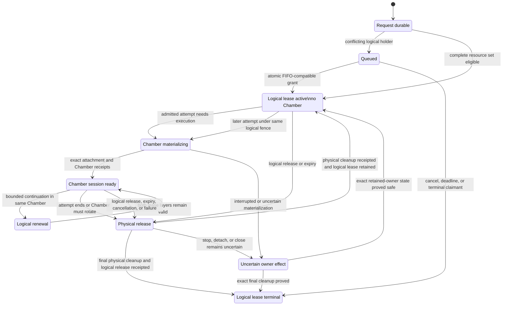
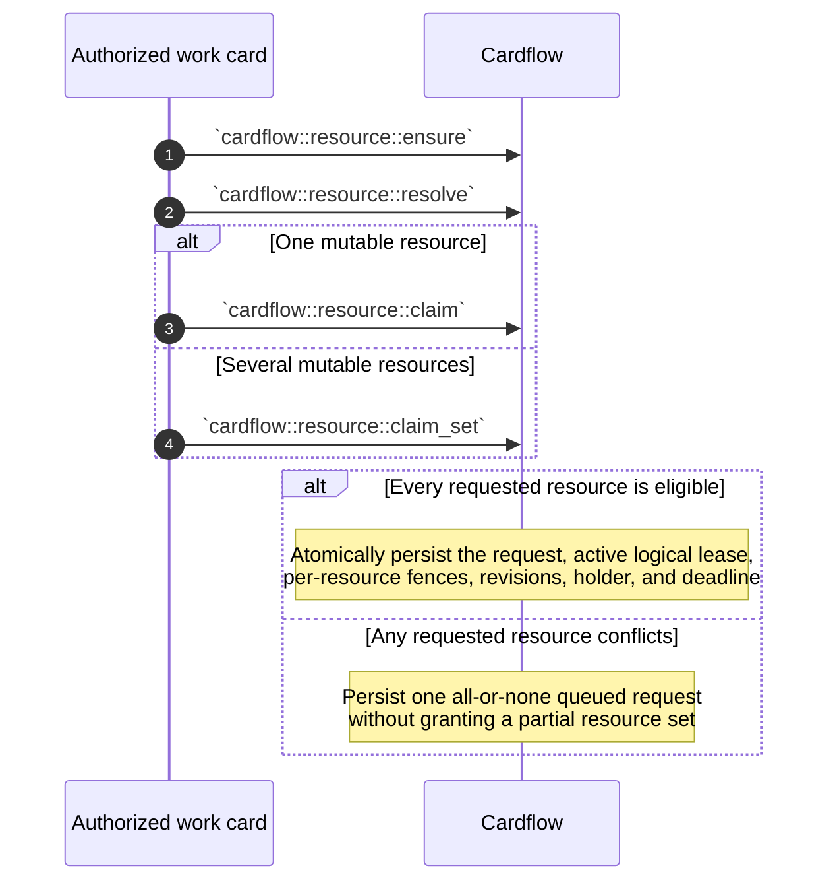
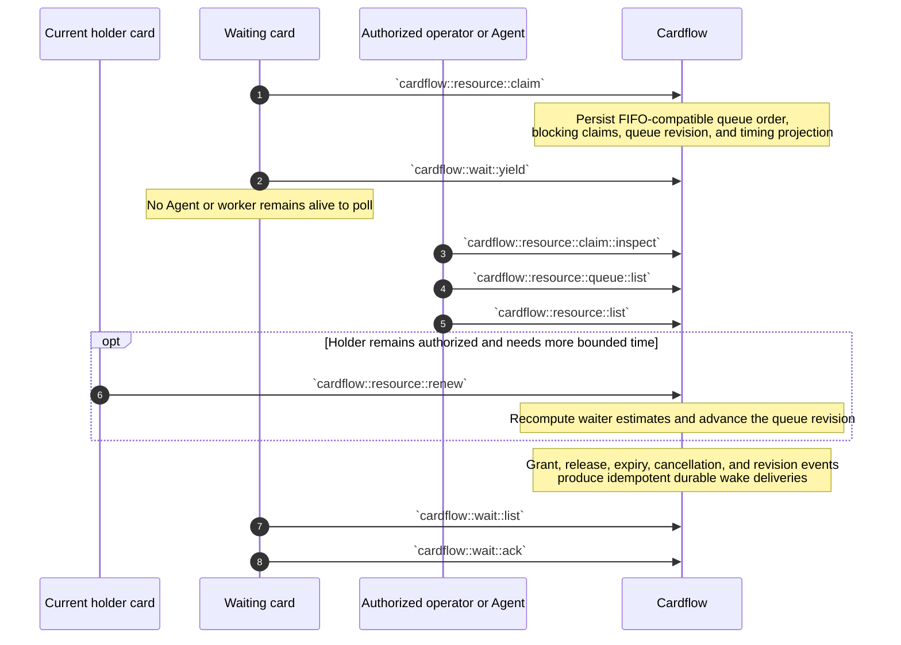
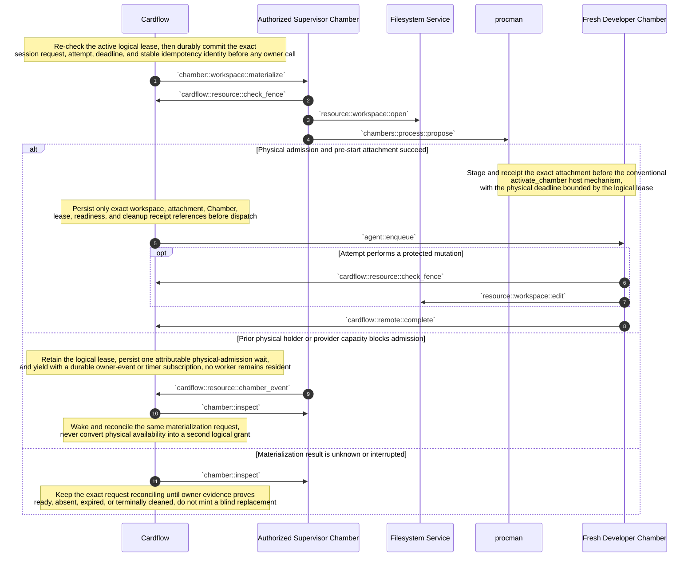
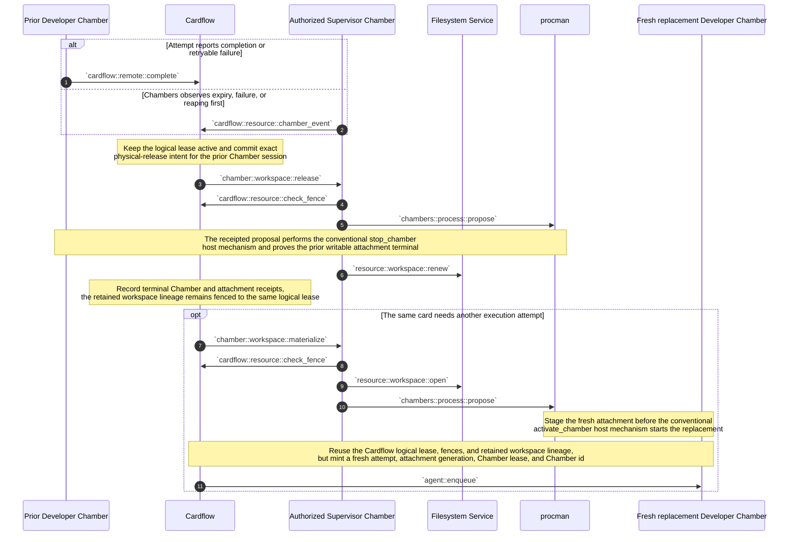
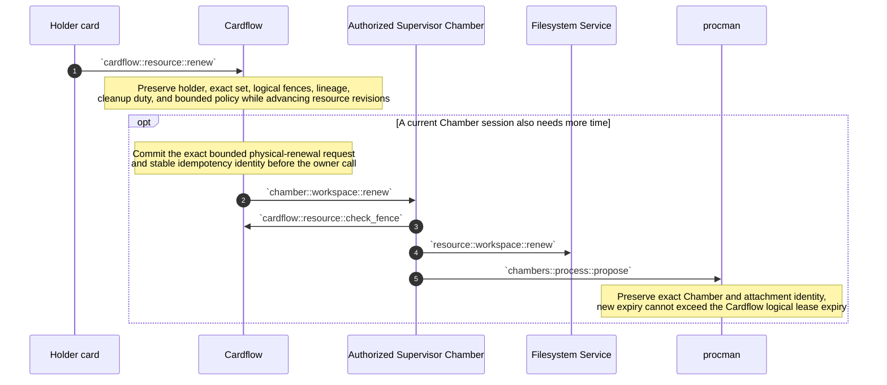
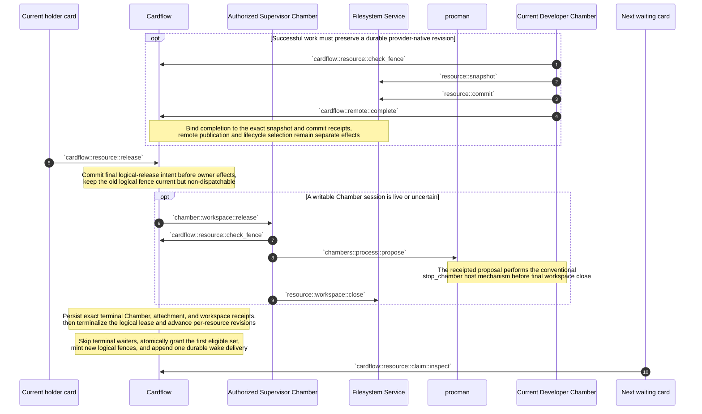
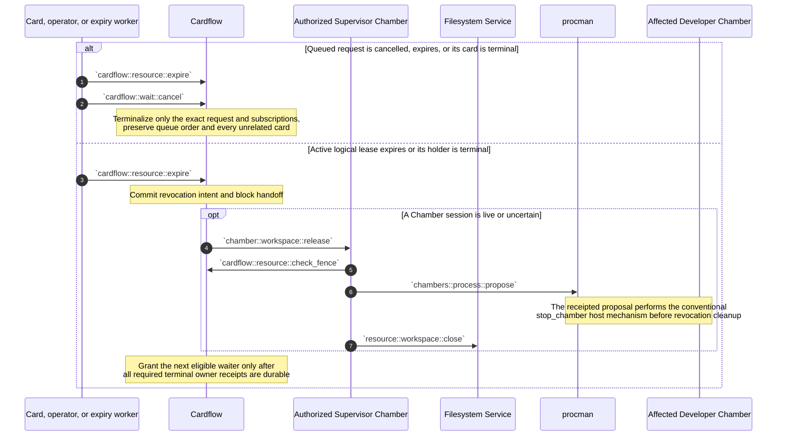
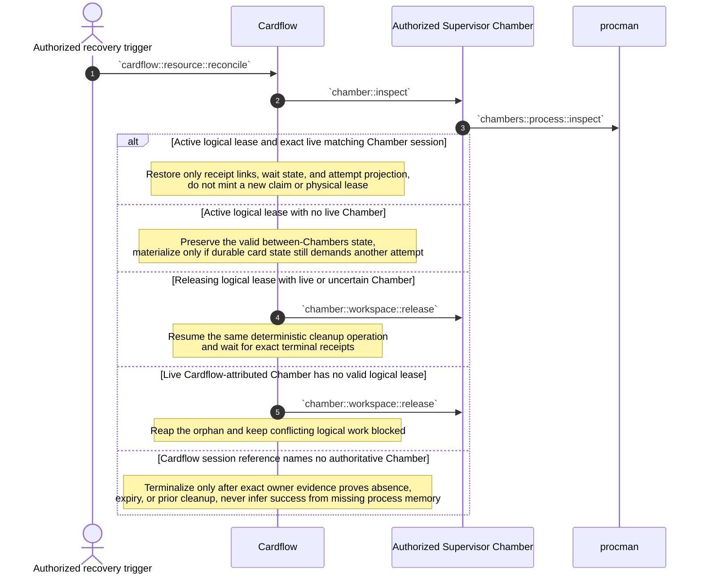
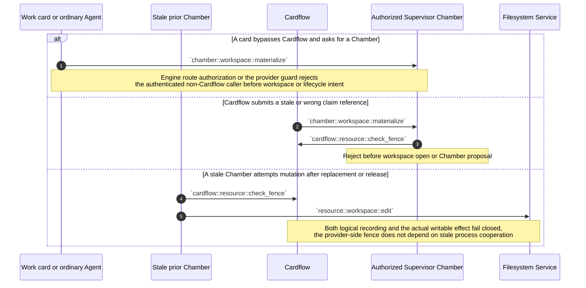

# Cardflow filesystem lease sequence reference

Status: **Current working architecture companion; downstream specification and implementation reconciliation pending**

Architecture classification: `architecture_delta_required`

Chambers authority baseline: [`chambers-lifecycle-sequences.md`](chambers-lifecycle-sequences.md) at
`eb49c29c81db787a0c0353d97a206bd7cd7cb8e2` with SHA-256
`26ab97e41bd47a4eddb8fbe22065fe363aefe250b8ffad78775d5fad83322769`.

Cardflow implementation comparison baseline:
[`dreamcatcher-tech/cardflow@57775eed19c9b62ccf3d48b9192d977e12ec9c30`](https://github.com/dreamcatcher-tech/cardflow/commit/57775eed19c9b62ccf3d48b9192d977e12ec9c30).

This document owns the working Cardflow-side design for logical filesystem-resource leases, queues,
waits, and their use of Chambers-scoped workspace attachments. The Chambers sequence authority still
owns physical Chamber identity, leases, admission, activation, attachment, reaping, and provider
custody. Cardflow owner Gherkin, Chambers owner Gherkin, schemas, implementation, and generated
projections are downstream reconciliation targets and may temporarily lag this design. This status
establishes a design target; it does not claim implementation or runtime acceptance.

The central split is:

- **Cardflow protects one card from competing cards.** Its logical lease may remain active while the
  holder has no live Chamber and may span several sequential Chamber leases.
- **Chambers protects one Chamber from competing Chambers.** Each materialization receives a fresh,
  exact, bounded Chamber lease and attachment authority.
- **Filesystem enforces the writable effect boundary.** A stale Chamber attachment or workspace fence
  cannot mutate the backing resource even when stale process state survives.

In ordinary Cardflow-managed work, cards never receive Chambers lifecycle authority. The authenticated
Cardflow service principal is the only ordinary caller allowed to request, renew, or release the
Chambers workspace sessions described here. Supervisor, `procman`, Filesystem, and lower recovery
mechanisms retain their own implementation and cleanup authority; that does not create another
application acquisition path.

## Contents

- [Lease axioms](#lease-axioms)
- [I3 function table](#i3-function-table)
- [Authoring and state shapes](#authoring-and-state-shapes)
- [Overall lifecycle](#overall-lifecycle)
- [Mode 1 - Register and claim logical resources](#mode-1---register-and-claim-logical-resources)
- [Mode 2 - Queue, inspect, and wait](#mode-2---queue-inspect-and-wait)
- [Mode 3 - Materialize the first Chamber session](#mode-3---materialize-the-first-chamber-session)
- [Mode 4 - Continue through another Chamber lease](#mode-4---continue-through-another-chamber-lease)
- [Mode 5 - Renew bounded leases](#mode-5---renew-bounded-leases)
- [Mode 6 - Release and hand off to the next card](#mode-6---release-and-hand-off-to-the-next-card)
- [Mode 7 - Cancel, expire, or terminalize](#mode-7---cancel-expire-or-terminalize)
- [Mode 8 - Recover and reconcile](#mode-8---recover-and-reconcile)
- [Mode 9 - Reject bypass and stale authority](#mode-9---reject-bypass-and-stale-authority)
- [Failure and recovery formulas](#failure-and-recovery-formulas)
- [Implementation handoff](#implementation-handoff)

## Lease axioms

### Identity

- `resource id = canonical Cardflow identity for one protected mutable mount backing and conflict
  namespace`; changing the mount path or alias does not create a different resource.
- `claim request id = one idempotent card request for one exact resource set and mode`.
- `logical lease id = one granted Cardflow claim held by one exact non-resource card`.
- `logical fence = monotonically increasing per-resource holder epoch minted by Cardflow`.
- `logical lease set = one atomic grant over one or more resource ids, with one fence per resource`.
- `materialization request id = one deterministic Cardflow request to obtain or reconcile one exact
  physical Chamber session under a current logical lease`.
- `attempt id = one exact execution attempt by the holder card`; retry creates a fresh attempt id.
- `workspace identity = Filesystem-owned mutable backing lineage`; it is not a Cardflow card or Chamber.
- `workspace generation/fence = Filesystem-owned writer authority for one exact mutable lineage and
  logical owner`.
- `attachment generation = fresh Filesystem/Chambers authority binding that workspace fence to one
  exact intended Chamber and mount`.
- `Chamber id = one fresh physical activation`; retry or restart always receives a fresh Chamber id.
- `Chamber lease = Chambers-owned bounded authority for one exact physical Chamber`.
- `attachment permit = one-use capability binding an exact workspace generation, mount name, intended
  Chamber, access mode, owner, and deadline`.
- `Chamber session = Cardflow's durable coordination link from one materialization request and attempt
  to exact workspace, attachment, Chamber, lease, and cleanup receipt references as they become known`;
  it is not a second physical authority.

Cardflow identifiers and fences never substitute for Filesystem or Chambers authority. Physical
identifiers and receipts never grant or advance a Cardflow logical lease.

### Cardinality

- `one protected mutable resource -> zero or one active exclusive Cardflow logical lease`.
- `one logical lease -> one holder card`.
- `one holder card -> zero or one logical lease set for the same acquisition phase`.
- `one logical lease -> zero or one live writable Chamber session at a time` in the initial policy.
- `one logical lease -> zero or many sequential historical Chamber sessions`.
- `one Chamber session -> one fresh Chamber id + one Chamber lease + one attachment permit`.
- `one Chamber lease -> at most one Cardflow logical lease authorization reference` for a
  Cardflow-managed mutable attachment.
- `one workspace identity -> zero or many sequential Chamber attachments`; concurrent writable
  attachments remain forbidden.
- one backing resource mounted through two aliases or declared mount names still has one conflict scope;
  attachment paths are not lease identities.
- immutable read-only mounts may be attached to several Chambers and do not require an exclusive
  Cardflow mutation lease merely because they are mounted.

A Cardflow logical lease with zero live Chamber sessions is valid. A Chamber session without a live
matching Cardflow logical lease is never valid for new Cardflow-managed mutation and must be reaped or
reconciled.

### Duration

- `Cardflow logical lease duration >= any one Chamber session duration` is permitted and expected.
- `Chamber lease expiry <= Cardflow logical lease expiry` for Cardflow-managed mutable work.
- Cardflow may retain the same logical lease and fence between attempts while Chambers releases one
  physical Chamber and later creates another.
- A fresh Chamber session never inherits the old Chamber id, Chamber lease, attachment permit,
  attachment generation, or connection epoch. The retained workspace generation may remain the same
  while the logical holder remains the same, but actual writes require the new current attachment.
- The Cardflow logical fence advances when logical ownership changes to another card, not merely when
  the same holder starts a replacement Chamber.
- Renewal cannot change holder, resource set, access mode, lineage, or cleanup duty.
- A card may request an earlier bounded release. No lease becomes ambient or perpetual merely because
  the card remains non-terminal.

### State

Cardflow owns only its logical state and references to owner receipts:

- canonical resource registry records and resource-card projections;
- idempotent claim requests and atomic logical lease sets;
- active logical holder and per-resource logical fences;
- FIFO-compatible waiter order and queue revisions;
- durable wait subscriptions and wake deliveries;
- execution-attempt, pre-effect physical-operation intent, stable idempotency keys,
  physical-admission waits, and Chamber-session receipt references;
- releasing, revoking, and reconciling intents;
- terminal logical release, expiry, and fence-rejection evidence.

Cardflow does not duplicate:

- Filesystem workspace bytes, workspace generation authority, or provider cleanup state;
- `procman` current, candidate, Chamber, admission, operation, or physical lease state;
- Engine route state;
- raw host paths, raw attachment capabilities, private Chamber identity material, or secret values.

An owner receipt is evidence referenced by Cardflow. It is not copied into Cardflow as independently
mutable owner state.

### Authority

- The authenticated work card asks Cardflow for logical access.
- Cardflow atomically orders conflicting cards, grants the logical lease, advances its logical fence,
  and owns card-visible queue and wait state.
- Only the authenticated Cardflow service principal may ordinarily call the Supervisor workspace
  materialize, renew, or release surfaces for Cardflow-managed work.
- Supervisor verifies the current Cardflow claim reference, then orchestrates Filesystem and `procman`.
- Filesystem owns mutable workspace identity, writer fencing, attachment capabilities, snapshots,
  commits, and provider cleanup.
- `procman` owns Chamber lease admission, physical activation, stop, and reaping.
- Engine transports I3 calls and enforces the authenticated route/RBAC decision; it does not own either
  lease layer.
- A card, Agent, or stale Chamber cannot obtain another Chamber merely by presenting a Cardflow card id,
  claim id, or payload-selected principal.
- An Agent attempt acts under its holder card's attenuated session authority; it is not a new logical
  holder. A child card does not inherit the parent's lease implicitly and must claim independently
  unless future owner Gherkin defines an explicit bounded delegation protocol.
- Lower recovery mechanisms may stop or reap unsafe Chambers while Cardflow is unavailable. They may not
  grant a new Cardflow logical lease or start ordinary replacement work on behalf of an arbitrary card.

In the healthy path, Cardflow resolves card-to-card demand before Chambers sees an acquisition request,
so Chambers should not need a second ordinary card queue. Chambers still rejects or waits behind an old
physical Chamber during rollover, expiry, or recovery, and host/provider capacity admission remains a
separate physical concern rather than a second Cardflow lease.

The two exclusion invariants are independent and both must hold:

```text
Cardflow safety = at most one eligible card holds each exclusive logical resource fence
Chambers safety = at most one eligible Chamber holds each exclusive writable attachment fence
```

Cardflow being the only ordinary Chambers acquisition caller makes the layers compose cleanly; it does
not justify removing Chambers' independent inter-Chamber enforcement.

### Claim compatibility and fairness

The initial mutable policy is exclusive. Shared mutable claims fail closed until owner Gherkin and
runtime proofs define their conflict and recovery behavior.

- A request from the current holder for the same resource set or a strict subset reuses the current
  logical lease and fences. It does not wait on itself or advance a fence.
- A request that widens the held set is not reentrant. The card must request the complete set atomically
  before execution or release and reacquire; incremental hold-and-wait is rejected to prevent deadlock.
- `cardflow::resource::claim_set` grants every requested mutable resource atomically or grants none.
  A queued set request appears in every blocking resource projection but remains one request.
- A set request is eligible only when every member resource is free and no earlier conflicting request
  precedes it on any member resource. It reserves nothing while queued; later conflicting singletons do
  not bypass it merely because one member becomes free first.
- FIFO order applies among equally eligible conflicting requests. Terminal waiters are expired in place
  rather than resurrected.
- Disjoint resource sets may be active concurrently.
- Immutable read-only mounts are excluded from the exclusive set unless a separate logical effect needs
  serialization.

### Queue time and observability

Queue position and time are projections, not authority. A claim inspection should expose at least:

```yaml
request_id: claim-request:Q17
state: queued
resource_revision: 81
queue_positions:
  resource:mount:workspace:repo-A: 3
blocking_request_ids:
  - claim-request:Q11
  - claim-request:Q14
active_holder_expires_at: 2026-07-21T08:15:00Z
earliest_eligible_at: 2026-07-21T08:15:00Z
estimated_eligible_at: 2026-07-21T08:24:00Z
upper_bound_at: null
estimate_confidence: low
estimate_reason: current holder may renew
```

- `earliest_eligible_at` is derived from currently known blocking lease deadlines.
- `estimated_eligible_at` may additionally use declared maximum durations and observed completion data.
- `upper_bound_at` exists only when every blocker and permitted renewal has an enforced bound.
- A permitted unbounded renewal makes `upper_bound_at` null; Cardflow must not display a false countdown.
- Queue ETA predicts logical eligibility, not Chamber readiness. Physical/provider admission and Chamber
  startup remain a separate interval unless Chambers supplies its own attributable estimate.
- Queue listings are capability-filtered and redact raw fences, attachment capabilities, host paths,
  secrets, and unauthorized card details.

## I3 function table

Every arrow in a `sequenceDiagram` below is an invocation labelled with exactly one function name.
Function completion and results are implied by the invocation and are not drawn as separate arrows.
Arguments, outcomes, receipts, and local durable mutations remain in surrounding text or Mermaid notes.
The I3 Engine transports brokered calls but is shown as a lane only when it owns the represented effect.

Every function-table invocation path is `I3`, and every arrow in a `sequenceDiagram` is labelled by one
of those namespaced I3 functions. Conventional host mechanisms inherited from Chambers appear only in
notes or prose, never as message arrows. Rows marked **required** are new functions to implement; rows
marked **contract extension required** already exist but do not yet satisfy this design. Existing owner
surfaces may still need schema and semantic reconciliation.

At authoring time, Cardflow implements the logical resource registry, exclusive claim/fence, FIFO wait,
release/expiry, and generic durable-wake substrate. It does not implement durable Chamber-session
bindings, pre-effect physical-operation intent, owner lifecycle events, physical renewal/release, or
startup reconciliation. Existing logical release and expiry can promote a waiter without a physical
cleanup barrier, so they are explicitly contract extensions rather than accepted two-layer behavior.

### Cardflow resource registry and logical leases

| Function | Invocation path | Brief contract |
| --- | --- | --- |
| `cardflow::resource::ensure` | I3 | Create or reuse one canonical resource registry record and its manager-card projection without granting access. |
| `cardflow::resource::resolve` | I3 | Return one capability-filtered canonical resource and current logical-lease projection. It is read-only. |
| `cardflow::resource::list` | I3 | List visible canonical resources and compact logical-lease summaries. It is read-only. |
| `cardflow::resource::claim` **contract extension required** | I3 | Grant or queue one idempotent bounded exclusive logical request for one resource; a singleton form of `claim_set`. |
| `cardflow::resource::claim_set` **required** | I3 | Atomically grant every mutable resource in one exact set or queue one all-or-none request without partial holds. |
| `cardflow::resource::claim::inspect` **required** | I3 | Read one claim request or active logical lease, including redacted blocker, queue-position, deadline, estimate, attempt, and Chamber-session references. |
| `cardflow::resource::queue::list` **required** | I3 | Read a capability-filtered, revisioned queue projection for one resource or claim set. |
| `cardflow::resource::renew` **required** | I3 | Extend the same bounded logical lease for the same holder, exact set, fences, and cleanup duty; it cannot change ownership or widen scope. |
| `cardflow::resource::release` **contract extension required** | I3 | Commit logical release intent, reconcile every linked writable Chamber session to terminal owner receipts, then terminalize the lease and grant the next eligible waiter. |
| `cardflow::resource::expire` **contract extension required** | I3 | Explicitly expire a current lease or obsolete queued request; an active Chamber makes this a revocation/reconciliation path rather than an immediate handoff. |
| `cardflow::resource::check_fence` **contract extension required** | I3 | Validate exact logical lease lineage, resource, holder, fence, deadline, attempt, and requested purpose. Materialize, renew, dispatch, and mutation require `active`; an exact `releasing` or `revoking` lineage may authorize cleanup only. Rejection appends audit evidence. |
| `cardflow::resource::chamber_event` **required** | I3 | Accept one exact idempotent Chambers lifecycle notification with owner receipt references; it is evidence, not authority to grant or release a logical lease. |
| `cardflow::resource::reconcile` **required** | I3 | Reconcile persisted logical lease/session intent against capability-scoped Chambers and Filesystem observations without blindly replaying materialization. |
| `cardflow::remote::complete` **contract extension required** | I3 | Record one exact remote attempt completion or failure against its card, attempt, logical lease, and Chamber session. Mutating success requires an authoritative owner receipt proving the effect occurred under that exact physical binding, not only a worker assertion. |

### Cardflow durable wait kernel

| Function | Invocation path | Brief contract |
| --- | --- | --- |
| `cardflow::wait::subscribe` | I3 | Persist a durable wait subscription over exact claim, queue revision, card lifecycle, stream, timer, or custom conditions. |
| `cardflow::wait::yield` | I3 | Persist a short-lived Agent/card yield plus subscription so no live worker is retained while waiting. |
| `cardflow::wait::wake` | I3 | Evaluate one exact idempotent source event against durable subscriptions and append matching deliveries. |
| `cardflow::wait::list` | I3 | List capability-filtered subscriptions and pending or acknowledged deliveries. It is read-only. |
| `cardflow::wait::cancel` | I3 | Cancel exact subscriptions without cancelling unrelated claim requests or cards. |
| `cardflow::wait::ack` | I3 | Acknowledge exact wake deliveries after the resumed worker observes them. |

Grant, release, expiry, cancellation, queue-revision, and Chambers-session events may invoke the wake
kernel locally inside Cardflow. Those local event evaluations are notes rather than artificial
self-invocation arrows.

### Supervisor and Chambers

| Function | Invocation path | Brief contract |
| --- | --- | --- |
| `chamber::workspace::materialize` **contract extension required** | I3 | Idempotent Cardflow-only ordinary acquisition surface. Verify the active logical claim and deterministic materialization request, open or continue the exact workspace, obtain a fresh attachment permit, and stage it into one fresh Developer Chamber activation. |
| `chamber::workspace::renew` **required** | I3 | Idempotently renew one exact live workspace/Chamber session without changing logical holder, workspace lineage, Chamber identity, or attachment scope, and never beyond the Cardflow lease deadline. |
| `chamber::workspace::release` **required** | I3 | Idempotently stop and reap one exact Developer Chamber and terminalize its attachment; either retain the fenced workspace continuation for the same Cardflow lease or close it for final logical release. Exact cleanup remains callable after logical expiry or loss without authorizing acquisition. |
| `chamber::inspect` | I3 | Return Supervisor's capability-filtered logical view assembled from authoritative owner observations. It cannot mutate either lease layer. |
| `chambers::process::propose` | I3 | Commit and perform one exact typed, fenced Chamber start, renewal, stop, or cleanup operation. |
| `chambers::process::inspect` | I3 | Return the authoritative capability-scoped view of Chambers, lease admissions, open operations, and receipts. It is read-only. |

A Cardflow card, Agent Chamber, or caller-selected principal is not authorized to invoke the three
`chamber::workspace::*` mutation functions. The Cardflow service principal may invoke them only with a
current Cardflow claim receipt and bounded attempt identity. Supervisor and `procman` continue to own
all lower orchestration and mechanism effects.

`activate_chamber` and `stop_chamber` remain conventional host mechanisms internal to `procman`'s
execution of `chambers::process::propose`. They are described in notes, not promoted into Cardflow-facing
I3 APIs or drawn as sequence arrows.

### Filesystem and Agent execution

| Function | Invocation path | Brief contract |
| --- | --- | --- |
| `resource::workspace::open` **contract extension required** | I3 | Open a new exact writer-fenced workspace or continue the same retained workspace lineage for a fresh intended Chamber, returning no raw host path. |
| `resource::workspace::edit` | I3 | Apply an authorized mutation through the current Filesystem workspace and attachment fences. |
| `resource::workspace::renew` | I3 | Renew the same workspace generation, owner, fence lineage, and cleanup duty; it cannot change the Cardflow holder or intended Chamber silently. |
| `resource::workspace::close` | I3 | Terminalize one exact workspace fence and reap unretained mutable backing after every writable attachment is gone. |
| `resource::snapshot` | I3 | Seal one exact fenced workspace revision into immutable content-addressed custody. |
| `resource::commit` | I3 | Consume an exact snapshot into a provider-native durable revision and receipt without publishing remotely or changing lifecycle selection. |
| `agent::enqueue` **contract extension required** | I3 | Dispatch one bounded card attempt only to the exact ready Chamber session and carry references to the current logical claim and owner-issued workspace authority. |

## Authoring and state shapes

### Canonical mutable resource

```yaml
resource_id: resource:mount:workspace:dreamcatcher-tech/example
kind: filesystem_mount
canonical_key: mount:workspace:github:dreamcatcher-tech/example
manager_card_id: card:resource-example
mutation_mode: exclusive
revision: 81
```

The canonical key identifies the protected logical namespace. It contains no checkout path, mount path,
credential, workspace capability, or Chamber identity.

### Logical claim request and lease set

```yaml
claim_requests:
  claim-request:Q17:
    claimant_card_id: card:work-42
    idempotency_key: card:work-42:implementation-set-v1
    resources:
      - resource_id: resource:mount:workspace:dreamcatcher-tech/example
        mode: exclusive
        scope: workspace-mutation
      - resource_id: resource:mount:generated-output:example-feature
        mode: exclusive
        scope: generated-output-mutation
    state: queued
    enqueued_at: 2026-07-21T08:00:00Z
    requested_expires_at: 2026-07-21T09:00:00Z

logical_leases:
  logical-lease:L9:
    claim_request_id: claim-request:Q9
    claimant_card_id: card:work-41
    resources:
      - resource_id: resource:mount:workspace:dreamcatcher-tech/example
        fence: 43
      - resource_id: resource:mount:generated-output:example-feature
        fence: 12
    state: active
    expires_at: 2026-07-21T08:15:00Z
    current_attempt_id: attempt:A3
    current_chamber_session_id: null
```

A claim-set transaction updates every affected resource revision atomically. Queue entries may be
indexed under each blocking resource for inspection, but the request is granted, cancelled, or expired
only once.

### Chamber-session reference

```yaml
chamber_sessions:
  chamber-session:S3:
    materialization_request_id: materialization-request:M3
    logical_lease_id: logical-lease:L9
    logical_fence_refs:
      resource:mount:workspace:dreamcatcher-tech/example: 43
      resource:mount:generated-output:example-feature: 12
    attempt_id: attempt:A3
    workspace_ref: workspace@sha256:W7
    workspace_generation_ref: workspace-generation@sha256:WG7
    attachment_generation_ref: attachment-generation@sha256:AG42
    owner_operation_ref: operation@sha256:O42
    chamber_id: chamber:C42
    chamber_lease_ref: lease@sha256:CL42
    attachment_receipt_ref: receipt@sha256:AR42
    phase: ready
    deadline: 2026-07-21T08:10:00Z
```

Cardflow creates the session in `requested` phase and commits its deterministic materialization request
and idempotency identity before invoking Chambers. It then stores only owner-issued references and the
phase derived from exact receipts. The canonical Chamber and workspace state remains with their owners.
An unknown result stays `materializing` or `reconciling` and is inspected by the same request identity;
Cardflow does not blindly mint another request. A replacement session under the same logical lease gets
a fresh session id, materialization request id, attempt id, Chamber id, Chamber lease, attachment
receipt, and attachment generation.

### Logical release operation

```yaml
logical_release_operations:
  release-operation:R4:
    logical_lease_id: logical-lease:L9
    expected_resource_revisions:
      resource:mount:workspace:dreamcatcher-tech/example: 81
      resource:mount:generated-output:example-feature: 29
    state: reconciling
    chamber_session_ids:
      - chamber-session:S3
    required_terminal_receipts:
      - chamber-stop
      - attachment-revocation
      - workspace-close
    deadline: 2026-07-21T08:20:00Z
```

Release intent is durable before any owner effect. Cardflow does not clear the active logical lease or
wake a conflicting waiter until every required writable-access receipt is terminal. If the effect is
uncertain, the operation remains `reconciling` and the resource remains unavailable.

## Overall lifecycle



The `Between` state is deliberate. It is how one Cardflow logical filesystem lease safely survives
several shorter Chamber leases without making any old Chamber authority reusable.

## Mode 1 - Register and claim logical resources

`entry = authorized non-resource work card + exact canonical mutable resource selectors`

`exit = one active logical lease set, or one durable all-or-none queued request`



The claimant identity comes from the authenticated Cardflow call and known card state. A resource card
cannot claim itself. Repeating the same idempotency key replays the active or queued record without
adding an event or changing queue order.

A same-holder request for the exact set or strict subset reuses the active lease. A wider request is
rejected unless it was submitted as the original atomic set; Cardflow does not let two holders create a
deadlock by each retaining one resource while waiting for the other.

## Mode 2 - Queue, inspect, and wait

`entry = durable conflicting claim request`

`exit = active logical lease, explicit cancellation/expiry, or continued durable wait`



A wake delivery says the condition changed; the resumed card re-reads its exact claim. It must not infer
that it owns a resource from an old delivery alone. A queue position may improve or worsen when bounded
renewal policy, terminal waiters, claim sets, or cancellations change. Every displayed estimate names
the queue revision from which it was derived.

## Mode 3 - Materialize the first Chamber session

`entry = active Cardflow logical lease + admitted card attempt + no live writable Chamber session`

`exit = exact ready Developer Chamber session, durable physical-admission wait, or retained logical
lease plus attributable terminal or reconciling evidence`



Cardflow checks its own authoritative state before dispatch without projecting a local self-call as an
I3 arrow. Supervisor independently invokes `cardflow::resource::check_fence` so a stale queued payload,
wrong resource, or wrong attempt cannot obtain a fresh Chamber.

`chamber::workspace::materialize` follows the Chambers activation kernel after it commits the exact
operation. The attachment is staged before `activate_chamber`; this document does not authorize
standalone post-start mount or unmount. Materialization success means the exact Chamber is ready with
the receipted attachment, not merely that an asynchronous request was accepted.

Cardflow commits its own outbound materialization intent before the Supervisor invocation. An
attributable physical conflict or provider-capacity wait retains the Cardflow logical lease and uses the
durable wait kernel without consuming an Agent. An unknown invocation outcome is reconciled by the same
deterministic request and owner operation identity before any retry. Neither case creates a second
card-visible ownership queue inside Chambers, and logical-eligibility ETA remains distinct from
physical-admission ETA.

`cardflow::remote::complete` does not turn a worker assertion into proof of mutation. Cardflow accepts a
mutating success only when it references the exact active logical lease and an authoritative owner
receipt proving that the protected effect completed while the recorded physical binding was valid.

## Mode 4 - Continue through another Chamber lease

`entry = active Cardflow logical lease + completed, failed, expired, or replaceable Chamber session`

`exit = same logical lease and fences + no live Chamber, or one fresh replacement Chamber session`



The old writable attachment reaches terminal evidence before the next one becomes ready. If stop or
revocation is uncertain, Cardflow remains `reconciling`; it neither starts the replacement nor releases
the logical resource to another card.

The same Filesystem workspace lineage may be retained so a replacement Chamber can continue the exact
mutable bytes. Retention does not reuse an attachment capability. `resource::workspace::open` must
issue a fresh exact attachment for the new intended Chamber while preserving the same owner and lineage.

A Cardflow workspace-repair workflow may repeat this mode for separate materializer, verifier,
developer, final-verifier, or finalizer Chambers. The exact grouping is workflow policy, but every
interval in which a Chamber can access the workspace needs its own receipted physical session. A
read-only verifier does not inherit the developer's writable attachment merely because both run under
the same logical card lease.

## Mode 5 - Renew bounded leases

Cardflow and Chambers renew different objects. A Cardflow renewal extends inter-card ownership. A
Chambers renewal extends only the current physical session. Neither call silently extends the other.



A logical renewal may succeed while no Chamber exists. A Chamber renewal fails if the logical lease is
stale, expired, releasing, or too short to contain the requested physical deadline. A physical renewal
failure does not automatically release the Cardflow lease; Cardflow may stop the Chamber, remain between
Chambers, retry with a fresh Chamber, or terminalize according to card policy. An unknown physical
renewal result is inspected by the same session and operation identity rather than replayed as a new
renewal grant.

## Mode 6 - Release and hand off to the next card

`entry = current logical holder requests final release or reaches successful final completion`

`exit = zero writable authority for the old card + terminal logical release + next eligible waiter
granted atomically, if any`



The next card is not granted merely because stop was requested. It is granted only after Cardflow has
terminal evidence that the prior card has no remaining writable Chamber access. This stronger ordering
keeps inter-card exclusion comprehensible even though Chambers would independently reject two
conflicting Chamber attachments.

If the logical lease has no current or uncertain Chamber session, Cardflow may terminalize it and grant
the next waiter in the same durable mutation.

Snapshot and provider-native commit are required only when the accepted disposition preserves the
workspace result. Their exact receipts must precede successful completion and close. A failed snapshot
or commit cannot masquerade as success; an authorized discard path may instead close the workspace
with explicit failure or cancellation evidence. `resource::commit` does not publish remotely or move a
stable lifecycle selection.

## Mode 7 - Cancel, expire, or terminalize

Cancellation has two distinct cases: a queued request owns no resource and can terminate immediately;
an active holder may still own a Chamber and must follow revocation and cleanup.



A terminal queued card is expired in place when encountered and is never resumed merely because it
reached the front. A terminal active card does not authorize immediate logical handoff while physical
cleanup is unproved. Expiry of the Cardflow lease bounds new dispatch even if Cardflow is temporarily
unable to reach Chambers; Chambers and Filesystem deadlines still independently fence and reap the
physical session.

## Mode 8 - Recover and reconcile

`entry = Cardflow process restart, interrupted release/materialization, missed lifecycle event, or
operator-requested repair`

`exit = exact linked state proved and resumed, exact unsafe state being reaped, or logical resource
blocked in attributable reconciliation`



Chambers lifecycle notifications call `cardflow::resource::chamber_event` when Cardflow is reachable.
They accelerate projection updates but cannot grant a logical lease or declare owner cleanup complete
without the referenced authoritative receipt. Missed events are harmless because reconciliation reads
the owner state.

Cardflow restart reconstructs cards, logical claims, queues, waits, and release intent from its own
durable events. It does not reconstruct Chambers by replaying `materialize`. An interrupted external
effect is first inspected and reconciled under the original deterministic identity.

## Mode 9 - Reject bypass and stale authority



Engine/Vault RBAC should make the first branch unreachable in normal operation, but Supervisor still
validates the authenticated principal and claim binding. Payload possession of a card id or claim id is
not authority. The lower reaper retains stop-only recovery authority so Cardflow failure cannot preserve
an unsafe Chamber indefinitely.

## Failure and recovery formulas

- `active Cardflow logical lease + zero Chamber sessions -> valid between-Chambers state`.
- `same holder + fresh attempt -> same logical lease and Cardflow fences + fresh Chamber session`.
- `fresh Chamber session -> fresh attempt id + attachment permit + attachment generation + Chamber id +
  Chamber lease`.
- `logical holder changes -> advance every affected Cardflow resource fence`.
- `Chamber changes while holder remains -> do not advance the Cardflow fence merely for that reason`.
- `Cardflow lease expiry < requested Chamber deadline -> reject or shorten the Chamber request`.
- `Cardflow claim missing, stale, wrong-resource, wrong-holder, or wrong-attempt -> no materialization and
  no mutation success`; exact owner-receipted cleanup remains available without reviving the claim.
- `Filesystem attachment or workspace fence stale -> reject actual mutation even if Cardflow process
  state is wrong`.
- `active release + uncertain Chamber stop or attachment revocation -> remain reconciling + grant no
  conflicting logical waiter`.
- `queued card terminal -> expire that request without granting or resuming it`.
- `queued claim-set partially eligible -> grant none`.
- `same-holder request is exact or narrower -> idempotently reuse`; `wider -> reject or submit a new
  all-or-none acquisition before execution`.
- `Chamber fails + logical lease remains live -> terminalize that Chamber session`; a later authorized
  retry may create a fresh one without changing logical ownership.
- `Cardflow fails + Chamber lease remains live -> Chambers continues to enforce and eventually reap its
  exact physical deadline`; recovery later reconciles receipts.
- `Chambers or Filesystem unavailable -> Cardflow retains logical exclusion and reports physical
  admission/reconciliation separately`; retries never become a second grant path.
- `physical holder or provider capacity blocks materialization -> retain the same logical lease +
  persist an attributable physical-admission wait + yield without a resident worker`.
- `materialization result unknown -> inspect by the deterministic request/operation identity`; do not
  mint another physical binding until exact owner evidence resolves the first request.
- `Cardflow sees a live attributed Chamber without a live matching logical lease -> block the logical
  resource + request exact cleanup`.
- `Cardflow sees no physical process but lacks terminal owner evidence -> do not infer release`.
- `direct card or Agent call to Cardflow-only Chambers acquisition surface -> reject before owner effect`.
- `immutable read-only mount -> no exclusive Cardflow mutation claim unless another serialized logical
  effect applies`; Chambers still scopes each physical attachment.
- `queue estimate has renewable or unknown blockers -> upper_bound_at = null`.
- `logical grant ETA != Chamber-ready ETA`; report the two delays separately when both are available.

## Implementation handoff

### Initial Cardflow slice

- canonical mutable mount-resource identities and one manager-card projection per resource;
- exclusive singleton claims plus atomic all-or-none claim sets;
- idempotent and same-holder reentrant acquisition;
- bounded logical deadlines and same-owner renewal;
- monotonic per-resource Cardflow fences that remain stable across same-holder Chamber replacement;
- durable FIFO-compatible queues, terminal-waiter skipping, queue revisions, inspection, and redacted
  queue listings;
- earliest/estimated/upper-bound timing fields with explicit confidence and no false countdown;
- durable `cardflow::wait::*` integration so queued cards consume no resident Agent;
- pre-effect materialization intent, deterministic request identities, physical-admission waits, and
  exact attempt/Chamber-session receipt references without duplicated physical authority;
- release/revocation intent before owner effects and no next-card grant before terminal writable cleanup;
- restart reconciliation against authoritative owner inspection without blind materialization replay;
- package/schema/projection/event coverage for every public function and state transition.

### Required Chambers and Filesystem reconciliation

- restrict ordinary Cardflow-managed workspace materialization, renewal, and release to the authenticated
  Cardflow service principal;
- extend `chamber::workspace::materialize` to bind an exact current Cardflow logical lease/fence receipt,
  card, attempt, resource set, mount name, workspace lineage, and deadline;
- add `chamber::workspace::renew` and `chamber::workspace::release` orchestration surfaces;
- permit `resource::workspace::open` to continue one retained exact workspace lineage while issuing a
  fresh Chamber-scoped attachment capability;
- ensure a replacement attachment is never valid concurrently with the prior writable attachment;
- cap every physical Chamber/workspace deadline by the Cardflow logical lease deadline;
- return exact attachment, Chamber lease, readiness, stop, revocation, and cleanup receipt references;
- preserve the current rule that workspace attachment is staged before runsc start and that standalone
  post-start attachment, detachment, or Developer command execution remains rejected;
- keep `procman` lifecycle state free of Cardflow cards, queues, logical fences, and duplicated workspace
  tables; its authority remains limited to lifecycle `current`, `candidates`, `chambers`, `admissions`,
  and `operations`.

### Required Cardflow owner sequences and tests

- immediate singleton grant and idempotent replay;
- all-or-none multi-resource grant and no partial hold;
- same-holder exact/subset reuse and wider-scope rejection;
- competing claim queue, durable yield, queue inspection, wake, and acknowledgement;
- bounded renewal with queue-estimate revision;
- first Chamber materialization only after a current logical fence check;
- materialization intent durably committed before the first owner effect and unknown-result retry by
  inspection rather than blind replay;
- physical-holder/provider-capacity wait using durable yield, owner event or timer wake, and the same
  logical lease;
- mutating completion rejected unless exact logical authority and an owner-issued physical effect
  receipt both validate;
- same logical lease surviving zero, one, and several sequential Chamber leases;
- old Chamber terminal evidence before replacement Chamber readiness;
- final release blocking next-card grant until exact physical cleanup receipts;
- queued cancellation and terminal-waiter skipping;
- active expiry/cancellation entering revocation rather than immediate handoff;
- Cardflow restart in active, between-Chambers, materializing, releasing, and uncertain states;
- Chambers failure while the logical lease remains valid;
- orphan Chamber detection and cleanup;
- direct non-Cardflow materialization rejection;
- stale Cardflow fence rejection before dispatch and stale Filesystem fence rejection at mutation;
- redaction of fences, capabilities, host paths, secrets, and unauthorized queue identities;
- separate logical-eligibility and Chamber-readiness timing projections.

### Required downstream architecture reconciliation

- Cardflow resource-claim, durable-wait, Agent-dispatch, and workspace-repair Gherkin;
- Chambers lifecycle and resource-provider Gherkin for Cardflow-only acquisition and sequential
  reattachment;
- Cardflow and Chambers public I3 schemas, manifests, RBAC, event contracts, projections, and package
  contract checks;
- exact owner repository tests and cross-stack acceptance fixtures;
- broader architecture narrative and generated traceability after authoritative inputs change.
