# Chambers lifecycle sequence reference

Status: **Current working architecture authority; downstream reconciliation pending**

Architecture classification: `architecture_delta_required`

Design-lineage baseline: `8e364299e8a0dd5d6628f0c910e7261850b4632d`

This document is the current Chambers lifecycle architecture authority. It owns the working design
for lifecycle identity, state, sequencing, authority boundaries, custody, routing, verification,
selection, quiescence, and recovery until it is explicitly superseded. The broader
[`ark-agent-architecture.md`](ark-agent-architecture.md), owning Gherkin, schemas, implementation,
and generated projections are downstream reconciliation targets and may temporarily lag this design.
This status establishes design authority; it does not claim implementation or runtime acceptance.

## Contents

- [Dictionary](#dictionary)
- [Lifecycle axioms](#lifecycle-axioms)
- [Lifecycle call table](#lifecycle-call-table)
- [Authoring and state shapes](#authoring-and-state-shapes)
- [Overall lifecycle](#overall-lifecycle)
- [First boot installation](#first-boot-installation)
- [Selected Boot set cold start](#selected-boot-set-cold-start)
- [Boot control bootstrap](#boot-control-bootstrap)
- [Host reboot into the selected Boot set](#host-reboot-into-the-selected-boot-set)
- [Ordinary Chamber activation kernel](#ordinary-chamber-activation-kernel)
- [Fenced development](#fenced-development)
- [Form and activate a candidate](#form-and-activate-a-candidate)
- [Build an artifact](#build-an-artifact)
- [Verify a candidate](#verify-a-candidate)
- [Select, upgrade, or roll back](#select-upgrade-or-roll-back)
- [Live Boot-set cutover](#live-boot-set-cutover)
- [Quiesce and wake](#quiesce-and-wake)
- [Attested multi-Ark builds (later)](#attested-multi-ark-builds-later)
- [Failure and recovery formulas](#failure-and-recovery-formulas)
- [Implementation handoff](#implementation-handoff)

## Dictionary

This section is the terminology source of truth for this document and every generated projection of it.
Other sections state relationships and invariants between these terms; they do not create aliases or
alternate meanings. Each term is unique in this table. **Definition** is normative; **Related terms** is
navigational and does not alter the definition.

| Term | Definition | Related terms |
| --- | --- | --- |
| Acceptance receipt | Durable evidence that one exact launch specification, artifact, or Boot set was accepted under one policy and a named set of evidence receipts. | Inspection receipt; Realization |
| Activation | The operation that creates one fresh Chamber from one exact Realization and lease. It is not a separate lifecycle object or durable identity. | Chamber; Realization; Run receipt |
| Admission | Host Agent-owned authority binding one fresh connection identity to one exact Chamber, Realization, registration contract, Engine listener, epoch, profile, and expiry. Ordinary Admissions are lease-scoped; Router, Persistence, Supervisor, and Host Agent bootstrap streams use exact Boot-set-scoped Admissions. | Chamber lease; Host Agent; libp2p PeerId; Registration contract |
| Artifact-backed launch spec | A normalized launch specification whose executable root is one exact OCI descriptor with an exact provider or bounded rebuild provenance and fixed runtime and security configuration. | Normalized launch spec; OCI digest; Source-composed launch spec |
| Assembly Covenant | A Covenant that expands to a process-tree subtree. The Assembly itself has no Chamber. | Covenant; Runnable Covenant |
| Boot Seed | An externally accepted, one-use installation or explicit-recovery bundle containing one exact Boot set, all four required OCI closures, initial durable Persistence state, and optionally an accepted Builder Realization. It never selects itself after enrollment. | Boot set; Boot-set selection; Builder |
| Boot set | One immutable accepted root launch envelope binding exactly four ordered Runnable Covenant Realizations: Bootstrap Engine, Router, Persistence, and Supervisor. It binds their OCI descriptors, dependency order, host ABI, bootstrap Admissions and registration contracts, Persistence schema, acceptance evidence, and predecessor without becoming a general Covenant evaluator. | Boot-set selection; Bootstrap Engine Covenant; Persistence Covenant; Router Covenant; Supervisor Covenant |
| Boot-set selection | The Host Agent-owned, expected-current-fenced containerd image record `dreamcatcher/bootset:current`, targeting one exact Boot-set digest. It is the sole normal selector for the coherent four-member boot root. | Boot set; containerd; Host Agent |
| Bootstrap Engine Covenant | The Runnable Covenant whose exact Boot-set Realization supplies the prepared III Engine image and only the irreducible transport kernel needed before any external worker can connect: Worker Manager listeners and session mechanics, function registration, dispatch, and connection-owned cleanup. | Boot set; Engine; Engine Chamber; Runnable Covenant |
| Build receipt | Durable evidence binding one build request, Builder Realization, output artifact identity, and evidence root. | Acceptance receipt; Realization |
| Builder | An ordinary separately sandboxed Runnable Covenant that produces OCI layouts from exact inputs. The installer may import its first accepted image, but Builder is never in the cold path and never receives the containerd socket. | Build receipt; Runnable Covenant |
| Candidate | One exact accepted or testable Realization retained under a bounded Hold but not selected as current. | Current selection; Hold; Realization |
| Chamber | One ephemeral host-local activation of one exact Runnable Covenant Realization. Every activation or restart receives a fresh Chamber ID; workers deliberately packaged in one Runnable Covenant share that Chamber's physical fate. | Activation; Chamber lease; Engine Chamber; Persistence Chamber; Router Chamber; Supervisor Chamber; Realization |
| Chamber lease | Bounded Host Agent authority for one exact Chamber, including its admission, lifetime, and cleanup scope. | Admission; Chamber; Host Agent |
| containerd | The Host Agent's sole image, snapshot, and task backend. Its protected boot namespace durably retains the selected Boot set, all four required image closures, and the predecessor; its ordinary runtime namespace remains reconstructable. Tasks use the runsc runtime shim. | Boot set; Boot-set selection; Host Agent; OCI digest |
| Contract Covenant | A promise-only Covenant with no Chamber of its own. | Covenant; Runnable Covenant |
| Covenant | A location-independent promise describing offered behavior, required dependencies, resources, workers, evidence, and policy without naming the repository that carries it. | Assembly Covenant; Contract Covenant; Runnable Covenant |
| Covenant locator | Provider coordinates plus an optional logical credential need used to resolve Covenant content. It is not immutable runtime identity. | Covenant; Credential; Provider |
| Covenant lock | The exact transitive closure of Covenant bytes, provider-native revisions, base-image and build inputs, mounts, workers, hardware, and launch policy. It is an input to candidate formation, not launch authority and not an alias for Realization. | Covenant; Normalized launch spec; Realization |
| Credential | A named Vault need. It is never a secret value, token, or leased credential embedded in lifecycle identity. | Covenant locator; Provider |
| Current selection | The sole Persistence-owned revisioned named choice `current[name] = {revision, realization}` for an ordinary durable lifecycle. Boot control uses the distinct Boot-set selection. | Candidate; Persistence; Realization; Selection |
| Engine | The III runtime that owns typed transport, Worker Manager listeners, function registration, invocation dispatch, and connection-owned cleanup. Dreamcatcher admission, lifecycle, and stable-route policy are registered by Covenants rather than built into this kernel. | Bootstrap Engine Covenant; Engine Chamber; I3 function; Registration contract |
| Engine Chamber | One gVisor activation of the selected Bootstrap Engine Covenant Realization. It starts before the other three boot Chambers and may remain running across Router-, Persistence-, or Supervisor-only replacement. | Boot set; Bootstrap Engine Covenant; Chamber; Engine |
| Hold | A bounded reference retaining one exact candidate and its custody, owner, expiry, and cleanup authority. | Candidate; Realization |
| Host Agent | The one small non-Chamber host authority combining the former process manager, image materializer, and direct-runtime adapter responsibilities. It owns Boot-set selection, containerd access, ordered four-member activation, physical lifecycle intent, Admission, task reconciliation, and reaping, but no Covenant interpretation, Builder, routing policy, or application policy. | Admission; Boot-set selection; containerd; Engine |
| I3 function | A named function registered by one owning actor and invoked at that actor. Sequence diagrams omit Engine's ordinary brokerage path; Engine is the arrow target only for functions registered by Engine workers. | Engine; Registration contract; Worker |
| Immutable identity | A provider-native commit, tree, digest, CID, or snapshot that identifies exact content rather than a moving locator. | Covenant lock; OCI digest; Provider |
| Inspection receipt | Durable evidence binding one exact artifact, inspection plan, evidence root, and verdict. | Acceptance receipt; OCI digest |
| Kind | The logical content form being addressed, independent of provider and location. | Provider |
| Latest | A moving resolution policy. It is never runtime identity or selection authority. | Covenant locator; Current selection |
| libp2p PeerId | Proof-of-possession transport identity authenticated by Noise. Ordinary Chambers use fresh lease identities; the selected Router, Persistence, and Supervisor Chambers use exact Boot-set-scoped identities and Admissions to connect across the Engine Chamber boundary. | Admission; Chamber |
| Normalized launch spec | One exact source-composed or artifact-backed runtime composition with fixed platform, resources, launcher, runtime, and security inputs. | Artifact-backed launch spec; Source-composed launch spec; Realization |
| OCI digest | Immutable materialization and verification identity for one OCI object or graph. A Boot-set tag selects an exact Boot-set digest rather than a moving upstream image tag. | Artifact-backed launch spec; Boot set; containerd; Realization |
| Operation | Durable exact lifecycle intent retained until a matching terminal receipt; retries reconcile that same intent before conflicting work. | Activation; Selection |
| Persistence | The durable worker owning ordinary current selections, candidate Holds, Realization manifests, exact source and resource revisions, provider locators, desired route snapshots, and receipts. It does not own the lower Boot-set tag or rebuildable OCI blobs. | Current selection; Hold; Persistence Covenant; Realization; Router |
| Persistence Chamber | One gVisor activation of the selected Persistence Covenant Realization. It has a separate failure and upgrade fate and remains available across Router- or Supervisor-only replacement. | Boot set; Chamber; Persistence Covenant |
| Persistence Covenant | The Runnable Covenant whose exact Boot-set Realization supplies the durable Persistence worker and its data-volume and schema contract. It starts after Router and before Supervisor. | Boot set; Persistence; Persistence Chamber; Runnable Covenant |
| Provider | An access, authority, and location family capable of resolving or supplying exact content under scoped credentials. | Covenant locator; Credential; Immutable identity |
| Realization | The sole public immutable executable lifecycle identity: one exact Covenant lock plus one normalized launch specification, acceptance evidence, and launch plan. It is immediately materializable without mutable lookup, dependency choice, build, or substitution. | Covenant lock; Normalized launch spec; Chamber |
| Realization ID | The digest of the canonical Realization manifest body. | Realization |
| Registration contract | The digest of the canonical declared worker and export set for one exact Realization. Engine accepts only the matching Admission-scoped set; the Boot set binds the bootstrap contracts for all four required Realizations. | Admission; Boot set; Realization; Worker |
| Route | A live Router-owned in-memory projection registered into Engine. A stable ordinary name resolves through an activation factory for its Current selection; an exact Chamber prefix resolves to one ready Chamber. Route state never selects a Boot set and is reconstructed from Persistence after restart. | Current selection; Engine; Router; Chamber |
| Router | The minimal worker that owns Dreamcatcher admission hooks, stable-route proxy functions, exact route projection, route epochs, and fencing in RAM. Supervisor supplies durable desired state; Router applies and inspects it without becoming selection or lifecycle-policy authority. | Engine; Persistence; Route; Router Covenant; Supervisor |
| Router Chamber | One gVisor activation of the selected Router Covenant Realization. It alone receives the protected Router control-listener capability and may remain running across Persistence- or Supervisor-only replacement. | Boot set; Chamber; Router Covenant |
| Router Covenant | The minimal Runnable Covenant whose exact Boot-set Realization supplies Router outside the Engine image. It owns no desired-state evaluation, artifact choice, ordinary selection, or physical task authority. | Boot set; Router; Router Chamber; Runnable Covenant |
| Run receipt | Durable evidence binding one Realization ID, fresh Chamber ID, host evidence, runtime specification identity, and outcome. | Activation; Chamber; Realization |
| Runnable Covenant | A Covenant whose selected Realization may have zero or many concurrent Chambers, each containing one or more workers. | Chamber; Covenant; Worker |
| Selection | A fenced compare-and-swap from an expected Current selection revision to one exact candidate Realization. Boot-set selection is a separate lower-host operation over one Boot-set digest. | Boot-set selection; Candidate; Current selection; Realization |
| Source-composed launch spec | A normalized launch specification that projects exact resource revisions and workers over an exact base OCI descriptor without producing or requiring a derived application image. | Artifact-backed launch spec; Normalized launch spec; OCI digest |
| Supervisor | The replaceable worker that reads Persistence, recovers the desired Covenant graph, proposes ordinary lifecycle work, resolves declared exports into registration contracts, and asks Router and Host Agent to apply typed effects. It owns neither selector, route mechanism, nor physical process effects. | Host Agent; Persistence; Registration contract; Router; Supervisor Covenant |
| Supervisor Chamber | One gVisor activation of the selected Supervisor Covenant Realization. It has a separate failure and upgrade fate and is routed by the current Router. | Boot set; Chamber; Supervisor Covenant |
| Supervisor Covenant | The Runnable Covenant whose exact Boot-set Realization supplies the replaceable Supervisor worker. It starts after Router and Persistence and drives all non-bootstrap Covenant reconciliation. | Boot set; Runnable Covenant; Supervisor; Supervisor Chamber |
| Worker | One function-registering process or SDK worker inside a Chamber. A Runnable Covenant may declare one or more workers. | Chamber; I3 function; Registration contract |

## Lifecycle axioms

### Identity

- `Covenant locator = provider coordinates + optional logical credential need`.
- `provider = access, authority, and location family`.
- `kind = logical content form`.
- `immutable identity = provider-native commit, tree, digest, CID, or snapshot`.
- `credential = named Vault need`; it is never a secret value, token, or leased credential.
- `Covenant = location-independent promise`; it does not name the repository containing itself.
- `Covenant lock = exact transitive closure of Covenant bytes, provider-native revisions, base-image/build inputs, mounts, workers, hardware, and launch policy`.
- `Covenant lock != Realization`; a lock alone is never authority to launch `current`.
- `normalized launch spec = one exact source-composed or artifact-backed runtime composition`.
- `Realization = Covenant lock + exact normalized launch spec + acceptance evidence + launch plan`.
- `realization id = digest(realization manifest body)`.
- `registration contract = digest(canonical declared worker and export set for one exact Realization)`.
- `Boot set = immutable accepted root launch envelope -> exactly one Bootstrap Engine + one Router + one Persistence + one Supervisor Covenant Realization in that order`.
- `Boot-set digest != mutable upstream image tag`; the host selector always targets the exact digest.
- `Engine image = pinned near-upstream III Engine + irreducible Worker Manager, registration, dispatch, and connection-cleanup kernel`; it contains no Dreamcatcher Router or Supervisor.
- `Router image = one minimal Router Covenant artifact`; its policy surface is route projection, admission hooks, fencing, and inspection only.
- `Persistence image = one Persistence Covenant artifact`; its durable state is authoritative over Router RAM projection.
- `Supervisor image = one Supervisor Covenant artifact`; it is independently replaceable from Router and Persistence.
- `Builder Realization != any required Boot-set Realization`; the first Builder may be imported by the installer but never runs on the cold path.
- `source-composed launch spec = exact base OCI descriptor and provider/rebuild provenance + platform + exact resource revisions + exact worker manifest + fixed projection, launcher, runtime, and security configuration`.
- `artifact-backed launch spec = exact OCI descriptor + exact provider or bounded rebuild provenance + fixed runtime and security configuration`.
- `OCI digest = materialization and verification identity`; it does not alone confer acceptance or selection.
- `Realization = immediately materializable from exact durable launch data`; launch performs no mutable-tag lookup, dependency choice, build, or substitution.
- `Build receipt = build request id + Builder realization id + output artifact id + evidence root`.
- `Inspection receipt = artifact id + plan id + evidence root + verdict`.
- `Acceptance receipt = subject id + evidence receipt ids + policy id + decision`.
- `Run receipt = realization id + Chamber id + host evidence + runtime-spec id + outcome`.
- `latest = resolution policy`; it is never runtime identity.

### Cardinality

- `one Boot-set selection -> one exact Boot set -> one exact ordered Engine/Router/Persistence/Supervisor Realization quartet`.
- `one selected Boot-set activation -> zero or one Engine Chamber + zero or one Router Chamber + zero or one Persistence Chamber + zero or one Supervisor Chamber`.
- `one Engine Chamber -> one prepared Engine process and its irreducible built-in transport workers`.
- `one Router Chamber -> one Router Covenant Realization -> one minimal Router worker`.
- `one Persistence Chamber -> one Persistence Covenant Realization -> one durable Persistence worker`.
- `one Supervisor Chamber -> one Supervisor Covenant Realization -> one replaceable Supervisor worker`.
- `Engine, Router, Persistence, and Supervisor Chamber fates are independent`; a component-only replacement reuses every unchanged selected Chamber.
- `one Boot-set selector -> one coherent quartet`; independent task fate never becomes independent durable selection.
- `unchanged member reuse across Boot sets -> byte-identical Realization, launch plan, registration contract, dependency epochs, and identity + operation-bound retention receipt + successor-scoped Admission renewal`; otherwise that member restarts.
- `same-Engine live Boot-set cutover -> at most one of Router, Persistence, or Supervisor Realization changes`; changing several requires sequential accepted Boot sets.
- `Router replacement and Supervisor replacement never overlap`; one current counterpart remains the handover authority until the other is complete.
- `one ordinary Chamber -> one runnable Covenant realization`.
- `one runnable Covenant realization -> zero or many concurrent ordinary Chambers`.
- `one durable named ordinary lifecycle -> zero or one current realization + zero or many candidate realizations`.
- `one ordinary Chamber -> one lease + one independent failure and cleanup fate`.
- `one runnable Covenant -> one or more workers inside that Chamber`.
- `Assembly Covenant -> process-tree subtree`; the Assembly itself has no Chamber.
- `Contract Covenant -> promise only`; it has no Chamber.

The four Boot-set members deliberately retain separate Chambers. Router remains stable while Supervisor changes;
Supervisor remains stable while Router changes; Persistence remains the durable witness for both. The Boot set
keeps their **reboot selection** atomic without pretending they share one runtime task or upgrade fate. Builder
remains a separate ordinary Covenant because build tooling and arbitrary build inputs must not enter the trusted
bootstrap closure.

### Runtime

- `Host Agent -> containerd task API -> containerd-shim-runsc-v1 -> runsc/gVisor` is the one physical launch path.
- The Host Agent never invokes `runsc` directly in ordinary operation and no Chamber receives either runtime socket.
- `containerd boot namespace = product-durable Boot-set state`; it retains the selected Boot set, all four exact required image graphs, accepted predecessor, and GC leases.
- `containerd ordinary runtime namespace = reconstructable image, snapshot, and task materialization`.
- `containerd state directory = volatile runtime state`; durable boot selection remains in its protected metadata/root domain.
- `dreamcatcher/bootset:current -> exact Boot-set digest`; the name means selected, never newest.
- `Boot-set cold start = resolve selected Boot set -> verify four retained closures -> start or reuse Engine -> Router -> Persistence -> Supervisor tasks`; it never pulls, builds, interprets an arbitrary Covenant graph, or chooses a fallback.
- `ordinary activation = exact launch data -> verified local content or exact pull/import -> containerd task with runsc runtime handler`.
- `current ordinary realization may have zero live Chambers`.
- `activate(realization, lease) = committed Chamber intent -> fresh Chamber id -> readiness or terminal failure`.
- `restart = same realization + fresh Chamber id`.
- `source-composed realization + lost runtime cache = rematerialize from exact durable launch data while the exact base OCI graph remains obtainable`.
- `artifact-backed realization + unavailable exact OCI bytes = cannot start`; rebuilding occurs through candidate formation.
- `build is never part of cold boot or ordinary activation`.

### State

- The Host Agent owns host operations, task observations, Admissions, receipts, and Boot-set selection; Persistence remains the sole writer of ordinary `current[name]`.
- `boot_selection.current = containerd.images["dreamcatcher/bootset:current"].target`.
- `bootsets[digest] = immutable accepted Boot-set envelope`; its predecessor, four ordered Realizations, image descriptors, dependencies, and bootstrap contracts are exact.
- `boot_selection.current` is written only by the Host Agent after a valid one-use permit and expected-target fence.
- The current Boot set and its predecessor are pinned before selector mutation; moving `current` never leaves the new target collectable.
- The Host Agent journals prepared Boot-set selection and physical cutover intent before effects and terminalizes only after authoritative readback.
- `current[name] = {revision, realization}` for ordinary lifecycles remains Persistence-owned.
- `candidates[name][realization id] = Hold reference`; candidate state adds no duplicate realization fields.
- `chambers[Chamber id] = {name, realization, lease, phase}` for ordinary Chambers.
- `engine_chamber = {started_by_bootset, retained_for_bootset, engine realization, image, Chamber id, task id, listeners, Engine epoch, phase}`.
- `router_chamber = {started_by_bootset, retained_for_bootset, router realization, image, Chamber id, task id, Engine epoch, route epoch, phase}`.
- `persistence_chamber = {started_by_bootset, retained_for_bootset, persistence realization, image, Chamber id, task id, Engine epoch, schema, phase}`.
- `supervisor_chamber = {started_by_bootset, retained_for_bootset, supervisor realization, image, Chamber id, task id, Engine epoch, route epoch, phase}`.
- `Router RAM = projection(Persistence desired-route snapshot, live Chamber observations, Engine epoch, route epoch)`; it is never the sole durable record of desired routes, selections, handover generation, or fences.
- `admissions[lease] = {peer id, Chamber id, realization, registration contract, listener, connection epoch, profile, expiry, state}` for ordinary Chambers.
- `phase = intended | starting | ready | stopping`; terminal Chambers leave immutable receipts, not live state.
- `operations[operation id] = durable intent until matching terminal receipt`.
- `last(name) = prior realization in the latest completed ordinary selection receipt`.
- `next(name) = exact candidate named by an open fenced ordinary selection operation, otherwise null`.
- `Realization` remains the sole public immutable executable lifecycle identity; there is no parallel `Generation` record.

### Routing

- `route(name) = Router-owned activation factory for current[name]`; it is not a Chamber selector.
- `route(Chamber id) = Router projection to one exact ready ordinary Chamber prefix`.
- The prepared Engine supplies only listeners, direct function registration, dispatch, and ownership-checked connection cleanup. Its static configuration names the protected Router listener and fixed Router authentication and registration-hook IDs; it stores no dynamic route map.
- Before the selected Router registers those fixed hook IDs, every Router-gated listener fails closed. The protected Router control listener is reachable only by the exact selected or candidate Router Chamber capability wired by Host Agent.
- Router connects first, registers its canonical bootstrap functions, and starts deny-all except for exact Boot-set Host Agent, Persistence, and Supervisor identities. Those actors connect through Router-gated control Admissions rather than the protected control listener.
- Persistence recovers durable selections and desired-route snapshots. Supervisor derives desired routing and asks Router to reconcile the complete stable alias and activation-factory projection before ordinary admission opens.
- Route registrations remain owned by Router's live Engine connection. Router restart or Engine restart discards them; Supervisor reconstructs them from Persistence and live Chamber evidence.
- Supervisor replacement keeps Router, Persistence, Engine, listener, and route epoch stable. A candidate Supervisor receives a non-mutating candidate profile; Router changes the stable Supervisor target only after readiness and the Boot-set decision point, then fences the predecessor profile.
- Router replacement keeps Supervisor, Persistence, and Engine stable. The candidate Router is prepared under a direct candidate prefix and external admission is fenced. After the Boot-set decision, Host Agent stops the exact predecessor Router task; the successor then claims the canonical Router and stable alias function IDs under a fresh route epoch.
- Upstream III ownership transfer is per function ID, not an atomic multi-function transaction. Router handover therefore remains fenced until `routing::inspect` proves the complete successor registration set; no partial set is public.
- The Engine never authors or atomically groups Boot-set selection. Boot-set replacement occurs below I3 through the Host Agent's one selector.
- The Host Agent authenticates through one Router-gated boot-scoped identity and registers its narrow I3 surface after Router readiness; it may inspect route readiness but never reconciles, installs, reopens, or chooses routes.
- The Host Agent injects the host-custodied Engine transport identity and stable listener binding into the selected Engine task, not any worker image. The private key is never in an image. Any same-Engine component replacement preserves the Engine epoch; an Engine replacement creates a fresh epoch that fences stale Admissions.
- Ordinary Chambers retain fresh lease-scoped PeerIds, Noise authentication, admission, server-assigned Chamber prefixes, and complete-set registration.

### Transition

- `operation intent -> physical or Engine effect -> evidence -> operation receipt`.
- Intent is durable before effect; completion follows authoritative evidence.
- `ordinary selection = Persistence compare-and-swap current[name] from expected revision to exact candidate realization`.
- `Boot-set selection = Host Agent expected-target-fenced update of dreamcatcher/bootset:current to one accepted Boot-set digest`.
- `promotion selects immutable content, never a running Chamber`.
- Ordinary selection changes future activations and never relabels an existing Chamber.
- Boot-set tag selection changes the next cold boot and may be followed by a separately journaled live cutover that reuses every unchanged member. Same-Engine live cutover changes only one of Router, Persistence, or Supervisor at a time.
- `rollback = the same fenced selection operation targeting retained accepted content`.
- Reaping a Chamber and writing execution receipts never mutate either selector.

### Authority

- Supervisor proposes logical work, ordinary Chamber activation, desired routes, and component handover.
- Persistence owns ordinary current selections, candidates, Holds, Realizations, selection history, durable resources, and receipts.
- Router owns live admission hooks, route projection, route epochs, and route fences. It owns no desired-state evaluation, ordinary or Boot-set selection, candidate acceptance, or physical task effect.
- The Host Agent owns the irreducible cold edge, Boot-set selector, containerd socket, physical operation journal, Admission, lifecycle effects, task reconciliation, and reaping.
- The Host Agent executes only the four exact normalized launch plans already bound by the selected Boot set. It does not parse arbitrary Covenant graphs, choose workers, or become a second Covenant evaluator.
- The Host Agent exposes typed semantic operations only. It accepts neither arbitrary command strings, raw host paths, mutable upstream image tags, nor caller-selected runtime flags.
- The Host Agent is the sole writer of `dreamcatcher/bootset:current`. A valid selection permit, exact accepted Boot-set digest, expected current target, pinned target/predecessor closures, and authoritative readback are required.
- Only Persistence may mutate ordinary Current selection. Only the Host Agent may mutate Boot-set selection.
- The external installer may create the first Boot-set tag only after proving the Ark unenrolled and consuming an accepted one-use Boot Seed.
- Absence alone never authorizes a blank Ark, genesis write, default image, or rollback.
- Missing, malformed, unaccepted, incomplete, or otherwise mismatched state fails closed; the Host Agent never falls back automatically to the predecessor or a bundled default.
- `containerd` performs image/content/snapshot/task mechanisms and invokes its runsc shim; it owns no application policy, acceptance, or ordinary selection.
- Engine owns typed transport, Worker Manager listener mechanics, registration, invocation dispatch, and connection-owned cleanup. It does not own Dreamcatcher admission policy, desired-state, selection, or stable-route policy.
- Router owns live Dreamcatcher route projection; Supervisor supplies desired route state after reading Persistence. Neither may mutate Boot-set or ordinary selection.
- Exactly one Supervisor profile may mutate lifecycle or route desired state. A candidate Supervisor is read-only until Router switches the stable target and fences its predecessor.
- The four selected worker and export contracts are fixed by their Realizations and Boot set. Separate images and Chambers preserve distinct identities, registrations, and failure fates.
- The Host Agent mints each ordinary Chamber's fresh identity and binds it to exact launch admission before task start.
- Builders run as ordinary separate Chambers. The installer may import the first accepted Builder image and seed its ordinary Realization, which closes bootstrap without putting compilation or package installation inside any boot Chamber.
- Builder output enters bounded staging and candidate formation; Builder never receives the containerd socket or moves either selection.
- Tester or the gate-appropriate verifier judges exact candidates.
- A distinct fenced promoter authorizes either ordinary selection or Boot-set selection.
- No Chamber receives a raw runtime socket or unrestricted host path.

## Lifecycle call table

Every arrow in a `sequenceDiagram` below is an invocation labelled with exactly one function name.
Function completion and results are implied and are not drawn as separate arrows. Arguments, outcomes, and
local state changes remain in notes or prose.

For an I3 invocation, the receiver lane is the actor whose worker registered that function. Engine's ordinary
brokerage hop is omitted. Names containing `::` are I3 function IDs. Snake-case rows explicitly marked
**external conventional call (not I3)** are lower-host, containerd, or local process calls that cannot depend
on an already-running Engine.

### Participant order

Participant lanes are declared in architectural order:

1. `HostAgent`, whenever present, is leftmost as the irreducible mechanism-only host authority;
2. `containerd` follows only where the standard image/task backend must be exposed rather than encapsulated;
3. Engine, Router, Persistence, Supervisor, and addressed ordinary Chambers follow;
4. verifiers, promoters, and external callers remain at the right edge.

Ordinary diagrams intentionally collapse containerd and runsc-shim details inside `chamber::activate` and
`chamber::stop`. The Boot-set installation/cold-start and reusable live-cutover diagrams expose containerd.
No diagram invokes `runsc` directly.

### Host Agent

| Function | Invocation path | Brief contract |
| --- | --- | --- |
| `chamber::activate` | I3 | Activate one exact Realization under one exact lease. Commit intent, verify bounded launch authority, materialize through containerd, start with the runsc runtime handler, bind Admission, and return only after exact readiness or terminal failure. |
| `chamber::inspect` | I3 | Return a capability-scoped read-only view of one exact Chamber, task, lease, Admission, operation, and receipt evidence. |
| `chamber::stop` | I3 | Stop and reap one exact Chamber under an expected subject fence after durable stop intent; never accept an arbitrary runtime identifier. |
| `bootset::stage` | I3 | Verify and pin one accepted Boot-set artifact, all four required Covenant Realizations and OCI closures, predecessor, host ABI, bootstrap contracts, candidate subject, and evidence binding without moving `dreamcatcher/bootset:current`. |
| `bootset::inspect` | I3 | Return the exact current target, staged Boot sets, pinned closures, four boot tasks and epochs, and open-operation evidence without mutation. |
| `bootset::select` | I3 | Consume one exact promoter permit and expected-current fence, commit one Host Agent operation, atomically move the Boot-set tag to the staged digest, verify readback, and optionally continue the journaled live cutover. |
| `bootset::quiesce` | I3 | Consume one committed stop plan and final-reply handoff, stop selected Supervisor, Persistence, Router, and Engine Chambers in reverse dependency order, and retain the unchanged Boot-set selection. |
| `install_boot_seed` | **External conventional call (not I3)** | An accepted lower installer supplies one one-use Boot Seed to a proved-unenrolled host. |
| `wake_bootset` | **External conventional call (not I3)** | An authenticated lower wake source asks the Host Agent to reconcile and start or reuse the exact selected Engine, Router, Persistence, and Supervisor Chambers while no Engine may exist. |
| `deliver_final_reply` | **External conventional call (not I3)** | The Host Agent uses a handed-off lower reply capability after the terminal receipt is durable and all selected boot Chambers may be stopped. |

After Router readiness, the Host Agent registers exactly `chamber::activate`, `chamber::inspect`,
`chamber::stop`, `bootset::stage`, `bootset::inspect`, `bootset::select`, and `bootset::quiesce` under
its Boot-set-scoped Admission. Public use remains closed until Router, Persistence, and Supervisor readiness. It exposes no raw
containerd, shell, path, mount, cgroup, or runtime-flag passthrough.

### containerd and boot members

| Function | Invocation path | Brief contract |
| --- | --- | --- |
| `containerd_import` | **External conventional call (not I3)** | Import and digest-verify one bounded accepted OCI graph into the specified protected namespace. |
| `containerd_resolve` | **External conventional call (not I3)** | Resolve one exact image record or digest and inspect required content, lease, snapshot, and task evidence. |
| `containerd_tag_update` | **External conventional call (not I3)** | Under the Host Agent's single-writer journal and expected-target fence, update one containerd image record and return authoritative target readback. |
| `containerd_task_start` | **External conventional call (not I3)** | Create and start one exact task with the fixed runsc runtime handler, constrained OCI spec, mounts, cgroup envelope, and log endpoints. |
| `containerd_task_stop` | **External conventional call (not I3)** | Signal, wait for, delete, and prove absence of one exact task and its runtime residue. |

`containerd-shim-runsc-v1` and `runsc` are implementation mechanisms below these calls, not separate
application-facing APIs. Each selected boot image starts only the worker declared by its own exact Realization;
none is a second general process manager or Covenant loader.

### Router

| Function | Invocation path | Brief contract |
| --- | --- | --- |
| `routing::authenticate` | I3 | Engine's fixed RBAC authentication hook: verify one exact Boot-set or lease-scoped identity and return its bounded Router profile; default deny. |
| `routing::authorize_registration` | I3 | Engine's fixed registration hook: admit only the exact profile, prefix, epoch, and registration contract bound by Admission; default deny. |
| `routing::reconcile` | I3 | Under an exact selected or candidate Router prefix, register or replace the complete stable route and activation-factory projection derived from one Persistence snapshot and route epoch. A successor Supervisor may invoke the selected Router only through an operation-bound handover plan after exact Boot-set-tag readback. |
| `routing::inspect` | I3 | Return operation-bound registration owners, canonical-set digest, desired-snapshot revision, route epoch, fence state, and readiness evidence without mutation. |
| `routing::fence` | I3 | Fence new admissions for one logical name, one Supervisor profile, or one exact route epoch at the expected revision. |
| `routing::install` | I3 | Install the derived activation factory for one newly selected ordinary revision and Realization. |
| `routing::reopen` | I3 | Reopen a fenced ordinary factory or control profile only after authoritative selection, desired-route revision, owner set, and route epoch agree. |
| `routing::claim` | I3 | Through a candidate Router's direct prefix, claim the complete canonical Router and stable alias function set under one fresh route epoch while public admission remains fenced. |

These functions are registered by the Router worker through Engine's built-in Worker Manager. They are
not compiled into Engine. The protected Router control listener supplies the first direct prefix; every other
boot and ordinary connection is admitted through the registered Router hooks. Engine ownership transfer is
per function ID, so `routing::claim` is not advertised as an atomic multi-function primitive.

### Persistence

| Function | Invocation path | Brief contract |
| --- | --- | --- |
| `resource::resolve` | I3 | Resolve a permitted locator once, or fetch an exact selector, and return verified immutable descriptors or bounded transfer capabilities. |
| `persistence::realization::read` | I3 | Read one exact Realization record, normalized launch spec, receipts, provider descriptors, and scoped immutable-resource capabilities. |
| `persistence::build::record` | I3 | Persist exact build definition/input identities, output OCI digest, receipt, and provider or rebuild policy without retaining the OCI graph. |
| `persistence::selection::read` | I3 | Read one exact ordinary Current selection and revision. It never resolves the lower Boot-set tag. |
| `persistence::selection::commit` | I3 | Consume one exact promoter permit and compare-and-swap one ordinary expected current revision to a candidate, transfer its Hold, and append selection history. |
| `persistence::routing::read` | I3 | Read one exact desired-route snapshot, revision, handover generation, fence epoch, canonical-set digest, and any operation-bound successor plan. |
| `persistence::routing::prepare` | I3 | Compare-and-swap one exact successor handover plan and next route epoch against the current desired-route revision; it prepares evidence but moves neither selector. |
| `persistence::routing::complete` | I3 | Terminalize one exact handover generation after the selected Boot set, Router owner set, route epoch, and readiness evidence agree. |
| `persistence::hold::acquire` | I3 | Acquire one bounded Hold over exact candidate Realization data and durable resource/evidence custody. |
| `persistence::hold::release` | I3 | Release one exact candidate Hold after authorized rejection, expiry, cancellation, or cleanup. |
| `resource::workspace::open` | I3 | Open one writer-fenced mutable workspace from an exact base and return its scoped attachment capability. |
| `resource::workspace::edit` | I3 | Apply an authorized mutation through the workspace fence without exposing a raw host path. |
| `resource::workspace::renew` | I3 | Renew the same workspace fence and lease for the same owner and cleanup duty. |
| `resource::workspace::close` | I3 | Terminalize one exact workspace fence and reap unretained overlay data. |
| `resource::snapshot` | I3 | Atomically seal exact fenced workspace bytes as an immutable content-addressed revision. |
| `resource::commit` | I3 | Consume one exact sealed snapshot into a durable provider-native revision and receipt; it neither publishes remotely nor selects a Realization. |
| `persistence::resources::flush` | I3 | Flush the declared durable resources covered by one committed stop or Boot-set-cutover operation and return operation-bound receipts. |

### Supervisor

| Function | Invocation path | Brief contract |
| --- | --- | --- |
| `chamber::covenant::load` | I3 | Orchestrate locator or lock resolution into an exact candidate Realization and Hold, optionally requesting a candidate Chamber; it cannot write `current`. |
| `chamber::workspace::materialize` | I3 | Orchestrate a named fenced workspace and its staged attachment to one exact Developer Chamber activation. |
| `chamber::version::candidate_event` | I3 | Receive an exact candidate lifecycle, evidence, expiry, or cleanup event and drive only the next separately authorized step. |
| `chamber::quiesce` | I3 | Coordinate dependency-ordered quiescence, durable flush, and final reply-duty handoff to the Host Agent. |
| `supervisor::wake::deliver` | I3 | Deliver one already authenticated wake event and bounded reply capability after the selected Router projection and Persistence service are ready. |

Supervisor composes logical lifecycle views from Host Agent inspection and Persistence reads; it does not
register a second physical-inspection function or acquire host mechanism authority.

### Builders, verifiers, and gates

| Function | Invocation path | Brief contract |
| --- | --- | --- |
| `artifact::build` | I3 | Execute one exact build request in a separate Builder Chamber and return an exact artifact descriptor plus build receipt; it does not accept, import, or select the output. |
| `artifact::accept` | I3 | Judge one exact artifact, evidence set, and policy and return an acceptance receipt or rejection. |
| `attestation::verify` *(later)* | I3 | Appraise fresh confidential-environment evidence bound to one builder identity and exact statement. |
| `verification::invoke` | I3 | Execute the exact candidate and fixture verification plan through exact Chamber routes and return subject-bound evidence and a verdict. |
| `selection::authorize` | I3 | Have the distinct fenced promoter validate fresh MET evidence and issue one exact, one-use ordinary-selection or Boot-set-selection permit. |

Only the three Host Agent `chamber::*` functions mutate ordinary physical lifecycle. Only
`persistence::selection::commit` writes ordinary current selection. Only `bootset::select`, with a distinct
permit, may move the one Boot-set tag. Neither selection owner acquires verifier or promoter authority.

## Authoring and state shapes

### External Covenant locator

A boot, load, or import edge supplies the locator:

```yaml
provider: github
kind: git-tree
repository: dreamcatcher-tech/gateway
ref: main
path: covenant.yaml
credential: github-private-read  # optional logical Vault need
```

Provider examples include `github`, `git`, `local-git`, `file`, `ipfs`, and
`oci-registry`. Kind examples include `git-tree`, `file-tree`, `oci-image`, `oci-artifact`, and
`ipfs-object`. Resolution preserves the provider-native immutable identity. The declared logical
credential name may enter the lock; credential bytes and leases never do.

### Runnable Covenant

```yaml
id: gateway
name: Gateway

hardware:
  cpus: 1
  memory_mb: 512

image:
  role: base
  provider: oci-registry
  kind: oci-image
  reference: docker.io/example/base@sha256:...
  credential: registry-read  # optional logical Vault need

build: null

mounts:
  common:
    provider: github
    kind: git-tree
    repository: dreamcatcher-tech/common
    ref: main
    access: read-only
    credential: github-private-read

workers:
  gateway:
    manifest: workers/gateway/iii.worker.yaml

exports:
  functions:
    - gateway::llm::responses
```

Mount declarations are flat. `access` defaults to `read-only`. Raw host paths are invalid.
For a source-composed Realization, `image.role: base` identifies the pinned generic worker base; exact
resources and the worker manifest are projected over it without creating a derived application image.
An artifact-backed Covenant instead names `role: artifact` and an exact OCI descriptor. Worker-specific
runtime, dependencies, installation, start, and tests stay in each `iii.worker.yaml`; Chamber-wide
hardware, base/artifact role, optional build, and mounts stay in the Covenant.

### Assembly Covenant

```yaml
id: core
name: Control assembly

imports:
  persistence:
    provider: github
    kind: git-tree
    repository: dreamcatcher-tech/filesystem
    ref: main
    path: covenant.yaml
  gateway:
    provider: github
    kind: git-tree
    repository: dreamcatcher-tech/gateway
    ref: main
    path: covenant.yaml
```

For a durable named Assembly lifecycle, the expanded import names become stable logical names with
independent current selections. Import edges and lock closure supply logical topology; lifecycle state
does not duplicate a dependency table. An operation-scoped development child receives exact candidate
custody and Chamber identity without manufacturing another durable logical name; an exact Realization it
produces may later become a candidate for an already authorized durable name.

### Engine-first Boot set and containerd boot namespace

A Boot set is a tiny immutable OCI root artifact whose four runnable members are exact accepted Covenant
Realizations in fixed order. The Bootstrap Engine Covenant supplies a pinned near-upstream III Engine image;
Router, Persistence, and Supervisor each supply one separate image and one separate Chamber. The images are
artifacts backing Covenants; they are not themselves Covenants.

The Boot set is the one intentional root exception: before Engine exists, Host Agent reads this closed schema
and executes the four already normalized launch plans in dependency order. It does not resolve locators, expand
an Assembly Covenant, choose dependencies, or interpret worker meaning. Once Engine, Router, Persistence, and
Supervisor are ready, every further desired component—including Builder—is loaded through normal Covenant
lifecycle.

```json
{
  "schema": "dreamcatcher.bootset/v3",
  "ark": "ark@sha256:...",
  "predecessor": "sha256:BOOTSET-41",
  "host_abi": "dreamcatcher-host/v3",
  "engine": {
    "covenant": "dreamcatcher.bootstrap-engine@sha256:LOCK-E17",
    "realization": "sha256:REALIZATION-E17",
    "image": "sha256:ENGINE-17",
    "platform": "linux/amd64",
    "runtime_handler": "io.containerd.runsc.v1",
    "bootstrap_contract": "sha256:ENGINE-KERNEL-17"
  },
  "router": {
    "covenant": "dreamcatcher.router@sha256:LOCK-R42",
    "realization": "sha256:REALIZATION-R42",
    "image": "sha256:ROUTER-42",
    "platform": "linux/amd64",
    "runtime_handler": "io.containerd.runsc.v1",
    "requires_engine_realization": "sha256:REALIZATION-E17",
    "protected_listener": "worker-manager-router",
    "bootstrap_prefix": "router-candidate::sha256:BOOTSET-42",
    "registration_contract": "sha256:ROUTER-REG-42",
    "canonical_registration_set": "sha256:ROUTER-CANONICAL-42",
    "workers": ["router"]
  },
  "persistence": {
    "covenant": "dreamcatcher.persistence@sha256:LOCK-P42",
    "realization": "sha256:REALIZATION-P42",
    "image": "sha256:PERSISTENCE-42",
    "platform": "linux/amd64",
    "runtime_handler": "io.containerd.runsc.v1",
    "requires_router_realization": "sha256:REALIZATION-R42",
    "bootstrap_prefix": "persistence::sha256:BOOTSET-42",
    "registration_contract": "sha256:PERSISTENCE-REG-42",
    "volume_contract": "sha256:PERSISTENCE-VOLUME-42",
    "workers": ["persistence"]
  },
  "supervisor": {
    "covenant": "dreamcatcher.supervisor@sha256:LOCK-S42",
    "realization": "sha256:REALIZATION-S42",
    "image": "sha256:SUPERVISOR-42",
    "platform": "linux/amd64",
    "runtime_handler": "io.containerd.runsc.v1",
    "requires_router_realization": "sha256:REALIZATION-R42",
    "requires_persistence_realization": "sha256:REALIZATION-P42",
    "bootstrap_prefix": "supervisor::sha256:BOOTSET-42",
    "registration_contract": "sha256:SUPERVISOR-REG-42",
    "workers": ["supervisor"]
  },
  "persistence_schema": "dreamcatcher-persistence/v9",
  "acceptance_receipt": "sha256:ACCEPT-42"
}
```

The outer OCI artifact digest is the Boot-set identity. Its four descriptors are the only required cold-path
images. Each is an artifact-backed Realization of a real Runnable Covenant; none is a special non-Covenant
worker bundle. Builder is deliberately absent. A first accepted Builder Realization may be carried in the
one-use installer seed and recorded in initial Persistence state.

Conceptually, containerd is partitioned as follows:

```text
containerd durable root / metadata
├── namespace: dreamcatcher-boot
│   ├── image dreamcatcher/bootset:current -> sha256:BOOTSET-42
│   ├── immutable Boot-set, Engine, Router, Persistence, and Supervisor image content
│   └── GC leases pin BOOTSET-42 and predecessor BOOTSET-41
└── namespace: dreamcatcher-runtime
    ├── ordinary exact-image cache
    ├── unpacked snapshots
    └── task metadata

containerd volatile state
└── live shim, socket, and runtime state
```

The boot namespace is protected product state and belongs in the host backup/recovery contract. The ordinary
runtime namespace remains reconstructable. The Host Agent is the only containerd client and the only writer
of `dreamcatcher/bootset:current`.

Selection uses one image-record mutation over the coherent quartet, never independent component tags:

```text
stage BOOTSET-42, ENGINE-17, ROUTER-42, PERSISTENCE-42, and SUPERVISOR-42 by exact digest
  -> verify four accepted Realizations, ordered dependency edges, host ABI, bootstrap contracts, and complete content
  -> pin BOOTSET-42 and predecessor BOOTSET-41
  -> commit Host Agent operation with expected current BOOTSET-41
  -> atomically update dreamcatcher/bootset:current to BOOTSET-42
  -> read back the exact target
  -> terminalize the operation
```

A crash before the image-record update leaves the complete predecessor selected. A crash after it leaves the
complete successor quartet selected. Runtime reconciliation reuses each already running member only when its
Realization, image, dependency epochs, identity, and task evidence match the selected Boot set; it never combines
independently chosen components. Reuse across a tag change also requires an operation-bound retention receipt and
successor-scoped Admission renewal while preserving the immutable receipt naming the Boot set that originally
started the Chamber. The operation journal reconciles incomplete pinning, task, listener,
volume-fence, route, and cleanup effects; it is not a second selection pointer.

The lower installer creates the first tag only after proving the Ark unenrolled and consuming one accepted
Boot Seed. Once enrolled, a missing tag, unknown target, invalid artifact, absent required image graph, or broken
acceptance binding is corruption. Cold boot fails closed and requires explicit restore or accepted recovery;
it never builds, pulls a moving image, or silently chooses the predecessor.

### Current, candidates, and Chambers

The Boot-set selector and ordinary logical selection are distinct because each closes a different recursion
boundary. The Host Agent can read the Boot-set tag and execute its four exact launch plans without resolving
mutable state. Persistence owns ordinary named selection after the fixed bootstrap order reaches it.

```yaml
containerd_boot:
  current_tag: dreamcatcher/bootset:current
  target: sha256:BOOTSET-42
  predecessor: sha256:BOOTSET-41

persistence:
  current:
    gateway:
      revision: 43
      realization: sha256:R18
  candidates:
    gateway:
      sha256:R19: hold@sha256:H19
      sha256:R20: hold@sha256:H20
  routing:
    revision: 27
    selected_bootset: sha256:BOOTSET-42
    handover_generation: 9
    fence_epoch: 9
    canonical_registration_set: sha256:ROUTER-CANONICAL-42
    aliases:
      gateway:
        current_revision: 43
        realization: sha256:R18
        target_prefix: chamber::C42::gateway
    handover: null

host_agent:
  engine_chamber:
    chamber_id: chamber:ENGINE-7
    started_by_bootset: sha256:BOOTSET-42
    retained_for_bootset: sha256:BOOTSET-42
    realization: sha256:REALIZATION-E17
    image: sha256:ENGINE-17
    task_id: engine-boot-7
    engine_epoch: 7
    phase: ready
  router_chamber:
    chamber_id: chamber:ROUTER-9
    started_by_bootset: sha256:BOOTSET-42
    retained_for_bootset: sha256:BOOTSET-42
    realization: sha256:REALIZATION-R42
    image: sha256:ROUTER-42
    task_id: router-9
    engine_epoch: 7
    route_epoch: 9
    phase: ready
  persistence_chamber:
    chamber_id: chamber:PERSISTENCE-6
    started_by_bootset: sha256:BOOTSET-42
    retained_for_bootset: sha256:BOOTSET-42
    realization: sha256:REALIZATION-P42
    image: sha256:PERSISTENCE-42
    task_id: persistence-6
    engine_epoch: 7
    schema: dreamcatcher-persistence/v9
    phase: ready
  supervisor_chamber:
    chamber_id: chamber:SUPERVISOR-12
    started_by_bootset: sha256:BOOTSET-42
    retained_for_bootset: sha256:BOOTSET-42
    realization: sha256:REALIZATION-S42
    image: sha256:SUPERVISOR-42
    task_id: supervisor-12
    engine_epoch: 7
    route_epoch: 9
    phase: ready
  chambers:
    chamber:C42:
      name: gateway
      realization: sha256:R18
      lease: lease@sha256:L42
      phase: ready
    chamber:C50:
      name: gateway
      realization: sha256:R19
      lease: lease@sha256:L50
      phase: ready
  operations: {}
```

Realization manifests are retrieved by content identity; these projections do not duplicate launch specs,
locks, acceptance evidence, or provider data. Candidate values contain only a Hold reference. Chamber leases
bind run ownership, deadline, resources, and cleanup. `persistence.routing` is the durable desired projection
and handover record; live connection owners and readiness remain Router/Engine observations and are rebuilt.

`current[gateway].realization = R18` remains true if all gateway Chambers are reaped. The Boot-set tag remains
`BOOTSET-42` if all four boot Chambers stop. A later cold wake creates or reuses exact Engine, Router,
Persistence, and Supervisor Chambers in order; it performs no mutable dependency resolution.

### Removed parallel concepts

- separate Procman, Image Materializer, and direct-runsc adapter -> one Host Agent;
- direct Host Agent `runsc` lifecycle -> standard containerd task API with runsc runtime shim;
- one image combining Engine with control workers -> one accepted Engine-first Boot set binding four separate Covenant Realizations;
- Persistence-owned `core-current.json` plus separate recovery selector -> one protected containerd Boot-set tag and pinned OCI closure;
- Engine-bundled Dreamcatcher route policy -> separate Covenant-owned Router registration over the intrinsic Worker Manager;
- ad hoc local control attachment -> exact Boot-set-scoped Admissions across separate Engine, Router, Persistence, and Supervisor Chambers;
- legacy image or generation record -> `Realization` for ordinary lifecycles;
- `last/current/next` Chamber-bearing slots -> current selection, candidate Holds, and selection history;
- proposal record -> exact candidate Realization mapped to one Hold reference;
- separate Activation record -> `Chamber`;
- route record -> derived Engine factory or exact-Chamber route;
- attachment table -> lock declaration plus Chamber endpoint observation;
- per-name inline operation -> exact operation intent and terminal receipt;
- duplicated receipt fields -> transitive references to Realization, Hold, lease, and prior evidence.

### Write-ahead operation

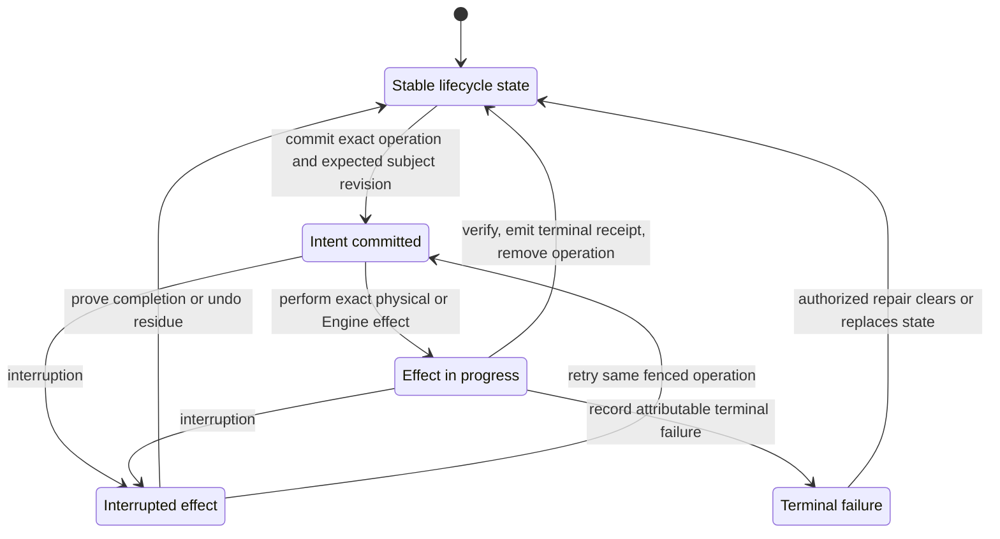

## Overall lifecycle

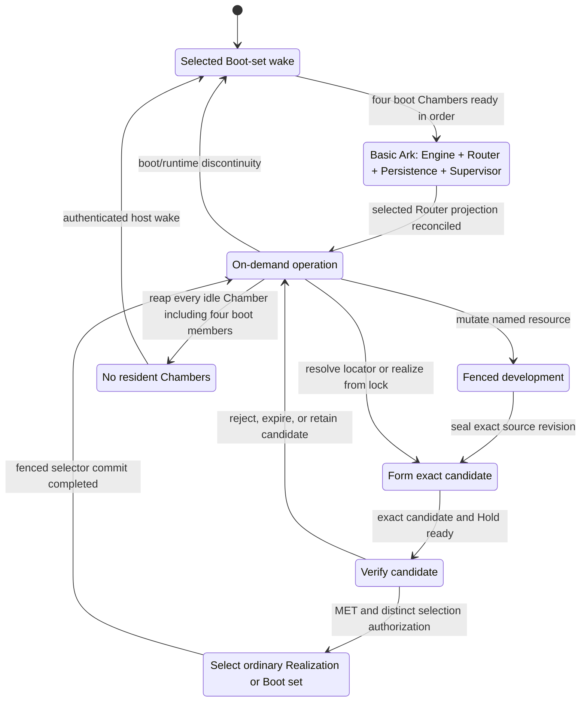

The lower lifecycle has one selected Boot set containing four exact Runnable Covenant Realizations. Host Agent
starts Engine, Router, Persistence, and Supervisor in that order. Ordinary lifecycle begins only after Router's
fixed hooks and complete route epoch, Persistence's durable state, and Supervisor's desired-state reconciliation
are ready. Boot-set selection is not a route operation; ordinary selection remains a Persistence operation
projected by the Covenant-owned Router.

## First boot installation

This one-time sequence imports rather than builds the prepared Engine, Router, Persistence, Supervisor, and
optional Builder images. The external installer supplies a one-use accepted Boot Seed to an independently
proved-unenrolled host. Builder is a separate ordinary Covenant seed and is not started on the cold path.

`entry = accepted host envelope + proved-unenrolled host + accepted one-use Boot Seed`

`exit = exact Boot-set tag + pinned selected/predecessor closures + four ready boot Chambers`

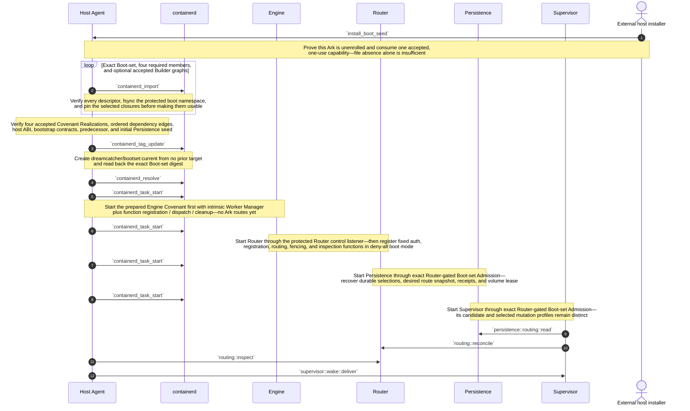

The installer never invokes a Builder. It imports an already accepted Boot set and may also import an
accepted Builder image whose exact ordinary Realization is present in the initial Persistence state. Once the
four boot Covenants are ready, Builder can be activated through `chamber::activate` in its own gVisor
Chamber. This closes self-hosting without putting compilers, package managers, arbitrary build inputs, or a
build API inside the Host Agent or any boot Chamber.

The first `containerd_tag_update` is the sole normal genesis write. After enrollment, only the Host Agent may
move that record, and only through `bootset::select` with an exact permit and expected-current fence. The
selected Boot-set and four required image graphs are product-durable in the protected boot namespace;
cold start never builds, pulls a moving tag, or chooses an alternative image.

## Selected Boot set cold start

`entry = running accepted Host Agent + protected containerd boot namespace + valid dreamcatcher/bootset:current`

`exit = ready Engine, Router, Persistence, and Supervisor Chambers for the exact selected Boot set, or an attributable terminal failure`

The Host Agent is the irreducible cold edge. It can act before I3 exists, but it can only resolve the one
selected Boot-set tag, verify four exact retained closures, and execute four fixed normalized launch plans
in dependency order. Starting or replacing the Host Agent and containerd remains a lower-platform responsibility.

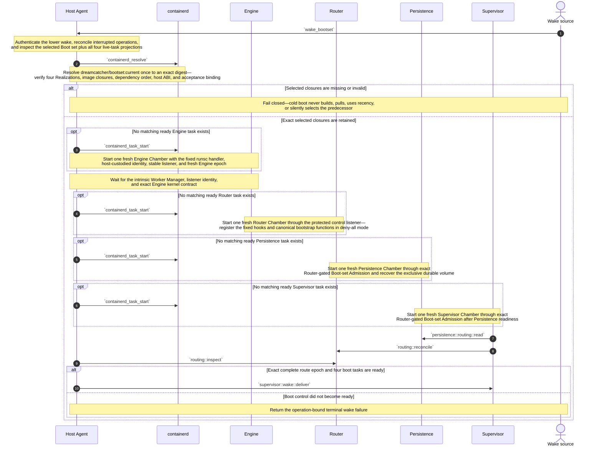

Physical creation is at most four conditional task starts. Each exact matching boot Chamber may be reused when
its Realization, dependencies, identities, epochs, and task evidence match the selected Boot set; a merely live
task is never adopted. A missing selected graph is host-state corruption requiring explicit accepted restore or
reinstall. The protected boot namespace is never treated as a disposable cache.

No Chamber is required to run continuously. Policy may keep all four boot members warm, but the Boot-set tag
survives with zero live tasks. If the Host Agent is stopped, a lower platform, cloud control plane, or physical
operator must wake it; this lifecycle does not hide that recursion.

## Boot control bootstrap

The selected Router, Persistence, and Supervisor images are independent artifact-backed Realizations of real
Runnable Covenants. Engine is already running in its separate Engine Chamber. Host Agent starts each exact task;
no boot worker becomes a general process manager. Router and Supervisor remain independently replaceable while
Persistence remains the durable witness for both.

`entry = ready selected Engine Chamber + started exact Router, Persistence, and Supervisor tasks + bootstrap Admissions and registration contracts`

`exit = exact four-member boot set + complete stable route epoch ready`

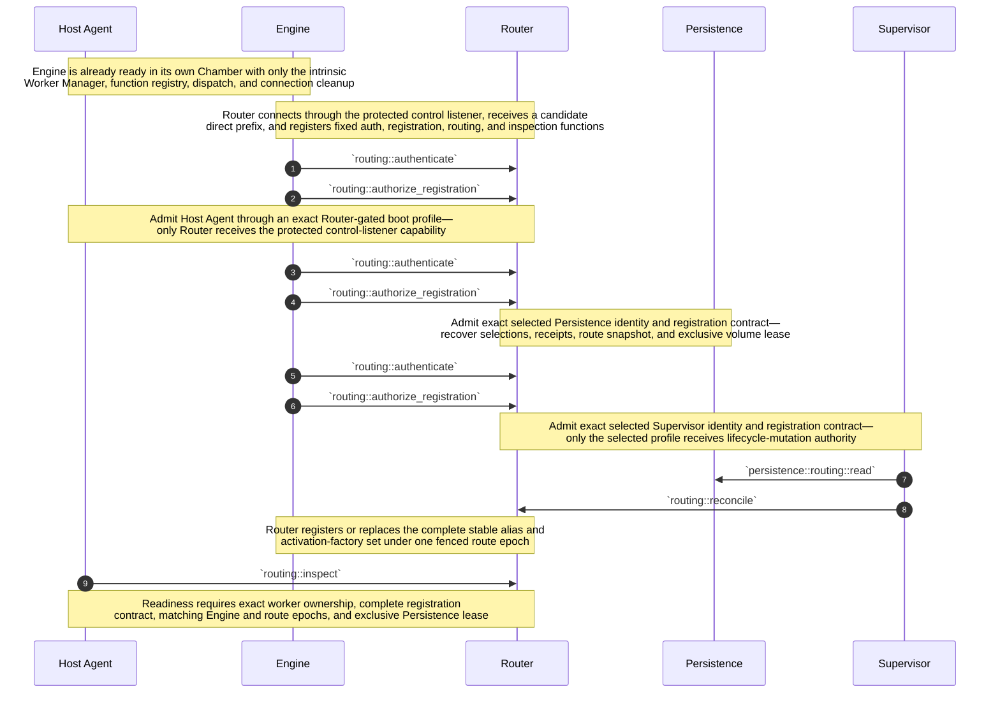

The unavoidable bootstrap primitive is Engine's protected Router listener and direct registration protocol: a
Covenant worker cannot install the mechanism it must use to connect. Everything above that primitive is
Covenant-owned. Supervisor determines desired routing after reading Persistence, but Router owns and registers
the live route functions. Host Agent wires the protected Router control listener but never calls `routing::reconcile`,
`routing::fence`, `routing::install`, or `routing::reopen`.

A route registration is live connection-owned state, not code injected permanently into Engine. Router RAM is
rebuildable projection, while Persistence remains authoritative for desired routes and handover epochs. During
Router replacement, the current Supervisor prepares and tests the successor, fences admission, and commands its
candidate prefix to claim the canonical function set one ID at a time. Stale predecessor disconnect cleanup
cannot remove successor-owned IDs, but admission stays closed until the complete owner set is proved.
Builder remains outside every boot Chamber and is activated only as a separate ordinary Covenant. After boot
readiness, Supervisor brings up every non-boot service only by invoking the ordinary `chamber::activate` kernel;
Host Agent executes the exact physical plan without interpreting why that service was chosen.

## Host reboot into the selected Boot set

A reboot repeats the same Engine-first cold-start kernel. The lower platform starts the accepted Host Agent,
containerd, runsc shim, and kernel. Host Agent resolves one Boot-set tag and starts the four exact Covenant
Realizations in dependency order; it performs no general Covenant evaluation.

`entry = enrolled host + restored protected boot namespace + running accepted host envelope`

`exit = four fresh boot Chambers whose receipts name the exact selected Boot-set and Realization digests`

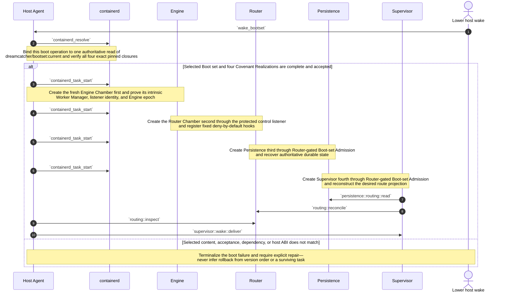

A successful `bootset::select` becomes reboot authority when its single containerd image-record update reads
back the successor Boot-set digest. A crash before that update reboots the predecessor quartet; a crash after it
reboots the successor quartet. The Host Agent reconciles unfinished Engine, Router, Persistence, Supervisor,
listener, volume-fence, route, or cleanup work against that one selected target. It never combines separately
selected Covenant Realizations.

## Ordinary Chamber activation kernel

This kernel creates one ordinary non-boot Chamber from one complete Realization. It applies to a current
Realization, a candidate under a valid Hold, a fixture, or a retained rollback target. Engine is ready in the
Engine Chamber; Router, Persistence, and Supervisor are ready in their separate boot Chambers.

`entry = ready selected four-member Boot set + exact Realization + current revision or candidate Hold + registration contract + authorized lease`

`exit = ready fresh Chamber + Run receipt, or no live Chamber + terminal failure receipt`

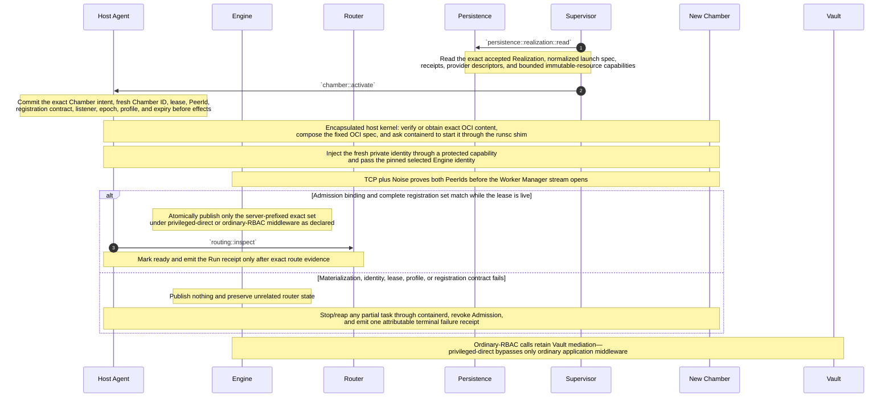

`chamber::activate(exact_realization, lease)` is the sole ordinary physical-start surface. The caller supplies
an exact accepted Realization and bounded lease, not a Covenant lock, mutable locator, host path, image tag,
or runtime flags. The Host Agent validates the supplied durable authority and encapsulates exact content
resolution, import/pull, snapshot, OCI-spec, containerd, shim, and runsc mechanics behind that one call.

Persistence remains the durable data boundary; it does not custody ordinary rebuildable OCI blobs. A
source-composed Realization may be rematerialized from its exact base and resource revisions. A missing
artifact-backed graph is not rebuilt in this kernel: an authorized rebuild returns through candidate
formation, and a different digest is a different candidate.

The Noise connection is not admission by itself. Engine invokes Router's fixed authentication and registration
hooks; Router validates the Host Agent-issued Admission both when the secure connection identifies the remote
PeerId and when the peer requests Worker Manager. A claimed Chamber ID is never authority. Private identities
are fresh per lease and destroyed with the Chamber.

The current revision or candidate Hold is captured when intent commits. A concurrent selection change never
relabels the Chamber, and a selected Realization may have zero live Chambers before or after this kernel.

## Fenced development

`mutable object = named Persistence workspace`

`developer execution = one leased ordinary Chamber from an exact development Realization`

`immutable handoff = exact resource snapshot`

The Developer Chamber is ordinary execution state. It is activated through the same three-function Host
Agent surface, terminates, and is reaped. Any immutable product may enter another lifecycle as a candidate,
but the Developer Chamber itself is never promoted.

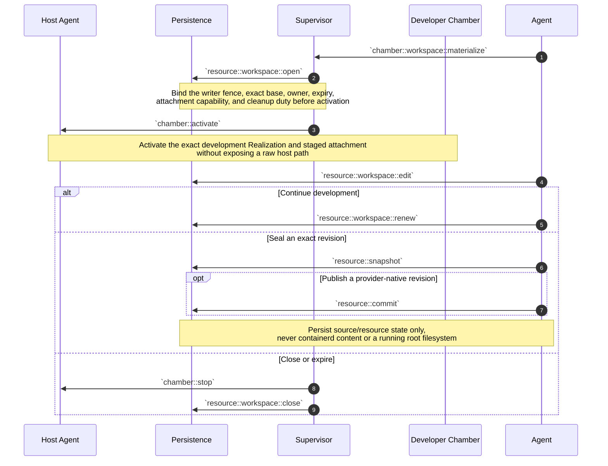

Workspace, snapshot, provider revision, Realization, and Chamber remain distinct identities. A sealed output
becomes an input to a later Covenant lock. It enters **Form and activate a candidate**, forms one exact
candidate under a Hold, and may be selected only after verification. No workspace, containerd snapshot, or
running Chamber is renamed into a candidate or current Realization.

## Form and activate a candidate

`entry = authorized caller + durable logical name + locator or exact Covenant lock + candidate quota`

`exit = exact source-composed or artifact-backed candidate Realization + bounded Hold + optional ready Chamber`

Several candidates may coexist for one logical name. Candidate formation is logical work owned by Supervisor
and Persistence; it does not need a Host Agent operation until an exact candidate is physically activated.
This mode never changes either selection authority.

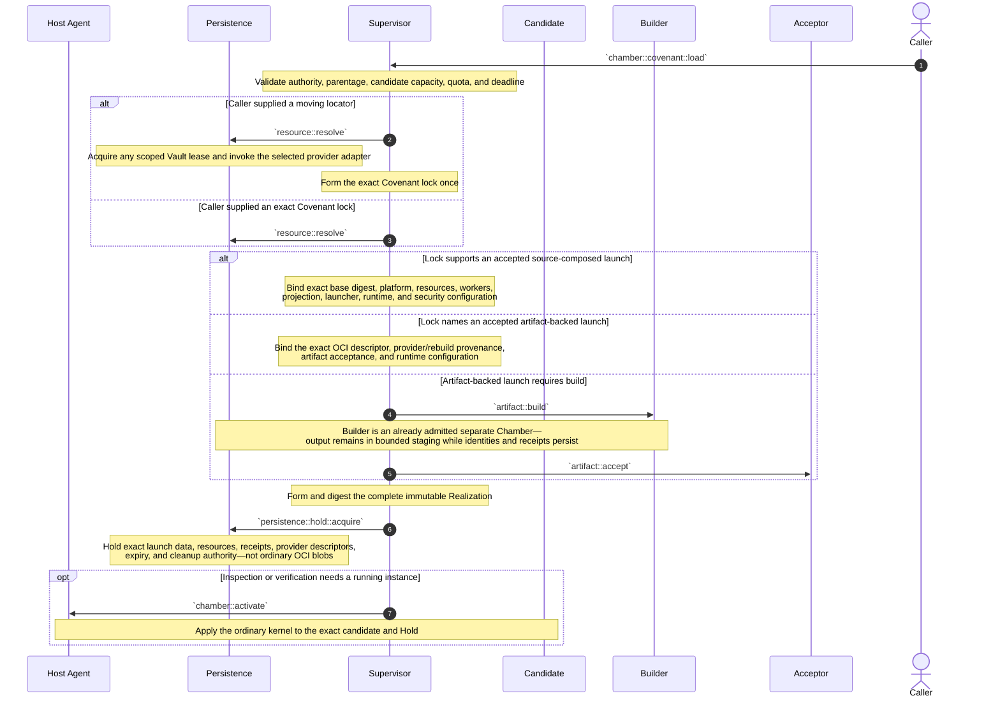

A moving locator is resolved only while forming the lock. Re-resolving it later may produce another lock and
candidate; it never mutates `current`. Candidate admission deduplicates the same Realization identity.

Source-composed launch is preferred when exact source and runtime base are cheaply obtainable. Artifact-backed
launch remains available for distributable or opaque images and accepted build outputs. Persistence retains
exact identity, evidence, and provider/rebuild policy rather than a duplicate ordinary OCI graph.

Builds are not assumed reproducible. A byte-identical authorized rebuild may restore an unavailable recorded
OCI descriptor after evidence checks. A different digest is a different candidate. Rejection, missing Builder
support, unavailable provider bytes, or incomplete durable inputs fails closed without changing selection.

## Build an artifact

`entry = accepted Builder Realization + accepted Covenant lock + exact build request`

`output = exact OCI descriptor + Build receipt + bounded output capability`

Build is an ordinary separately sandboxed Chamber capability. The first accepted Builder image may be imported
by the installer and named in initial Persistence state, so Builder need not build itself before first use.
It is not a Host Agent method, boot process, or cold-start dependency. `containerd` does not build images.

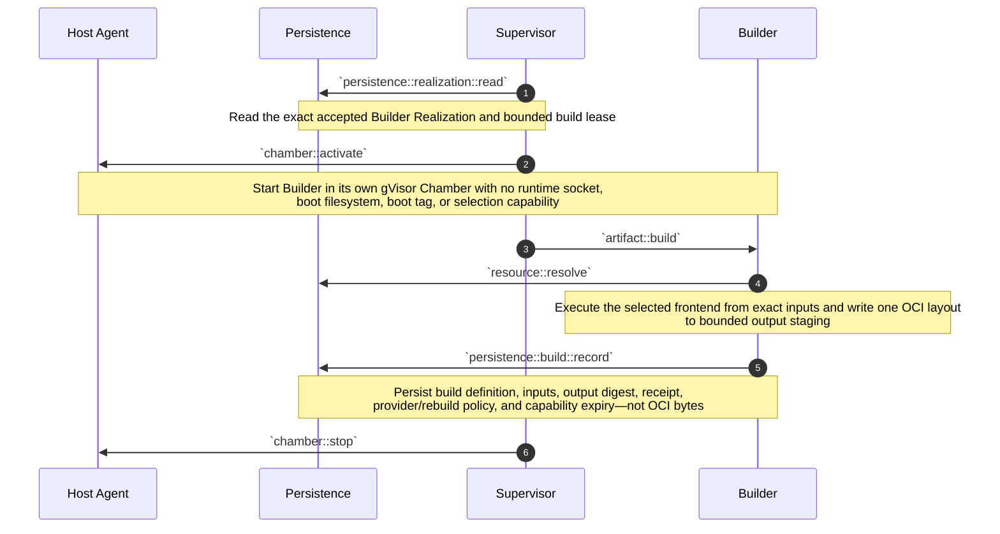

A later activation or `bootset::stage` may give the Host Agent the exact bounded output capability to import.
The Builder never receives the containerd socket. If output must be durable independently, an explicit OCI
provider receives it and Persistence retains only the exact provider descriptor and digest.

If bounded output disappears before import or publication, no selected identity changes. An authorized rebuild
enters candidate formation. Matching the recorded digest proves byte convergence; a different digest is a
different candidate. BuildKit, Nix, Kaniko, or a minimal OCI assembler may be replaceable Builder
implementations behind the same contract.

If a chosen frontend cannot operate inside the bounded Builder Chamber, build is delegated to an explicit
external provider with exact input/output evidence. That limitation never expands the Host Agent or moves
build onto the boot cold path.

## Verify a candidate

`verdict subject = exact candidate Realization + exact Chamber + exact plan + environment`

`verdict != selection`

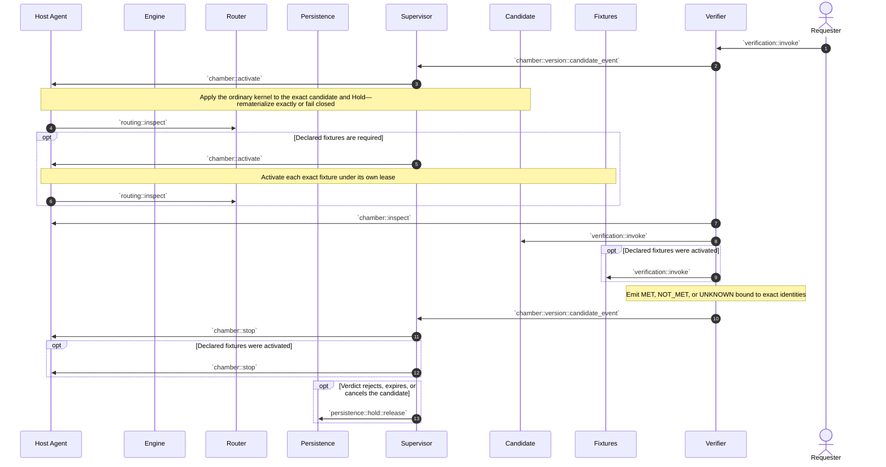

MET permits a later selection request while the Hold remains valid; it does not keep verification Chambers
alive. Further attempts create fresh Chambers of the same Realization and independently scoped evidence.

A source-composed candidate can be recreated from exact durable launch data while its exact base graph is
obtainable. An artifact-backed candidate needs its exact graph from staging, the ordinary runtime namespace,
or a declared provider. The verifier never rebuilds or substitutes an image.

The first Tester is judged by the external bootstrap verifier. Once selected, its ordinary Realization supplies
on-demand Tester Chambers. Tester never writes either selector.

## Select, upgrade, or roll back

`ordinary selection authority = gate-appropriate fenced promoter + Persistence compare-and-swap`

`Boot-set selection authority = gate-appropriate fenced promoter + Host Agent expected-target tag update`

`entry = exact accepted candidate or Boot set + valid custody + fresh evidence + expected selector revision`

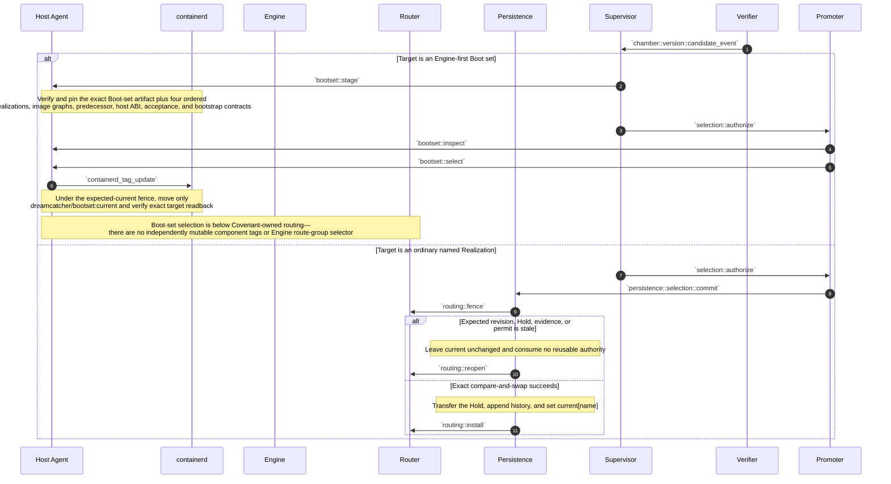

Selection always names immutable content, never a running Chamber. Existing ordinary Chambers remain pinned
to their captured Realizations until independently drained. A new ordinary call uses the new Persistence
revision. A new cold boot uses the new Boot-set target.

The Boot-set path has one selector over an ordered quartet of exact Covenant Realizations, so it does not add
independently mutable component tags or route-group selection to Engine. `bootset::stage` may import and
preflight exact candidate content while the predecessor quartet is live, but only `bootset::select` changes
reboot authority. A crash before the containerd image-record update leaves the complete predecessor selected;
a crash after it leaves the complete successor selected. A same-Engine live cutover changes at most one of
Router, Persistence, or Supervisor; several changes require sequential accepted Boot sets.

Rollback uses the same respective operation with retained accepted content as target. No selector infers
rollback from health, creation time, semantic version, fleet majority, surviving task, or cache contents.
Boot-set rollback additionally requires the predecessor graph to remain pinned and its Persistence schema
to remain compatible; otherwise rollback is not authorized.

## Live Boot-set cutover

Router and Supervisor are the mutual live-upgrade pair. Router remains current while a successor Supervisor is
prepared and targeted; Supervisor remains current while a successor Router is prepared and claims the canonical
registration set. Persistence remains the durable witness for both. Neither component authorizes its own
replacement after it has been fenced, and Router and Supervisor replacement never overlap.

An unchanged Engine Chamber, stable listener, transport identity, and Engine epoch survive any Router-,
Persistence-, or Supervisor-only cutover. A Boot set that changes Engine uses a bounded stop/start handoff. The
baseline does not claim zero downtime: III ownership transfer is per function ID, Persistence authority is
exclusive, and Engine has no atomic multi-registration or whole-control-set promotion primitive.

After the tag decision, Host Agent retains each unchanged member only by proving its exact selected Realization,
launch plan, registration contract, identity, and dependency epochs, then recording a successor-scoped retention
receipt and renewing its Boot-set Admission. This reconciliation changes no component selector and gives Host
Agent no route-policy authority. Failure to prove or renew one unchanged member makes that member restart from the
selected Boot set before admission reopens.

`entry = ready predecessor quartet + accepted successor Boot set + exact preflight plan and custody`

`exit = current tag and ready four-member boot set match successor, or exact journaled state for deterministic recovery`

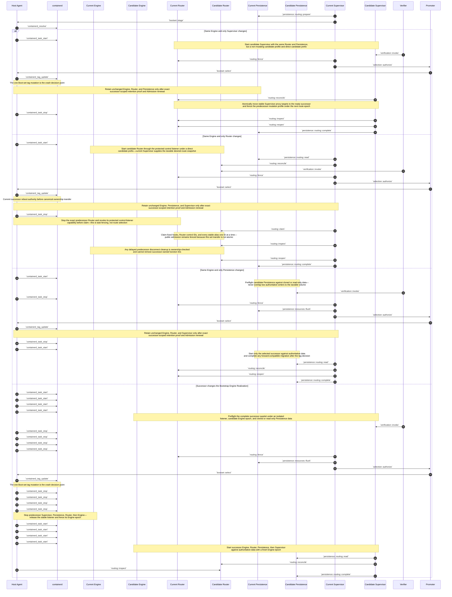

Supervisor replacement is the cheapest branch: Router keeps its in-memory route projection and changes the
stable Supervisor proxy targets only after the candidate is ready and the Boot-set tag commits. Persistence
remains authoritative throughout. The predecessor Supervisor's operation-bound handover authority ends when
Router fences its mutation profile; it cannot reclaim the stable target.

Router replacement uses current Supervisor as the external handover authority and a conservative
break-before-make baseline. Host Agent stops the exact predecessor task after the tag decision but before
`routing::claim`; it neither chooses the route set nor invokes Router mutation functions. The accepted Engine
Realization must still prove that each function ID is associated with its latest owner and delayed disconnect
cleanup removes it only when the disconnecting worker still owns it. That required III property prevents cleanup
races from deleting successor registrations, but it does not make the complete set atomic; the bounded route gap,
fence, and final `routing::inspect` proof are mandatory.

When Engine changes, ordinary Chambers may remain physically alive during the bounded Engine gap. They
reconnect to the same pinned Engine PeerId and stable listener after the successor starts, but the fresh Engine
epoch requires Host Agent to reinstall live lease Admissions before registrations become routable.

A successor must read the predecessor's durable Persistence schema. Irreversible migration may begin only
after the current tag commits; explicit rollback is permitted only when the resulting data remains compatible.
On crash, Host Agent reads the one current tag, reuses only exact matching selected members, fences tasks and
route epochs from the other Boot set, and finishes or recreates the selected quartet. The journal never chooses
a different Boot set. A same-Engine upgrade that needs several component changes proceeds through intermediate
accepted Boot sets so every handover retains one current witness.

## Quiesce and wake

`quiescence preserves Boot-set and ordinary selections, candidate Holds, receipts, and durable resources—not Chambers`

`wake = selected Boot set cold start`

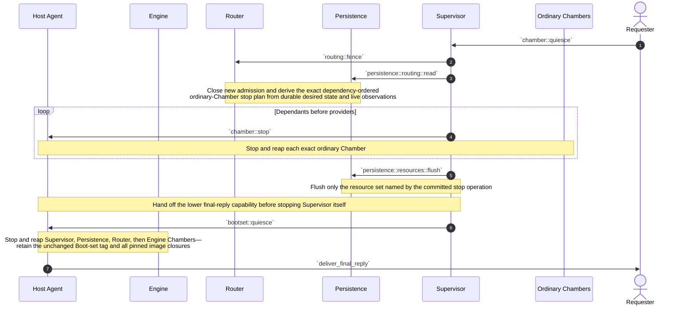

`persistence::resources::flush` is the sole explicit Persistence barrier. Every other Persistence call already
honors its own durability contract. Once scoped receipts are durable and no invocation remains active, Host
Agent stops the four exact Boot-set tasks in reverse dependency order. There is no arbitrary task-ID stop API.

Idle reaping uses the same exact operations and never changes selection. Reaping all four boot members leaves Host
Agent waiting on its authenticated lower wake edge; the next event follows **Selected Boot set cold start**. A
hard deadline may discard unflushed Chamber-local state but creates no alternate identity or selector update.
The ordinary runtime namespace may be discarded; the protected Boot-set namespace and current tag may not.

## Attested multi-Ark builds (later)

Status: **Later extension; not required by the first Builder contract.**

The baseline single-Builder contract above remains the compatibility floor. This stronger policy is useful
only when independent builders and fresh confidential-computing evidence add enough value to justify the
extra cost.

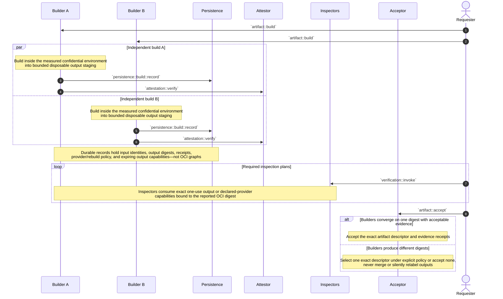

Attestation binds a statement about one Builder realization, request, input closure, output digest, and
fresh environment evidence. It does not prove truth, reproducibility, or acceptability. Inspectors and the
Acceptor remain separate replaceable policy roles.

Multi-Ark agreement still creates no Ark-local durability obligation for OCI bytes. Each output may remain
in bounded disposable builder staging, be imported into a host's ordinary containerd runtime namespace, or be pushed
to an explicit external OCI provider. Persistence records identities, evidence, and locators. If every byte
source disappears, rebuilding is candidate work and a different digest is a different artifact.

## Failure and recovery formulas

- `operation remains non-terminal after interruption -> reconcile that exact operation before conflicting work`.
- `current[name] = R + zero ordinary Chambers -> valid idle state`; do nothing until demand or explicit prewarm policy.
- `dreamcatcher/bootset:current = B + zero boot tasks -> valid idle state`; authenticated wake starts or reuses exact Engine, Router, Persistence, then Supervisor from `B`.
- `admitted call snapshots ordinary current revision S and Realization R -> its Chamber remains pinned to (S, R)` even if selection changes before physical start completes.
- `ready ordinary Chamber fails -> terminalize its exact lease and receipt`; authorized retry creates a fresh Chamber of the same Realization without changing current.
- `ordinary Chamber lease expires or work terminates -> chamber::stop exact Chamber`; sibling Chambers and both selectors are unchanged.
- `any selected boot member absent + authenticated wake -> Host Agent resolves dreamcatcher/bootset:current once and applies selected Boot set cold start`.
- `Boot-set tag update not committed when host crashes -> predecessor quartet remains the complete selected Boot set`.
- `Boot-set tag update committed when host crashes -> successor quartet is the complete selected Boot set`; reconcile Engine, Router, Persistence, Supervisor, listener, data lease, route epoch, Admissions, and cleanup to that target.
- `selected Boot-set artifact, any required Realization or image graph, dependency edge, acceptance, host ABI, or pinned content is missing/corrupt -> cold start fails closed`; never build, pull a moving tag, infer newest, or silently select predecessor.
- `proved-unenrolled host + accepted one-use Boot Seed -> external installer may import and create the first Boot-set tag`; absence alone grants no write authority.
- `enrolled host + missing/damaged protected containerd boot namespace -> explicit accepted restore or reinstall`; the ordinary runtime namespace may be reconstructed, but the Boot-set selector is product state.
- `staged Boot set + stale expected current target, evidence, or promoter permit -> bootset::select rejects before tag mutation`.
- `selected predecessor graph not pinned or Persistence data no longer compatible -> Boot-set rollback rejects`; history alone is not materialization or rollback authority.
- `successor quartet preflight passes + live-data handoff fails before tag mutation -> predecessor remains selected and live or is recreated`.
- `successor Boot-set tag commits + later live handoff fails -> recover the successor quartet or explicitly authorize compatible rollback`; never infer a third target.
- `Router bootstrap hooks, Persistence lease, Supervisor profile, Engine epoch, route epoch, or exact registration subset fails -> Boot set is not ready`; publish no partial stable route set.
- `same Engine + Supervisor-only replacement -> retain exact Router and Persistence`; candidate remains non-mutating until Router moves stable targets and fences predecessor.
- `same Engine + Router-only replacement -> retain exact Supervisor and Persistence`; fence admission, commit the tag, stop the exact predecessor Router, claim every canonical and alias function ID under a fresh route epoch, prove complete ownership, then reopen.
- `Router successor claims only a subset -> remain fenced`; recover the selected Boot set or explicitly select compatible predecessor—never publish the partial set.
- `same Engine + Persistence-only replacement -> retain exact Router and Supervisor`; preflight read-only, flush and stop predecessor writer, commit tag, then start only successor against authoritative data.
- `same Engine + several changed boot-control Realizations -> reject one-step live handover`; construct sequential accepted Boot sets so only one changes at a time.
- `unchanged boot member crosses a committed Boot-set tag update -> require exact retention proof and successor-scoped Admission renewal`; otherwise restart that selected member rather than silently adopting it.
- `different selected Engine Realization -> stop predecessor Supervisor, Persistence, Router, then Engine and start successor Engine, Router, Persistence, then Supervisor`; a fresh Engine epoch fences stale Admissions.
- `candidate Hold expires -> reap its candidate Chambers + remove candidates[name][R] + emit cleanup receipt`, unless another selector, candidate, or operation retains the exact durable launch data.
- `source-composed ordinary runtime view unavailable -> rematerialize from exact durable launch data while its exact base graph remains obtainable; otherwise activation fails`.
- `artifact-backed ordinary graph unavailable from runtime cache, output capability, or provider -> activation fails`; do not build from a lock inside `chamber::activate`.
- `build starts from a Covenant lock -> output enters candidate formation`, never directly as ordinary current or Boot-set current.
- `rebuild reproduces an exact recorded OCI digest -> verify candidate and perform the appropriate fenced selection/custody operation`.
- `rebuild produces another artifact or Realization digest -> distinct candidate`; only fenced selection may choose it.
- `provider credential unavailable -> resolution or build fails closed`; selection is unchanged.
- `Router projection disagrees with ordinary current or authoritative Chamber state -> lifecycle state wins`; fence affected admission and rebuild the projection.
- `Noise authenticates a PeerId absent from live Admission, or the pinned Engine identity is wrong -> no Worker Manager stream`; publish no registration.
- `ordinary admitted PeerId claims another Chamber or submits a non-exact registration set -> close stream + fail activation`; quarantined routes never publish.
- `Admission expires, Engine epoch changes, route epoch is fenced, or lease is revoked -> reject new streams or routed calls`; replacement needs the appropriate fresh Chamber ID, lease, epoch, and identity.
- `physical task survives but exact selected Boot set or Realization, lease, Admission, and operation cannot be proved -> reap it`; never adopt by runtime ID or apparent health.
- `verifier unavailable or verdict UNKNOWN -> no selection`.
- `stale ordinary revision, Hold, lease, operation subject, or permit -> reject before effect`.
- `cleanup names exact Chamber IDs, task identities, Boot-set digest, route epoch, and candidate Holds`; unrelated work is unaffected.
- `Host Agent unavailable -> only an explicitly lower platform may wake or replace it`; no boot or ordinary Chamber can bootstrap its absent host authority.

## Implementation handoff

### Initial lifecycle

- external provider-specific Covenant locators with optional logical credential names;
- location-independent Covenants with top-level `hardware`, `image`, optional `build`, flat `mounts`, and plural `workers`;
- exact Covenant locks and content-addressed Realizations with source-composed and artifact-backed launch modes;
- one accepted OCI Boot-set root artifact binding exactly four ordered Runnable Covenant Realizations, their image descriptors, dependency order, host ABI, bootstrap Admissions and registration contracts, predecessor, acceptance, and Persistence schema;
- a Bootstrap Engine Covenant whose pinned near-upstream image starts first in one gVisor Engine Chamber and contains only III transport, Worker Manager listeners, function registration, dispatch, and ownership-checked cleanup;
- separate minimal Router, durable Persistence, and replaceable Supervisor Covenants and gVisor Chambers starting second, third, and fourth;
- one protected containerd boot namespace containing the authoritative `dreamcatcher/bootset:current` image record plus all pinned selected/predecessor closures;
- one separate ordinary containerd runtime namespace whose images, snapshots, and tasks remain reconstructable;
- an accepted first-install Boot Seed imported rather than built, optionally carrying a separately sandboxed initial Builder Realization and initial Persistence state;
- no Builder, build frontend, arbitrary command execution, or general Covenant evaluator in the Host Agent, Engine image, Router, Persistence, or Supervisor bootstrap path;
- one mechanism-only Host Agent replacing separate Procman, Image Materializer, and direct-runsc adapter roles;
- Host Agent as sole containerd socket and Boot-set-tag writer, with durable exact-operation journal, expected-target fencing, four-task reconciliation, Admission, mounts, cgroups, and logs;
- standard `Host Agent -> containerd -> containerd-shim-runsc-v1 -> runsc -> gVisor` physical actuation, with no application-facing direct-runsc or raw runtime API;
- the narrow ordinary I3 surface `chamber::activate(exact_realization, lease)`, `chamber::inspect(chamber_id)`, and `chamber::stop(chamber_id, fence)`;
- the narrow Boot-set surface `bootset::stage`, `bootset::inspect`, `bootset::select`, and `bootset::quiesce`, with no Engine route-group promotion;
- a host-custodied stable Engine transport identity/listener injected into each accepted Engine task, plus a fresh Engine epoch only when Engine is replaced;
- one protected Router control-listener capability and fixed Router authentication and registration-hook IDs in Engine static configuration, with no dynamic route map or Dreamcatcher policy in Engine;
- Router as the only protected-control-listener client, registering deny-by-default bootstrap hooks before exact Router-gated Host Agent, Persistence, and Supervisor Admissions connect;
- Persistence recovery followed by Supervisor-driven `routing::reconcile` of the complete stable route epoch;
- connection-owned route registrations, RAM-only live projection reconstructed from durable Persistence state, and no claim that route code is injected permanently into Engine;
- sequential mutual Router/Supervisor handover: Router targets a ready Supervisor successor; Supervisor prepares, tests, and commands a ready Router successor to claim canonical registrations;
- one-component-at-a-time same-Engine Boot-set cutover, with sequential intermediate Boot sets for several component changes;
- per-function owner-safe III re-registration plus an admission fence and complete successor-owner proof, without claiming an atomic multi-function handover;
- Persistence-owned `current[name] = {revision, realization}` as the only ordinary stable named selection;
- `candidates[name][realization] = Hold reference` with several bounded candidates permitted;
- `chambers[id] = {name, realization, lease, phase}` with fresh zero-to-many ordinary Chambers per Realization;
- no separate Activation record and no Chamber-bearing `last/current/next` slots;
- exact-Chamber execution, verification, inspection, and cleanup;
- fresh ordinary Chamber PeerIds bound by Host Agent Admission to exact Chamber, Realization, registration contract, selected Engine listener, Engine epoch, profile, and expiry;
- a Noise-authenticated Worker Manager stream gate with server-assigned `chamber::<Chamber-ID>` prefixes and exact complete-set publication;
- privileged Router-bootstrap, selected-control, candidate-control, and ordinary-RBAC profiles that all retain Admission, prefix, lease, epoch, and registration-contract enforcement;
- Builder as an ordinary separately sandboxed Covenant Chamber with no containerd socket, boot filesystem, tag mutation, or selection authority;
- no build on Boot-set cold start or ordinary activation; missing artifact content enters candidate/rebuild work rather than hidden substitution;
- ordinary selection through Persistence compare-and-swap and Router projection registered into Engine;
- Boot-set selection through one Host Agent expected-target update of the single Boot-set tag;
- Engine-first cold start; reverse-order Supervisor/Persistence/Router/Engine shutdown; component-only cutover that preserves every exact unchanged Chamber and epoch;
- Engine-changing cutover that preflights the complete quartet and then replaces it in dependency order under one selected Boot-set decision;
- minimal run, build, verification, selection, cutover, route, and cleanup receipts that reference exact prior identities and evidence;
- idle ordinary or boot Chamber reaping that never mutates either selector.

### Deliberately later

- additional provider-neutral Builder frontends and multi-Ark confidential Builder attestations, inspection, and collective acceptance;
- zero-gap Router replacement via an upstream Engine transactional registration-set primitive, only if measurement proves fenced per-ID transfer insufficient; it must remain mechanism, not desired-route policy or selection authority;
- replicated or externally transactional Persistence replacement if a bounded exclusive-writer handoff is insufficient;
- live dual-Engine handover through a separately justified stable host-owned ingress primitive; baseline Engine change remains a bounded discontinuity;
- shared reusable ordinary Chamber pools, prewarm controllers, and service traffic balancing;
- lower-platform automation that also stops and wakes the Host Agent;
- independently accepted replacement of Host Agent, containerd, runsc shim, runsc, kernel, and protected boot-store formats;
- process-memory or rootfs checkpoint recovery;
- migration of ordinary Ark-to-Ark RBAC handshakes to the reusable Noise-plus-authorization-contract boundary.

### Required downstream reconciliation to this sequence authority

- cross-stack architecture vocabulary and narrative;
- Covenant owner schema and Gherkin (`source`, singular `worker`, and `worker.resources` are old);
- Chambers owner process-tree, routing, image construction, Host Agent activation, verification, Boot-set packaging, and upgrade Gherkin;
- Chambers runtime replacement of direct-runsc/materializer/procman surfaces with the typed Host Agent and standard containerd runsc runtime handler;
- separate Bootstrap Engine, Router, Persistence, and Supervisor Covenant packaging with fixed boot order and independent physical fate;
- III stable host identity/listener injection, protected Router listener, fixed auth/registration hook IDs, Engine-epoch Admission rebuild, candidate prefixes, owner-safe connection cleanup, and ordinary PeerId stream gate;
- Persistence ordinary-selection, Realization/build-record/Hold/resource/provider contracts, initial seed state, flush, route-snapshot, handover epoch, and schema compatibility contracts;
- installer and recovery tooling for one-use accepted Boot Seed import, protected containerd boot namespace, all pinned selected/predecessor closures, and exact Boot-set-tag update/readback;
- Host Agent operation journal, expected-current Boot-set fencing, same-Engine reuse proof, Engine-changing cutover reconciliation, containerd task receipts, and runtime-namespace invalidation;
- generated traceability and registered Lifecycle Atlas after authoritative inputs change.
