# Chambers lifecycle sequence reference

Status: **Current working architecture authority; downstream reconciliation pending**

Architecture classification: `architecture_delta_required`

Design-lineage baseline: `8e364299e8a0dd5d6628f0c910e7261850b4632d`

This document is the current Chambers lifecycle architecture authority. It owns the working design
for lifecycle identity, state, sequencing, authority boundaries, custody, routing, verification,
selection, quiescence, and recovery until it is explicitly superseded. The broader
[`ark-agent-architecture.md`](ark-agent-architecture.md), owning Gherkin, schemas, implementation,
and generated projections are downstream reconciliation targets and may temporarily lag this design.
This status establishes design authority; it does not claim implementation or runtime acceptance.

## Contents

- [Dictionary](#dictionary)
- [Lifecycle axioms](#lifecycle-axioms)
- [Lifecycle call table](#lifecycle-call-table)
- [Authoring and state shapes](#authoring-and-state-shapes)
- [Overall lifecycle](#overall-lifecycle)
- [First core installation](#first-core-installation)
- [Core image cold start](#core-image-cold-start)
- [Core process bootstrap](#core-process-bootstrap)
- [Host reboot into the selected Core image](#host-reboot-into-the-selected-core-image)
- [Ordinary Chamber activation kernel](#ordinary-chamber-activation-kernel)
- [Fenced development](#fenced-development)
- [Form and activate a candidate](#form-and-activate-a-candidate)
- [Build an artifact](#build-an-artifact)
- [Verify a candidate](#verify-a-candidate)
- [Select, upgrade, or roll back](#select-upgrade-or-roll-back)
- [Live Core-image cutover](#live-core-image-cutover)
- [Quiesce and wake](#quiesce-and-wake)
- [Attested multi-Ark builds (later)](#attested-multi-ark-builds-later)
- [Failure and recovery formulas](#failure-and-recovery-formulas)
- [Implementation handoff](#implementation-handoff)

## Dictionary

This section is the terminology source of truth for this document and every generated projection of it.
Other sections state relationships and invariants between these terms; they do not create aliases or
alternate meanings. Each term is unique in this table. **Definition** is normative; **Related terms** is
navigational and does not alter the definition.

| Term | Definition | Related terms |
| --- | --- | --- |
| Acceptance receipt | Durable evidence that one exact launch specification, artifact, or Boot set was accepted under one policy and a named set of evidence receipts. | Inspection receipt; Realization |
| Activation | The operation that creates one fresh Chamber from one exact Realization and lease. It is not a separate lifecycle object or durable identity. | Chamber; Realization; Run receipt |
| Admission | Host Agent-owned, lease-scoped authority binding a fresh PeerId to one exact ordinary Chamber, Realization, registration contract, Engine listener, epoch, profile, and expiry. Core processes use the separate local Boot-set contract. | Chamber lease; Host Agent; libp2p PeerId; Registration contract |
| Artifact-backed launch spec | A normalized launch specification whose executable root is one exact OCI descriptor with an exact provider or bounded rebuild provenance and fixed runtime and security configuration. | Normalized launch spec; OCI digest; Source-composed launch spec |
| Assembly Covenant | A Covenant that expands to a process-tree subtree. The Assembly itself has no Chamber. | Covenant; Runnable Covenant |
| Boot Seed | An externally accepted, one-use installation or explicit-recovery bundle containing one exact Boot set, its complete OCI closure, initial durable Persistence state, and optionally an accepted Builder image. It never selects itself after enrollment. | Boot set; Builder; Core boot selection |
| Boot set | One immutable OCI boot-set artifact whose only runnable member is one exact Core image. The artifact binds that image, host ABI, local core-process contract, Persistence schema, acceptance evidence, and predecessor. | Core boot selection; Core Chamber; OCI digest |
| Build receipt | Durable evidence binding one build request, Builder Realization, output artifact identity, and evidence root. | Acceptance receipt; Realization |
| Builder | An ordinary separately sandboxed Runnable Covenant that produces OCI layouts from exact inputs. The installer may import its first accepted image, but Builder is never in the cold path and never receives the containerd socket. | Build receipt; Runnable Covenant |
| Candidate | One exact accepted or testable Realization retained under a bounded Hold but not selected as current. | Current selection; Hold; Realization |
| Chamber | One ephemeral host-local activation of one exact Runnable Covenant Realization. Every activation or restart receives a fresh Chamber ID and independent fate, except that the named core processes intentionally share one Core Chamber fate. | Activation; Chamber lease; Core Chamber; Realization |
| Chamber lease | Bounded Host Agent authority for one exact Chamber, including its admission, lifetime, and cleanup scope. | Admission; Chamber; Host Agent |
| containerd | The Host Agent's sole image, snapshot, and task backend. Its protected boot namespace durably retains the selected Boot set and predecessor; its ordinary runtime namespace remains reconstructable. Tasks use the runsc runtime shim. | Boot set; Core boot selection; Host Agent; OCI digest |
| Contract Covenant | A promise-only Covenant with no Chamber of its own. | Covenant; Runnable Covenant |
| Core boot selection | The Host Agent-owned, expected-current-fenced containerd image record `dreamcatcher/core:current`, targeting one exact Boot-set digest. It is the sole normal Core selector. | Boot set; containerd; Host Agent |
| Core Chamber | The single gVisor sandbox/task created from the selected Core image. Engine, Persistence, and Supervisor run as separate local processes inside it and intentionally share its host-isolation, resource, failure, pause, and upgrade fate. | Boot set; Engine; Persistence; Supervisor |
| Covenant | A location-independent promise describing offered behavior, required dependencies, resources, workers, evidence, and policy without naming the repository that carries it. | Assembly Covenant; Contract Covenant; Runnable Covenant |
| Covenant locator | Provider coordinates plus an optional logical credential need used to resolve Covenant content. It is not immutable runtime identity. | Covenant; Credential; Provider |
| Covenant lock | The exact transitive closure of Covenant bytes, provider-native revisions, base-image and build inputs, mounts, workers, hardware, and launch policy. It is an input to candidate formation, not launch authority and not an alias for Realization. | Covenant; Normalized launch spec; Realization |
| Credential | A named Vault need. It is never a secret value, token, or leased credential embedded in lifecycle identity. | Covenant locator; Provider |
| Current selection | The sole Persistence-owned revisioned named choice `current[name] = {revision, realization}` for an ordinary durable lifecycle. Core boot uses the distinct Core boot selection. | Candidate; Persistence; Realization; Selection |
| Engine | The I3 actor that owns typed transport, authenticated Worker Manager admission, function registration, derived routing, and Engine-specific lifecycle functions. In the Core Chamber it starts before and accepts local core-process attachment. | I3 function; Registration contract; Route |
| Hold | A bounded reference retaining one exact candidate and its custody, owner, expiry, and cleanup authority. | Candidate; Realization |
| Host Agent | The one small non-Chamber host authority combining the former process manager, image materializer, and direct-runtime adapter responsibilities. It owns boot selection, containerd access, physical lifecycle intent, Admission, reconciliation, and reaping, but no Builder or application policy. | Admission; containerd; Core boot selection; Engine |
| I3 function | A named function registered by one owning actor and invoked at that actor. Sequence diagrams omit Engine's ordinary brokerage path; Engine is the arrow target only for functions registered by Engine workers. | Engine; Registration contract; Worker |
| Immutable identity | A provider-native commit, tree, digest, CID, or snapshot that identifies exact content rather than a moving locator. | Covenant lock; OCI digest; Provider |
| Inspection receipt | Durable evidence binding one exact artifact, inspection plan, evidence root, and verdict. | Acceptance receipt; OCI digest |
| Kind | The logical content form being addressed, independent of provider and location. | Provider |
| Latest | A moving resolution policy. It is never runtime identity or selection authority. | Covenant locator; Current selection |
| libp2p PeerId | Proof-of-possession transport identity authenticated by Noise. Ordinary Chambers use fresh lease identities; local core processes do not need PeerIds between themselves. | Admission; Chamber |
| Normalized launch spec | One exact source-composed or artifact-backed runtime composition with fixed platform, resources, launcher, runtime, and security inputs. | Artifact-backed launch spec; Source-composed launch spec; Realization |
| OCI digest | Immutable materialization and verification identity for one OCI object or graph. A Core boot tag selects an exact Boot-set digest rather than a moving upstream image tag. | Artifact-backed launch spec; Boot set; containerd; Realization |
| Operation | Durable exact lifecycle intent retained until a matching terminal receipt; retries reconcile that same intent before conflicting work. | Activation; Selection |
| Persistence | The durable Core process owning ordinary current selections, candidate Holds, Realization manifests, exact source and resource revisions, provider locators, and receipts. It does not own the lower Core boot tag or rebuildable OCI blobs. | Current selection; Hold; Realization |
| Provider | An access, authority, and location family capable of resolving or supplying exact content under scoped credentials. | Covenant locator; Credential; Immutable identity |
| Realization | The sole public immutable executable lifecycle identity: one exact Covenant lock plus one normalized launch specification, acceptance evidence, and launch plan. It is immediately materializable without mutable lookup, dependency choice, build, or substitution. | Covenant lock; Normalized launch spec; Chamber |
| Realization ID | The digest of the canonical Realization manifest body. | Realization |
| Registration contract | The digest of the canonical declared worker and export set for one exact Realization. Engine publishes the complete matching set atomically; the Boot set separately binds the local Core process set. | Admission; Boot set; Realization; Worker |
| Route | A derived Engine lookup. A stable ordinary name routes to an activation factory for its Current selection; an exact Chamber ID routes to one ready Chamber. Route state never selects the Core image. | Current selection; Engine; Chamber |
| Run receipt | Durable evidence binding one Realization ID, fresh Chamber ID, host evidence, runtime specification identity, and outcome. | Activation; Chamber; Realization |
| Runnable Covenant | A Covenant whose selected Realization may have zero or many concurrent Chambers, each containing one or more workers. | Chamber; Covenant; Worker |
| Selection | A fenced compare-and-swap from an expected Current selection revision to one exact candidate Realization. The Core boot selection is a separate lower-host operation over one Boot-set digest. | Candidate; Current selection; Realization |
| Source-composed launch spec | A normalized launch specification that projects exact resource revisions and workers over an exact base OCI descriptor without producing or requiring a derived application image. | Artifact-backed launch spec; Normalized launch spec; OCI digest |
| Supervisor | The replaceable control-plane Core process that proposes ordinary lifecycle work and resolves declared exports into registration contracts but does not own selection or physical process effects. | Host Agent; Registration contract |
| Worker | One function-registering process or SDK worker inside a Chamber. A Runnable Covenant may declare one or more workers. | Chamber; I3 function; Registration contract |

## Lifecycle axioms

### Identity

- `Covenant locator = provider coordinates + optional logical credential need`.
- `provider = access, authority, and location family`.
- `kind = logical content form`.
- `immutable identity = provider-native commit, tree, digest, CID, or snapshot`.
- `credential = named Vault need`; it is never a secret value, token, or leased credential.
- `Covenant = location-independent promise`; it does not name the repository containing itself.
- `Covenant lock = exact transitive closure of Covenant bytes, provider-native revisions, base-image/build inputs, mounts, workers, hardware, and launch policy`.
- `Covenant lock != Realization`; a lock alone is never authority to launch `current`.
- `normalized launch spec = one exact source-composed or artifact-backed runtime composition`.
- `Realization = Covenant lock + exact normalized launch spec + acceptance evidence + launch plan`.
- `realization id = digest(realization manifest body)`.
- `registration contract = digest(canonical declared worker and export set for one exact Realization)`.
- `Boot set = immutable OCI boot-set artifact -> exactly one runnable Core image descriptor`.
- `Boot-set digest != mutable upstream image tag`; the host selector always targets the exact digest.
- `Core image = Engine + Persistence + Supervisor process binaries and one local bootstrap contract`.
- `Builder image != Core image`; the first Builder may be imported by the installer but never runs on the cold path.
- `source-composed launch spec = exact base OCI descriptor and provider/rebuild provenance + platform + exact resource revisions + exact worker manifest + fixed projection, launcher, runtime, and security configuration`.
- `artifact-backed launch spec = exact OCI descriptor + exact provider or bounded rebuild provenance + fixed runtime and security configuration`.
- `OCI digest = materialization and verification identity`; it does not alone confer acceptance or selection.
- `Realization = immediately materializable from exact durable launch data`; launch performs no mutable-tag lookup, dependency choice, build, or substitution.
- `Build receipt = build request id + Builder realization id + output artifact id + evidence root`.
- `Inspection receipt = artifact id + plan id + evidence root + verdict`.
- `Acceptance receipt = subject id + evidence receipt ids + policy id + decision`.
- `Run receipt = realization id + Chamber id + host evidence + runtime-spec id + outcome`.
- `latest = resolution policy`; it is never runtime identity.

### Cardinality

- `one Core boot selection -> one exact Boot set -> one exact Core image`.
- `one Core activation -> one Core Chamber -> Engine + Persistence + Supervisor local processes`.
- `one Core Chamber -> one shared gVisor Sentry, host cgroup envelope, pause/checkpoint scope, fatal failure fate, and upgrade generation`.
- `one ordinary Chamber -> one runnable Covenant realization`.
- `one runnable Covenant realization -> zero or many concurrent ordinary Chambers`.
- `one durable named ordinary lifecycle -> zero or one current realization + zero or many candidate realizations`.
- `one ordinary Chamber -> one lease + one independent failure and cleanup fate`.
- `one runnable Covenant -> one or more workers inside that Chamber`.
- `Assembly Covenant -> process-tree subtree`; the Assembly itself has no Chamber.
- `Contract Covenant -> promise only`; it has no Chamber.

The single Core Chamber is an intentional exception to independent core-service fate. It removes group route
promotion and intra-Core network identity from bootstrap, at the explicit cost that Engine, Persistence, and
Supervisor rotate and fail together. Builder remains separately sandboxed because build tooling and build
inputs must not share that trusted fate boundary.

### Runtime

- `Host Agent -> containerd task API -> containerd-shim-runsc-v1 -> runsc/gVisor` is the one physical launch path.
- The Host Agent never invokes `runsc` directly in ordinary operation and no Chamber receives either runtime socket.
- `containerd boot namespace = product-durable Core boot state`; it retains the selected Boot set, exact Core image graph, accepted predecessor, and GC leases.
- `containerd ordinary runtime namespace = reconstructable image, snapshot, and task materialization`.
- `containerd state directory = volatile runtime state`; durable boot selection remains in its protected metadata/root domain.
- `dreamcatcher/core:current -> exact Boot-set digest`; the name means selected, never newest.
- `Core cold boot = resolve selected Boot set -> verify exact retained closure -> start one Core task`; it never pulls, builds, or chooses a fallback.
- `ordinary activation = exact launch data -> verified local content or exact pull/import -> containerd task with runsc runtime handler`.
- `current ordinary realization may have zero live Chambers`.
- `activate(realization, lease) = committed Chamber intent -> fresh Chamber id -> readiness or terminal failure`.
- `restart = same realization + fresh Chamber id`.
- `source-composed realization + lost runtime cache = rematerialize from exact durable launch data while the exact base OCI graph remains obtainable`.
- `artifact-backed realization + unavailable exact OCI bytes = cannot start`; rebuilding occurs through candidate formation.
- `build is never part of cold boot or ordinary activation`.

### State

- The Host Agent owns host operations, task observations, Admissions, receipts, and Core boot selection; Persistence remains the sole writer of ordinary `current[name]`.
- `core_boot.current = containerd.images["dreamcatcher/core:current"].target`.
- `bootsets[digest] = immutable OCI boot-set artifact`; its predecessor and single Core image descriptor are exact.
- `core_boot.current` is written only by the Host Agent after a valid one-use permit and expected-target fence.
- The current Boot set and its predecessor are pinned before selector mutation; moving `current` never leaves the new target collectable.
- The Host Agent journals prepared Core selection and physical cutover intent before effects and terminalizes only after authoritative readback.
- `current[name] = {revision, realization}` for ordinary lifecycles remains Persistence-owned.
- `candidates[name][realization id] = Hold reference`; candidate state adds no duplicate realization fields.
- `chambers[Chamber id] = {name, realization, lease, phase}` for ordinary Chambers.
- `core_chamber = {bootset, core image, Chamber id, task id, boot epoch, phase}`.
- `admissions[lease] = {peer id, Chamber id, realization, registration contract, listener, connection epoch, profile, expiry, state}` for ordinary Chambers.
- `phase = intended | starting | ready | stopping`; terminal Chambers leave immutable receipts, not live state.
- `operations[operation id] = durable intent until matching terminal receipt`.
- `last(name) = prior realization in the latest completed ordinary selection receipt`.
- `next(name) = exact candidate named by an open fenced ordinary selection operation, otherwise null`.
- `Realization` remains the sole public immutable executable lifecycle identity; there is no parallel `Generation` record.

### Routing

- `route(name) = activation factory for current[name]`; it is not a Chamber selector.
- `route(Chamber id) = exact ready ordinary Chamber`.
- Engine route state is reconstructed from Persistence ordinary selections and Host Agent Chamber observations.
- The Engine router never authors or atomically groups Core selection. Core replacement occurs below the Engine through the Host Agent's one Boot-set selector.
- Engine, Persistence, and Supervisor attach inside the Core Chamber through local-only endpoints under the exact Boot-set process and registration contract.
- Local Core attachment removes intra-Core libp2p PeerIds but does not make arbitrary local registration valid: process identity, boot epoch, local endpoint permissions, and the exact declared set must match.
- The Host Agent authenticates to the selected Engine through one boot-scoped host identity and registers its narrow I3 surface only after Core readiness.
- The Host Agent injects the host-custodied Engine transport identity and stable listener binding into the selected Core task; the private key is never in the image, and a new boot epoch fences stale admissions.
- Ordinary Chambers retain fresh lease-scoped PeerIds, Noise authentication, admission, server-assigned Chamber prefixes, and complete-set registration.

### Transition

- `operation intent -> physical or Engine effect -> evidence -> operation receipt`.
- Intent is durable before effect; completion follows authoritative evidence.
- `ordinary selection = Persistence compare-and-swap current[name] from expected revision to exact candidate realization`.
- `Core selection = Host Agent expected-target-fenced update of dreamcatcher/core:current to one accepted Boot-set digest`.
- `promotion selects immutable content, never a running Chamber`.
- Ordinary selection changes future activations and never relabels an existing Chamber.
- Core tag selection changes the next cold boot and may be followed by a separately journaled live Core cutover.
- `rollback = the same fenced selection operation targeting retained accepted content`.
- Reaping a Chamber and writing execution receipts never mutate either selector.

### Authority

- Supervisor proposes logical work and ordinary Chamber activation.
- Persistence owns ordinary current selections, candidates, Holds, Realizations, selection history, durable resources, and receipts.
- The Host Agent owns the irreducible cold edge, Core boot selector, containerd socket, physical operation journal, Admission, lifecycle effects, reconciliation, and reaping.
- The Host Agent exposes typed semantic operations only. It accepts neither arbitrary command strings, raw host paths, mutable upstream image tags, nor caller-selected runtime flags.
- The Host Agent is the sole writer of `dreamcatcher/core:current`. A valid selection permit, exact accepted Boot-set digest, expected current target, pinned target/predecessor closure, and authoritative readback are required.
- Only Persistence may mutate ordinary Current selection. Only the Host Agent may mutate Core boot selection.
- The external installer may create the first Core tag only after proving the Ark unenrolled and consuming an accepted one-use Boot Seed.
- Absence alone never authorizes a blank Ark, genesis write, default image, or rollback.
- Missing, malformed, unaccepted, incomplete, or otherwise mismatched state fails closed; the Host Agent never falls back automatically to the predecessor or a bundled default.
- `containerd` performs image/content/snapshot/task mechanisms and invokes its runsc shim; it owns no application policy, acceptance, or ordinary selection.
- Engine owns typed transport, registration, derived routing, and admission enforcement after Core startup.
- The local Core process contract is fixed by the selected Boot set. Core locality replaces only intra-Core transport identity, not role separation or registration-set checks.
- The Host Agent mints each ordinary Chamber's fresh identity and binds it to exact launch admission before task start.
- Builders run as ordinary separate Chambers. The installer may import the first accepted Builder image and seed its ordinary Realization, which closes bootstrap without putting compilation or package installation inside the Host Agent or Core Chamber.
- Builder output enters bounded staging and candidate formation; Builder never receives the containerd socket or moves either selection.
- Tester or the gate-appropriate verifier judges exact candidates.
- A distinct fenced promoter authorizes either ordinary selection or Core Boot-set selection.
- No Chamber receives a raw runtime socket or unrestricted host path.

## Lifecycle call table

Every arrow in a `sequenceDiagram` below is an invocation labelled with exactly one function name.
Function completion and results are implied and are not drawn as separate arrows. Arguments, outcomes, and
local state changes remain in notes or prose.

For an I3 invocation, the receiver lane is the actor whose worker registered that function. Engine's ordinary
brokerage hop is omitted. Names containing `::` are I3 function IDs. Snake-case rows explicitly marked
**external conventional call (not I3)** are lower-host, containerd, or local process calls that cannot depend
on an already-running Engine.

### Participant order

Participant lanes are declared in architectural order:

1. `HostAgent`, whenever present, is leftmost as the irreducible mechanism-only host authority;
2. `containerd` follows only where the standard image/task backend must be exposed rather than encapsulated;
3. Core init, Engine, Supervisor, addressed Chambers, and Persistence follow;
4. verifiers, promoters, and external callers remain at the right edge.

Ordinary diagrams intentionally collapse containerd and runsc-shim details inside `chamber::activate` and
`chamber::stop`. The Core installation/cold-start and reusable live-cutover diagrams expose containerd once.
No diagram invokes `runsc` directly.

### Host Agent

| Function | Invocation path | Brief contract |
| --- | --- | --- |
| `chamber::activate` | I3 | Activate one exact Realization under one exact lease. Commit intent, verify bounded launch authority, materialize through containerd, start with the runsc runtime handler, bind Admission, and return only after exact readiness or terminal failure. |
| `chamber::inspect` | I3 | Return a capability-scoped read-only view of one exact Chamber, task, lease, Admission, operation, and receipt evidence. |
| `chamber::stop` | I3 | Stop and reap one exact Chamber under an expected subject fence after durable stop intent; never accept an arbitrary runtime identifier. |
| `bootset::stage` | I3 | Verify and pin one accepted Boot-set artifact, its single Core image closure, predecessor, host ABI, candidate subject, and evidence binding without moving `dreamcatcher/core:current`. |
| `bootset::inspect` | I3 | Return the exact current target, staged Boot sets, pinned closure, Core task/epoch, and open-operation evidence without mutation. |
| `bootset::select` | I3 | Consume one exact promoter permit and expected-current fence, commit one Host Agent operation, atomically move the Core tag to the staged Boot-set digest, verify readback, and optionally continue the journaled live cutover. |
| `install_boot_seed` | **External conventional call (not I3)** | An accepted lower installer supplies one one-use Boot Seed to a proved-unenrolled host. |
| `wake_core` | **External conventional call (not I3)** | An authenticated lower wake source asks the Host Agent to reconcile and start or reuse the exact selected Core image while no Engine may exist. |
| `deliver_final_reply` | **External conventional call (not I3)** | The Host Agent uses a handed-off lower reply capability after the terminal receipt is durable and the Core Engine may be stopped. |

After Core readiness, the Host Agent registers exactly `chamber::activate`, `chamber::inspect`,
`chamber::stop`, `bootset::stage`, `bootset::inspect`, and `bootset::select`. It exposes no raw
containerd, shell, path, mount, cgroup, or runtime-flag passthrough.

### containerd and Core init

| Function | Invocation path | Brief contract |
| --- | --- | --- |
| `containerd_import` | **External conventional call (not I3)** | Import and digest-verify one bounded accepted OCI graph into the specified protected namespace. |
| `containerd_resolve` | **External conventional call (not I3)** | Resolve one exact image record or digest and inspect required content, lease, snapshot, and task evidence. |
| `containerd_tag_update` | **External conventional call (not I3)** | Under the Host Agent's single-writer journal and expected-target fence, update one containerd image record and return authoritative target readback. |
| `containerd_task_start` | **External conventional call (not I3)** | Create and start one exact task with the fixed runsc runtime handler, constrained OCI spec, mounts, cgroup envelope, and log endpoints. |
| `containerd_task_stop` | **External conventional call (not I3)** | Signal, wait for, delete, and prove absence of one exact task and its runtime residue. |
| `start_core_process` | **External conventional call (not I3)** | Core init starts one exact Boot-set-declared local process in dependency order and under its fixed local identity and registration contract. |

`containerd-shim-runsc-v1` and `runsc` are implementation mechanisms below these calls, not separate
application-facing APIs. Core init is inside the Core Chamber and may start only the three exact declared
processes; it is not a second general process manager.

### I3 Engine

| Function | Invocation path | Brief contract |
| --- | --- | --- |
| `engine::route::inspect` | I3 | Return operation-bound registration and readiness evidence for one exact ordinary Chamber or the exact local Core registration set. |
| `engine::route::fence` | I3 | Fence new factory admissions for one ordinary logical name at the expected current revision. |
| `engine::route::install` | I3 | Install the derived activation factory for one newly selected ordinary revision and Realization. |
| `engine::route::reopen` | I3 | Reopen an ordinary factory at the unchanged authoritative revision after failed selection. |
| `engine::wake::deliver` | I3 | Deliver one already authenticated wake event and bounded reply capability to the ready selected Core Engine. |
| `engine::quiescence::plan` | I3 | Close admission and return the dependency-ordered exact ordinary-Chamber stop plan. |
| `engine::quiescence::chamber` | I3 | Drive one exact ordinary Chamber to terminal quiescence evidence under a committed stop plan. |

### Persistence

| Function | Invocation path | Brief contract |
| --- | --- | --- |
| `resource::resolve` | I3 | Resolve a permitted locator once, or fetch an exact selector, and return verified immutable descriptors or bounded transfer capabilities. |
| `persistence::realization::read` | I3 | Read one exact Realization record, normalized launch spec, receipts, provider descriptors, and scoped immutable-resource capabilities. |
| `persistence::build::record` | I3 | Persist exact build definition/input identities, output OCI digest, receipt, and provider or rebuild policy without retaining the OCI graph. |
| `persistence::selection::read` | I3 | Read one exact ordinary Current selection and revision. It never resolves the lower Core boot tag. |
| `persistence::selection::commit` | I3 | Consume one exact promoter permit and compare-and-swap one ordinary expected current revision to a candidate, transfer its Hold, and append selection history. |
| `persistence::hold::acquire` | I3 | Acquire one bounded Hold over exact candidate Realization data and durable resource/evidence custody. |
| `persistence::hold::release` | I3 | Release one exact candidate Hold after authorized rejection, expiry, cancellation, or cleanup. |
| `resource::workspace::open` | I3 | Open one writer-fenced mutable workspace from an exact base and return its scoped attachment capability. |
| `resource::workspace::edit` | I3 | Apply an authorized mutation through the workspace fence without exposing a raw host path. |
| `resource::workspace::renew` | I3 | Renew the same workspace fence and lease for the same owner and cleanup duty. |
| `resource::workspace::close` | I3 | Terminalize one exact workspace fence and reap unretained overlay data. |
| `resource::snapshot` | I3 | Atomically seal exact fenced workspace bytes as an immutable content-addressed revision. |
| `resource::commit` | I3 | Consume one exact sealed snapshot into a durable provider-native revision and receipt; it neither publishes remotely nor selects a Realization. |
| `persistence::resources::flush` | I3 | Flush the declared durable resources covered by one committed stop or Core-cutover operation and return operation-bound receipts. |

### Supervisor

| Function | Invocation path | Brief contract |
| --- | --- | --- |
| `chamber::covenant::load` | I3 | Orchestrate locator or lock resolution into an exact candidate Realization and Hold, optionally requesting a candidate Chamber; it cannot write `current`. |
| `chamber::workspace::materialize` | I3 | Orchestrate a named fenced workspace and its staged attachment to one exact Developer Chamber activation. |
| `chamber::version::candidate_event` | I3 | Receive an exact candidate lifecycle, evidence, expiry, or cleanup event and drive only the next separately authorized step. |
| `chamber::quiesce` | I3 | Coordinate dependency-ordered quiescence, durable flush, and final reply-duty handoff to the Host Agent. |

Supervisor composes logical lifecycle views from Host Agent inspection and Persistence reads; it does not
register a second physical-inspection function or acquire host mechanism authority.

### Builders, verifiers, and gates

| Function | Invocation path | Brief contract |
| --- | --- | --- |
| `artifact::build` | I3 | Execute one exact build request in a separate Builder Chamber and return an exact artifact descriptor plus build receipt; it does not accept, import, or select the output. |
| `artifact::accept` | I3 | Judge one exact artifact, evidence set, and policy and return an acceptance receipt or rejection. |
| `attestation::verify` *(later)* | I3 | Appraise fresh confidential-environment evidence bound to one builder identity and exact statement. |
| `verification::invoke` | I3 | Execute the exact candidate and fixture verification plan through exact Chamber routes and return subject-bound evidence and a verdict. |
| `selection::authorize` | I3 | Have the distinct fenced promoter validate fresh MET evidence and issue one exact, one-use ordinary-selection or Boot-set-selection permit. |

Only the three `chamber::*` Host Agent functions mutate ordinary physical lifecycle. Only
`persistence::selection::commit` writes ordinary current selection. Only `bootset::select`, with a distinct
permit, may move the one Core boot tag. Neither selection owner acquires verifier or promoter authority.

## Authoring and state shapes

### External Covenant locator

A boot, load, or import edge supplies the locator:

```yaml
provider: github
kind: git-tree
repository: dreamcatcher-tech/gateway
ref: main
path: covenant.yaml
credential: github-private-read  # optional logical Vault need
```

Provider examples include `github`, `git`, `local-git`, `file`, `ipfs`, and
`oci-registry`. Kind examples include `git-tree`, `file-tree`, `oci-image`, `oci-artifact`, and
`ipfs-object`. Resolution preserves the provider-native immutable identity. The declared logical
credential name may enter the lock; credential bytes and leases never do.

### Runnable Covenant

```yaml
id: gateway
name: Gateway

hardware:
  cpus: 1
  memory_mb: 512

image:
  role: base
  provider: oci-registry
  kind: oci-image
  reference: docker.io/example/base@sha256:...
  credential: registry-read  # optional logical Vault need

build: null

mounts:
  common:
    provider: github
    kind: git-tree
    repository: dreamcatcher-tech/common
    ref: main
    access: read-only
    credential: github-private-read

workers:
  gateway:
    manifest: workers/gateway/iii.worker.yaml

exports:
  functions:
    - gateway::llm::responses
```

Mount declarations are flat. `access` defaults to `read-only`. Raw host paths are invalid.
For a source-composed Realization, `image.role: base` identifies the pinned generic worker base; exact
resources and the worker manifest are projected over it without creating a derived application image.
An artifact-backed Covenant instead names `role: artifact` and an exact OCI descriptor. Worker-specific
runtime, dependencies, installation, start, and tests stay in each `iii.worker.yaml`; Chamber-wide
hardware, base/artifact role, optional build, and mounts stay in the Covenant.

### Assembly Covenant

```yaml
id: core
name: Core assembly

imports:
  persistence:
    provider: github
    kind: git-tree
    repository: dreamcatcher-tech/filesystem
    ref: main
    path: covenant.yaml
  gateway:
    provider: github
    kind: git-tree
    repository: dreamcatcher-tech/gateway
    ref: main
    path: covenant.yaml
```

For a durable named Assembly lifecycle, the expanded import names become stable logical names with
independent current selections. Import edges and lock closure supply logical topology; lifecycle state
does not duplicate a dependency table. An operation-scoped development child receives exact candidate
custody and Chamber identity without manufacturing another durable logical name; an exact Realization it
produces may later become a candidate for an already authorized durable name.

### Single-image Boot set and containerd boot namespace

A Boot set is a tiny immutable OCI artifact whose only runnable member is one Core image. The wrapper exists
so acceptance evidence, host ABI, predecessor, local process contract, and the runnable image descriptor are
all bound without requiring the image to contain a circular self-attestation. The Core image itself contains
Engine, Persistence, and Supervisor and starts them as separate local processes inside one Core Chamber.

```json
{
  "schema": "dreamcatcher.bootset/v1",
  "ark": "ark@sha256:...",
  "predecessor": "sha256:BOOTSET-41",
  "host_abi": "dreamcatcher-host/v3",
  "core_image": {
    "digest": "sha256:CORE-42",
    "platform": "linux/amd64",
    "runtime_handler": "io.containerd.runsc.v1"
  },
  "processes": ["engine", "persistence", "supervisor"],
  "local_registration_contract": "sha256:CORE-REG-42",
  "persistence_schema": "dreamcatcher-persistence/v9",
  "acceptance_receipt": "sha256:ACCEPT-42"
}
```

The outer OCI artifact digest is the Boot-set identity. Its `core_image.digest` is the only runnable image.
Builder is deliberately not a process in that image. A first accepted Builder image may be carried in the
one-use installer seed and recorded as an ordinary accepted Realization after Persistence starts.

Conceptually, containerd is partitioned as follows:

```text
containerd durable root / metadata
├── namespace: dreamcatcher-boot
│   ├── image dreamcatcher/core:current -> sha256:BOOTSET-42
│   ├── immutable Boot-set and Core-image content
│   └── GC leases pin BOOTSET-42 and predecessor BOOTSET-41
└── namespace: dreamcatcher-runtime
    ├── ordinary exact-image cache
    ├── unpacked snapshots
    └── task metadata

containerd volatile state
└── live shim, socket, and runtime state
```

The boot namespace is no longer described as a disposable cache. It is protected product state and belongs
in the host backup/recovery contract. The ordinary runtime namespace remains reconstructable. The Host Agent
is the only containerd client and the only writer of `dreamcatcher/core:current`.

Selection uses one image-record mutation, never three service tags:

```text
stage BOOTSET-42 and CORE-42 by exact digest
  -> verify acceptance, host ABI, local contract, and complete content
  -> pin BOOTSET-42 and predecessor BOOTSET-41
  -> commit Host Agent operation with expected current BOOTSET-41
  -> atomically update dreamcatcher/core:current to BOOTSET-42
  -> read back the exact target
  -> terminalize the operation
```

A crash before the image-record update leaves the complete predecessor selected. A crash after it leaves the
complete successor selected. There is no mixed Engine/Persistence/Supervisor combination because those
processes are one image and one Core Chamber generation. The operation journal reconciles incomplete
pinning, task, listener, volume-fence, and cleanup effects; it is not a second selection pointer.

The lower installer creates the first tag only after proving the Ark unenrolled and consuming one accepted
Boot Seed. Once enrolled, a missing tag, unknown target, invalid artifact, absent Core image graph, or broken
acceptance binding is corruption. Cold boot fails closed and requires explicit restore or accepted recovery;
it never builds, pulls a moving image, or silently chooses the predecessor.

### Current, candidates, and Chambers

The Core boot selector and ordinary logical selection are distinct because each closes a different recursion
boundary. The Host Agent can read the Core tag before I3 exists. Persistence owns ordinary named selection
after the Core Chamber is ready.

```yaml
containerd_boot:
  current_tag: dreamcatcher/core:current
  target: sha256:BOOTSET-42
  predecessor: sha256:BOOTSET-41

persistence:
  current:
    gateway:
      revision: 43
      realization: sha256:R18
  candidates:
    gateway:
      sha256:R19: hold@sha256:H19
      sha256:R20: hold@sha256:H20

host_agent:
  core_chamber:
    chamber_id: chamber:CORE-7
    bootset: sha256:BOOTSET-42
    core_image: sha256:CORE-42
    task_id: core-boot-7
    boot_epoch: 7
    phase: ready
  chambers:
    chamber:C42:
      name: gateway
      realization: sha256:R18
      lease: lease@sha256:L42
      phase: ready
    chamber:C50:
      name: gateway
      realization: sha256:R19
      lease: lease@sha256:L50
      phase: ready
  operations: {}
```

Realization manifests are retrieved by content identity; these projections do not duplicate launch specs,
locks, acceptance evidence, or provider data. Candidate values contain only a Hold reference. Chamber leases
bind run ownership, deadline, resources, and cleanup.

`current[gateway].realization = R18` remains true if all gateway Chambers are reaped. The Core tag remains
`BOOTSET-42` if the Core Chamber stops. A later cold wake creates a fresh Core Chamber from `CORE-42`; it does
not create three separately selected core Chambers.

### Removed parallel concepts

- separate Procman, Image Materializer, and direct-runsc adapter -> one Host Agent;
- direct Host Agent `runsc` lifecycle -> standard containerd task API with runsc runtime shim;
- three independently selected core-service images -> one accepted single-image Boot set;
- Persistence-owned `core-current.json` plus separate Core recovery store -> one protected containerd Core tag and pinned OCI closure;
- intra-Core PeerIds and Engine group-route promotion -> local Core attachment and one lower-host Boot-set selection;
- legacy image or generation record -> `Realization` for ordinary lifecycles;
- `last/current/next` Chamber-bearing slots -> current selection, candidate Holds, and selection history;
- proposal record -> exact candidate Realization mapped to one Hold reference;
- separate Activation record -> `Chamber`;
- route record -> derived Engine factory or exact-Chamber route;
- attachment table -> lock declaration plus Chamber endpoint observation;
- per-name inline operation -> exact operation intent and terminal receipt;
- duplicated receipt fields -> transitive references to Realization, Hold, lease, and prior evidence.

### Write-ahead operation

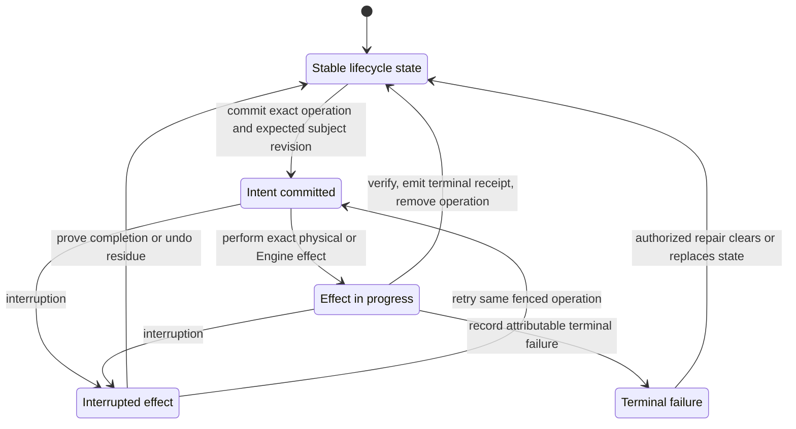

## Overall lifecycle

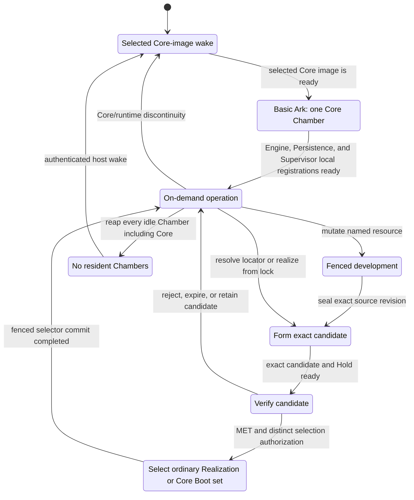

The lower Core lifecycle has one selected image and one Core Chamber. Ordinary lifecycle begins only after
that Chamber's Engine, Persistence, and Supervisor processes are locally ready. Core selection is not an
Engine route operation; ordinary selection remains a Persistence operation projected into Engine routes.

## First core installation

This one-time sequence imports rather than builds the initial Core and Builder images. The external installer
supplies a one-use accepted Boot Seed to an independently proved-unenrolled host. The Boot set contains one
runnable Core image; the optional Builder image is a separately sandboxed ordinary seed and is not started on
the cold path.

`entry = accepted host envelope + proved-unenrolled host + accepted one-use Boot Seed`

`exit = exact Core tag + pinned selected/predecessor closure + ready Core Chamber`

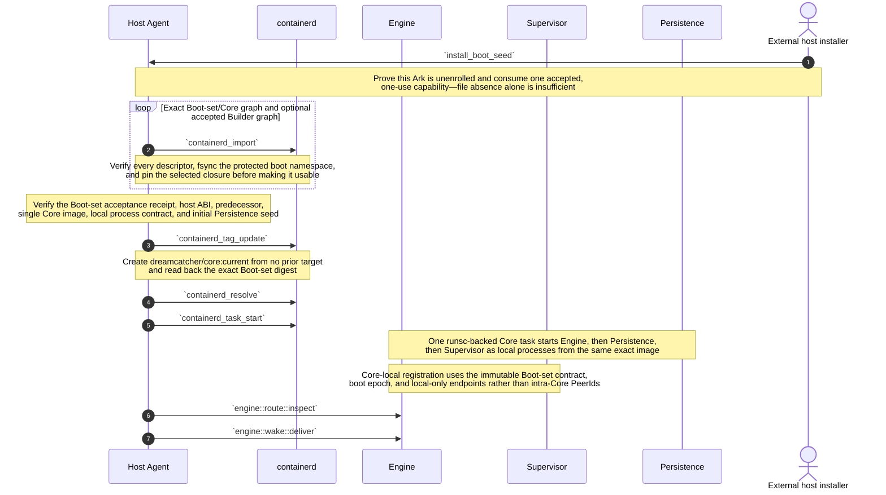

The installer never invokes a Builder. It imports an already accepted Boot set and may also import an
accepted Builder image whose exact ordinary Realization is present in the initial Persistence state. Once the
Core Chamber is ready, that Builder can be activated through `chamber::activate` in its own gVisor Chamber.
This closes self-hosting without putting compilers, package managers, arbitrary build inputs, or a build API
inside the Host Agent or Core Chamber.

The first `containerd_tag_update` is the sole normal genesis write. After enrollment, only the Host Agent may
move that record, and only through `bootset::select` with an exact permit and expected-current fence. The
selected Boot-set and Core-image graphs are product-durable in the protected boot namespace; cold start never
builds, pulls a moving tag, or chooses an alternative image.

## Core image cold start

`entry = running accepted Host Agent + protected containerd boot namespace + valid dreamcatcher/core:current`

`exit = one ready Core Chamber for the exact selected Boot set, or an attributable terminal failure`

The Host Agent is the irreducible cold edge. It can act before I3 exists, but it can only resolve the one
selected Boot-set tag, verify its exact retained closure, and start the fixed Core task. Starting or replacing
the Host Agent and containerd remains a lower-platform responsibility.

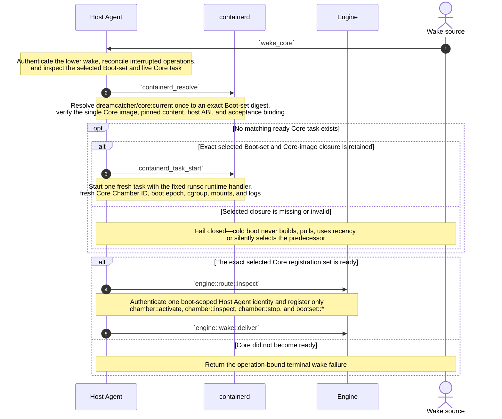

Physical creation is one conditional task start. A ready task from another Boot-set digest is never adopted as
current. A missing selected graph is host-state corruption requiring explicit accepted restore or reinstall;
containerd's ordinary runtime namespace is reconstructable, but its protected boot namespace is not treated
as a disposable cache.

No Chamber is required to run continuously. Policy may keep the Core Chamber warm, but the Core tag survives
with zero live tasks. If the Host Agent is stopped, a lower platform, cloud control plane, or physical operator
must wake it; this lifecycle does not hide that recursion.

## Core process bootstrap

The selected Core image is one physical gVisor fate boundary with three separately declared local processes.
Core init is a fixed image entrypoint, not a general process manager. It starts only the Boot-set-declared
Engine, Persistence, and Supervisor in dependency order.

`entry = one started Core task + exact Boot-set process and registration contract`

`exit = exact local Core registration set ready under one boot epoch`

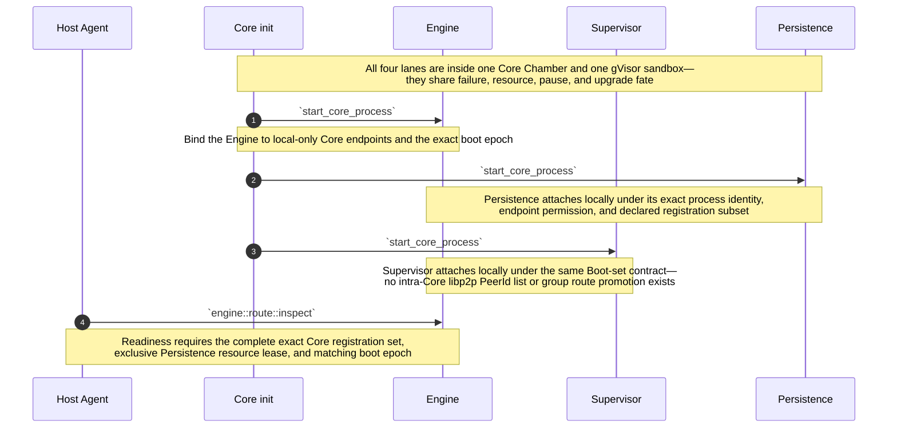

Local transport may be a protected Unix socket or loopback endpoint. Locality is not unrestricted trust:
Core init supplies separate process identities and boot-scoped capabilities, Engine accepts only the exact
Boot-set registration set, and each process retains its logical role. The simplification intentionally trades
independent Engine/Persistence/Supervisor failure and upgrade boundaries for one atomic Core image and one
local attachment domain.

Builder is excluded from this sandbox. It may be imported with the Boot Seed, but it runs only as a separate
ordinary Chamber under an exact Realization and bounded build capabilities.

## Host reboot into the selected Core image

A reboot repeats the same cold-start kernel; there is no three-service reconstruction sequence. The lower
platform starts the accepted Host Agent, containerd, runsc shim, and kernel. Those mechanisms resolve one
Core tag and start one Core task.

`entry = enrolled host + restored protected boot namespace + running accepted host envelope`

`exit = fresh Core Chamber whose receipt names the exact selected Boot-set and Core-image digests`

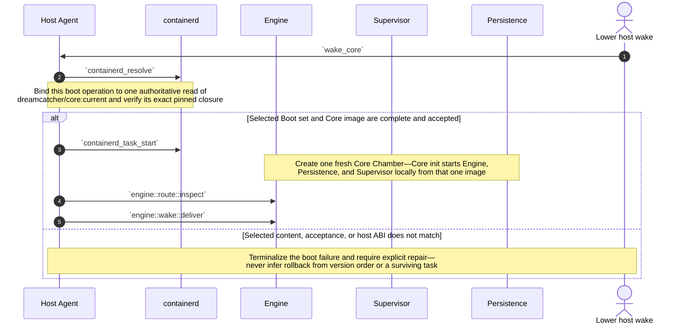

A successful `bootset::select` becomes reboot authority when its single containerd image-record update reads
back the successor Boot-set digest. A crash before that update reboots the predecessor; a crash after it
reboots the successor. The Host Agent reconciles any unfinished task, listener, volume-fence, or cleanup work
against that one selected target. It never combines separately tagged core components.

## Ordinary Chamber activation kernel

This kernel creates one ordinary non-Core Chamber from one complete Realization. It applies to a current
Realization, a candidate under a valid Hold, a fixture, or a retained rollback target. Engine, Persistence,
and Supervisor are already ready inside the Core Chamber.

`entry = ready Core Chamber + exact Realization + current revision or candidate Hold + registration contract + authorized lease`

`exit = ready fresh Chamber + Run receipt, or no live Chamber + terminal failure receipt`

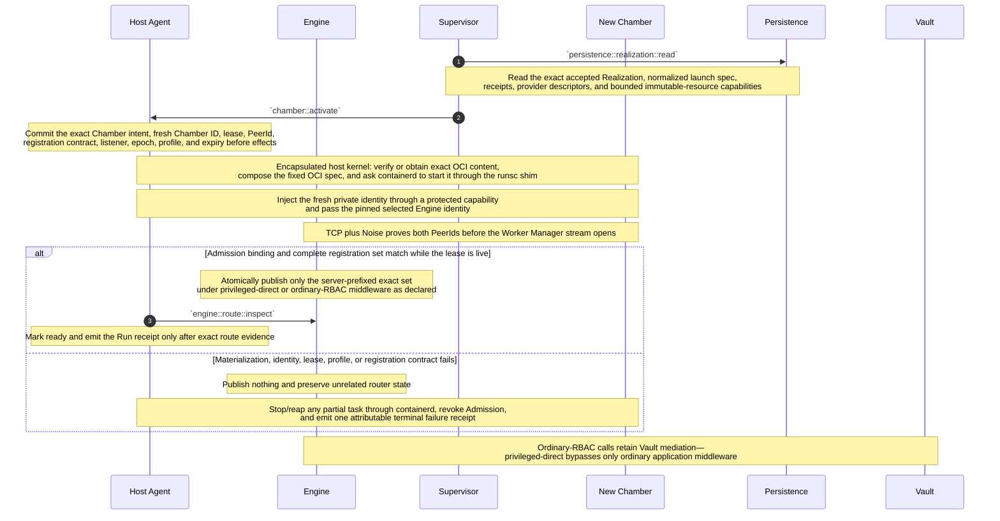

`chamber::activate(exact_realization, lease)` is the sole ordinary physical-start surface. The caller supplies
an exact accepted Realization and bounded lease, not a Covenant lock, mutable locator, host path, image tag,
or runtime flags. The Host Agent validates the supplied durable authority and encapsulates exact content
resolution, import/pull, snapshot, OCI-spec, containerd, shim, and runsc mechanics behind that one call.

Persistence remains the durable data boundary; it does not custody ordinary rebuildable OCI blobs. A
source-composed Realization may be rematerialized from its exact base and resource revisions. A missing
artifact-backed graph is not rebuilt in this kernel: an authorized rebuild returns through candidate
formation, and a different digest is a different candidate.

The Noise connection is not admission by itself. Engine checks the Host Agent admission projection both when
the secure connection identifies the remote PeerId and when the peer requests Worker Manager. A claimed
Chamber ID is never authority. Private identities are fresh per lease and destroyed with the Chamber.

The current revision or candidate Hold is captured when intent commits. A concurrent selection change never
relabels the Chamber, and a selected Realization may have zero live Chambers before or after this kernel.

## Fenced development

`mutable object = named Persistence workspace`

`developer execution = one leased ordinary Chamber from an exact development Realization`

`immutable handoff = exact resource snapshot`

The Developer Chamber is ordinary execution state. It is activated through the same three-function Host
Agent surface, terminates, and is reaped. Any immutable product may enter another lifecycle as a candidate,
but the Developer Chamber itself is never promoted.

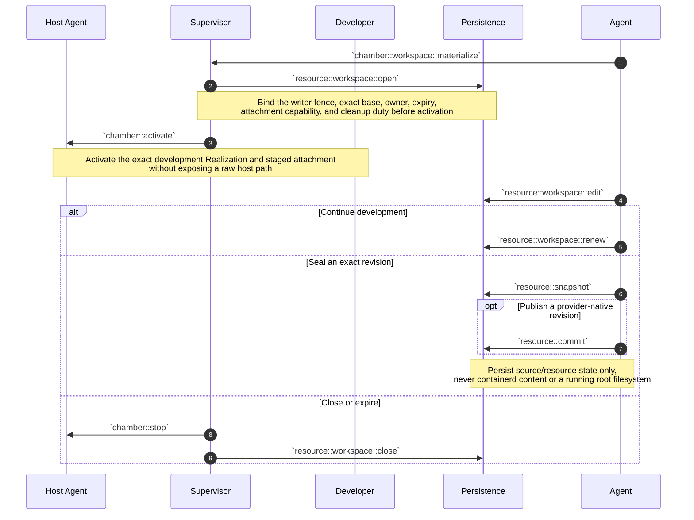

Workspace, snapshot, provider revision, Realization, and Chamber remain distinct identities. A sealed output
becomes an input to a later Covenant lock. It enters **Form and activate a candidate**, forms one exact
candidate under a Hold, and may be selected only after verification. No workspace, containerd snapshot, or
running Chamber is renamed into a candidate or current Realization.

## Form and activate a candidate

`entry = authorized caller + durable logical name + locator or exact Covenant lock + candidate quota`

`exit = exact source-composed or artifact-backed candidate Realization + bounded Hold + optional ready Chamber`

Several candidates may coexist for one logical name. Candidate formation is logical work owned by Supervisor
and Persistence; it does not need a Host Agent operation until an exact candidate is physically activated.
This mode never changes either selection authority.

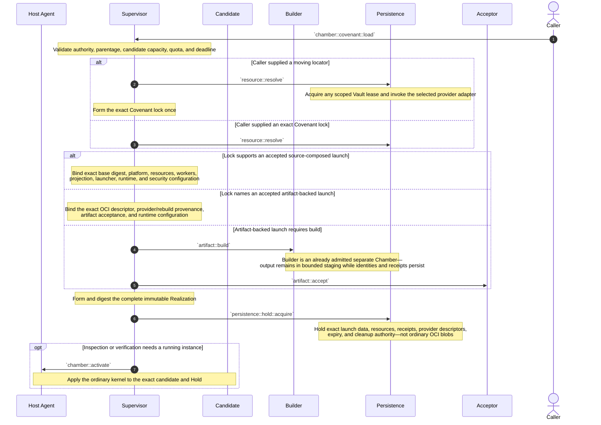

A moving locator is resolved only while forming the lock. Re-resolving it later may produce another lock and
candidate; it never mutates `current`. Candidate admission deduplicates the same Realization identity.

Source-composed launch is preferred when exact source and runtime base are cheaply obtainable. Artifact-backed
launch remains available for distributable or opaque images and accepted build outputs. Persistence retains
exact identity, evidence, and provider/rebuild policy rather than a duplicate ordinary OCI graph.

Builds are not assumed reproducible. A byte-identical authorized rebuild may restore an unavailable recorded
OCI descriptor after evidence checks. A different digest is a different candidate. Rejection, missing Builder
support, unavailable provider bytes, or incomplete durable inputs fails closed without changing selection.

## Build an artifact

`entry = accepted Builder Realization + accepted Covenant lock + exact build request`

`output = exact OCI descriptor + Build receipt + bounded output capability`

Build is an ordinary separately sandboxed Chamber capability. The first accepted Builder image may be imported
by the installer and named in initial Persistence state, so Builder need not build itself before first use.
It is not a Host Agent method, Core process, or cold-start dependency. `containerd` does not build images.

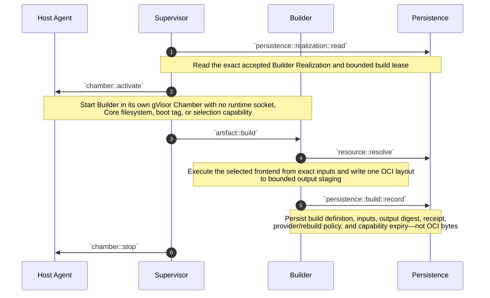

A later activation or `bootset::stage` may give the Host Agent the exact bounded output capability to import.
The Builder never receives the containerd socket. If output must be durable independently, an explicit OCI
provider receives it and Persistence retains only the exact provider descriptor and digest.

If bounded output disappears before import or publication, no selected identity changes. An authorized rebuild
enters candidate formation. Matching the recorded digest proves byte convergence; a different digest is a
different candidate. BuildKit, Nix, Kaniko, or a minimal OCI assembler may be replaceable Builder
implementations behind the same contract.

If a chosen frontend cannot operate inside the bounded Builder Chamber, build is delegated to an explicit
external provider with exact input/output evidence. That limitation never expands the Host Agent or moves
build onto the Core cold path.

## Verify a candidate

`verdict subject = exact candidate Realization + exact Chamber + exact plan + environment`

`verdict != selection`

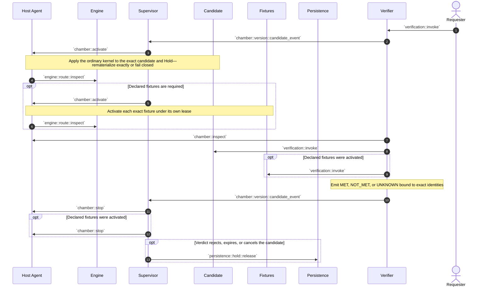

MET permits a later selection request while the Hold remains valid; it does not keep verification Chambers
alive. Further attempts create fresh Chambers of the same Realization and independently scoped evidence.

A source-composed candidate can be recreated from exact durable launch data while its exact base graph is
obtainable. An artifact-backed candidate needs its exact graph from staging, the ordinary runtime namespace,
or a declared provider. The verifier never rebuilds or substitutes an image.

The first Tester is judged by the external bootstrap verifier. Once selected, its ordinary Realization supplies
on-demand Tester Chambers. Tester never writes either selector.

## Select, upgrade, or roll back

`ordinary selection authority = gate-appropriate fenced promoter + Persistence compare-and-swap`

`Core selection authority = gate-appropriate fenced promoter + Host Agent expected-target tag update`

`entry = exact accepted candidate or Boot set + valid custody + fresh evidence + expected selector revision`

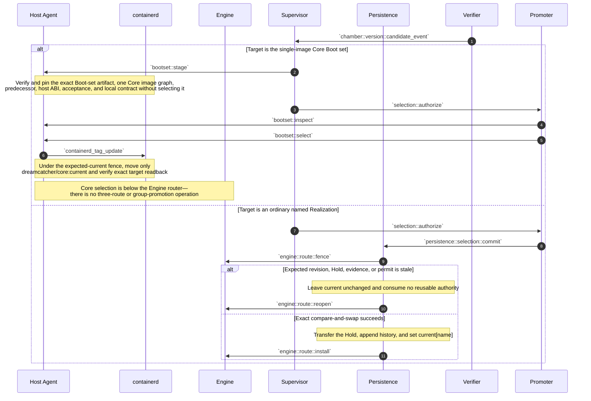

Selection always names immutable content, never a running Chamber. Existing ordinary Chambers remain pinned
to their captured Realizations until independently drained. A new ordinary call uses the new Persistence
revision. A new cold Core start uses the new Boot-set target.

The Core path has one selector and one runnable image, so it does not add atomic group promotion to Engine.
`bootset::stage` may import and preflight exact candidate content while the predecessor Core is live, but only
`bootset::select` changes reboot authority. A crash before the containerd image-record update leaves the
complete predecessor selected; a crash after it leaves the complete successor selected.

Rollback uses the same respective operation with retained accepted content as target. No selector infers
rollback from health, creation time, semantic version, fleet majority, surviving task, or cache contents.
Core rollback additionally requires the predecessor Boot-set graph to remain pinned and its Persistence schema
to remain compatible; otherwise rollback is not authorized.

## Live Core-image cutover

Core upgrade can be staged while the Ark runs without asking Engine to promote a route group or to replace
itself. The Host Agent performs a lower-host blue/green preflight and a bounded handoff. Baseline cutover may
briefly interrupt Engine admission while the exclusive Persistence resource and stable Engine listener move;
zero-downtime replicated Persistence is deliberately not implied.

`entry = ready predecessor Core + staged accepted successor Boot set + one-use selection permit`

`exit = current tag and ready Core task both name successor, or exact journaled state for deterministic recovery`

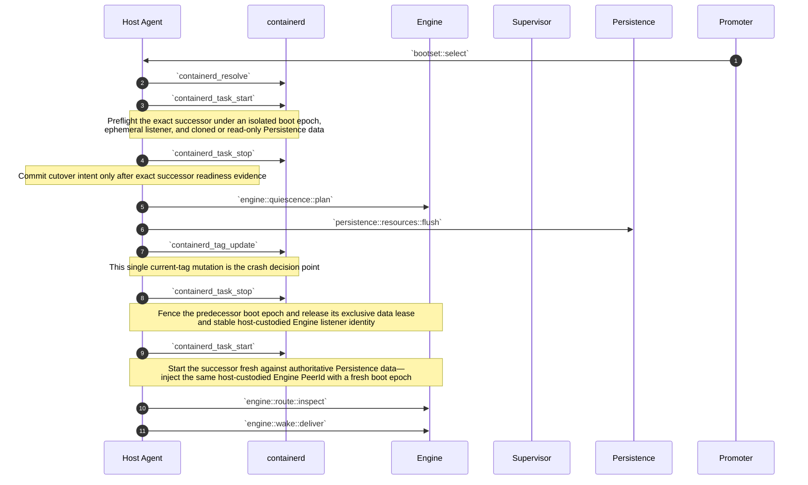

Ordinary Chambers may remain alive during the bounded Engine gap. They reconnect to the same pinned Engine
PeerId and stable listener, but the fresh boot epoch requires the Host Agent to reinstall live lease
Admissions before registrations become routable. Core-local Engine, Persistence, and Supervisor attachment
uses local credentials and the new Boot-set contract, not PeerIds.

A successor must read the predecessor's durable Persistence schema. Irreversible migration may begin only
after the current tag commits; explicit rollback is permitted only when the resulting data remains compatible.
On crash, the Host Agent reads the one current tag, fences any task from the other boot epoch, and finishes or
recreates the selected Core. The journal never chooses a different Boot set.

## Quiesce and wake

`quiescence preserves Core and ordinary selections, candidate Holds, receipts, and durable resources—not Chambers`

`wake = Core image cold start`

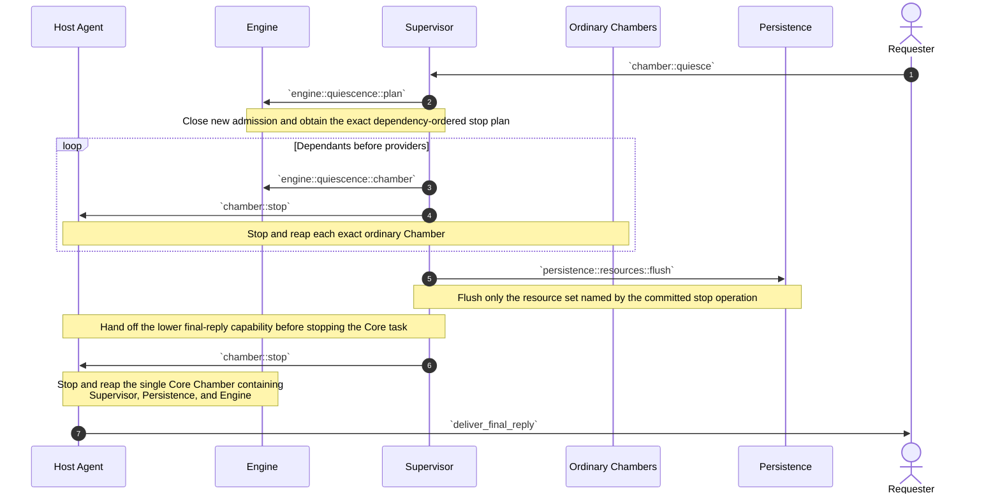

`persistence::resources::flush` is the sole explicit Persistence barrier. Every other Persistence call already
honors its own durability contract. Once the scoped receipts are durable and no invocation remains active,
the one Core task may stop; there is no three-service stop sequence or generic second flush.

Idle reaping uses the same `chamber::stop` operation and never changes selection. Reaping the Core leaves the
Host Agent waiting on its authenticated lower wake edge; the next event follows **Core image cold start**. A
hard deadline may discard unflushed Chamber-local state but creates no alternate identity or selector update.
The ordinary runtime namespace may be discarded; the protected Boot-set namespace and current tag may not.

## Attested multi-Ark builds (later)

Status: **Later extension; not required by the first Builder contract.**

The baseline single-Builder contract above remains the compatibility floor. This stronger policy is useful
only when independent builders and fresh confidential-computing evidence add enough value to justify the
extra cost.

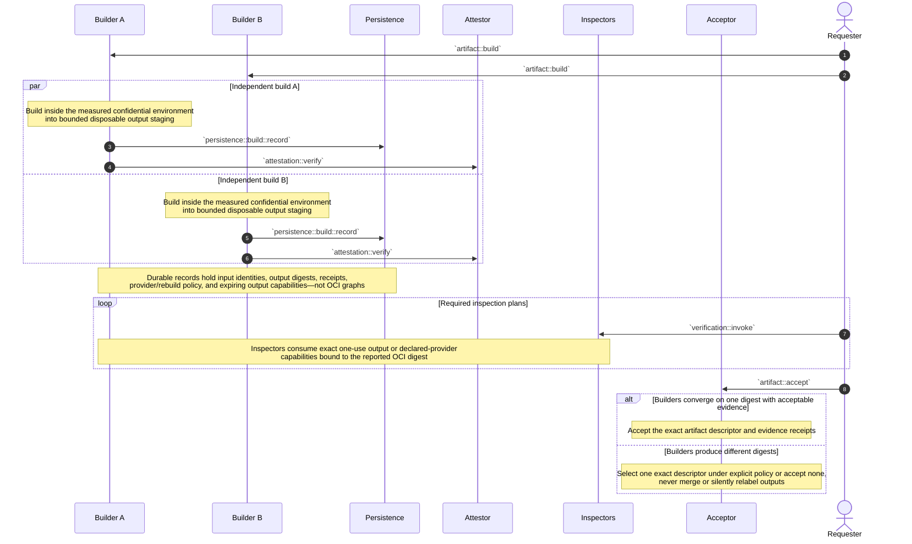

Attestation binds a statement about one Builder realization, request, input closure, output digest, and
fresh environment evidence. It does not prove truth, reproducibility, or acceptability. Inspectors and the
Acceptor remain separate replaceable policy roles.

Multi-Ark agreement still creates no Ark-local durability obligation for OCI bytes. Each output may remain
in bounded disposable builder staging, be imported into a host's ordinary containerd runtime namespace, or be pushed
to an explicit external OCI provider. Persistence records identities, evidence, and locators. If every byte
source disappears, rebuilding is candidate work and a different digest is a different artifact.

## Failure and recovery formulas

- `operation remains non-terminal after interruption -> reconcile that exact operation before conflicting work`.
- `current[name] = R + zero ordinary Chambers -> valid idle state`; do nothing until demand or explicit prewarm policy.
- `dreamcatcher/core:current = B + zero Core tasks -> valid idle state`; authenticated wake starts one fresh Core task from exact `B`.
- `admitted call snapshots ordinary current revision S and Realization R -> its Chamber remains pinned to (S, R)` even if selection changes before physical start completes.
- `ready ordinary Chamber fails -> terminalize its exact lease and receipt`; authorized retry creates a fresh Chamber of the same Realization without changing current.
- `ordinary Chamber lease expires or work terminates -> chamber::stop exact Chamber`; sibling Chambers and both selectors are unchanged.
- `Core task absent + authenticated wake -> Host Agent resolves dreamcatcher/core:current once and applies Core image cold start`.
- `Core-tag update not committed when host crashes -> predecessor remains the complete selected Boot set`.
- `Core-tag update committed when host crashes -> successor is the complete selected Boot set`; reconcile tasks, listener, data lease, Admissions, and cleanup to that target.
- `selected Boot-set artifact, single Core image, acceptance, host ABI, or pinned content is missing/corrupt -> cold start fails closed`; never build, pull a moving tag, infer newest, or silently select predecessor.
- `proved-unenrolled host + accepted one-use Boot Seed -> external installer may import and create the first Core tag`; absence alone grants no write authority.
- `enrolled host + missing/damaged protected containerd boot namespace -> explicit accepted restore or reinstall`; the ordinary runtime namespace may be reconstructed, but the Core selector is product state.
- `staged Boot set + stale expected current target, evidence, or promoter permit -> bootset::select rejects before tag mutation`.
- `selected predecessor graph not pinned or Persistence data no longer compatible -> Core rollback rejects`; history alone is not materialization or rollback authority.
- `successor Core preflight passes + live-data handoff fails before tag mutation -> predecessor remains selected and live or is recreated`.
- `successor Core tag commits + later live handoff fails -> recover the successor or explicitly authorize compatible rollback`; never infer a third target.
- `Core local process identity, boot epoch, endpoint permission, or exact registration subset fails -> Core task is not ready`; publish no partial Core registration set.
- `candidate Hold expires -> reap its candidate Chambers + remove candidates[name][R] + emit cleanup receipt`, unless another selector, candidate, or operation retains the exact durable launch data.
- `source-composed ordinary runtime view unavailable -> rematerialize from exact durable launch data while its exact base graph remains obtainable; otherwise activation fails`.
- `artifact-backed ordinary graph unavailable from runtime cache, output capability, or provider -> activation fails`; do not build from a lock inside `chamber::activate`.
- `build starts from a Covenant lock -> output enters candidate formation`, never directly as ordinary current or Core current.
- `rebuild reproduces an exact recorded OCI digest -> verify candidate and perform the appropriate fenced selection/custody operation`.
- `rebuild produces another artifact or Realization digest -> distinct candidate`; only fenced selection may choose it.
- `provider credential unavailable -> resolution or build fails closed`; selection is unchanged.
- `Engine route cache disagrees with ordinary current or authoritative Chamber state -> lifecycle state wins`; fence affected admission and rebuild the projection.
- `Noise authenticates a PeerId absent from live Admission, or the pinned Engine identity is wrong -> no Worker Manager stream`; publish no registration.
- `ordinary admitted PeerId claims another Chamber or submits a non-exact registration set -> close stream + fail activation`; quarantined routes never publish.
- `Admission expires, boot epoch changes, or lease is revoked -> reject new streams + close registration authority`; replacement needs fresh Chamber ID, lease, epoch, and PeerId.
- `physical task survives but exact Boot set, Realization, lease, and operation cannot be proved -> reap it`; never adopt by runtime ID or apparent health.
- `verifier unavailable or verdict UNKNOWN -> no selection`.
- `stale ordinary revision, Hold, lease, operation subject, or permit -> reject before effect`.
- `cleanup names exact Chamber IDs, task identities, Boot-set digest, and candidate Holds`; unrelated work is unaffected.
- `Host Agent unavailable -> only an explicitly lower platform may wake or replace it`; no Core or ordinary Chamber can bootstrap its absent host authority.

## Implementation handoff

### Initial lifecycle

- external provider-specific Covenant locators with optional logical credential names;
- location-independent Covenants with top-level `hardware`, `image`, optional `build`, flat `mounts`, and plural `workers`;
- exact Covenant locks and content-addressed Realizations with source-composed and artifact-backed launch modes;
- one accepted OCI Boot-set artifact that references exactly one runnable Core image and its acceptance, host ABI, predecessor, process, local-registration, and Persistence-schema contract;
- one gVisor Core Chamber whose fixed Core-init entrypoint starts Engine, Persistence, and Supervisor locally in dependency order;
- one protected containerd boot namespace containing the authoritative `dreamcatcher/core:current` image record plus pinned selected/predecessor closure;
- one separate ordinary containerd runtime namespace whose images, snapshots, and tasks remain reconstructable;
- an accepted first-install Boot Seed imported rather than built, optionally carrying a separately sandboxed initial Builder image and initial Persistence state;
- no Builder, build frontend, arbitrary command execution, or general process manager in the Host Agent or resident Core process set;
- one mechanism-only Host Agent replacing separate Procman, Image Materializer, and direct-runsc adapter roles;
- Host Agent as sole containerd socket and Core-tag writer, with durable exact-operation journal, expected-target fencing, task reconciliation, Admission, mounts, cgroups, and logs;
- standard `Host Agent -> containerd -> containerd-shim-runsc-v1 -> runsc -> gVisor` physical actuation, with no application-facing direct-runsc or raw runtime API;
- the narrow ordinary I3 surface `chamber::activate(exact_realization, lease)`, `chamber::inspect(chamber_id)`, and `chamber::stop(chamber_id, fence)`;
- the narrow Core surface `bootset::stage`, `bootset::inspect`, and `bootset::select`, with no Engine route-group promotion;
- a host-custodied stable Engine transport identity/listener injected into each accepted Core task, plus a fresh boot epoch that fences stale Admissions;
- Core-local Engine/Persistence/Supervisor attachment through local-only endpoints, process identities, and one exact Boot-set registration contract rather than intra-Core PeerIds;
- Persistence-owned `current[name] = {revision, realization}` as the only ordinary stable named selection;
- `candidates[name][realization] = Hold reference` with several bounded candidates permitted;
- `chambers[id] = {name, realization, lease, phase}` with fresh zero-to-many ordinary Chambers per Realization;
- no separate Activation record and no Chamber-bearing `last/current/next` slots;
- exact-Chamber execution, verification, inspection, and cleanup;
- fresh ordinary Chamber PeerIds bound by Host Agent Admission to exact Chamber, Realization, registration contract, selected Engine listener, boot epoch, profile, and expiry;
- a Noise-authenticated Worker Manager stream gate with server-assigned `chamber::<Chamber-ID>` prefixes and atomic complete-set publication;
- privileged-direct and ordinary-RBAC profiles that both retain Admission, prefix, lease, and registration-contract enforcement;
- Builder as an ordinary separately sandboxed Chamber with no containerd socket, Core filesystem, tag mutation, or selection authority;
- no build on Core cold start or ordinary activation; missing artifact content enters candidate/rebuild work rather than hidden substitution;
- ordinary selection through Persistence compare-and-swap and derived Engine route projection;
- Core selection through one Host Agent expected-target update of the single Boot-set tag;
- live Core preflight while predecessor runs, followed by bounded Host Agent listener/data-lease handoff rather than Engine group promotion;
- minimal run, build, verification, selection, cutover, and cleanup receipts that reference exact prior identities and evidence;
- idle ordinary or Core Chamber reaping that never mutates either selector.

### Deliberately later

- additional provider-neutral Builder frontends and multi-Ark confidential Builder attestations, inspection, and collective acceptance;
- zero-downtime dual-Core replacement with replicated or externally transactional Persistence; baseline live cutover permits a bounded Engine gap;
- splitting Engine, Persistence, or Supervisor back into independently isolated images only if measured risk or upgrade pressure justifies the lost atomicity and added coordination;
- shared reusable ordinary Chamber pools, prewarm controllers, and service traffic balancing;
- lower-platform automation that also stops and wakes the Host Agent;
- independently accepted replacement of Host Agent, containerd, runsc shim, runsc, kernel, and protected boot-store formats;
- process-memory or rootfs checkpoint recovery;
- migration of ordinary Ark-to-Ark RBAC handshakes to the reusable Noise-plus-authorization-contract boundary.

### Required downstream reconciliation to this sequence authority

- cross-stack architecture vocabulary and narrative;
- Covenant owner schema and Gherkin (`source`, singular `worker`, and `worker.resources` are old);
- Chambers owner process-tree, routing, image construction, Host Agent activation, verification, Core packaging, and upgrade Gherkin;
- Chambers runtime replacement of direct-runsc/materializer/procman surfaces with the typed Host Agent and standard containerd runsc runtime handler;
- Core-image packaging and fixed Core-init contract for one local Engine/Persistence/Supervisor process set;
- I3 Engine stable host identity/listener injection, boot-epoch Admission rebuild, local Core registration contract, and ordinary PeerId stream gate;
- Persistence ordinary-selection, Realization/build-record/Hold/resource/provider contracts, initial seed state, flush, and Core-schema compatibility contracts;
- installer and recovery tooling for one-use accepted Boot Seed import, protected containerd boot namespace, pinned selected/predecessor closure, and exact Core-tag update/readback;
- Host Agent operation journal, expected-current bootset fencing, live-cutover reconciliation, containerd task receipts, and runtime-namespace invalidation;
- generated traceability and registered Lifecycle Atlas after authoritative inputs change.
