# Chambers lifecycle sequence reference

Status: **Current working architecture authority; bounded runsc mechanism proof accepted; production integration pending**

Architecture classification: `architecture_delta_accepted`

Design-lineage baseline: `96bc5f7f5d97641a0a33e8a98636d38dcfee8d51`

This document is the current Chambers lifecycle architecture authority. It owns the working design for lifecycle
identity, state, sequencing, authority boundaries, image preparation and custody, dynamic-job versus
resident-service execution, routing, verification, selection, quiescence, and recovery until explicitly superseded.
The broader [`ark-agent-architecture.md`](ark-agent-architecture.md), owning Gherkin, schemas, implementation, and
generated projections are downstream reconciliation targets and may temporarily lag. This status establishes
design authority plus the bounded mechanism evidence named below; it does not claim production containerd/CNI,
storage-driver, or deployment acceptance.

The selected initial core is one **Ark Core Appliance**: one exact OCI image, one gVisor task, one s6 PID 1,
one III Engine, and required Persistence, Gateway, and Supervisor processes. It has one selection, upgrade, crash,
and recovery fate.
ProcMan starts and replaces that opaque unit; it does not orchestrate its internal worker graph. Ordinary Chambers
remain separate untrusted or replaceable gVisor tasks.

The accepted bounded runtime proof is Chambers source `17543edafb53c007582886032df07af8297f4f5a` with III
candidate `56c4304aa368efdc925b69baaf6356cc723ba0ca`: 22/22 independently verified checks on real Linux
namespaces, nftables, and `runsc --platform=systrap`. It proves the private-network, dual-listener,
scope-derived activation, descendant-reaping, exact restart, selector/LKG, and volume-fence mechanisms, and it
demonstrates the superseded Engine-owned fatality mechanism. s6 whole-appliance fatality, production
containerd/CNI-plugin, and storage-driver integration require their own acceptance evidence.

## Contents

- [Dictionary](#dictionary)
- [Lifecycle axioms](#lifecycle-axioms)
- [Lifecycle call table](#lifecycle-call-table)
- [Authoring and state shapes](#authoring-and-state-shapes)
- [Overall lifecycle](#overall-lifecycle)
- [First Ark Core installation](#first-ark-core-installation)
- [Selected Ark Core cold start](#selected-ark-core-cold-start)
- [Ark Core bootstrap](#ark-core-bootstrap)
- [Host reboot into the selected Ark Core](#host-reboot-into-the-selected-ark-core)
- [Whole-appliance crash recovery](#whole-appliance-crash-recovery)
- [Scope-bound child Ark Core activation](#scope-bound-child-ark-core-activation)
- [Ark-to-Ark peer interconnect](#ark-to-ark-peer-interconnect)
- [Ordinary Chamber activation kernel](#ordinary-chamber-activation-kernel)
- [Fenced development](#fenced-development)
- [Form a candidate Realization](#form-a-candidate-realization)
- [Build an artifact](#build-an-artifact)
- [Prepare and retain a tested Realization](#prepare-and-retain-a-tested-realization)
- [Select, upgrade, or roll back](#select-upgrade-or-roll-back)
- [Execute a dynamic job or resident service](#execute-a-dynamic-job-or-resident-service)
- [Ordinary resident-service routed cutover](#ordinary-resident-service-routed-cutover)
- [Complete Ark Core replacement and bounded fallback](#complete-ark-core-replacement-and-bounded-fallback)
- [Quiesce and wake](#quiesce-and-wake)
- [Attested multi-Ark builds (later)](#attested-multi-ark-builds-later)
- [Failure and recovery formulas](#failure-and-recovery-formulas)
- [Implementation handoff](#implementation-handoff)

## Dictionary

This section is the terminology source of truth for this document and every generated projection of it. Other
sections state relationships and invariants between these terms; they do not create aliases or alternate meanings.
Each term is unique in this table. **Definition** is normative; **Related terms** is navigational only.

| Term | Definition | Related terms |
| --- | --- | --- |
| Acceptance receipt | Durable evidence that one exact launch specification, artifact, or Ark Core Appliance was accepted under one policy and named evidence receipts. | Inspection receipt; Realization |
| Activation | The operation that creates one fresh Chamber from one exact Realization and lease. It is not a durable identity. | Chamber; Realization; Run receipt |
| Admission | Host Agent-owned authority binding one fresh connection identity to one exact scope, Chamber, Realization, registration contract, Engine listener, epoch, profile, and expiry. | Ark scope; Chamber lease; Host Agent; libp2p PeerId; Registration contract |
| Ark contact card | An Ark-signed, expiring descriptor containing its Ark PeerId, supported interconnect protocol versions, and direct or relay-reachable addresses. It is routing metadata, not a bearer capability, lifecycle handle, or invitation. | Ark Interconnect; Gateway; libp2p PeerId |
| Ark Core Appliance | One accepted OCI image and one gVisor Chamber containing s6 as PID 1, the III Engine, and required Persistence, Gateway, and Supervisor processes. s6 runs one-shot private-runtime bootstrap, ordered startup, aggregate process supervision, and whole-task fail-fast shutdown; the appliance is one selection, upgrade, crash, and recovery unit. | Ark Core selection; Ark scope; Engine; Gateway; Persistence; Supervisor |
| Ark Core Seed | An externally accepted one-use installation or explicit-recovery bundle containing one exact Ark Core Appliance, initial durable Persistence state, selector bytes, and optionally an accepted Builder Realization. It never selects itself after enrollment. | Ark Core Appliance; Ark Core selection; Builder |
| Ark Core selection | The sole mutable canonical JSON record `boot-control/selected.json` for one Ark scope. Persistence normally replaces it atomically under an expected-generation fence after exact content is staged and promotion is authorized; ProcMan reads it exactly once at each cold boundary. | Ark Core Appliance; Ark scope; Host Agent; Persistence |
| Ark Interconnect | The universal Gateway-mediated, end-to-end authenticated peer transport used by any two Arks, whether parent/child, siblings, co-located, or remote. A receiver-local invitation and policy authorize the exact peer session and exported I3 capabilities; topology and parenthood authorize nothing. | Ark contact card; Gateway; I3 function; libp2p PeerId |
| Ark scope | The immutable ProcMan lifecycle and isolation domain for one Ark Core Appliance, its volume, private network, selector, last-known-good record, and descendants. One host has exactly one parentless host-root scope; every other scope is a child whose parent is derived from an authenticated creation request, never caller-selected. | Ark Core Appliance; Ark-private network; Child Ark; Host-root Ark |
| Ark-private network | One container network allocated to one Ark scope, with a per-task attachment for its Core and each ordinary descendant. The host reaches the Core's private address directly, while host port publication, host networking, and forwarding to other scope networks are explicitly denied. Accepted Gateway egress may reach topology-neutral Ark Interconnect addresses without making another scope locally routable. | Ark Interconnect; Ark scope; Engine; Host Agent |
| Artifact-backed launch spec | A normalized launch specification whose executable root is one exact OCI descriptor with exact provider or bounded rebuild provenance and fixed runtime and security configuration. | Normalized launch spec; OCI digest; Source-composed launch spec |
| Assembly Covenant | A Covenant that expands to a process-tree subtree. The Assembly itself has no Chamber. | Covenant; Runnable Covenant |
| Build receipt | Durable evidence binding one build request, Builder Realization, output artifact identity, and evidence root. | Acceptance receipt; Realization |
| Builder | An ordinary separately sandboxed Runnable Covenant that produces OCI layouts from exact inputs. Builder is never in the Ark Core cold path and never receives the containerd socket. | Build receipt; Runnable Covenant |
| Candidate | One exact accepted or testable Realization retained under a bounded Hold but not selected as current. | Current selection; Hold; Realization |
| Chamber | One ephemeral host-local activation of one exact Runnable Covenant Realization. Every activation or restart receives a fresh Chamber ID; workers packaged together share that Chamber's physical fate. | Activation; Ark Core Appliance; Chamber lease; Realization |
| Chamber lease | Bounded Host Agent authority for one exact Chamber, including admission, lifetime, and cleanup scope. | Admission; Chamber; Host Agent |
| Child Ark | An independently isolated Ark scope created only by a live Ark's authenticated `ark::core::activate` request. It may serve development, rehearsal, delegation, or another principal without inheriting the lifecycle parent's policy or identity. | Ark scope; Host-root Ark; Lifecycle parent |
| Child Ark activation | A specific accepted Host Agent operation that creates one direct child Ark scope for an exact Core under the authenticated caller's child-creation lease. The child receives ProcMan authority only for its own descendants; the parent receives only the distinct direct-child teardown handle. | Ark Core Appliance; Ark scope; Child Ark; Host Agent; Lifecycle parent |
| containerd | ProcMan's sole image, snapshot, and task backend. It retains exact selected and fallback OCI content but owns no selection or application policy. | Ark Core Appliance; Ark Core selection; Host Agent; OCI digest |
| Contract Covenant | A promise-only Covenant with no Chamber of its own. | Covenant; Runnable Covenant |
| Covenant | A location-independent promise describing behavior, dependencies, resources, workers, evidence, and policy without naming the repository that carries it. | Assembly Covenant; Contract Covenant; Runnable Covenant |
| Covenant locator | Provider coordinates plus an optional logical credential need used to resolve Covenant content. It is not immutable runtime identity. | Covenant; Credential; Provider |
| Covenant lock | The exact transitive closure of Covenant bytes, provider-native revisions, base-image and build inputs, mounts, workers, hardware, and launch policy. It is an input to candidate formation, not launch authority. | Covenant; Normalized launch spec; Realization |
| Credential | A named Vault need. It is never a secret value, token, or leased credential embedded in lifecycle identity. | Covenant locator; Provider |
| Current selection | The sole Persistence-owned revisioned named choice `current[name] = {revision, realization}` for an ordinary lifecycle. Ark Core control uses the distinct Ark Core selection. | Candidate; Persistence; Prepared Realization; Realization; Selection |
| Dynamic job | One finite demand-triggered execution of a selected Prepared Realization. A fresh Chamber starts, invokes its declared entrypoint, records evidence, and is reaped; no live function is promised while idle. | Chamber; Execution profile; Prepared Realization; Resident service |
| Engine | The III runtime inside the Ark Core Appliance. It owns transport, the loopback required-worker listener, the Gateway-authorized Ark-private listener, function registration, invocation dispatch, and semantic role readiness. s6 owns OS-process lifetime, and any required process exit or semantic-readiness loss terminates the whole Core task. | Ark Core Appliance; I3 function; Registration contract; Worker |
| Execution profile | Immutable Covenant and Realization policy choosing `dynamic-job` or `resident-service`, with the allowed entrypoint, availability promise, deadlines, and minimum ready residency. | Dynamic job; Prepared Realization; Resident service; Realization |
| Gateway | The required Ark Core worker combining authentication, RBAC/authorization, bounded volatile buffering, stable-route proxying, exact route projection, route epochs, and fencing in RAM. | Ark Core Appliance; Engine; Persistence; Route; Supervisor |
| Hold | A bounded reference retaining one exact candidate and its custody, owner, expiry, and cleanup authority. | Candidate; Realization |
| Host Agent | The small non-Chamber host authority, also called ProcMan. It has one configured host-root boot slot. Per scope it reads one selector at cold activation, attaches one volume and private network, starts one opaque Core task, attaches descendants only to that scope, enforces the no-forwarding boundary, owns physical lifecycle and Admission, and executes one bounded pre-authorized fallback. It creates every non-root scope only for an authenticated live parent's child request and contains no internal Core orchestration or Covenant policy. | Admission; Ark Core selection; Ark scope; containerd; Engine; Host-root Ark |
| Host-root Ark | The sole parentless Ark scope configured for one ProcMan host. Installation, wake, reboot, and lower-platform recovery may boot only this scope directly; multi-Ark hosting occurs below it. | Ark scope; Child Ark; Host Agent |
| I3 function | A named function registered by one owning actor and invoked at that actor. Sequence diagrams omit Engine's ordinary brokerage path. | Engine; Registration contract; Worker |
| Immutable identity | A provider-native commit, tree, digest, CID, or snapshot identifying exact content rather than a moving locator. | Covenant lock; OCI digest; Provider |
| Inspection receipt | Durable evidence binding one exact artifact, inspection plan, evidence root, and verdict. | Acceptance receipt; OCI digest |
| Kind | The logical content form being addressed, independent of provider and location. | Provider |
| Latest | A moving resolution policy. It is never runtime identity or selection authority. | Covenant locator; Current selection |
| libp2p PeerId | Proof-of-possession transport identity authenticated by Noise. Ordinary Chambers use fresh lease identities; each Core and ProcMan session is bound to one Ark scope and epoch. | Admission; Ark scope; Chamber |
| Lifecycle parent | The Ark whose authenticated child-creation request caused one direct child scope to exist. Parenthood grants only an opaque, generation-bound right to tear down that direct child's complete subtree; it grants no data, route, inspection, identity, policy, peer-session, or ordinary control authority. | Child Ark; Host Agent; Host-root Ark |
| Normalized launch spec | One exact source-composed or artifact-backed runtime composition with fixed platform, resources, launcher, runtime, and security inputs. | Artifact-backed launch spec; Source-composed launch spec; Realization |
| OCI digest | Immutable materialization and verification identity for one OCI object or graph. Ark Core selection names an exact appliance digest, never a moving image tag. | Ark Core Appliance; Artifact-backed launch spec; containerd; Realization |
| Operation | Durable exact lifecycle intent retained until a matching terminal receipt; retries reconcile that same intent before conflicting work. | Activation; Selection |
| Persistence | The required Ark Core worker owning Ark Core selector writes, ordinary selections, candidate Holds, Realizations, Prepared projections, exact resources, desired routes, and receipts. It alone owns the authoritative Ark-volume data path inside the appliance. | Ark Core selection; Current selection; Hold; Prepared Realization; Realization; Gateway |
| Prepared Realization | Derived accepted state over one exact artifact-backed Realization whose image passed profile-bound verification, exact shutdown, authoritative retention, and digest readback. It stores no stopped Chamber state. | Dynamic job; Execution profile; OCI digest; Realization; Resident service |
| Provider | An access, authority, and location family capable of resolving or supplying exact content under scoped credentials. | Covenant locator; Credential; Immutable identity |
| Realization | The sole public immutable executable lifecycle identity: one exact Covenant lock plus one normalized launch specification, acceptance evidence, and launch plan. | Chamber; Covenant lock; Normalized launch spec |
| Realization ID | The digest of the canonical Realization manifest body. | Realization |
| Registration contract | The digest of the canonical declared worker and export set for one exact Realization or Core worker. Engine admits only the exact scope- and epoch-bound set. | Admission; Ark Core Appliance; Realization; Worker |
| Resident service | A selected Prepared Realization whose profile requires Supervisor to keep an exact ready Chamber and Gateway to expose its stable declared functions. | Dynamic job; Execution profile; Prepared Realization; Route |
| Route | A live Gateway-owned in-memory projection registered into Engine. It is reconstructed from Persistence and never selects an Ark Core Appliance. | Current selection; Dynamic job; Engine; Gateway; Resident service |
| Run receipt | Durable evidence binding one Realization ID, fresh Chamber ID, host evidence, runtime specification identity, and outcome. | Activation; Chamber; Realization |
| Runnable Covenant | A Covenant whose selected Realization may have zero or many concurrent Chambers, each containing one or more workers. | Chamber; Covenant; Worker |
| Selection | A fenced compare-and-swap from an expected Current selection revision to one exact Prepared candidate. Ark Core selection is a distinct lower-host operation over one appliance digest. | Ark Core selection; Candidate; Current selection; Prepared Realization; Realization |
| Source-composed launch spec | A normalized launch specification projecting exact resource revisions and workers over an exact base OCI descriptor without requiring a derived application image. | Artifact-backed launch spec; Normalized launch spec; OCI digest |
| Supervisor | The required Ark Core policy worker. It reads Persistence, reconstructs the desired Covenant graph, resolves exports, and asks Gateway and Host Agent to apply typed effects; it owns no selector, route mechanism, or physical task authority. | Ark Core Appliance; Gateway; Host Agent; Persistence; Registration contract |
| Worker | One function-registering process, built-in module, or SDK worker inside a Chamber. A Runnable Covenant may declare one or more workers. | Chamber; I3 function; Registration contract |

## Lifecycle axioms

### Identity

- `Ark Core Appliance = one exact accepted Runnable Covenant Realization + one OCI image + one bootstrap/Engine config + exact listener, required-worker, and registration contracts`.
- `Ark Core selection = one exact selected appliance digest + generation + expected predecessor + acceptance + promotion permit + optional bounded fallback`.
- `Covenant lock != Realization`; a lock alone is never launch authority.
- `Realization = Covenant lock + exact normalized launch spec + acceptance evidence + launch plan`.
- `Prepared Realization = exact artifact-backed Realization + profile-bound verification + exact shutdown + authoritative OCI retention`.
- `registration contract = digest(canonical declared worker and export set)`.
- Engine, Persistence, Gateway, and Supervisor are worker roles inside one Core image, not four separately selected Covenants.
- Builder remains a separately sandboxed ordinary Covenant and never enters the cold path.
- A moving tag, process identity, containerd label, or apparent liveness is never selection authority.

### Cardinality

- `one ProcMan host -> exactly one configured host-root Ark scope`; only lower installation, wake, reboot, or recovery boots that parentless scope directly.
- `one authenticated child-creation request -> one direct child Ark scope + one distinct teardown handle`; every non-root Ark has exactly one lifecycle parent.
- `one lifecycle parent -> zero or many direct child Arks`; each child may create only its own direct descendants under the same rule.
- `one Ark scope -> one selector -> zero or one live Ark Core Appliance -> zero or many descendant Chambers`.
- `one selected Core activation -> one Chamber + one s6 PID 1 + one Engine process + exactly one required Persistence process + one required Gateway process + one required Supervisor process`.
- `one Core -> one OCI image + one gVisor sandbox + one private runtime tmpfs + one volume attachment + one Ark-private network + one Engine epoch + one recovery fate`.
- `any required Core process exit or semantic-readiness loss -> complete Core-task exit -> complete scope recovery`; no member-local repair exists.
- `any selected Core change -> stop the scope tree -> one cold selector read -> one fresh Core`.
- `one ordinary Chamber -> one Runnable Covenant Realization + one lease + one independent cleanup fate`.
- `one Prepared Realization -> one exact retained OCI graph + zero or many fresh Chambers over time`.
- `one dynamic-job request -> one fresh Chamber -> one terminal result or failure -> zero retained job tasks`.
- `one selected resident-service -> at least one exact ready Chamber while its availability policy is active`.
- `one accepted Ark contact card + one receiver-local invitation -> at most one exact authenticated peer session`; parenthood and co-location contribute no authority.

### Runtime

- `Host Agent -> containerd task API -> containerd-shim-runsc-v1 -> runsc/gVisor` is the physical launch path, encapsulated behind intent-level Host Agent operations.
- `Ark Core cold activation = read selector once -> verify exact selected/fallback closure -> attach one volume and Ark-private network -> start one Core task -> await exact worker/route readiness -> open ordinary admission`.
- The immutable image starts s6 as PID 1. An accepted s6 one-shot copies III runtime bytes into private `/run/iii` tmpfs without making the image root writable; ordered long-runs then start Engine, Persistence, Gateway, and Supervisor.
- s6 never repairs a required Core member locally. Any required-process exit or Engine-validated semantic-readiness loss records the cause, withdraws aggregate readiness, stops the complete service tree, and exits the Core task. The accepted s6 graph and its fixed failure notifier are part of the selected Core closure.
- Engine exposes `127.0.0.1:49133` only for exact required in-appliance workers and an Ark-private scope listener at port `49134` for Gateway-authorized traffic. ProcMan connects directly to the private container address only after Gateway policy readiness. There is no host port mapping, host-network mode, donated Unix socket, or TCP fallback.
- Each Ark scope has a distinct private network with one attachment per gVisor task. An explicit forwarding-deny fence separates every pair of scope CIDRs; descendants attach only to their owning scope.
- Each ready Ark Gateway may use its ordinary accepted egress profile to dial direct or mutually selected relay addresses from an Ark contact card. The same end-to-end authenticated Ark Interconnect session is required for parent/child, siblings, same-host, and remote peers; ProcMan never wires a pair-specific route.
- ProcMan treats selector read, content resolution, OCI specification, containerd, runsc, mount, CNI, and task cleanup as one internal launch/stop macro. Top-level diagrams expose intent, not those subcommands.
- Gateway buffering is bounded and volatile. Core restart loses it; callers remain idempotent and retry.
- Build is never part of Core cold start or ordinary activation.

### State

- `core_selection = {schema, generation, selected_core, expected_predecessor, acceptance, promotion_permit, fallback}`.
- `fallback = {last_known_good_core, exact_selector_bytes_digest, fallback_permit, eligibility, max_attempts: 1}` or null.
- `core_manifests[digest] = immutable accepted Ark Core Appliance manifest`.
- `host_scope_journal[scope] = {parent_scope, selector_digest, selected_generation, active_core, task_id, volume_fence, network_id, forwarding_fence, descendants, direct_child_teardown_handles, admission_opened, fallback_consumed, phase}`.
- ProcMan reads selector bytes exactly once per cold activation and caches one exact plan for same-selection whole-appliance recovery.
- Persistence normally writes `boot-control/selected.json`; ProcMan may install only exact pre-authorized fallback bytes before admission/effects.
- `current[name] = {revision, realization}` remains the ordinary selection.
- `candidates[name][realization] = Hold reference`; `prepared[realization]` stores verification, shutdown, retention, and provider evidence, not OCI bytes.
- Gateway RAM is reconstructible from Persistence, live Chamber observations, Engine epoch, and route epoch.
- Scope identity is derived from the authenticated Core connection; callers cannot name a sibling scope or parent task.
- `peer_contact[ark] = {ark_peer_id, protocol_versions, direct_or_relay_addresses, expiry, signature}` contains no lifecycle or bearer authority.
- `peer_session = {local_ark, remote_ark, remote_peer_id, invitation, policy_revision, admitted_exports, epoch, expiry}` is Gateway-owned volatile projection reconstructed only from receiver-local durable policy and a fresh authenticated handshake.

### Routing

- Engine's loopback-only Worker Manager at `127.0.0.1:49133` admits exact required Core workers from accepted config.
- Engine's Ark-private Worker Manager at `<scope-private-IP>:49134` remains fail closed until Gateway authentication and authorization hooks are registered through the loopback path.
- After Gateway readiness, ProcMan connects to the Core's private container IP, authenticates for that exact scope/epoch, and registers only the narrow Host Agent function set.
- Ordinary Chambers connect only to their owning Core's Ark-private listener with fresh lease identities and exact Admissions; they receive no Ark-volume attachment or contents.
- Supervisor derives desired ordinary routes from Persistence and asks Gateway to reconcile the complete projection before admission opens.
- Gateway warm cutover applies only to ordinary Chambers, never the Ark Core Appliance.
- No private network route, Engine address, mount, task handle, registration namespace, or ordinary lifecycle capability crosses Ark scopes.
- Ark-to-Ark traffic crosses only the Ark Interconnect boundary: the remote Ark PeerId is authenticated end to end, the receiver validates its own invitation and policy, and Gateway projects only the admitted peer-session exports. The scope-private Worker Manager address is never published as a peer address.
- A signed contact card can be exchanged in an activation receipt, through Oath/registry traffic, or out of band, but it never creates a route or session by itself.

### Transition

- `operation intent -> physical or Engine effect -> evidence -> terminal receipt`.
- `ordinary selection = Persistence compare-and-swap current[name] from expected revision to exact Prepared candidate`.
- `Ark Core selection = stage exact appliance -> verify and accept -> Persistence atomically replace selected.json -> stop scope tree -> cold-read once -> start one fresh appliance`.
- `required role failure = process exit or Engine-validated semantic loss -> s6 closes aggregate readiness and exits the Core task -> ProcMan reaps descendants and old Core -> restart exact still-selected appliance`.
- `activation fallback = successor fails before admission/effects + exact pre-authorized LKG + compatibility + unused permit -> remove successor residue -> install exact fallback selector -> one fallback cold start`.
- Automatic fallback is forbidden after ordinary admission, irreversible migration/effect, incompatible state, or the one bounded attempt.
- A ready Ark may activate an accepted Core in one direct child scope with its own volume policy and network. The child may create only its own descendants; development/rehearsal and delegated hosted use follow the same lifecycle primitive.
- Parent teardown consumes the exact direct-child handle and reaps that child's complete subtree. It does not expose a child inspect/control session and cannot be redirected by a caller-supplied scope.
- Peer connection is independent: contact-card exchange -> receiver-local invitation -> end-to-end authenticated session -> exact exported I3 routes. Parent/child status is neither a guard nor a grant.
- Reaping any Chamber never mutates either selector.

### Authority

- Host Agent owns only one configured host-root boot slot, opaque direct-child scope creation/recovery, selector-bound Core start/stop, one volume and network attachment per scope, descendant physical lifecycle, exact direct-child teardown handles, Admission, task evidence, and bounded fallback execution.
- Host Agent does not know or repair individual Core workers, interpret Covenant graphs, choose routes, build images, or expose raw containerd, shell, path, mount, runtime-flag, or caller-selected scope passthrough.
- Persistence is the sole normal writer of Ark Core and ordinary selections and owns durable desired state and receipts.
- Gateway owns live authentication, authorization, route projection, fencing, and bounded volatile buffering.
- Supervisor proposes logical lifecycle work and typed physical/route effects but owns no durable selector or runtime socket.
- Engine owns transport, registration, dispatch, and semantic readiness. s6 owns required-process mechanics and whole-task fatality; neither is ProcMan application orchestration.
- A child-creation grant is accepted only from an authenticated live Ark scope for an exact accepted Core profile. ProcMan derives the direct parent, never creates a second parentless scope, and grants only the resulting direct-child teardown handle—never ambient host, data, peer-session, or sibling authority.
- Ordinary and untrusted Chambers remain separate gVisor tasks and receive no Core volume contents or runtime socket; an empty image mountpoint is not an attachment.

## Lifecycle call table

Every arrow in a `sequenceDiagram` below is an invocation labelled with exactly one function name. Completion and
results are implied. Names containing `::` are I3 function IDs. Snake-case rows marked **external conventional call
(not I3)** are lower-host or local intent boundaries and may encapsulate many runtime subcommands.

### Host Agent

| Function | Invocation path | Brief contract |
| --- | --- | --- |
| `ark::core::activate` | I3 | Create one direct child Ark scope for an exact accepted Core under the authenticated caller and its child-creation lease, with its own selector, volume policy, private network, Core task, and scope-bound ProcMan registration; return a distinct teardown handle and, after readiness, the child-issued contact card, neither of which grants a peer session. |
| `ark::child::stop` | I3 | Consume one opaque generation-bound handle to stop and reap the authenticated caller's exact direct child subtree; expose no child data, task handle, route, inspection, policy, or ordinary control surface. |
| `ark::core::inspect` | I3 | Return capability-scoped evidence for the caller's exact Core scope, selector digest cached at its cold boundary, task, descendants, volume fence, network, readiness, and fallback eligibility. |
| `ark::core::quiesce` | I3 | Consume one committed scope stop plan and final-reply handoff, stop and reap descendants and the single Core task, and retain unchanged selection and exact OCI closure. |
| `ark::core::restart` | I3 | Consume an exact selector-commit receipt and final-reply handoff, stop the caller's scope tree, then cold-read once and start one fresh selected Core. |
| `ark::core::stage` | I3 | Verify and pin one exact accepted Core image/manifest, fallback closure, host ABI, volume/network/schema contracts, candidate subject, and evidence without moving selection. |
| `chamber::activate` | I3 | Activate one exact ordinary Realization under one lease inside the caller's immutable Ark scope; materialization and runtime details remain encapsulated. |
| `chamber::inspect` | I3 | Return a scope-filtered view of one exact Chamber, task, lease, Admission, operation, and receipt evidence. |
| `chamber::stop` | I3 | Stop and reap one exact ordinary Chamber in the caller's scope under an expected subject fence. |
| `deliver_final_reply` | **External conventional call (not I3)** | Use a handed-off lower reply capability after terminal evidence is durable and the Core may be stopped. |
| `install_core_seed` | **External conventional call (not I3)** | Consume one accepted Ark Core Seed on the proved-unenrolled configured host-root scope, atomically seed exact selection, and request its first start; never create another parentless scope. |
| `recover_ark_tree` | **External conventional call (not I3)** | On Core exit or aggregate-readiness failure, stop/reap that scope's descendants and old Core, release its attachments, and start the exact still-selected Core from the cached plan. |
| `start_ark_core` | **External conventional call (not I3)** | Encapsulate one selector read, exact content check, Core-only volume and per-task private-network attachment, OCI/task construction, Core start, dual-listener readiness, direct private-port connection, and aggregate result. |
| `wake_ark_core` | **External conventional call (not I3)** | Ask ProcMan to cold-start the sole configured host-root scope while no Core exists; child startup originates only from a live parent's authenticated activation request or exact existing-scope recovery. |

After Gateway readiness, ProcMan registers exactly the nine I3 functions above on a session bound to that Ark scope.
It exposes no caller-selected scope, arbitrary command, runtime identifier, raw host path, mount, port, or containerd
option. A child Core gets a new registration bound only to its child scope.

### Gateway

| Function | Invocation path | Brief contract |
| --- | --- | --- |
| `routing::authenticate` | I3 | Verify one exact Core or lease identity and return its bounded authorization profile; default deny. |
| `routing::authorize_registration` | I3 | Admit only the exact profile, prefix, scope, epoch, and registration contract bound by Admission; default deny. |
| `routing::fence` | I3 | Fence one ordinary logical name or route epoch; bounded calls may be held or rejected but are not durably accepted in RAM. |
| `routing::inspect` | I3 | Return registration owners, canonical-set digest, desired revision, route epoch, fence, buffer, and readiness evidence without mutation. |
| `routing::install` | I3 | Install one ordinary dynamic-job factory or stable resident-service function projection. |
| `routing::reconcile` | I3 | Register or replace the complete ordinary projection derived from one Persistence snapshot and route epoch. |
| `routing::reopen` | I3 | Reopen a fenced ordinary route only after selection, owner set, readiness, and route epoch agree. |
| `ark::peer::contact` | I3 | Return this Ark's signed, expiring PeerId/protocol/address contact card; it contains no bearer authorization, lifecycle handle, or implicit invitation. |
| `ark::peer::connect` | I3 | Consume one peer contact card plus receiver-issued invitation, dial its direct or mutually selected relay address through ordinary Gateway egress, and request the same authenticated peer session regardless of topology. |
| `ark::peer::session::open` | I3 | Authenticate one remote Ark PeerId and proof, validate an unexpired receiver-local invitation and policy, and expose only the exact I3 functions or protocol routes admitted for that session. |
| `ark::peer::disconnect` | I3 | Revoke one exact peer session and its projected routes without changing lifecycle parentage, teardown handles, or any other peer relationship. |

### Persistence

| Function | Invocation path | Brief contract |
| --- | --- | --- |
| `persistence::build::record` | I3 | Persist exact build inputs, output OCI digest, receipt, and provider or rebuild policy without retaining OCI bytes. |
| `persistence::core::commit` | I3 | Consume exact staged-closure evidence, promotion permit, expected generation, and accepted target/fallback manifests, then atomically replace `boot-control/selected.json`; start no task. |
| `persistence::hold::acquire` | I3 | Acquire one bounded Hold over exact candidate data and evidence custody. |
| `persistence::hold::release` | I3 | Release one exact candidate Hold after authorized rejection, expiry, cancellation, or cleanup. |
| `persistence::prepared::record` | I3 | Record Prepared state only after profile-bound verification, exact Chamber shutdown, OCI retention, digest readback, and accepted receipts agree. |
| `persistence::realization::read` | I3 | Read one exact Realization, launch spec, receipts, provider descriptors, and scoped immutable-resource capabilities. |
| `persistence::resources::flush` | I3 | Flush resources named by one committed stop or Core-cutover operation and return bound receipts. |
| `persistence::routing::complete` | I3 | Terminalize one ordinary handover after Current, Gateway owner set, route epoch, and readiness agree. |
| `persistence::routing::prepare` | I3 | Compare-and-swap one ordinary resident-service handover plan and next route epoch without moving selection. |
| `persistence::routing::read` | I3 | Read one exact desired-route snapshot, revision, handover generation, fence epoch, and canonical-set digest. |
| `persistence::selection::commit` | I3 | Compare-and-swap one ordinary expected revision to a Prepared candidate under an exact promoter permit. |
| `persistence::selection::read` | I3 | Read one exact ordinary Current selection and revision. |
| `resource::commit` | I3 | Commit one sealed snapshot into a durable provider-native revision and receipt without selecting it. |
| `resource::resolve` | I3 | Resolve a permitted locator once, or fetch an exact selector, and return immutable descriptors or bounded transfer capabilities. |
| `resource::snapshot` | I3 | Seal exact fenced workspace bytes as an immutable content-addressed revision. |
| `resource::workspace::close` | I3 | Terminalize one workspace fence and reap unretained overlay data. |
| `resource::workspace::edit` | I3 | Apply an authorized mutation through the workspace fence without exposing a raw host path. |
| `resource::workspace::open` | I3 | Open one writer-fenced workspace from an exact base and return its scoped attachment capability. |
| `resource::workspace::renew` | I3 | Renew the same workspace fence and lease for the same owner and cleanup duty. |

### Supervisor

| Function | Invocation path | Brief contract |
| --- | --- | --- |
| `chamber::covenant::load` | I3 | Resolve a locator or lock into an exact candidate Realization and Hold; formation starts no Chamber and moves no selection. |
| `chamber::job::run` | I3 | Activate, invoke, evidence, and reap one selected dynamic-job Realization for one bounded request. |
| `chamber::quiesce` | I3 | Coordinate dependency-ordered quiescence, durable flush, and final-reply handoff to ProcMan. |
| `chamber::version::candidate_event` | I3 | Receive one exact candidate lifecycle/evidence event and drive only the next separately authorized step. |
| `chamber::workspace::materialize` | I3 | Orchestrate a named fenced workspace and its staged attachment to one exact Developer Chamber. |
| `supervisor::wake::deliver` | I3 | Deliver one authenticated wake event and reply capability after exact Core and ordinary projection readiness. |

### Builders, verifiers, and gates

| Function | Invocation path | Brief contract |
| --- | --- | --- |
| `artifact::accept` | I3 | Judge one exact artifact, evidence set, and policy and return acceptance or rejection. |
| `artifact::build` | I3 | Execute one exact build request in a separate Builder Chamber and return an artifact descriptor and receipt. |
| `artifact::retain` | I3 | Retain the exact verified OCI graph by digest and return provider readback evidence without selecting or launching it. |
| `attestation::verify` *(later)* | I3 | Appraise fresh confidential-environment evidence bound to one builder identity and statement. |
| `job::invoke` | I3 | Execute the declared finite dynamic-job entrypoint in one exact newly activated Chamber. |
| `selection::authorize` | I3 | Issue one exact one-use ordinary-selection or Ark Core-selection permit from fresh gate evidence. |
| `verification::invoke` | I3 | Execute the exact candidate and fixture verification plan and return subject-bound evidence and verdict. |

Only Host Agent `chamber::*` functions mutate ordinary physical lifecycle. Only `persistence::selection::commit`
writes ordinary Current. `persistence::core::commit` is the sole normal Core selector writer; ProcMan's exact bounded
fallback installation is the one recovery exception.

## Authoring and state shapes

### External Covenant locator

```yaml
provider: github
kind: git-tree
repository: dreamcatcher-tech/gateway
ref: main
path: covenant.yaml
credential: github-private-read  # optional logical Vault need
```

Resolution preserves provider-native immutable identity. Credential names may enter a lock; secret bytes never do.

### Runnable Covenant

```yaml
id: example-service
name: Example service
hardware:
  cpus: 1
  memory_mb: 512
execution:
  class: resident-service
  min_ready: 1
image:
  role: artifact
  provider: oci-registry
  kind: oci-image
  reference: docker.io/example/service@sha256:...
build: null
mounts: {}
workers:
  service:
    manifest: workers/service/iii.worker.yaml
exports:
  functions:
    - service::invoke
```

Mounts never expose raw host paths. `execution` is immutable lock content. Source-composed development remains
possible, but reusable dynamic-job and resident-service selections require an exact Prepared artifact-backed
Realization.

### Ark Core Appliance manifest and selector

The Ark Core is one Runnable Covenant Realization and one OCI image. Its accepted s6 graph binds bootstrap, required
process binaries/config, order, registrations, and whole-task fatality policy. ProcMan does not interpret those fields
after verifying the accepted manifest.

```json
{
  "schema": "dreamcatcher.ark-core/v1",
  "ark": "ark@sha256:...",
  "predecessor": "sha256:CORE-41",
  "host_abi": "dreamcatcher-host/v5",
  "covenant": "dreamcatcher.ark-core@sha256:LOCK-42",
  "realization": "sha256:REALIZATION-CORE-42",
  "image": {
    "digest": "sha256:CORE-42",
    "platform": "linux/amd64",
    "runtime_handler": "io.containerd.runsc.v1"
  },
  "init": {
    "pid": 1,
    "implementation": "s6",
    "service_graph_digest": "sha256:S6-GRAPH-42",
    "config_digest": "sha256:S6-CONFIG-42",
    "bootstrap": {
      "runtime_root": "/run/iii",
      "storage": "private-tmpfs",
      "action": "seed-accepted-runtime"
    },
    "required_processes": ["engine", "persistence", "gateway", "supervisor"],
    "member_restart": false,
    "fatality": {
      "process_exit": "exit-core-task",
      "semantic_readiness_loss": "exit-core-task"
    }
  },
  "engine": {
    "config_digest": "sha256:III-CONFIG-42",
    "listeners": [
      {"address": "127.0.0.1:49133", "purpose": "required-worker-bootstrap", "admission": "accepted-exact-worker-set"},
      {"address": "ark-private:49134", "purpose": "scope-admission", "admission": "gateway-default-deny"}
    ],
    "host_port_mapping": false,
    "workers": [
      {"name": "persistence", "required": true, "order": 1, "registration_contract": "sha256:P-REG-42"},
      {"name": "gateway", "required": true, "order": 2, "registration_contract": "sha256:G-REG-42"},
      {"name": "supervisor", "required": true, "order": 3, "registration_contract": "sha256:S-REG-42"}
    ]
  },
  "volume": {
    "contract": "sha256:ARK-VOLUME-42",
    "schema": "dreamcatcher-persistence/v10",
    "mount": "/var/lib/dreamcatcher",
    "persistence_uid": 10001,
    "ordinary_descendant_attachment": false
  },
  "network": {
    "mode": "ark-private",
    "task_attachment": "per-task-netns-veth-or-cni-equivalent",
    "host_reaches_private_core_address": true,
    "host_port_mapping": false,
    "cross_scope_forwarding": false
  },
  "acceptance_receipt": "sha256:ACCEPT-42"
}
```

```json
{
  "schema": "dreamcatcher.ark-core-selection/v1",
  "generation": 42,
  "selected_core": "sha256:CORE-42",
  "expected_predecessor": "sha256:CORE-41",
  "acceptance": "sha256:ACCEPT-42",
  "promotion_permit": "sha256:PROMOTE-42",
  "fallback": {
    "last_known_good_core": "sha256:CORE-41",
    "exact_selector_bytes_digest": "sha256:SELECTOR-RECOVERY-41",
    "fallback_permit": "sha256:FALLBACK-41",
    "eligibility": "pre-admission-and-pre-effect-with-schema-proof",
    "max_attempts": 1
  }
}
```

The selector contains no mutable tag and no list of separately replaceable roles. The exact selected and fallback OCI
closures are retained before selection changes. Persistence writes the normal selector atomically; ProcMan reads it
once at each cold boundary.

### Scope and ordinary lifecycle state

```text
scope[scope_id] = {
  parent_scope,
  direct_child_teardown_handles,
  selected_core,
  selector_digest,
  core_task,
  volume_fence,
  private_network,
  forwarding_fence,
  descendants,
  admission_epoch,
  phase
}

current[name] = {revision, realization}
candidates[name][realization] = Hold
prepared[realization] = {verification, shutdown, retention, provider}
chambers[id] = {scope, name, realization, lease, phase}
```

Physical tasks remain flat host peers with separate per-task network attachments. Scope parentage, visibility, and
the no-forwarding fence are logical, immutable, and enforced by ProcMan. A call cannot provide another `scope_id`;
the active connection supplies it.

ProcMan's configured root slot is singular. `parent_scope = null` is valid only for that host-root scope; every other
scope is created by a live parent's authenticated request. Parentage and peer connectivity are separate state:
the journal records teardown lineage, while Gateway records only independently authorized Ark Interconnect sessions.

## Overall lifecycle

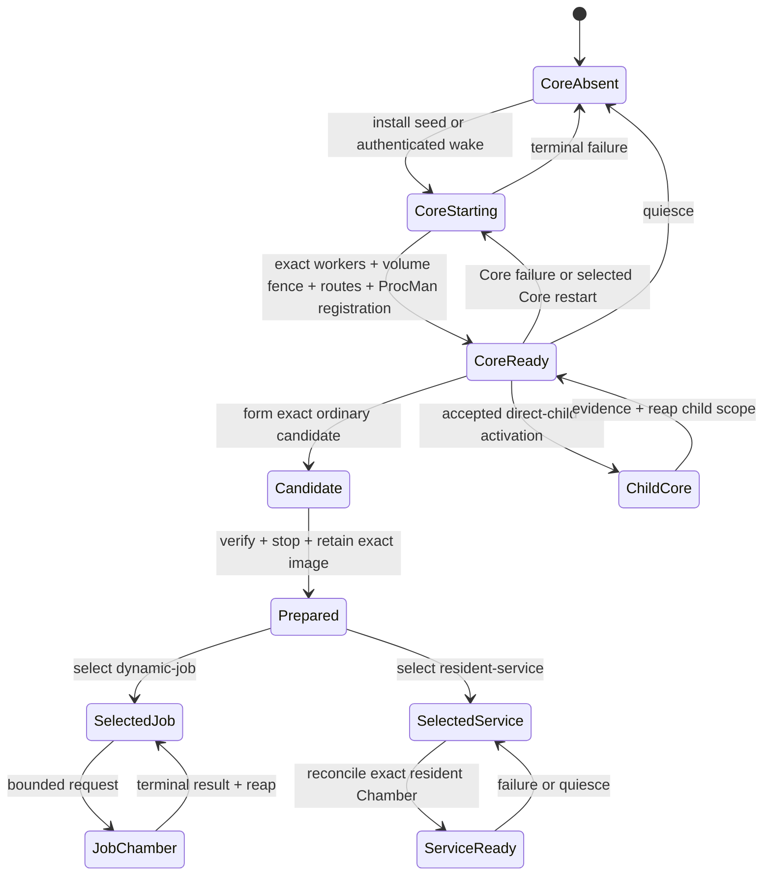

Startup, ordinary development/execution, and Core replacement share one rule: durable intent precedes effects and
exact evidence terminalizes them. A Core is durable selection plus reconstructible execution, not a long-lived task
identity.

## First Ark Core installation

`entry = proved-unenrolled configured host-root Ark scope + accepted one-use Ark Core Seed`

`exit = one ready parentless host-root Ark Core Appliance, or no live Core and attributable terminal failure`

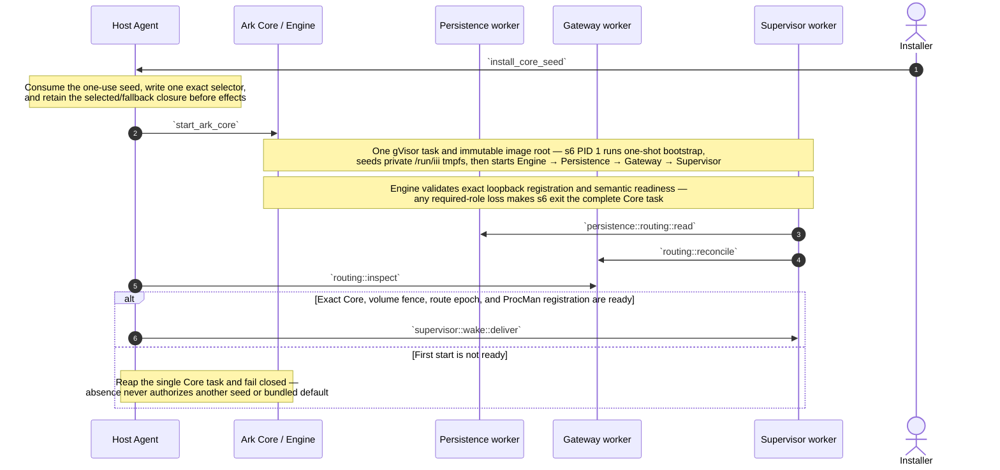

`start_ark_core` is one intent-level host macro. It includes the selector read, exact OCI resolution/import, volume and
Ark-private network attachment, OCI spec, containerd/runsc task start, private container-port connection, and cleanup.
Those subcommands are deliberately absent from this top-level lifecycle diagram.

## Selected Ark Core cold start

`entry = enrolled host-root Ark scope, or an already-created child under exact recovery + durable selector/volume + retained selected/fallback closure + no live Core`

`exit = one fresh ready Ark Core Appliance for one selector read, or attributable failure`

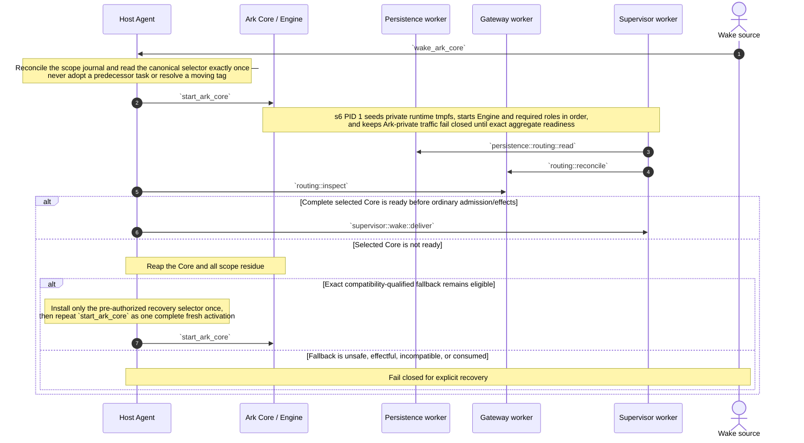

The selector is not polled while the Core runs. Persistence may atomically commit another generation, but it takes
effect only after `ark::core::restart` stops the complete scope tree and the next boundary reads once.

## Ark Core bootstrap

`entry = one fresh Core task with s6 PID 1 and one accepted service graph`

`exit = required workers, fail-closed policy, desired routes, and scope-bound ProcMan registration ready`

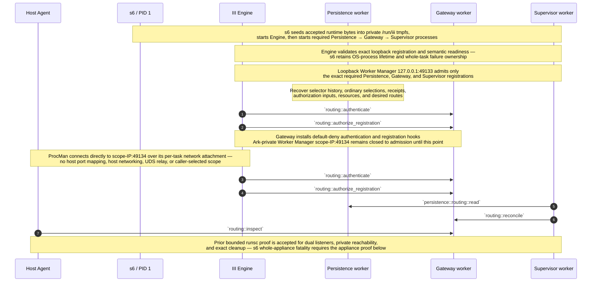

The prior III candidate proved that exact required-role loss can terminate a Core task, but s6 now owns that mechanism:
its accepted graph contains no member-local restart path, and both process exit and Engine-validated semantic loss drive
one whole-task shutdown. ProcMan does not emulate that policy or learn worker names. The implementation must preserve
the failure cause before shutdown because container exit status alone need not identify the failed role.

## Host reboot into the selected Ark Core

A host reboot is exactly **Selected Ark Core cold start** for the sole configured host-root scope. ProcMan performs
one selector read and one `start_ark_core` macro for that root only. After the root is ready, its durable policy may
recreate or reconcile child Arks through authenticated child requests. ProcMan does not discover or boot a second
parentless scope, reuse a task, perform role-by-role upgrade logic, or expose image-resolution and containerd
subcommands in another duplicate sequence.

## Whole-appliance crash recovery

Ark Core roles share one crash fate. There is no same-selection Persistence-, Gateway-, or Supervisor-only repair.

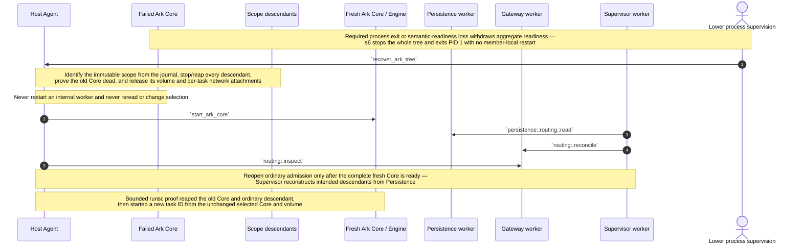

Repeated failure, ambiguous task ownership, stale Admission, registration mismatch, or volume-fence uncertainty fails
closed. Automatic fallback remains restricted to a failed successor activation before admission/effects; a crash of
an already admitted selected Core restarts that same selection or requires explicit recovery.

## Scope-bound child Ark Core activation

ProcMan boots one host-root Ark directly. Every additional Ark on that host is a direct or transitive child created
by a live Ark's authenticated request. The same primitive supports experiments, Core rehearsal, development, and
long-lived hosting for another principal. Each child receives a distinct selector, volume policy, private network,
Engine, descendants, and scope-bound ProcMan registration.

```mermaid
sequenceDiagram
    autonumber
    participant HostAgent as Host Agent
    participant Parent as Parent Supervisor
    participant Child as Candidate Ark Core / Engine
    participant Gateway as Child Gateway worker
    participant Supervisor as Child Supervisor worker
    participant Member as Child ordinary Chamber

    Parent->>HostAgent: `ark::core::activate`
    Note over Parent,HostAgent: Exact accepted Core + child-creation lease + volume policy<br/>connection derives immutable direct parent and child scope — payload parent/routing fields are rejected
    HostAgent->>Child: `start_ark_core`
    Note over HostAgent,Child: Allocate a new child scope, private network, volume, selector,<br/>Core task, and ProcMan session — never attach the parent's ordinary network
    Note over HostAgent,Child: Attach each child task through its own netns/veth or CNI equivalent<br/>and deny forwarding to parent and sibling scope networks
    HostAgent->>Gateway: `routing::inspect`
    Supervisor->>HostAgent: `chamber::activate`
    Note over HostAgent,Member: The authenticated child session supplies scope —<br/>the new Chamber can reach only its owning Child Core
    Note over Parent,Member: Parenthood grants no inspection, data, route, policy, or ordinary-control capability<br/>any such access requires the child's ordinary Ark Interconnect invitation and receiver-local policy
    Note over HostAgent,Member: Bounded runsc proof created an ordinary descendant through the child-bound host function<br/>and denied cross-scope routes, runtime handles, and caller-selected scope; nested child-Ark proof remains required
    opt Parent exercises its sole child-specific authority
        Parent->>HostAgent: `ark::child::stop`
        Note over Parent,HostAgent: Consume the opaque direct-child handle, reap the complete child subtree,<br/>and revoke the handle without exposing child state or redirecting to another scope
    end
```

Physical tasks remain flat host peers. Logical parentage, scope-derived lifecycle authority, separate networks, and
filtered evidence create the tree. Every ready Ark may request a direct child only under its explicit child-creation
lease and host resource policy; an ordinary Chamber cannot do so. The lifecycle parent may terminate that direct
child subtree but cannot thereby inspect, administer, impersonate, or communicate with it.

## Ark-to-Ark peer interconnect

Every Ark uses the same peer mechanism, independent of lifecycle topology and physical placement. The minimum
transport is outbound-capable and relay/rendezvous tolerant so isolated same-host scopes do not need host port
mappings or pair-specific ProcMan routes. Direct paths are optional optimizations and must preserve the same Ark
PeerIds, receiver-local authorization, session namespace, and revocation behavior.

```mermaid
sequenceDiagram
    autonumber
    participant CallingPolicy as Calling Ark policy
    participant CallingGateway as Calling Ark Gateway
    participant ReceivingGateway as Receiving Ark Gateway
    participant ReceivingPolicy as Receiving Ark policy

    ReceivingPolicy->>ReceivingGateway: `ark::peer::contact`
    Note over CallingPolicy,ReceivingPolicy: Transfer the signed contact card and a receiver-issued invitation<br/>through an activation receipt, Oath/registry exchange, or any authorized out-of-band path
    CallingPolicy->>CallingGateway: `ark::peer::connect`
    Note over CallingGateway,ReceivingGateway: Dial a direct or mutually selected relay address through ordinary egress —<br/>same-host, parent/child, sibling, and remote peers use the same end-to-end protocol
    CallingGateway->>ReceivingGateway: `ark::peer::session::open`
    Note over CallingGateway,ReceivingGateway: Authenticate both Ark PeerIds, validate the receiver's invitation and policy,<br/>then project only the exact admitted I3 functions or protocol routes into this session
    Note over CallingPolicy,ReceivingPolicy: Application calls use those relationship-specific exports —<br/>the scope-private Worker Manager address and ProcMan lifecycle channel are never exposed
    opt Either Ark revokes or the session expires
        CallingPolicy->>CallingGateway: `ark::peer::disconnect`
        Note over CallingGateway,ReceivingGateway: Remove only this session and its projected routes;<br/>lifecycle parentage, teardown handles, and other peer sessions remain unchanged
    end
```

A child activation receipt may carry the child's self-signed contact card so the lifecycle parent can locate it, but
the card is not an invitation. The child must authorize that parent exactly as it would any unrelated Ark. Conversely,
a hosted child's principal may authorize remote Arks without granting its lifecycle parent access. Each Ark may
choose direct addresses, its own relay, shared relays, or no reachable peer path; unavailable routing fails closed
rather than creating a private-network shortcut or a mandatory global service.

## Ordinary Chamber activation kernel

This kernel creates one ordinary non-Core Chamber from one complete Realization. It applies to a current
Realization, a candidate under a valid Hold, a fixture, or a retained rollback target. Engine and the required
Persistence, Gateway, and Supervisor workers are ready inside the selected Ark Core Appliance.

`entry = ready selected Ark Core Appliance + exact Realization + current revision or candidate Hold + registration contract + authorized scope-bound lease`

`exit = ready fresh Chamber + Run receipt, or no live Chamber + terminal failure receipt`

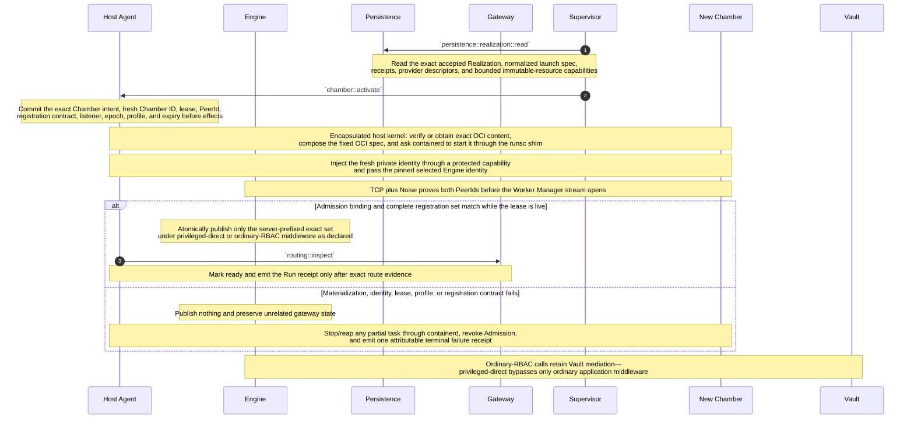

`chamber::activate(exact_realization, lease)` is the sole ordinary physical-start surface. The caller supplies
an exact accepted Realization and bounded lease, not a Covenant lock, mutable locator, host path, image tag,
or runtime flags. The Host Agent validates the supplied durable authority and encapsulates exact content
resolution, import/pull, snapshot, OCI-spec, containerd, shim, and runsc mechanics behind that one call.

Persistence remains the durable data boundary; it does not custody ordinary rebuildable OCI blobs. A
source-composed Realization may be rematerialized from its exact base and resource revisions. A missing
artifact-backed graph is not rebuilt in this kernel: an authorized rebuild returns through candidate
formation, and a different digest is a different candidate.

The Noise connection is not admission by itself. Engine invokes Gateway's fixed authentication and registration
hooks; Gateway validates the Host Agent-issued Admission both when the secure connection identifies the remote
PeerId and when the peer requests Worker Manager. A claimed Chamber ID is never authority. Private identities
are fresh per lease and destroyed with the Chamber.

The current revision or candidate Hold is captured when intent commits. A concurrent selection change never
relabels the Chamber. A selected `dynamic-job` Realization normally has zero live Chambers before and after this
kernel; a selected `resident-service` Realization with zero matching ready Chambers remains fenced and triggers
Supervisor reconciliation.

## Fenced development

`mutable object = named Persistence workspace`

`developer execution = one leased ordinary Chamber from an exact development Realization`

`immutable handoff = exact resource snapshot`

The Developer Chamber is ordinary execution state. It is activated through the same three-function Host
Agent surface, terminates, and is reaped. Any immutable product may enter another lifecycle as a candidate,
but the Developer Chamber itself is never promoted.

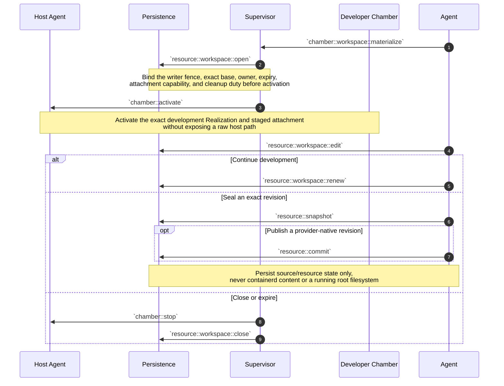

Workspace, snapshot, provider revision, Realization, and Chamber remain distinct identities. A sealed output
becomes an input to a later Covenant lock. It enters **Form a candidate Realization**, forms one exact
candidate under a Hold, and may be selected only after verification. No workspace, containerd snapshot, or
running Chamber is renamed into a candidate or current Realization.

## Form a candidate Realization

`entry = authorized caller + durable logical name + locator or exact Covenant lock + candidate quota`

`exit = exact source-composed or artifact-backed candidate Realization + bounded Hold + zero new Chambers`

Several candidates may coexist for one logical name. Candidate formation is logical work owned by Supervisor
and Persistence and never starts a Chamber. Preparation is the separately evidenced operation that later
activates the exact artifact-backed candidate. Formation changes neither selection authority.

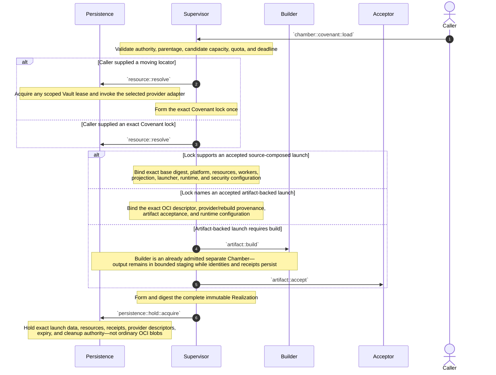

A moving locator is resolved only while forming the lock. Re-resolving it later may produce another lock and
candidate; it never mutates `current`. Candidate admission deduplicates the same Realization identity.

Loading remains strictly non-executing. A source-composed activation begins only after one exact candidate exists:

1. ProcMan reserves one fresh Chamber identity and lease under the scope derived from its authenticated Core session.
2. Persistence issues one attenuated, single-use attachment capability binding that scope, Chamber, Realization,
   immutable tree or fenced workspace generation, mount projection, manifest digest, pinned command, and deadline.
3. ProcMan resolves only that opaque capability beneath its fixed trusted resource root and stages the projection in
   the OCI mount table before `runsc run`; no raw host path enters the Supervisor request, lease, or visible receipt.
4. The fixed in-Chamber launcher verifies the activation projection, reads the pinned worker manifest from the exact
   mounted tree, and executes only the realization-pinned command inside that fresh Chamber.
5. Engine readiness accepts only the exact registration receipt for that Chamber, Realization, operation, and lease.
6. Stop or Core-scope reaping revokes the capability and detaches or durably fences the projection before reuse.

Persistence and ProcMan never execute the Covenant command on the host. A capability cannot authorize another
Chamber, Realization, generation, scope, mount, command, or post-revocation start. Ordinary Chambers receive neither
the Ark volume nor a provider root; they see only the exact projected mount named by their launch plan.

Source-composed launch remains useful for development when exact source and runtime base are cheaply obtainable.
Reusable `dynamic-job` and `resident-service` execution requires an artifact-backed candidate: preparation
must test and retain the exact immutable image that future Chambers will use. Persistence retains exact identity,
evidence, and provider/rebuild policy rather than a duplicate ordinary OCI graph.

Builds are not assumed reproducible. A byte-identical authorized rebuild may restore an unavailable recorded
OCI descriptor after evidence checks. A different digest is a different candidate. Rejection, missing Builder
support, unavailable provider bytes, or incomplete durable inputs fails closed without changing selection.

## Build an artifact

`entry = accepted Builder Realization + accepted Covenant lock + exact build request`

`output = exact OCI descriptor + Build receipt + bounded output capability`

Build is an ordinary separately sandboxed Chamber capability. The first accepted Builder image may be imported
by the installer and named in initial Persistence state, so Builder need not build itself before first use.
It is not a Host Agent method, boot process, or cold-start dependency. `containerd` does not build images.

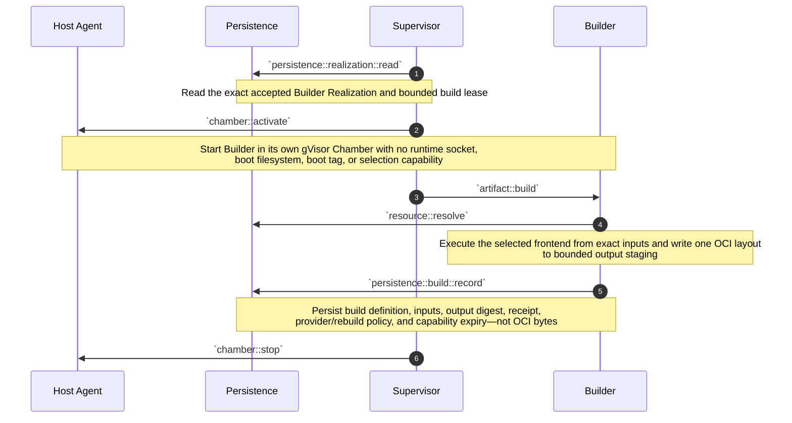

A later preparation or `ark::core::stage` may give the Host Agent the exact bounded output capability to import.
The Builder never receives the containerd socket. Builder output remains disposable candidate staging; the
separate `artifact::retain` step is mandatory before that image becomes a Prepared Realization selectable for
`dynamic-job` or `resident-service` execution. The explicit OCI provider retains the graph and Persistence
retains only the exact provider descriptor, digest, and transitive receipts.

If bounded output disappears before import or publication, no selected identity changes. An authorized rebuild
enters candidate formation. Matching the recorded digest proves byte convergence; a different digest is a
different candidate. BuildKit, Nix, Kaniko, or a minimal OCI assembler may be replaceable Builder
implementations behind the same contract.

If a chosen frontend cannot operate inside the bounded Builder Chamber, build is delegated to an explicit
external provider with exact input/output evidence. That limitation never expands the Host Agent or moves
build onto the boot cold path.

## Prepare and retain a tested Realization

`entry = exact artifact-backed candidate Realization + bounded Hold + declared execution profile`

`verification subject = exact candidate Realization + exact Chamber + exact plan + environment`

`exit = dormant Prepared Realization + authoritative retained OCI graph + zero verification Chambers, or no Prepared record`

`Prepared != selected != running`

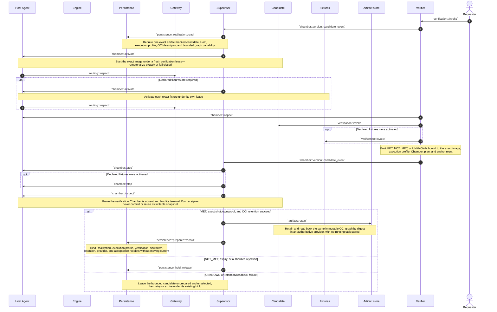

Preparation is the explicit boundary between candidate work and reusable execution. The reusable object is the
same immutable OCI graph that booted the verification Chamber, plus the exact Realization and transitive receipts.
The Chamber itself is shut down and reaped; its writable runtime snapshot, process state, live registrations, and
leases are never a template or storage format.

Only a Prepared Realization may be selected for `dynamic-job` or `resident-service` execution. A Prepared
Realization may remain stored indefinitely with zero live Chambers. Further verification attempts and every job
request create fresh Chambers of the same Realization and independently scoped evidence. The verifier never
rebuilds or substitutes an image, and Persistence stores provider custody evidence rather than OCI bytes.

The first Tester is judged by the external bootstrap verifier. Once Prepared and selected under a `dynamic-job`
profile, its ordinary Realization supplies fresh on-demand Tester Chambers; Tester never writes either selector.

## Select, upgrade, or roll back

`ordinary selection authority = gate-appropriate fenced promoter + Persistence compare-and-swap`

`Ark Core selection authority = gate-appropriate fenced promoter + Persistence atomic selector commit + ProcMan fresh activation`

`entry = exact Prepared ordinary candidate or accepted complete Ark Core Appliance + custody + fresh evidence + expected selector revision`

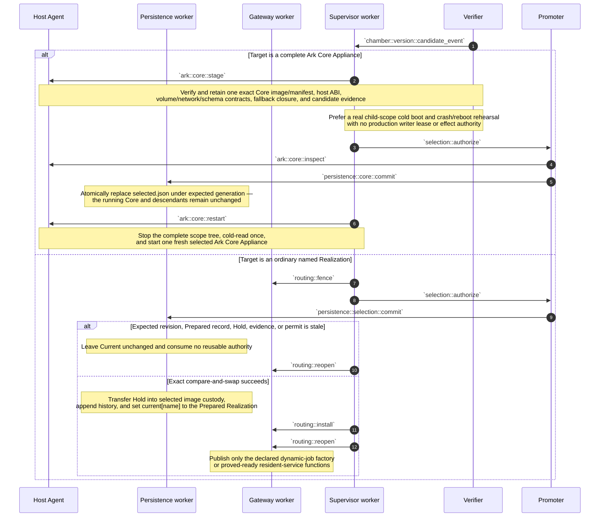

Selection names immutable content, never a running Chamber. Ordinary operational selection may fence, buffer bounded
calls, install a successor route, and drain a predecessor. Ark Core selection never uses routed handover.
Persistence's atomic JSON commit changes only the next cold authority; `ark::core::restart` applies it by stopping
that scope's descendants and single Core task, then starting one fresh appliance.

Ordinary rollback repeats ordinary CAS against retained accepted content. Core rollback is another accepted selector
commit and complete activation. The sole automatic exception is one exact compatibility-qualified last-known-good
fallback during failed pre-admission successor activation; liveness, creation time, version order, or cache content
never chooses rollback.

## Execute a dynamic job or resident service

`entry = selected Prepared Realization + immutable execution profile + authoritative retained OCI graph`

`dynamic-job exit = terminal result or attributable failure + Run evidence + zero job Chambers`

`resident-service exit = one exact ready Chamber + stable declared route, or fenced unavailable state`

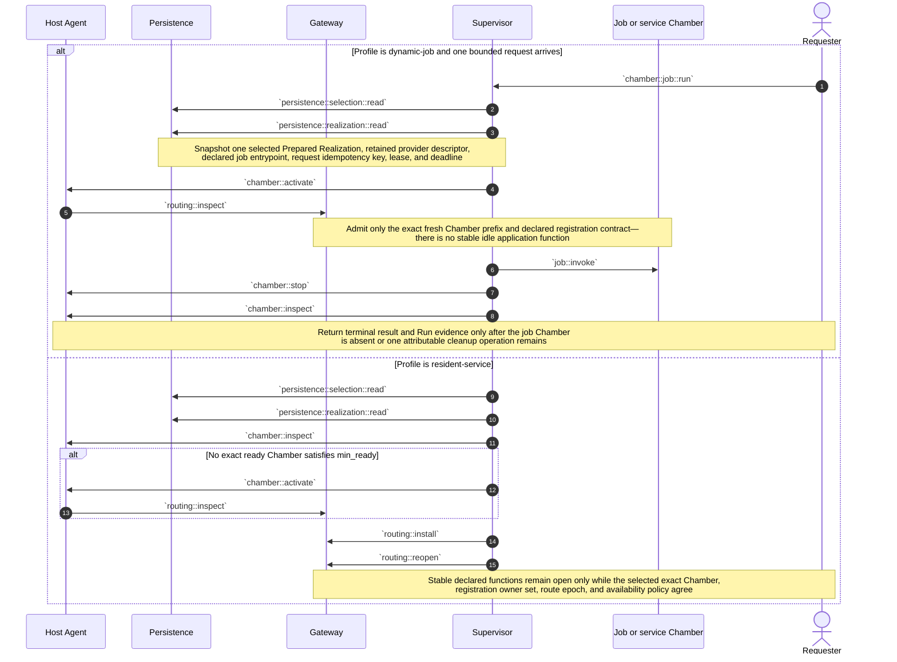

Both branches consume the same kind of Prepared Realization; neither builds, retests, snapshots, or mutates the
stored image at execution time. Their difference is residency and routing. A dynamic job has no live application
function while idle: one request gets a fresh writable snapshot and exact Chamber prefix, then terminal handling
stops and reaps it. A resident service requires Supervisor to keep one matching Chamber ready and Gateway to
maintain its stable function projection; if readiness is lost, the route fences until exact replacement.

The prepared image therefore outlives every job and every resident-service process, while no stopped Chamber
becomes durable state. Current selection chooses the exact reusable Realization. Its immutable execution profile
alone determines whether zero idle Chambers is the intended steady state or an availability failure requiring
reconciliation.

## Ordinary resident-service routed cutover

Gateway's warm-cutover machinery exists for ordinary Chambers only. It keeps one stable logical function set,
fences new calls, holds or rejects a bounded volatile set, changes the Persistence-owned ordinary selection, then
installs one proved-ready successor target. No Engine, Persistence, Gateway, or Supervisor Realization changes.

`entry = ready selected resident-service + Prepared successor + exact Hold and fresh evidence`

`exit = Current and stable routes name successor + predecessor reaped, or predecessor remains current`

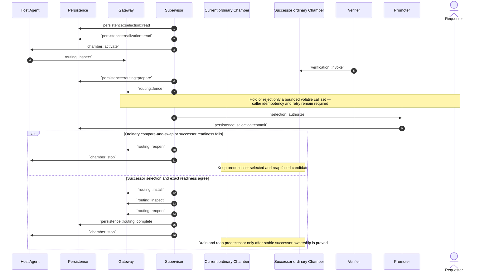

Gateway buffering is not a second durable queue. Gateway failure exits the complete Core, loses held RAM calls, and
requires clients to retry. The cutover is therefore useful for bounded ordinary target movement, not for pretending
Gateway can route around its own replacement or around a full Ark Core restart. Dynamic jobs do not need this route handover: each new
request snapshots the newly selected revision and creates a fresh Chamber.

## Complete Ark Core replacement and bounded fallback

The selected Ark Core Appliance has one upgrade fate because it is one image and one task. A change to Engine,
Persistence, Gateway, Supervisor, worker config, registration contract, schema, volume contract, network contract, or
host ABI forms another Core digest. Replacement stops the entire Ark scope tree and starts one fresh appliance.
There is no role-specific live handover or member reuse.

Before promotion, the preferred proof is a real cold boot and crash/reboot rehearsal of the exact candidate as a
child Ark scope. It receives a private test network and volume and no production effect authority. The same
child-activation mechanism also proves that the candidate can create only its own direct descendants.

`entry = ready predecessor scope + accepted exact successor Core + staged fallback closure + compatibility proof`

`exit = fresh successor Core ready, exact pre-authorized predecessor restored once, or fail-closed recovery state`

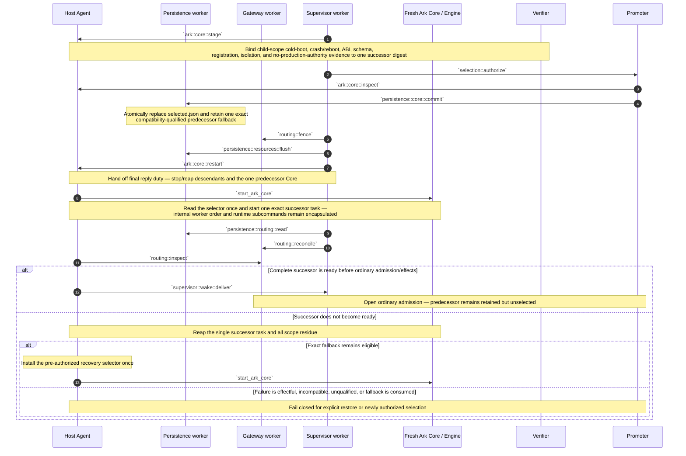

The last-known-good entry is not another mutable selector and not merely “the previous version.” It is one exact
retained Core plus precomputed selector bytes, one-use authority, and evidence that predecessor Persistence can read
the current state. Automatic fallback expires when ordinary admission opens or an irreversible migration/effect
occurs. A successful successor becomes future fallback-eligible only through separate operational acceptance;
ProcMan never infers “good” from process liveness.

## Quiesce and wake

`quiescence preserves Ark Core and ordinary selections, candidate Holds, receipts, and durable resources—not tasks`

`wake = selected Ark Core cold activation with one selector read and one fresh Core task`

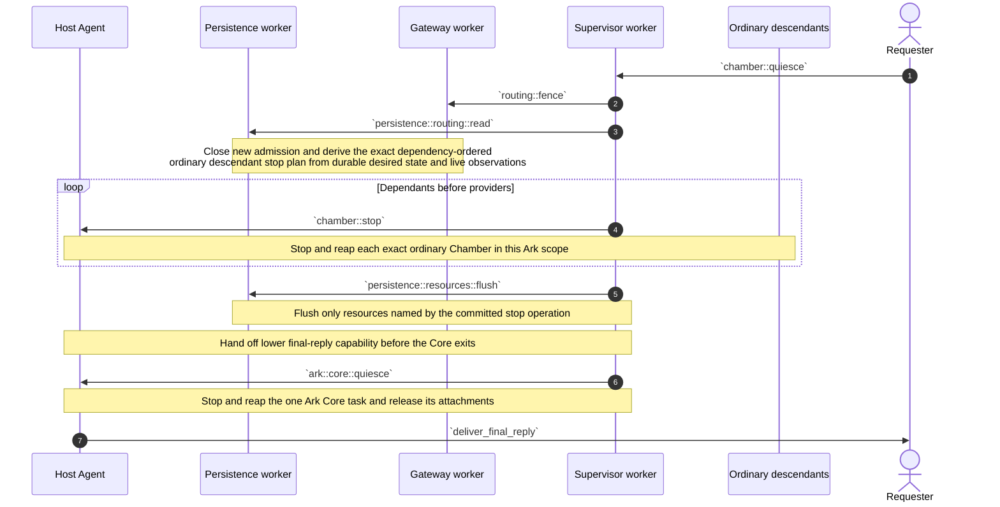

`persistence::resources::flush` is the explicit durable barrier. Once scoped receipts are durable and no invocation
remains active, ProcMan stops the one Core task and releases its volume/network attachments. Idle reaping changes no
selection. The next lower wake follows **Selected Ark Core cold start**, reads `selected.json` once, and creates one
fresh Core. The ordinary runtime namespace may be discarded; selector bytes, Persistence data, and pinned
selected/fallback closure may not.

## Attested multi-Ark builds (later)

Status: **Later extension; not required by the first Builder contract.**

The baseline single-Builder contract above remains the compatibility floor. This stronger policy is useful
only when independent builders and fresh confidential-computing evidence add enough value to justify the
extra cost.

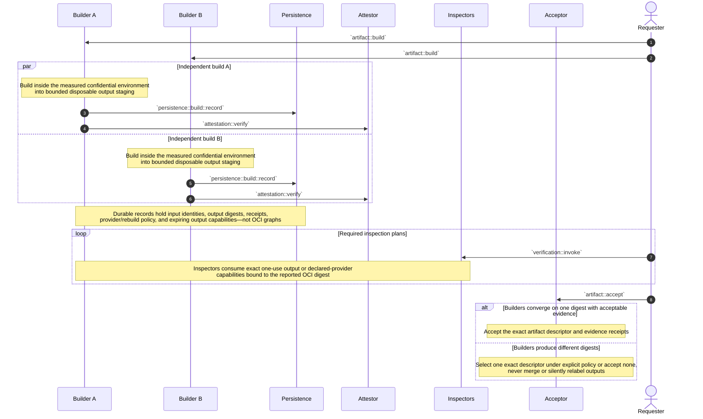

Attestation binds a statement about one Builder realization, request, input closure, output digest, and
fresh environment evidence. It does not prove truth, reproducibility, or acceptability. Inspectors and the
Acceptor remain separate replaceable policy roles.

Multi-Ark build agreement alone creates no Ark-local durability obligation for OCI bytes. An output may remain
in bounded disposable builder staging until preparation. It becomes selectable for `dynamic-job` or
`resident-service` execution only after the exact graph is tested, the verification Chamber stops, and an
explicit authoritative OCI provider returns a digest-bound retention receipt. Persistence records identities,
evidence, and locators rather than blobs. If every byte source disappears, the Prepared custody condition is
broken; execution fails closed and rebuilding is candidate work.

## Failure and recovery formulas

- `operation remains non-terminal after interruption -> reconcile that exact operation before conflicting work`.
- `current[name] = Prepared R + dynamic-job + zero ordinary Chambers -> valid idle state`; do nothing until one bounded request.
- `current[name] = Prepared R + resident-service + fewer than min_ready Chambers -> fenced unavailable`; Supervisor activates an exact replacement and Gateway reopens only after readiness.
- `candidate R + MET + exact verification-Chamber shutdown + retained OCI graph readback -> prepared[R] may be recorded`; none alone selects or starts it.
- `dynamic job terminalizes -> stop and reap its exact Chamber before successful chamber::job::run completion`; Prepared image and Current remain.
- `selected.json = C + zero Core tasks -> valid quiescent scope`; authenticated wake reads once and creates one fresh Ark Core Appliance from `C`.
- `Engine, Persistence, Gateway, or Supervisor exits or loses semantic readiness -> s6 exits the Core task -> recover_ark_tree`.
- `s6 bootstrap cannot seed private runtime tmpfs or start the accepted service graph -> Core never becomes ready`; immutable image bytes remain unchanged.
- `loopback required-worker listener unavailable or Ark-private listener admits before Gateway policy -> Core is not ready`; no host-published listener may substitute.
- `Core task exits -> stop/reap every descendant in that scope -> prove old Core dead -> release attachments -> start exact still-selected Core from cached plan`.
- `whole-appliance same-selection recovery -> no selector reread and no digest change`; repeated or ambiguous failure becomes explicit fail-closed recovery.
- `selected Core changes by any bound image/config/contract -> stop scope tree -> one cold selector read -> one fresh Core`; no partial handover or member reuse.
- `successor fails before admission/effects + exact retained fallback + unused permit + schema compatibility -> remove successor residue -> install exact recovery bytes -> one fallback cold start`.
- `successor admitted ordinary work, performed irreversible effect, lacks compatibility, or consumed fallback -> no automatic fallback`; require explicit restore or selection.
- `last-known-good liveness alone -> insufficient`; future fallback eligibility needs distinct operational acceptance, exact retention, and compatibility evidence.
- `selected/fallback Core image, manifest, acceptance, ABI, worker registration, volume/network/schema contract, selector digest, or permit missing/corrupt -> cold start fails closed`.
- `proved-unenrolled scope + accepted one-use Ark Core Seed -> installer may atomically seed first selector`; absence alone grants no write authority.
- `ProcMan host boot or wake -> exactly one configured parentless host-root scope`; any request to boot a second parentless scope fails closed.
- `staged Core + stale generation, evidence, closure receipt, or permit -> persistence::core::commit rejects before rename`.
- `required worker set, volume fence, Engine/route epoch, Gateway hooks, ProcMan registration, or complete route projection fails -> Core is not ready`.
- `Core task is not proved dead or volume generation mismatches -> no new RW attachment`; authoritative writer overlap is forbidden.
- `ProcMan request arrives on scope A -> ordinary effects remain in scope A`; the sole cross-scope lifecycle effect is `ark::child::stop` consuming A's opaque exact direct-child handle, never a payload-selected scope.
- `accepted child activation from scope A -> new direct child scope + private network + declared volume policy + exact Core + teardown handle -> child ProcMan session can create only child descendants`.
- `parent creates child -> no implicit inspect, data, route, task, policy, identity, application, or peer-session authority`; only the exact teardown handle is parent-specific.
- `child teardown handle is valid + parent connection and generation match -> reap exact child subtree`; mismatch, reuse, sibling target, or caller-selected target fails closed.
- `ordinary descendant starts -> per-task attachment to owning Ark-private network + no Ark-volume contents`; an empty image mountpoint is not a volume attachment.
- `no private route, Engine address, mount, task handle, or registration namespace crosses Ark scopes`.
- `signed contact card alone -> no session`; receiver-issued invitation + fresh PeerId proof + receiver-local policy are all required.
- `Ark peer session opens -> same Gateway-mediated direct/relay protocol for parent, child, sibling, same-host, or remote peer -> only receiver-admitted exports are projected`.
- `Ark peer route unavailable, invitation invalid, or policy unavailable -> fail closed`; never fall back to ProcMan wiring or scope-private Worker Manager reachability.
- `peer session revoked or expires -> remove only that session projection`; lifecycle parentage, teardown authority, and unrelated sessions are unchanged.
- `admitted ordinary call snapshots Current revision S and Realization R -> Chamber remains pinned to (S, R)` despite later selection change.
- `ordinary Chamber lease expires or work terminates -> chamber::stop exact Chamber`; siblings and both selectors are unchanged.
- `ordinary resident successor passes tests + ordinary CAS succeeds -> Gateway may install and reopen exact route`; predecessor drains independently.
- `Gateway or complete Core fails during ordinary cutover -> volatile buffer is lost -> clients retry`; Gateway RAM is not durable acceptance.
- `artifact-backed ordinary graph unavailable -> activation fails`; do not build inside `chamber::activate`.
- `Prepared provider graph missing or readback mismatched -> fence new jobs or resident replacement and fail closed`.
- `build starts from Covenant lock -> output enters candidate formation`, never directly as Current or Ark Core selection.
- `rebuild reproduces exact recorded digest -> verify, stop, retain, record Prepared, then separately select`.
- `rebuild produces another digest -> distinct candidate`; only fenced selection may choose it.
- `Noise authenticates a PeerId absent from live Admission, wrong scope, or wrong Engine epoch -> no Worker Manager stream`.
- `physical task survives but exact scope, selected Core or Realization, lease, Admission, and operation cannot be proved -> reap it`.
- `verifier unavailable, verdict UNKNOWN, shutdown unproved, or retention readback absent -> no Prepared record and no selection`.
- `Host Agent unavailable -> only an explicitly lower platform may wake or replace it`; no Chamber bootstraps absent host authority.

## Implementation handoff

### Bounded runtime mechanism proof

- exact Chambers proof source `17543edafb53c007582886032df07af8297f4f5a` and III candidate `56c4304aa368efdc925b69baaf6356cc723ba0ca`;
- 22/22 independently verified checks on `runsc release-20260706.0`, real task network namespaces/veths, Linux bridges, nftables forwarding fences, and private container addresses;
- historical proof of independent selectors/LKG permits and directory-backed volume fences for two parentless roots, plus child-scope activation, ordinary descendant isolation, the superseded Engine-owned essential-worker fatality path, whole-scope reaping, exact same-selection restart, cleanup, and ephemeral credential redaction; the two-root result remains isolation evidence but no longer defines the accepted host topology;
- evidence receipt SHA-256 `184d6a2ff7237e9bc286f5164cf1c8b2d4060ad0eb13b94d908c2183c85c901b` in the Chambers runtime-proof report;
- bounded mechanism acceptance only — production containerd/CNI-plugin, storage driver, packaging, deployment, and operational policy integration remain required.

### Initial lifecycle

- one accepted **Ark Core Appliance** Runnable Covenant Realization and OCI image containing s6, III Engine, and required Persistence, Gateway, and Supervisor processes;
- s6 as container PID 1, with one-shot bootstrap seeding accepted runtime bytes into private `/run/iii` tmpfs while the image root remains read-only;
- one exact accepted s6 graph with binary/config digests, registration contracts, startup order Engine → Persistence → Gateway → Supervisor, and no required-member restart path;
- required process exit or Engine-validated semantic-readiness loss causing s6 whole-task exit and one whole-appliance/scope recovery;
- one Ark Core selector `boot-control/selected.json` per scope, atomically written by Persistence under expected generation and a distinct promotion permit;
- exact immutable Core manifests and one pre-authorized compatibility-qualified fallback selector in the durable boot-control slice;
- one-use accepted Ark Core Seed and selector genesis on a proved-unenrolled scope;
- one mechanism-only ProcMan with exactly one configured host-root slot, containerd socket, selector boundary read, one volume and Ark-private network attachment per scope, exact cached plan, activation journal, Admissions, direct-child teardown handles, descendant task index, cgroups, logs, reaping, and bounded fallback execution;
- standard `Host Agent -> containerd -> containerd-shim-runsc-v1 -> runsc -> gVisor` actuation encapsulated by `start_ark_core` and ordinary typed operations rather than drawn as top-level sequence chatter;
- direct ProcMan connection to the Core's private container IP and Ark-private Worker Manager port `49134`, with no host port mapping, host networking, UDS relay, or TCP fallback;
- loopback-only Worker Manager `127.0.0.1:49133` for exact required workers and Gateway default-deny hooks before Ark-private admission;
- one CNI/bridge-backed private network per Ark scope, one attachment per task, an explicit inter-scope forwarding-deny fence, ordinary descendants attached only to their owning scope, and ordinary accepted Gateway egress for topology-neutral Ark Interconnect transport;
- Core-only Ark-volume attachment with Persistence-specific ownership; ordinary descendants receive no Ark-volume contents;
- loopback managed-worker bootstrap with no host-donated Persistence descriptor/session;
- scope derived from the authenticated ProcMan/Engine connection rather than caller payload;
- narrow ordinary Host Agent I3 surface `chamber::activate`, `chamber::inspect`, and `chamber::stop`;
- narrow Core surface `ark::core::activate`, `ark::child::stop`, `ark::core::stage`, `ark::core::inspect`, `ark::core::restart`, and `ark::core::quiesce`;
- one host-root Ark booted directly, with every additional Ark created as its direct or transitive child and no second parentless ProcMan scope;
- accepted child activation creating a child selector, declared-purpose volume, private network, Core task, ProcMan session authorized only for that subtree, opaque direct-child teardown handle, and child-signed contact card that grants no communication;
- lifecycle-parent authority limited to teardown of the exact direct-child subtree, with hosted-principal identity, policy, data, peer relationships, and ordinary administration remaining inside the child;
- Gateway-owned Ark Interconnect contact, connect, session-open, and disconnect functions using end-to-end Ark PeerId authentication, receiver-local invitation/policy, exact session export projection, and topology-neutral direct or relay transport;
- complete scope-tree replacement on Core selection change or Core failure, with no live Core route handover and no independently mutable role tag;
- one-attempt LKG fallback restricted to pre-admission, pre-effect, compatibility-qualified successor activation failure;
- candidate Core rehearsal as a real child scope that cold boots, crash/reboots, creates descendants, and proves no sibling-scope reachability;
- Persistence recovery followed by Supervisor-driven `routing::reconcile` of complete Gateway authorization and route projection;
- connection-owned registrations and RAM-only Gateway projection reconstructed from Persistence;
- bounded volatile Gateway buffering only for ordinary routed target cutover, with caller idempotency and retry on Core loss;
- immutable `dynamic-job` and `resident-service` execution profiles;
- non-executing Covenant load followed by pre-start, single-use, scope/Chamber/Realization/generation-bound attachment capability consumption;
- fixed in-Chamber launcher execution of only the pinned manifest command from the exact Persistence-authorized projection, with no host command execution or raw host path surface;
- attachment revocation and detach-or-durable-fence evidence before Chamber identity, source generation, or capability reuse;
- Prepared Realization as receipt-backed state over one exact retained artifact, never a stopped Chamber or writable snapshot;
- ordinary resident-service cutover through Gateway fence, Prepared successor proof, Persistence CAS, route install/reopen, and predecessor drain;
- Persistence-owned `current[name] = {revision, realization}` as the sole ordinary named selection;
- fresh ordinary Chamber PeerIds bound by Admission to exact scope, Chamber, Realization, registration contract, Engine epoch, profile, and expiry;
- Builder as an ordinary separate sandbox with no containerd socket, selector path, Ark volume, or selection authority;
- no build on Core cold activation or ordinary activation;
- finite `chamber::job::run` orchestration and baseline one-ready-Chamber resident-service reconciliation;
- receipts naming exact scope, selector, Core, Realizations, tasks, volume fence, network, route epoch, and prior evidence.

### Deliberately later

- a stricter separate-Persistence sandbox profile if the accepted threat model again requires Engine/Gateway container-root compromise to be unable to read raw Persistence state;
- replicated or externally transactional Persistence for reduced whole-scope interruption without changing one-selector/fresh-Core authority until separately accepted;
- host-level blue/green replacement and outer ingress cutover after child-scope Core rehearsal;
- durable ingress queueing if product requirements exceed volatile Gateway buffering and caller retry;
- shared ordinary Chamber pools, prewarm controllers, and service traffic balancing;
- optional direct-path optimization, richer discovery, relay selection automation, and additional inter-Ark application protocols after the baseline topology-neutral authenticated Ark Interconnect; never implicit scope routing or a mandatory global relay;
- lower-platform automation that stops, wakes, and replaces ProcMan;
- independently accepted replacement of ProcMan, containerd, runsc shim, runsc, kernel, CNI boundary, and boot-control format;
- process-memory or rootfs checkpoint recovery.

### Required downstream reconciliation to this sequence authority

- cross-stack architecture vocabulary and narrative, replacing historical four-member core assumptions with one Ark Core Appliance;
- Covenant schema/Gherkin for one Core image with plural required workers and a child-creation execution profile;
- Chambers owner Gherkin for one-task Core, whole-appliance recovery, atomic selector, bounded fallback, Ark-private networks, one host-root topology, scope-derived direct-child teardown authority, child-Core rehearsal/hosting, topology-neutral Ark Interconnect, Gateway buffering, and ordinary routed cutover;
- Chambers runtime implementation of typed ProcMan operations over standard containerd/runsc and per-scope CNI/network policy;
- package and production-integrate the accepted s6 graph and whole-task failure notifier; non-Core availability profiles may retain distinct restart behavior outside the Ark Core Appliance;
- production-integrate the proven loopback/Ark-private dual-listener shape, stable identity injection, fixed auth/registration hooks, owner-safe cleanup, and ordinary PeerId admission;
- Persistence Core/ordinary selection, Realization/build/Prepared/Hold/resource/provider, seed, flush, desired-route, fallback compatibility, and schema contracts;
- installer and recovery tooling for Core Seed import, durable selector, selected/fallback closure retention, atomic write/readback, and one-attempt recovery rewrite;
- ProcMan singular host-root journal, direct private-container-port connection, per-task CNI attachments, explicit no-forwarding policy, descendant indexing, child-creation leases, opaque direct-child teardown handles, Core-only volume fencing, complete restart, task receipts, and runtime-namespace invalidation;
- generated traceability and registered Lifecycle Atlas after authoritative inputs change.
