# Chambers lifecycle sequence reference

Status: **Current working architecture authority; downstream reconciliation pending**

Architecture classification: `architecture_delta_required`

Design-lineage baseline: `8e364299e8a0dd5d6628f0c910e7261850b4632d`

This document is the current Chambers lifecycle architecture authority. It owns the working design
for lifecycle identity, state, sequencing, authority boundaries, image preparation and custody,
dynamic-job versus resident-service execution, routing, verification, selection, quiescence, and recovery until it is explicitly superseded. The broader
[`ark-agent-architecture.md`](ark-agent-architecture.md), owning Gherkin, schemas, implementation,
and generated projections are downstream reconciliation targets and may temporarily lag this design.
This status establishes design authority; it does not claim implementation or runtime acceptance.

## Contents

- [Dictionary](#dictionary)
- [Lifecycle axioms](#lifecycle-axioms)
- [Lifecycle call table](#lifecycle-call-table)
- [Authoring and state shapes](#authoring-and-state-shapes)
- [Overall lifecycle](#overall-lifecycle)
- [First boot installation](#first-boot-installation)
- [Selected Boot set cold start](#selected-boot-set-cold-start)
- [Boot control bootstrap](#boot-control-bootstrap)
- [Host reboot into the selected Boot set](#host-reboot-into-the-selected-boot-set)
- [Same-selection Boot-set crash repair](#same-selection-boot-set-crash-repair)
- [Ordinary Chamber activation kernel](#ordinary-chamber-activation-kernel)
- [Fenced development](#fenced-development)
- [Form a candidate Realization](#form-a-candidate-realization)
- [Build an artifact](#build-an-artifact)
- [Prepare and retain a tested Realization](#prepare-and-retain-a-tested-realization)
- [Select, upgrade, or roll back](#select-upgrade-or-roll-back)
- [Execute a dynamic job or resident service](#execute-a-dynamic-job-or-resident-service)
- [Ordinary resident-service routed cutover](#ordinary-resident-service-routed-cutover)
- [Complete Boot-set replacement and bounded fallback](#complete-boot-set-replacement-and-bounded-fallback)
- [Quiesce and wake](#quiesce-and-wake)
- [Attested multi-Ark builds (later)](#attested-multi-ark-builds-later)
- [Failure and recovery formulas](#failure-and-recovery-formulas)
- [Implementation handoff](#implementation-handoff)

## Dictionary

This section is the terminology source of truth for this document and every generated projection of it.
Other sections state relationships and invariants between these terms; they do not create aliases or
alternate meanings. Each term is unique in this table. **Definition** is normative; **Related terms** is
navigational and does not alter the definition.

| Term | Definition | Related terms |
| --- | --- | --- |
| Acceptance receipt | Durable evidence that one exact launch specification, artifact, or Boot set was accepted under one policy and a named set of evidence receipts. | Inspection receipt; Realization |
| Activation | The operation that creates one fresh Chamber from one exact Realization and lease. It is not a separate lifecycle object or durable identity. | Chamber; Realization; Run receipt |
| Admission | Host Agent-owned authority binding one fresh connection identity to one exact Chamber, Realization, registration contract, Engine listener, epoch, profile, and expiry. Ordinary Admissions are lease-scoped. Persistence receives one exact Boot-set-scoped direct Engine admission before Gateway exists; Gateway receives its own exact bootstrap admission; Supervisor and Host Agent use Gateway-gated Boot-set profiles. | Chamber lease; Host Agent; libp2p PeerId; Registration contract |
| Artifact-backed launch spec | A normalized launch specification whose executable root is one exact OCI descriptor with an exact provider or bounded rebuild provenance and fixed runtime and security configuration. | Normalized launch spec; OCI digest; Source-composed launch spec |
| Assembly Covenant | A Covenant that expands to a process-tree subtree. The Assembly itself has no Chamber. | Covenant; Runnable Covenant |
| Boot Seed | An externally accepted, one-use installation or explicit-recovery bundle containing one exact Boot set, all four required OCI closures, initial durable Persistence state, and optionally an accepted Builder Realization. It never selects itself after enrollment. | Boot set; Boot-set selection; Builder |
| Boot set | One immutable accepted root launch envelope binding exactly four ordered Runnable Covenant Realizations: Bootstrap Engine, Persistence, Gateway, and Supervisor. Gateway combines Router, RBAC/authorization, bounded buffering, and fenced route projection. The envelope binds exact OCI descriptors, dependency order, host ABI, bootstrap Admissions and registration contracts, Persistence schema and volume contract, acceptance evidence, and predecessor without becoming a general Covenant evaluator. | Boot-set selection; Bootstrap Engine Covenant; Persistence Covenant; Gateway Covenant; Supervisor Covenant |
| Boot-set selection | The sole mutable canonical JSON record `boot-control/selected.json` on the host-attached durable volume. Persistence normally replaces it atomically under an expected-generation fence after exact content is staged and promotion is authorized; Host Agent reads it exactly once at each cold activation boundary. The same record may bind one exact pre-authorized last-known-good fallback. | Boot set; Host Agent; Persistence |
| Bootstrap Engine Covenant | The Runnable Covenant whose exact Boot-set Realization supplies the prepared III Engine image and only the irreducible transport kernel needed before any external worker can connect: Worker Manager listeners and session mechanics, function registration, dispatch, and connection-owned cleanup. | Boot set; Engine; Engine Chamber; Runnable Covenant |
| Build receipt | Durable evidence binding one build request, Builder Realization, output artifact identity, and evidence root. | Acceptance receipt; Realization |
| Builder | An ordinary separately sandboxed Runnable Covenant that produces OCI layouts from exact inputs. The installer may import its first accepted image, but Builder is never in the cold path and never receives the containerd socket. | Build receipt; Runnable Covenant |
| Candidate | One exact accepted or testable Realization retained under a bounded Hold but not selected as current. | Current selection; Hold; Realization |
| Chamber | One ephemeral host-local activation of one exact Runnable Covenant Realization. Every activation or restart receives a fresh Chamber ID; workers deliberately packaged in one Runnable Covenant share that Chamber's physical fate. | Activation; Chamber lease; Engine Chamber; Persistence Chamber; Gateway Chamber; Supervisor Chamber; Realization |
| Chamber lease | Bounded Host Agent authority for one exact Chamber, including its admission, lifetime, and cleanup scope. | Admission; Chamber; Host Agent |
| containerd | The Host Agent's sole image, snapshot, and task backend. Its protected boot namespace durably retains the exact selected and authorized-fallback Boot-set OCI closures, but it is not the selector; its ordinary runtime namespace remains reconstructable. Tasks use the runsc runtime shim. | Boot set; Boot-set selection; Host Agent; OCI digest |
| Contract Covenant | A promise-only Covenant with no Chamber of its own. | Covenant; Runnable Covenant |
| Covenant | A location-independent promise describing offered behavior, required dependencies, resources, workers, evidence, and policy without naming the repository that carries it. | Assembly Covenant; Contract Covenant; Runnable Covenant |
| Covenant locator | Provider coordinates plus an optional logical credential need used to resolve Covenant content. It is not immutable runtime identity. | Covenant; Credential; Provider |
| Covenant lock | The exact transitive closure of Covenant bytes, provider-native revisions, base-image and build inputs, mounts, workers, hardware, and launch policy. It is an input to candidate formation, not launch authority and not an alias for Realization. | Covenant; Normalized launch spec; Realization |
| Credential | A named Vault need. It is never a secret value, token, or leased credential embedded in lifecycle identity. | Covenant locator; Provider |
| Current selection | The sole Persistence-owned revisioned named choice `current[name] = {revision, realization}` for an ordinary durable lifecycle. Operational targets are Prepared Realizations; execution profile, not selection, determines whether any Chamber remains live. Boot control uses the distinct Boot-set selection. | Candidate; Persistence; Prepared Realization; Realization; Selection |
| Dynamic job | One finite demand-triggered execution of a selected Prepared Realization. A fresh Chamber starts for the request, invokes its exact declared job entrypoint, records result and Run evidence, and is stopped and reaped; no live function availability is promised while idle. | Chamber; Execution profile; Prepared Realization; Resident service |
| Engine | The III runtime that owns typed transport, Worker Manager listeners, function registration, invocation dispatch, and connection-owned cleanup. Dreamcatcher admission, lifecycle, and stable-route policy are registered by Covenants rather than built into this kernel. | Bootstrap Engine Covenant; Engine Chamber; I3 function; Registration contract |
| Engine Chamber | One gVisor activation of the selected Bootstrap Engine Covenant Realization. It starts first. Any selected Engine change and any Engine crash use a complete fresh Boot-set activation because every boot and ordinary registration depends on its epoch. | Boot set; Bootstrap Engine Covenant; Chamber; Engine |
| Execution profile | Behavior-affecting immutable Covenant and Realization policy choosing `dynamic-job` or `resident-service`. It binds the allowed entrypoint, availability promise, deadlines, and minimum ready residency without becoming image or Chamber identity. | Dynamic job; Prepared Realization; Resident service; Realization |
| Gateway | The privileged boot worker combining Router, RBAC/authorization, bounded volatile call buffering, stable-route proxy functions, exact route projection, route epochs, and fencing in RAM. Supervisor supplies durable desired state; Gateway applies and inspects it without becoming durable selection, lifecycle-policy, or physical task authority. | Engine; Persistence; Route; Gateway Covenant; Supervisor |
| Gateway Chamber | One gVisor activation of the selected Gateway Covenant Realization. It starts third, receives the protected Gateway control-listener capability, and reconstructs all route and authorization projection from Persistence after restart. Its volatile buffers are never durable acceptance. | Boot set; Chamber; Gateway Covenant |
| Gateway Covenant | The Runnable Covenant whose exact Boot-set Realization supplies the combined Router, RBAC/authorization, buffering, and route-projection Gateway outside the Engine image. Its routed warm-cutover machinery applies only to ordinary Chambers, never Boot-set members. | Boot set; Gateway; Gateway Chamber; Runnable Covenant |
| Hold | A bounded reference retaining one exact candidate and its custody, owner, expiry, and cleanup authority. | Candidate; Realization |
| Host Agent | The one small non-Chamber host authority, also called Procman at this boundary, combining process-manager, image-materializer, and direct-runtime-adapter responsibilities. It reads one Boot-set selection at cold activation, owns containerd access, ordered four-member activation, the exclusive Persistence mount, physical lifecycle intent, Admission, task reconciliation, reaping, and one narrowly pre-authorized fallback operation, but no Covenant interpretation, Builder, routing policy, application policy, or normal selection choice. | Admission; Boot-set selection; containerd; Engine |
| I3 function | A named function registered by one owning actor and invoked at that actor. Sequence diagrams omit Engine's ordinary brokerage path; Engine is the arrow target only for functions registered by Engine workers. | Engine; Registration contract; Worker |
| Immutable identity | A provider-native commit, tree, digest, CID, or snapshot that identifies exact content rather than a moving locator. | Covenant lock; OCI digest; Provider |
| Inspection receipt | Durable evidence binding one exact artifact, inspection plan, evidence root, and verdict. | Acceptance receipt; OCI digest |
| Kind | The logical content form being addressed, independent of provider and location. | Provider |
| Latest | A moving resolution policy. It is never runtime identity or selection authority. | Covenant locator; Current selection |
| libp2p PeerId | Proof-of-possession transport identity authenticated by Noise. Ordinary Chambers use fresh lease identities. Selected Persistence uses an exact direct bootstrap identity, selected Gateway uses an exact bootstrap identity, and Supervisor uses a Gateway-gated Boot-set identity across the Engine Chamber boundary. | Admission; Chamber |
| Normalized launch spec | One exact source-composed or artifact-backed runtime composition with fixed platform, resources, launcher, runtime, and security inputs. | Artifact-backed launch spec; Source-composed launch spec; Realization |
| OCI digest | Immutable materialization and verification identity for one OCI object or graph. The atomic Boot-set selection targets an exact Boot-set digest rather than a moving upstream image tag. | Artifact-backed launch spec; Boot set; containerd; Realization |
| Operation | Durable exact lifecycle intent retained until a matching terminal receipt; retries reconcile that same intent before conflicting work. | Activation; Selection |
| Persistence | The durable worker owning the normal atomic Boot-set selector write, ordinary current selections, candidate Holds, Realization manifests, Prepared projections, exact source and resource revisions, provider locators, desired route snapshots, and receipts. It records OCI custody but stores no OCI blobs. | Boot-set selection; Current selection; Hold; Persistence Covenant; Prepared Realization; Realization; Gateway |
| Persistence Chamber | One gVisor activation of the selected Persistence Covenant Realization. It starts second through a private boot-scoped Engine admission and is the only Chamber receiving the dedicated authoritative read-write data volume, including its `boot-control` slice. | Boot set; Chamber; Persistence Covenant |
| Persistence Covenant | The Runnable Covenant whose exact Boot-set Realization supplies the durable Persistence worker, atomic Boot-set selector function, data-volume and schema contract, and crash recovery. It starts after Engine and before Gateway. | Boot set; Persistence; Persistence Chamber; Runnable Covenant |
| Prepared Realization | A derived accepted state, not a second identity: one exact artifact-backed Realization whose immutable OCI graph booted a verification Chamber, passed the required profile-bound tests, survived exact shutdown and cleanup, and remains digest-retained in an authoritative OCI provider with preparation and retention receipts. It may remain dormant with zero Chambers. | Dynamic job; Execution profile; OCI digest; Realization; Resident service |
| Provider | An access, authority, and location family capable of resolving or supplying exact content under scoped credentials. | Covenant locator; Credential; Immutable identity |
| Realization | The sole public immutable executable lifecycle identity: one exact Covenant lock plus one normalized launch specification, acceptance evidence, and launch plan. It is immediately materializable without mutable lookup, dependency choice, build, or substitution. | Covenant lock; Normalized launch spec; Chamber |
| Realization ID | The digest of the canonical Realization manifest body. | Realization |
| Registration contract | The digest of the canonical declared worker and export set for one exact Realization. Engine accepts only the matching Admission-scoped set; the Boot set binds the bootstrap contracts for all four required Realizations. | Admission; Boot set; Realization; Worker |
| Resident service | A selected Prepared Realization whose execution profile requires Supervisor to keep at least one exact ready Chamber and Gateway to expose its stable declared functions. Its availability policy is distinct from image preparation and Current selection. | Dynamic job; Execution profile; Prepared Realization; Route |
| Route | A live Gateway-owned in-memory projection registered into Engine. A dynamic-job name resolves to an activation factory while an exact Chamber prefix resolves only during one job; a resident-service function resolves to a ready selected Chamber. Route state never selects a Boot set and is reconstructed from Persistence after restart. | Current selection; Dynamic job; Engine; Resident service; Gateway; Chamber |
| Run receipt | Durable evidence binding one Realization ID, fresh Chamber ID, host evidence, runtime specification identity, and outcome. | Activation; Chamber; Realization |
| Runnable Covenant | A Covenant whose selected Realization may have zero or many concurrent Chambers, each containing one or more workers. | Chamber; Covenant; Worker |
| Selection | A fenced compare-and-swap from an expected Current selection revision to one exact Prepared candidate Realization. Boot-set selection is a separate lower-host operation over one Boot-set digest. | Boot-set selection; Candidate; Current selection; Prepared Realization; Realization |
| Source-composed launch spec | A normalized launch specification that projects exact resource revisions and workers over an exact base OCI descriptor without producing or requiring a derived application image. | Artifact-backed launch spec; Normalized launch spec; OCI digest |
| Supervisor | The replaceable worker that reads Persistence, recovers the desired Covenant graph, proposes ordinary lifecycle work, resolves declared exports into registration contracts, and asks Gateway and Host Agent to apply typed effects. It owns neither selector, route mechanism, nor physical process effects. | Host Agent; Persistence; Registration contract; Gateway; Supervisor Covenant |
| Supervisor Chamber | One gVisor activation of the selected Supervisor Covenant Realization. It starts fourth, is routed by the selected Gateway, and is reconstructible from Persistence after an exact same-selection restart. | Boot set; Chamber; Supervisor Covenant |
| Supervisor Covenant | The Runnable Covenant whose exact Boot-set Realization supplies the replaceable Supervisor worker. It starts after Persistence and Gateway and drives all non-bootstrap Covenant reconciliation. | Boot set; Runnable Covenant; Supervisor; Supervisor Chamber |
| Worker | One function-registering process or SDK worker inside a Chamber. A Runnable Covenant may declare one or more workers. | Chamber; I3 function; Registration contract |

## Lifecycle axioms

### Identity

- `Covenant locator = provider coordinates + optional logical credential need`.
- `provider = access, authority, and location family`.
- `kind = logical content form`.
- `immutable identity = provider-native commit, tree, digest, CID, or snapshot`.
- `credential = named Vault need`; it is never a secret value, token, or leased credential.
- `Covenant = location-independent promise`; it does not name the repository containing itself.
- `Covenant lock = exact transitive closure of Covenant bytes, provider-native revisions, base-image/build inputs, mounts, workers, hardware, and launch policy`.
- `Covenant lock != Realization`; a lock alone is never authority to launch `current`.
- `normalized launch spec = one exact source-composed or artifact-backed runtime composition`.
- `Realization = Covenant lock + exact normalized launch spec + acceptance evidence + launch plan`.
- `realization id = digest(realization manifest body)`.
- `execution profile = immutable dynamic-job or resident-service behavior bound into the Covenant lock and Realization`.
- `Prepared Realization = exact artifact-backed Realization + profile-bound MET verification + exact shutdown receipt + authoritative OCI retention receipt`; Prepared is derived accepted state, not another executable identity.
- A Prepared Realization retains the immutable image that booted the verification Chamber. It never captures, commits, or reuses that Chamber's writable runtime snapshot.
- `registration contract = digest(canonical declared worker and export set for one exact Realization)`.
- `Boot set = immutable accepted root launch envelope -> exactly one Bootstrap Engine + one Persistence + one Gateway + one Supervisor Covenant Realization in that order`.
- `Boot-set digest != mutable upstream image tag`; `boot-control/selected.json` targets the exact digest and is read once at a cold activation boundary.
- `Engine image = pinned near-upstream III Engine + irreducible Worker Manager, registration, dispatch, and connection-cleanup kernel`; it contains no Dreamcatcher Persistence, Gateway, or Supervisor.
- `Persistence image = one Persistence Covenant artifact`; it starts through a private Boot-set admission, alone receives the authoritative RW volume, and its durable state is authoritative over Gateway RAM projection.
- `Gateway image = one Gateway Covenant artifact combining Router + RBAC/authorization + bounded volatile buffering + route projection`.
- `Supervisor image = one Supervisor Covenant artifact`; it is reconstructible from Persistence and owns no durable selector.
- `Builder Realization != any required Boot-set Realization`; the first Builder may be imported by the installer but never runs on the cold path.
- `source-composed launch spec = exact base OCI descriptor and provider/rebuild provenance + platform + exact resource revisions + exact worker manifest + fixed projection, launcher, runtime, and security configuration`.
- `artifact-backed launch spec = exact OCI descriptor + exact provider or bounded rebuild provenance + fixed runtime and security configuration`.
- `OCI digest = materialization and verification identity`; it does not alone confer acceptance or selection.
- `Realization = immediately materializable from exact durable launch data`; launch performs no mutable-tag lookup, dependency choice, build, or substitution.
- `Build receipt = build request id + Builder realization id + output artifact id + evidence root`.
- `Inspection receipt = artifact id + plan id + evidence root + verdict`.
- `Acceptance receipt = subject id + evidence receipt ids + policy id + decision`.
- `Run receipt = realization id + Chamber id + host evidence + runtime-spec id + outcome`.
- `latest = resolution policy`; it is never runtime identity.

### Cardinality

- `one Boot-set selection -> one exact Boot set -> one exact ordered Engine/Persistence/Gateway/Supervisor Realization quartet`.
- `one selected Boot-set activation -> zero or one Engine Chamber + zero or one Persistence Chamber + zero or one Gateway Chamber + zero or one Supervisor Chamber`.
- `one Engine Chamber -> one prepared Engine process and its irreducible built-in transport workers`.
- `one Persistence Chamber -> one Persistence Covenant Realization -> one durable Persistence worker + one exclusive authoritative RW volume mount`.
- `one Gateway Chamber -> one Gateway Covenant Realization -> one combined Router/RBAC/buffering worker boundary`.
- `one Supervisor Chamber -> one Supervisor Covenant Realization -> one replaceable Supervisor worker`.
- `one Boot-set selector -> one coherent quartet`; there are no independently mutable component selectors.
- `any selected Boot-set member change -> complete fresh four-member activation`; no old Boot-set Chamber is reused and no Gateway-mediated Boot-set handover exists.
- `same-selection Supervisor crash -> fresh Supervisor Chamber from the cached activation plan`.
- `same-selection Persistence crash -> fresh Persistence Chamber from the cached activation plan + reacquired exclusive volume fence`.
- `same-selection Gateway crash -> fresh fail-closed Gateway Chamber from the cached activation plan + route reconstruction from Persistence`; callers retry any volatile buffered work.
- `Engine crash, uncertain member identity or fence, or failed bounded member repair -> complete fresh activation of the selected quartet`.
- `one ordinary Chamber -> one runnable Covenant realization`.
- `one runnable Covenant realization -> zero or many concurrent ordinary Chambers`.
- `one durable named ordinary lifecycle -> zero or one current realization + zero or many candidate realizations`.
- `one Prepared Realization -> one exact retained OCI graph + zero or many fresh Chambers over time`; the verification Chamber is never retained as a template.
- `one dynamic-job request -> one fresh Chamber -> one exact job invocation -> one terminal result or failure -> zero retained tasks`.
- `one selected resident-service Realization -> at least one exact ready Chamber while its availability policy remains active`; the initial baseline is one ready Chamber and does not invent a balancing pool.
- `one ordinary Chamber -> one lease + one independent failure and cleanup fate`.
- `one runnable Covenant -> one or more workers inside that Chamber`.
- `Assembly Covenant -> process-tree subtree`; the Assembly itself has no Chamber.
- `Contract Covenant -> promise only`; it has no Chamber.

The four Boot-set members retain separate Chambers because their crash repair and privileges differ, while their
**selection and upgrade fate is one atomic unit**. Persistence is the single disk-owning exception; Gateway is the
single ordinary admission and route boundary; Supervisor remains reconstructible policy. Builder remains a
separate ordinary Covenant because build tooling and arbitrary build inputs must not enter the trusted bootstrap
closure.

### Runtime

- `Host Agent -> containerd task API -> containerd-shim-runsc-v1 -> runsc/gVisor` is the one physical launch path.
- The Host Agent never invokes `runsc` directly in ordinary operation and no Chamber receives either runtime socket.
- `durable Ark volume -> boot-control slice + Persistence data`; Host Agent attaches the volume below the Chamber boundary, Persistence alone receives it RW, and no ordinary Chamber receives a host path.
- `boot-control/selected.json = sole canonical mutable Boot-set selector`; Persistence normally writes it by same-directory temporary-file write, file `fsync`, atomic rename, directory `fsync`, and generation readback.
- `containerd protected boot namespace = immutable Boot-set manifests, exact OCI closures, and GC leases`; it is retention and materialization state, not selection authority.
- `containerd ordinary runtime namespace = reconstructable image, snapshot, and task materialization`.
- `containerd state directory = volatile runtime state`; loss never changes `boot-control/selected.json`.
- `Boot-set cold activation = mount boot-control slice -> read selected JSON once -> verify selected and authorized fallback closures -> start fresh Engine -> Persistence -> Gateway -> Supervisor tasks -> reconstruct routes -> open ordinary admission`.
- Cold activation never pulls, builds, interprets an arbitrary Covenant graph, watches the selector, or reuses a predecessor Boot-set task.
- `selected member change = full process-tree stop + fresh cold activation`; Gateway's routed upgrade mechanism applies only to ordinary Chambers.
- `same-selection member restart = cached exact launch plan + fresh Chamber ID`; it never rereads or changes the selector.
- Gateway buffering is bounded and volatile. It may bridge an ordinary routed cutover, but Gateway crash or Boot-set restart requires caller retry and idempotency; no buffered call is durably accepted merely by entering Gateway RAM.
- `ordinary activation = exact launch data -> verified local content or exact pull/import -> containerd task with runsc runtime handler`.
- `current ordinary realization may have zero live Chambers`; that is steady state for `dynamic-job` and a fenced reconciliation condition for `resident-service`.
- `prepare(image realization) = build or resolve exact OCI graph -> run exact verification Chamber -> MET -> stop and reap it -> retain the same immutable graph in an authoritative OCI provider -> record Prepared receipts`.
- `dynamic-job idle state = selected Prepared Realization + zero live Chambers`; demand activates a fresh Chamber and terminal job completion stops it.
- `resident-service state = selected Prepared Realization + declared minimum ready residency`; Supervisor continuously reconciles a matching Chamber and Gateway's stable live-function projection.
- Preparing and storing an image never creates an availability promise. Current selection never creates one either; the immutable execution profile does.
- `activate(realization, lease) = committed Chamber intent -> fresh Chamber id -> readiness or terminal failure`.
- `restart = same realization + fresh Chamber id`.
- `source-composed realization + lost runtime cache = rematerialize from exact durable launch data while the exact base OCI graph remains obtainable`.
- `artifact-backed realization + unavailable exact OCI bytes = cannot start`; rebuilding occurs through candidate formation.
- `build is never part of cold boot or ordinary activation`.

### State

- Persistence owns normal writes to both `boot-control/selected.json` and ordinary `current[name]`; Host Agent owns cached activation state, physical operations, task observations, Admissions, and receipts.
- `boot_selection = {schema, generation, selected_bootset, expected_predecessor, acceptance, promotion_permit, fallback}`.
- `fallback = {last_known_good_bootset, exact_selector_bytes_digest, fallback_permit, eligibility, max_attempts: 1}` or null. It is part of the same authoritative selection, not a second mutable selector.
- `bootsets[digest] = immutable accepted Boot-set envelope`; its four ordered Realizations, image descriptors, dependencies, volume and schema contract, and bootstrap contracts are exact.
- Persistence writes a new selector only after exact target and fallback closures are staged and pinned, an expected-generation fence matches, and one-use promotion authority validates.
- `host_activation_journal = {selector_digest_read_at_boundary, selected_generation, active_bootset, attempt, member task ids, volume fence, admission_opened, fallback_consumed, phase}`; it records mechanism evidence but never supplies an alternate normal selection.
- Host Agent reads selector bytes exactly once per cold activation and caches the resulting exact launch plan for same-selection repairs.
- Host Agent's exceptional fallback operation may atomically install only the exact pre-authorized selector bytes already bound by the failed selection; it cannot synthesize or choose another Boot set.
- The selected and last-known-good OCI closures are pinned before selector mutation; neither may become collectable while authorized.
- `current[name] = {revision, realization}` for ordinary lifecycles remains Persistence-owned.
- `candidates[name][realization id] = Hold reference`; candidate state adds no duplicate realization fields.
- `prepared[realization id] = {verification receipt, shutdown receipt, retention receipt, provider descriptor}`; it is a derived durable projection over the immutable Realization and stores no OCI bytes or stopped Chamber state.
- `chambers[Chamber id] = {name, realization, lease, phase}` for ordinary Chambers.
- `engine_chamber = {started_by_bootset, realization, image, Chamber id, task id, listeners, Engine epoch, phase}`.
- `persistence_chamber = {started_by_bootset, realization, image, Chamber id, task id, Engine epoch, volume id, volume fence, schema, phase}`.
- `gateway_chamber = {started_by_bootset, realization, image, Chamber id, task id, Engine epoch, route epoch, phase}`.
- `supervisor_chamber = {started_by_bootset, realization, image, Chamber id, task id, Engine epoch, route epoch, phase}`.
- `Gateway RAM = projection(Persistence desired-route snapshot, live Chamber observations, Engine epoch, route epoch) + bounded volatile buffers`; it is never the sole durable record of desired routes, selections, handover generation, fences, or accepted calls.
- `admissions[lease] = {peer id, Chamber id, realization, registration contract, listener, connection epoch, profile, expiry, state}` for ordinary Chambers.
- `phase = intended | starting | ready | stopping`; terminal Chambers leave immutable receipts, not live state.
- `operations[operation id] = durable intent until matching terminal receipt`.
- `last(name) = prior realization in the latest completed ordinary selection receipt`.
- `next(name) = exact candidate named by an open fenced ordinary selection operation, otherwise null`.
- `Realization` remains the sole public immutable executable lifecycle identity; there is no parallel `Generation` record.

### Routing

- `route(dynamic-job name) = Gateway-owned activation factory for current[name]`; it creates no resident application function while idle.
- `route(resident-service function) = Gateway projection to one exact ready Chamber of current[name]` under the selected execution profile and route epoch.
- `route(Chamber id) = Gateway projection to one exact ready ordinary Chamber prefix`.
- The prepared Engine supplies listeners, direct registration, dispatch, and ownership-checked connection cleanup. Its static configuration names exact protected Persistence and Gateway bootstrap admission contracts; it stores no dynamic route map.
- Persistence starts before Gateway through a private Boot-set-scoped Engine connection, registers only its exact physical bootstrap prefix, and never depends on Gateway to recover the state from which Gateway itself is reconstructed.
- After Gateway is ready, it may expose stable logical Persistence functions to authorized callers. Persistence boot, mount ownership, crash repair, and replacement remain Host Agent operations outside that logical route.
- Gateway connects third, registers canonical authentication, authorization, stable proxy, fencing, buffering, and inspection functions, and starts fail closed except for exact Boot-set identities.
- Persistence recovers durable selections, Prepared receipts, execution profiles, authorization inputs, and desired-route snapshots. Supervisor derives mode-specific routing and asks Gateway to reconcile the complete resident-function and dynamic-job-factory projection before ordinary admission opens.
- Route registrations remain owned by Gateway's live Engine connection. Gateway restart or Engine restart discards them; Supervisor reconstructs them from Persistence and live Chamber evidence.
- Gateway's bounded volatile buffer may hold or reject ordinary calls while an ordinary resident-service target changes. It never acknowledges durable completion without downstream evidence and never promises survival across Gateway crash or Boot-set restart.
- Routed warm replacement is exclusively an ordinary-Chamber mechanism. No selected Engine, Persistence, Gateway, or Supervisor change is represented as a Gateway route handover.
- Upstream III ownership transfer is per function ID, not an atomic multi-function transaction. Ordinary routed handover therefore remains fenced until `routing::inspect` proves the complete successor registration set; no partial set is public.
- The Engine never authors or atomically groups Boot-set selection. Boot-set replacement occurs below I3 through one persisted selector and one fresh activation.
- The Host Agent authenticates through one Gateway-gated boot-scoped identity after Gateway readiness and registers its narrow I3 surface; it may inspect route readiness but never reconciles, installs, reopens, or chooses routes.
- The Host Agent injects host-custodied Engine transport identities and stable listener bindings into selected tasks, not worker images. Private keys are never in an image. A complete fresh activation creates a fresh Engine epoch that fences stale Admissions.
- Ordinary Chambers retain fresh lease-scoped PeerIds, Noise authentication, admission, server-assigned Chamber prefixes, and complete-set registration.

### Transition

- `operation intent -> physical or Engine effect -> evidence -> operation receipt`.
- Intent is durable before effect; completion follows authoritative evidence.
- `ordinary selection = Persistence compare-and-swap current[name] from expected revision to exact Prepared candidate Realization`.
- `Boot-set selection = stage exact closure -> externally verify and accept -> Persistence atomically replace selected.json under expected generation -> stop the complete active process tree -> cold-read once -> start a complete fresh quartet`.
- `promotion selects immutable content, never a running Chamber`.
- `preparation != selection != execution`; preparation stores one verified immutable image, selection chooses it by Realization, and the execution profile determines on-demand job or resident-service behavior.
- Ordinary selection changes future activations and never relabels an existing Chamber. Resident-service continuity may use Gateway fencing, bounded buffering, target installation, and route reopening.
- Any Boot-set member digest, launch plan, registration contract, volume/schema contract, or dependency change changes the Boot-set digest and therefore requires full fresh activation. There is no partial live Boot-set handover.
- A same-selection Persistence, Gateway, or Supervisor crash may restart only that exact member from the cached activation plan. Engine crash, ambiguous state, or failed bounded repair escalates to complete fresh activation of the still-selected Boot set.
- `activation fallback = latest fails before ordinary admission/effects + exact pre-authorized last-known-good recovery selector + compatibility proof + unused one-attempt permit -> stop all latest residue -> atomically install the exact monotonic recovery selector -> cold-activate fallback`.
- Automatic fallback is forbidden after ordinary admission opens, after irreversible Persistence migration/effects, when compatibility is absent, or after the one bounded attempt. Later rollback is a newly authorized Boot-set selection and full activation.
- `ordinary rollback = the same fenced ordinary selection operation targeting retained accepted content`.
- Reaping a Chamber and writing execution receipts never mutate either selector.

### Authority

- Supervisor proposes preparation, logical work, ordinary Chamber activation, desired routes, dynamic-job execution, resident-service reconciliation, Boot-set staging, and whole-stack restart.
- Persistence owns normal atomic Boot-set selector writes, ordinary current selections, candidates, Holds, Realizations, Prepared projections, selection history, durable resources, desired route snapshots, and receipts; it records provider custody but never stores OCI bytes.
- Gateway owns live authentication and authorization hooks, route projection, route epochs, route fences, and bounded volatile buffering. It owns no durable desired-state evaluation, ordinary or Boot-set selection, candidate acceptance, or physical task effect.
- The Host Agent owns the irreducible cold edge, one boundary read of the selector, the exclusive Persistence volume attachment and fence, containerd socket, physical operation journal, Admission, lifecycle effects, task reconciliation, reaping, and bounded pre-authorized fallback execution.
- The Host Agent executes only the four exact normalized launch plans already bound by the selector read at the current cold boundary. It does not watch the selector, parse arbitrary Covenant graphs, choose workers, or become a second Covenant evaluator.
- The Host Agent exposes typed semantic operations only. It accepts neither arbitrary command strings, raw host paths, mutable upstream image tags, nor caller-selected runtime flags.
- Persistence is the sole normal writer of `boot-control/selected.json`. A valid one-use selection permit, exact accepted Boot-set digest, expected generation, pinned selected/fallback closures, and authoritative readback are required.
- Host Agent may mutate the selector only in the exceptional fallback path and only by installing exact canonical fallback bytes already authorized inside the failed selector. It cannot choose content, retry indefinitely, or fall back to a bundled default.
- The external installer may create the first selector only after proving the Ark unenrolled and consuming an accepted one-use Boot Seed.
- Absence alone never authorizes a blank Ark, genesis write, default image, or rollback.
- Missing, malformed, unaccepted, incomplete, incompatible, or otherwise mismatched state fails closed. Automatic fallback is limited to one pre-admission, pre-effect, compatibility-qualified predecessor attempt; every other recovery requires explicit authority.
- Persistence is the only Chamber with the authoritative RW host-backed volume. Engine, Gateway, Supervisor, Builder, and ordinary Chambers receive no direct durable host path.
- `containerd` performs image/content/snapshot/task mechanisms and invokes its runsc shim; it owns no selection, application policy, or acceptance.
- Engine owns typed transport, Worker Manager listener mechanics, registration, invocation dispatch, and connection-owned cleanup. It does not own Dreamcatcher admission policy, desired-state, selection, or stable-route policy.
- Gateway owns live Dreamcatcher route and authorization projection; Supervisor supplies desired state after reading Persistence. Neither may mutate Boot-set or ordinary selection.
- Exactly one Supervisor profile may mutate lifecycle or route desired state. A candidate ordinary Supervisor-like workload has no Boot-set authority; selected Supervisor changes require whole-stack replacement.
- The four selected worker and export contracts are fixed by their Realizations and Boot set. Separate Chambers preserve distinct identities, registrations, privileges, and crash repair while the selector preserves one upgrade fate.
- The Host Agent mints each ordinary Chamber's fresh identity and binds it to exact launch admission before task start.
- Builders run as ordinary separate Chambers. The installer may import the first accepted Builder image and seed its ordinary Realization, which closes bootstrap without putting compilation or package installation inside any boot Chamber.
- Builder output enters bounded staging and candidate formation; Builder never receives the containerd socket, retains its own output as accepted product state, or moves either selection.
- Tester or the gate-appropriate verifier judges the exact artifact-backed candidate and execution profile that actually ran. A Boot-set candidate is preferably cold-booted and crash-tested on an isolated replacement host or VM with no production writer lease or effect authority.
- An explicit artifact-store/provider adapter retains the same verified OCI graph by digest and proves readback; it cannot accept, select, start, or keep a Chamber alive.
- A distinct fenced promoter authorizes either ordinary selection or Persistence's next Boot-set selector write.
- No Chamber receives a raw runtime socket or unrestricted host path.

## Lifecycle call table

Every arrow in a `sequenceDiagram` below is an invocation labelled with exactly one function name.
Function completion and results are implied and are not drawn as separate arrows. Arguments, outcomes, and
local state changes remain in notes or prose.

For an I3 invocation, the receiver lane is the actor whose worker registered that function. Engine's ordinary
brokerage hop is omitted. Names containing `::` are I3 function IDs. Snake-case rows explicitly marked
**external conventional call (not I3)** are lower-host, containerd, or local process calls that cannot depend
on an already-running Engine.

### Participant order

Participant lanes are declared in architectural order:

1. `HostAgent`, whenever present, is leftmost as the irreducible mechanism-only host authority;
2. a `BootControl` durable-slice lane follows where the atomic selector filesystem boundary is exposed;
3. `containerd` follows where the standard image/task backend must be exposed rather than encapsulated;
4. Engine, Persistence, Gateway, Supervisor, and addressed ordinary Chambers follow;
5. verifiers, promoters, and external callers remain at the right edge.

Ordinary diagrams intentionally collapse containerd and runsc-shim details inside `chamber::activate` and
`chamber::stop`. Boot installation, cold activation, fallback, and crash-repair diagrams expose lower mechanisms.
No diagram invokes `runsc` directly.

### Host Agent

| Function | Invocation path | Brief contract |
| --- | --- | --- |
| `chamber::activate` | I3 | Activate one exact ordinary Realization under one exact lease. Commit intent, verify bounded launch authority, materialize through containerd, start with the runsc runtime handler, bind Admission, and return only after exact readiness or terminal failure. |
| `chamber::inspect` | I3 | Return a capability-scoped read-only view of one exact Chamber, task, lease, Admission, operation, and receipt evidence. |
| `chamber::stop` | I3 | Stop and reap one exact ordinary Chamber under an expected subject fence after durable stop intent; never accept an arbitrary runtime identifier. |
| `bootset::stage` | I3 | Verify and pin one accepted Boot-set artifact, all four required Realizations and OCI closures, authorized last-known-good closure, host ABI, bootstrap contracts, candidate subject, and evidence binding without moving `selected.json`. |
| `bootset::inspect` | I3 | Return the selector digest cached at the current cold boundary, active quartet, staged Boot sets, pinned closures, volume fence, task epochs, fallback eligibility, and open-operation evidence without rereading or mutating the selector. |
| `bootset::restart` | I3 | Consume one exact Persistence selector-commit receipt, committed whole-stack stop plan, and final-reply handoff; stop every ordinary and Boot-set task, then re-enter a fresh cold activation where the selector is read once. |
| `bootset::quiesce` | I3 | Consume one committed stop plan and final-reply handoff, stop ordinary Chambers then Supervisor, Gateway, Persistence, and Engine in reverse dependency order, and retain the unchanged Boot-set selection. |
| `install_boot_seed` | **External conventional call (not I3)** | An accepted lower installer supplies one one-use Boot Seed to a proved-unenrolled host. |
| `wake_bootset` | **External conventional call (not I3)** | An authenticated lower wake source asks Host Agent to enter a cold activation of the exact selector; it is valid while no Engine may exist. |
| `repair_boot_member` | **External conventional call (not I3)** | Lower process supervision asks Host Agent to repair one crashed selected member from the cached exact activation plan; unsafe, repeated, or Engine repair escalates to complete fresh activation. |
| `deliver_final_reply` | **External conventional call (not I3)** | Host Agent uses a handed-off lower reply capability after the terminal receipt is durable and selected boot Chambers may be stopped. |

After Gateway readiness, Host Agent registers exactly `chamber::activate`, `chamber::inspect`, `chamber::stop`,
`bootset::stage`, `bootset::inspect`, `bootset::restart`, and `bootset::quiesce` under its Boot-set-scoped
Admission. Public use remains closed until Persistence, Gateway, and Supervisor readiness. It exposes no raw
containerd, shell, path, mount, cgroup, selector-write, or runtime-flag passthrough.

### boot-control slice, containerd, and boot members

| Function | Invocation path | Brief contract |
| --- | --- | --- |
| `bootset_selector_seed` | **External conventional call (not I3)** | On a proved-unenrolled Ark only, atomically initialize one accepted selector and its exact immutable manifests from the consumed Boot Seed. |
| `bootset_selector_read` | **External conventional call (not I3)** | Read and validate the complete canonical selector bytes exactly once at one cold activation boundary; return selected, fallback, generation, permits, and digest without watching. |
| `bootset_selector_fallback` | **External conventional call (not I3)** | After latest fails before admission/effects, atomically install only the exact authorized fallback selector bytes bound by the read selector, consume its one-attempt permit, and prove readback. |
| `persistence_volume_attach` | **External conventional call (not I3)** | Attach the exact durable Ark volume to one selected Persistence task only, under the expected volume generation and exclusive-writer fence. |
| `persistence_volume_release` | **External conventional call (not I3)** | Prove the exact Persistence task dead, flush and unmount its volume, release its writer lease, and return fence evidence before another attachment. |
| `containerd_import` | **External conventional call (not I3)** | Import and digest-verify one bounded accepted OCI graph into the specified protected namespace. |
| `containerd_resolve` | **External conventional call (not I3)** | Resolve one exact digest and inspect required content, lease, snapshot, and task evidence; never resolve selection from a mutable containerd tag. |
| `containerd_task_start` | **External conventional call (not I3)** | Create and start one exact task with the fixed runsc runtime handler, constrained OCI spec, declared mounts, cgroup envelope, and log endpoints. |
| `containerd_task_stop` | **External conventional call (not I3)** | Signal, wait for, delete, and prove absence of one exact task and its runtime residue. |

`containerd-shim-runsc-v1` and `runsc` are implementation mechanisms below these calls, not separate
application-facing APIs. Each selected boot image starts only the worker declared by its exact Realization;
none is a second general process manager or Covenant loader.

### Gateway

| Function | Invocation path | Brief contract |
| --- | --- | --- |
| `routing::authenticate` | I3 | Engine's fixed authentication hook: verify one exact Boot-set or lease-scoped identity and return its bounded Gateway authorization profile; default deny. |
| `routing::authorize_registration` | I3 | Engine's fixed registration hook: admit only the exact profile, prefix, epoch, and registration contract bound by Admission; default deny. |
| `routing::reconcile` | I3 | Register or replace the complete resident-function and dynamic-job-factory projection derived from one Persistence snapshot and route epoch. Boot-set membership is never reconciled through this function. |
| `routing::inspect` | I3 | Return operation-bound registration owners, canonical-set digest, desired-snapshot revision, route epoch, fence state, buffer state, and readiness evidence without mutation. |
| `routing::fence` | I3 | Fence new admissions for one ordinary logical name or exact route epoch at the expected revision; bounded calls may be held or rejected but are not durably accepted in Gateway RAM. |
| `routing::install` | I3 | Install one ordinary mode-specific projection: an activation factory for `dynamic-job`, or stable declared functions of an exact ready `resident-service` Chamber. |
| `routing::reopen` | I3 | Reopen a fenced ordinary factory or resident-service function set only after authoritative selection, execution profile, desired-route revision, owner set, and route epoch agree; release bounded calls for caller-safe retry or dispatch. |

These functions are registered by the Gateway worker through Engine's built-in Worker Manager. They are not
compiled into Engine. Gateway combines Router, RBAC/authorization, bounded volatile buffering, and route
projection. Persistence already has its independent private bootstrap connection; all later boot and ordinary
connections use registered Gateway hooks. No Gateway function upgrades a Boot-set member.

### Persistence

| Function | Invocation path | Brief contract |
| --- | --- | --- |
| `resource::resolve` | I3 | Resolve a permitted locator once, or fetch an exact selector, and return verified immutable descriptors or bounded transfer capabilities. |
| `persistence::realization::read` | I3 | Read one exact Realization record, normalized launch spec, receipts, provider descriptors, and scoped immutable-resource capabilities. |
| `persistence::build::record` | I3 | Persist exact build definition/input identities, output OCI digest, receipt, and provider or rebuild policy without retaining the OCI graph. |
| `persistence::prepared::record` | I3 | Record or read back one derived Prepared projection only after exact profile-bound MET verification, verification-Chamber shutdown, authoritative OCI retention, digest readback, and accepted receipts agree. It stores no OCI bytes and moves no selection. |
| `persistence::bootset::commit` | I3 | Consume one exact staged-closure receipt, promoter permit, expected selector generation, accepted target and fallback manifests, then durably persist manifests and atomically replace `boot-control/selected.json`; it starts no task. |
| `persistence::selection::read` | I3 | Read one exact ordinary Current selection and revision. It never substitutes for the cold-boundary selector read. |
| `persistence::selection::commit` | I3 | Consume one exact promoter permit and compare-and-swap one ordinary expected current revision to a Prepared candidate, transfer its Hold into selected image custody, and append selection history. |
| `persistence::routing::read` | I3 | Read one exact desired-route snapshot, revision, ordinary handover generation, fence epoch, and canonical-set digest. |
| `persistence::routing::prepare` | I3 | Compare-and-swap one exact ordinary resident-service handover plan and next route epoch against the current desired-route revision; it prepares evidence but moves neither selector. |
| `persistence::routing::complete` | I3 | Terminalize one exact ordinary handover generation after Current selection, Gateway owner set, route epoch, and readiness evidence agree. |
| `persistence::hold::acquire` | I3 | Acquire one bounded Hold over exact candidate Realization data and durable resource/evidence custody. |
| `persistence::hold::release` | I3 | Release one exact candidate Hold after authorized rejection, expiry, cancellation, or cleanup. |
| `resource::workspace::open` | I3 | Open one writer-fenced mutable workspace from an exact base and return its scoped attachment capability. |
| `resource::workspace::edit` | I3 | Apply an authorized mutation through the workspace fence without exposing a raw host path. |
| `resource::workspace::renew` | I3 | Renew the same workspace fence and lease for the same owner and cleanup duty. |
| `resource::workspace::close` | I3 | Terminalize one exact workspace fence and reap unretained overlay data. |
| `resource::snapshot` | I3 | Atomically seal exact fenced workspace bytes as an immutable content-addressed revision. |
| `resource::commit` | I3 | Consume one exact sealed snapshot into a durable provider-native revision and receipt; it neither publishes remotely nor selects a Realization. |
| `persistence::resources::flush` | I3 | Flush the declared durable resources covered by one committed stop or Boot-set-cutover operation and return operation-bound receipts. |

### Supervisor

| Function | Invocation path | Brief contract |
| --- | --- | --- |
| `chamber::covenant::load` | I3 | Orchestrate locator or lock resolution into an exact candidate Realization and Hold. Formation starts no Chamber and cannot write `current`; preparation is separate. |
| `chamber::job::run` | I3 | For one selected `dynamic-job` Prepared Realization and idempotent bounded request, activate a fresh Chamber, invoke only its exact declared job entrypoint, return result and Run evidence, and stop/reap it before terminal success. It creates no resident route. |
| `chamber::workspace::materialize` | I3 | Orchestrate a named fenced workspace and its staged attachment to one exact Developer Chamber activation. |
| `chamber::version::candidate_event` | I3 | Receive an exact candidate lifecycle, evidence, expiry, or cleanup event and drive only the next separately authorized step. |
| `chamber::quiesce` | I3 | Coordinate dependency-ordered quiescence, durable flush, and final reply-duty handoff to the Host Agent. |
| `supervisor::wake::deliver` | I3 | Deliver one already authenticated wake event and bounded reply capability after the selected Gateway projection and Persistence service are ready. |

Supervisor composes logical lifecycle views from Host Agent inspection and Persistence reads; it does not
register a second physical-inspection function or acquire host mechanism authority.

### Builders, verifiers, and gates

| Function | Invocation path | Brief contract |
| --- | --- | --- |
| `artifact::build` | I3 | Execute one exact build request in a separate Builder Chamber and return an exact artifact descriptor plus build receipt; it does not accept, import, or select the output. |
| `artifact::accept` | I3 | Judge one exact artifact, evidence set, and policy and return an acceptance receipt or rejection. |
| `artifact::retain` | I3 | Have an explicit artifact-store/provider adapter retain the exact verified OCI graph by digest, prove provider readback, and return a retention receipt. It does not accept, select, launch, or snapshot a Chamber. |
| `attestation::verify` *(later)* | I3 | Appraise fresh confidential-environment evidence bound to one builder identity and exact statement. |
| `job::invoke` | I3 | Execute the one declared finite dynamic-job entrypoint inside an exact newly activated Chamber and return subject-bound result evidence; the function is never a stable idle route. |
| `verification::invoke` | I3 | Execute the exact candidate and fixture verification plan through exact Chamber routes and return subject-bound evidence and a verdict. |
| `selection::authorize` | I3 | Have the distinct fenced promoter validate fresh MET evidence and issue one exact, one-use ordinary-selection or Boot-set-selection permit. |

Only the three Host Agent `chamber::*` functions mutate ordinary physical lifecycle. Only
`persistence::selection::commit` writes ordinary Current selection. `persistence::bootset::commit` is the sole
normal Boot-set selector writer; `bootset_selector_fallback` is the one bounded recovery exception. Neither
selection owner acquires verifier or promoter authority.

## Authoring and state shapes

### External Covenant locator

A boot, load, or import edge supplies the locator:

```yaml
provider: github
kind: git-tree
repository: dreamcatcher-tech/gateway
ref: main
path: covenant.yaml
credential: github-private-read  # optional logical Vault need
```

Provider examples include `github`, `git`, `local-git`, `file`, `ipfs`, and
`oci-registry`. Kind examples include `git-tree`, `file-tree`, `oci-image`, `oci-artifact`, and
`ipfs-object`. Resolution preserves the provider-native immutable identity. The declared logical
credential name may enter the lock; credential bytes and leases never do.

### Runnable Covenant

```yaml
id: gateway
name: Gateway

hardware:
  cpus: 1
  memory_mb: 512

execution:
  class: resident-service
  min_ready: 1

image:
  role: artifact
  provider: oci-registry
  kind: oci-image
  reference: docker.io/example/gateway@sha256:...
  credential: registry-read  # optional logical Vault need

build: null

mounts:
  common:
    provider: github
    kind: git-tree
    repository: dreamcatcher-tech/common
    ref: main
    access: read-only
    credential: github-private-read

workers:
  gateway:
    manifest: workers/gateway/iii.worker.yaml

exports:
  functions:
    - gateway::llm::responses
```

Mount declarations are flat. `access` defaults to `read-only`. Raw host paths are invalid.
For a source-composed Realization, `image.role: base` identifies the pinned generic worker base; exact
resources and the worker manifest are projected over it without creating a derived application image.
An artifact-backed Covenant instead names `role: artifact` and an exact OCI descriptor. Worker-specific
runtime, dependencies, installation, start, and tests stay in each `iii.worker.yaml`; Chamber-wide
hardware, base/artifact role, optional build, and mounts stay in the Covenant.

`execution` is behavior-affecting lock content. A `dynamic-job` profile instead declares one bounded
`job::invoke` entrypoint and promises no live availability between requests. The baseline
`resident-service` profile declares `min_ready: 1`; replica pools and traffic balancing remain later
extensions. Any Realization selected for either operational profile must first become a Prepared
Realization. A source-composed candidate remains useful for development, but it must be sealed into an
artifact-backed candidate and the exact resulting OCI image must pass preparation before reusable job or
resident-service selection. Changing only the execution profile forms a different Realization even when the
OCI digest is unchanged.

### Assembly Covenant

```yaml
id: core
name: Control assembly

imports:
  persistence:
    provider: github
    kind: git-tree
    repository: dreamcatcher-tech/filesystem
    ref: main
    path: covenant.yaml
  gateway:
    provider: github
    kind: git-tree
    repository: dreamcatcher-tech/gateway
    ref: main
    path: covenant.yaml
```

For a durable named Assembly lifecycle, the expanded import names become stable logical names with
independent current selections. Import edges and lock closure supply logical topology; lifecycle state
does not duplicate a dependency table. An operation-scoped development child receives exact candidate
custody and Chamber identity without manufacturing another durable logical name; an exact Realization it
produces may later become a candidate for an already authorized durable name.

### Engine-first Boot set, durable selector, and retained OCI closure

A Boot set is a tiny immutable OCI root artifact whose four runnable members are exact accepted Covenant
Realizations in fixed order: Engine, Persistence, Gateway, Supervisor. Gateway combines Router,
RBAC/authorization, bounded volatile buffering, and route projection; Persistence remains a separate Chamber
because it alone owns the authoritative durable mount. The images are artifacts backing Covenants, not
Covenants themselves.

The Boot set is the one intentional root exception. At a cold activation boundary Host Agent attaches the Ark
volume, reads one closed selector schema exactly once, and executes four already-normalized launch plans. It does
not watch the file, resolve locators, expand an Assembly Covenant, choose dependencies, or interpret worker
meaning. Once all four members are ready and Gateway has reconstructed the persisted projection, ordinary
admission opens and every further component—including Builder—uses normal Covenant lifecycle.

```json
{
  "schema": "dreamcatcher.bootset/v4",
  "ark": "ark@sha256:...",
  "predecessor": "sha256:BOOTSET-41",
  "host_abi": "dreamcatcher-host/v4",
  "engine": {
    "covenant": "dreamcatcher.bootstrap-engine@sha256:LOCK-E17",
    "realization": "sha256:REALIZATION-E17",
    "image": "sha256:ENGINE-17",
    "platform": "linux/amd64",
    "runtime_handler": "io.containerd.runsc.v1",
    "bootstrap_contract": "sha256:ENGINE-KERNEL-17"
  },
  "persistence": {
    "covenant": "dreamcatcher.persistence@sha256:LOCK-P42",
    "realization": "sha256:REALIZATION-P42",
    "image": "sha256:PERSISTENCE-42",
    "platform": "linux/amd64",
    "runtime_handler": "io.containerd.runsc.v1",
    "requires_engine_realization": "sha256:REALIZATION-E17",
    "bootstrap_transport": "procman-donated-private-engine-session",
    "bootstrap_prefix": "persistence::sha256:BOOTSET-42",
    "registration_contract": "sha256:PERSISTENCE-REG-42",
    "volume_contract": "sha256:PERSISTENCE-VOLUME-42",
    "schema": "dreamcatcher-persistence/v9",
    "workers": ["persistence"]
  },
  "gateway": {
    "covenant": "dreamcatcher.gateway@sha256:LOCK-G42",
    "realization": "sha256:REALIZATION-G42",
    "image": "sha256:GATEWAY-42",
    "platform": "linux/amd64",
    "runtime_handler": "io.containerd.runsc.v1",
    "requires_engine_realization": "sha256:REALIZATION-E17",
    "requires_persistence_realization": "sha256:REALIZATION-P42",
    "protected_listener": "worker-manager-gateway",
    "bootstrap_prefix": "gateway::sha256:BOOTSET-42",
    "registration_contract": "sha256:GATEWAY-REG-42",
    "canonical_registration_set": "sha256:GATEWAY-CANONICAL-42",
    "workers": ["gateway"]
  },
  "supervisor": {
    "covenant": "dreamcatcher.supervisor@sha256:LOCK-S42",
    "realization": "sha256:REALIZATION-S42",
    "image": "sha256:SUPERVISOR-42",
    "platform": "linux/amd64",
    "runtime_handler": "io.containerd.runsc.v1",
    "requires_persistence_realization": "sha256:REALIZATION-P42",
    "requires_gateway_realization": "sha256:REALIZATION-G42",
    "bootstrap_prefix": "supervisor::sha256:BOOTSET-42",
    "registration_contract": "sha256:SUPERVISOR-REG-42",
    "workers": ["supervisor"]
  },
  "acceptance_receipt": "sha256:ACCEPT-42"
}
```

The outer OCI artifact digest is the Boot-set identity. Its four descriptors are the only required cold-path
images. Builder is absent. An accepted first Builder Realization may be carried in the one-use installer seed
and recorded in initial Persistence state.

The one mutable selector is separate from OCI retention:

```json
{
  "schema": "dreamcatcher.boot-selection/v1",
  "generation": 42,
  "selected_bootset": "sha256:BOOTSET-42",
  "expected_predecessor": "sha256:BOOTSET-41",
  "acceptance_receipt": "sha256:ACCEPT-42",
  "promotion_permit": "sha256:PROMOTE-42",
  "last_known_good": {
    "bootset": "sha256:BOOTSET-41",
    "recovery_generation": 43,
    "selector_file": "selectors/sha256:RECOVERY-43.json",
    "selector_digest": "sha256:RECOVERY-43",
    "fallback_permit": "sha256:FALLBACK-42-TO-41",
    "eligible_only_before_ordinary_admission": true,
    "persistence_compatibility_receipt": "sha256:COMPAT-42-41",
    "max_attempts": 1
  }
}
```

Conceptually, durable and reconstructible host state is partitioned as follows:

```text
Ark durable volume
├── boot-control/
│   ├── selected.json                         # sole mutable selector
│   ├── selectors/sha256:RECOVERY-43.json    # immutable authorized selector for LKG Boot set
│   └── manifests/sha256:BOOTSET-42.json     # immutable accepted envelope copy
└── persistence-data/                         # all other durable lifecycle state

containerd durable root / metadata
├── namespace: dreamcatcher-boot
│   ├── immutable selected/fallback Boot-set and four-member OCI content
│   └── GC leases pin BOOTSET-42 and authorized fallback BOOTSET-41
└── namespace: dreamcatcher-runtime
    ├── ordinary exact-image cache
    ├── unpacked snapshots
    └── task metadata

containerd volatile state
└── live shim, socket, and runtime state
```

Host Agent attaches the volume below the Chamber boundary. Persistence is the only Chamber that receives it RW.
Host Agent normally reads only the `boot-control` slice at a cold boundary; its only selector write is the exact,
pre-authorized fallback operation. No Engine, Gateway, Supervisor, Builder, or ordinary Chamber receives the
path. The containerd boot namespace is protected retained content, not selection authority.

Normal selection is one Persistence-owned atomic JSON replacement over the coherent quartet:

```text
stage BOOTSET-42 and all four exact image closures in containerd
  -> verify acceptance, ordered dependencies, ABI, registrations, volume/schema contract, and fallback compatibility
  -> pin BOOTSET-42 plus authorized last-known-good BOOTSET-41
  -> distinct promoter issues one-use permit against expected selector generation 41
  -> Persistence writes immutable manifests and candidate selector, fsyncs, atomically renames selected.json, fsyncs directory
  -> Persistence reads back generation 42 and emits selector-commit receipt
  -> Supervisor requests complete process-tree restart
  -> Host Agent stops all ordinary and Boot-set tasks
  -> next cold activation reads selected.json exactly once and starts a fresh quartet
```

A crash before atomic rename leaves generation 41 selected. A crash after rename leaves generation 42 selected,
but changes no running task until a cold activation boundary. No task is reused across generations. The Host
Agent journal records staged content, the selector digest observed at the boundary, task and mount effects, and
activation outcome; it is not a second selector.

If generation 42 fails before ordinary admission or irreversible Persistence effects, Host Agent may consume the
single exact fallback permit, atomically install pre-authorized recovery generation 43 selecting Boot set 41, stop
all successor residue, and cold-activate Boot set 41. The recovery selector is monotonic, marks fallback consumed,
and cannot loop back to generation 42. If compatibility, closure, or proof is absent—or if admission already
opened—it fails closed for explicit recovery. It never guesses a predecessor or boots a bundled default.

The lower installer creates the first selector only after proving the Ark unenrolled and consuming one accepted
Boot Seed. Once enrolled, missing or malformed selector state, unknown content, invalid acceptance, absent image
closure, incompatible fallback, or exhausted fallback is corruption.

### Current, candidates, and Chambers

Boot-set and ordinary logical selection are distinct because they close different recursion boundaries. Host
Agent cold-reads the one Boot-set selector and executes four exact launch plans. Persistence owns both subsequent
Boot-set selector commits and ordinary named selection, but selection changes are applied through different
activation rules.

```yaml
boot_control:
  selector_file: boot-control/selected.json
  generation: 42
  selected_bootset: sha256:BOOTSET-42
  selector_digest: sha256:SELECTOR-42
  last_known_good:
    bootset: sha256:BOOTSET-41
    recovery_generation: 43
    selector_digest: sha256:RECOVERY-43
    eligible_before_admission: true
    max_attempts: 1

persistence:
  current:
    model-service:
      revision: 43
      realization: sha256:R18
    report-job:
      revision: 12
      realization: sha256:J7
  candidates:
    model-service:
      sha256:R19: hold@sha256:H19
      sha256:R20: hold@sha256:H20
  prepared:
    sha256:R18:
      verification_receipt: receipt@sha256:VERIFY-R18
      shutdown_receipt: receipt@sha256:STOP-R18
      retention_receipt: receipt@sha256:RETAIN-R18
      provider: oci://registry.example/model-service@sha256:IMAGE-R18
    sha256:J7:
      verification_receipt: receipt@sha256:VERIFY-J7
      shutdown_receipt: receipt@sha256:STOP-J7
      retention_receipt: receipt@sha256:RETAIN-J7
      provider: oci://registry.example/report-job@sha256:IMAGE-J7
  routing:
    revision: 27
    selected_bootset: sha256:BOOTSET-42
    handover_generation: 9
    fence_epoch: 9
    canonical_registration_set: sha256:GATEWAY-CANONICAL-42
    aliases:
      model-service:
        current_revision: 43
        realization: sha256:R18
        execution_profile: resident-service
        target_prefix: chamber::C42::model-service
      report-job:
        current_revision: 12
        realization: sha256:J7
        execution_profile: dynamic-job
        factory: chamber::job::run
    handover: null

host_agent:
  activation:
    selector_digest_read_at_boundary: sha256:SELECTOR-42
    selected_bootset: sha256:BOOTSET-42
    attempt: 1
    admission_opened: true
    fallback_consumed: false
  engine_chamber:
    chamber_id: chamber:ENGINE-7
    realization: sha256:REALIZATION-E17
    task_id: engine-boot-7
    engine_epoch: 7
    phase: ready
  persistence_chamber:
    chamber_id: chamber:PERSISTENCE-6
    realization: sha256:REALIZATION-P42
    task_id: persistence-6
    engine_epoch: 7
    volume_id: ark-volume-1
    volume_fence: 42
    schema: dreamcatcher-persistence/v9
    phase: ready
  gateway_chamber:
    chamber_id: chamber:GATEWAY-9
    realization: sha256:REALIZATION-G42
    task_id: gateway-9
    engine_epoch: 7
    route_epoch: 9
    phase: ready
  supervisor_chamber:
    chamber_id: chamber:SUPERVISOR-12
    realization: sha256:REALIZATION-S42
    task_id: supervisor-12
    engine_epoch: 7
    route_epoch: 9
    phase: ready
  chambers:
    chamber:C42:
      name: model-service
      realization: sha256:R18
      lease: lease@sha256:L42
      phase: ready
    chamber:C50:
      name: model-service
      realization: sha256:R19
      lease: lease@sha256:L50
      phase: ready
  operations: {}
```

Realization manifests are retrieved by content identity; projections do not duplicate launch specs or locks.
Candidate values contain only a Hold reference. Prepared values bind transitive receipts and the exact provider
locator without storing OCI bytes or stopped runtime state. Chamber leases bind run ownership, deadline,
resources, and cleanup. `persistence.routing` is the durable desired projection; live connection owners,
volatile buffers, and readiness remain Gateway/Engine observations and are rebuilt.

`current[report-job] = J7` is valid with no matching Chamber: the selected Prepared image remains dormant until
one bounded job request. Conversely, `current[model-service] = R18` carries a `resident-service` profile, so
Supervisor must reconcile one matching ready Chamber and Gateway may expose its stable declared functions only
after that readiness is proved.

`current[model-service].realization = R18` remains true if all model-service Chambers are reaped. The Boot-set
selector remains `BOOTSET-42` if all four boot Chambers stop. A later cold wake reads the selector once and
creates a fresh Engine, Persistence, Gateway, and Supervisor quartet; it never reuses old tasks or resolves a
mutable dependency.

### Removed parallel concepts

- separate Procman, Image Materializer, and direct-runsc adapter -> one Host Agent/Procman boundary;
- direct Host Agent `runsc` lifecycle -> standard containerd task API with runsc runtime shim;
- one process combining Engine with control workers -> one accepted Boot set binding four separate Covenant Realizations;
- containerd tag, component tags, or multiple recovery selectors -> one Persistence-maintained atomic `boot-control/selected.json` plus one exact pre-authorized fallback entry;
- ordinary Gateway-mediated Boot-set member upgrades -> complete fresh Boot-set activation whenever any selected member changes;
- Engine-bundled Dreamcatcher route or RBAC policy -> separate Gateway combining Router, RBAC/authorization, bounded buffering, and route projection;
- Persistence reachable only through the Gateway it reconstructs -> one exact private direct bootstrap admission plus later stable routed aliases;
- ad hoc local control attachment -> exact Boot-set-scoped Admissions across separate Engine, Persistence, Gateway, and Supervisor Chambers;
- broad durable host mounts -> one exclusive Persistence volume and brokered resource functions for every ordinary Chamber;
- legacy image or generation record -> `Realization` for ordinary lifecycles;
- stopped verification Chamber or committed writable snapshot as a reusable template -> Prepared Realization retaining the same immutable OCI graph that was tested;
- Current selection as an implicit always-live promise -> explicit immutable `dynamic-job` or `resident-service` execution profile;
- `last/current/next` Chamber-bearing slots -> current selection, candidate Holds, and selection history;
- proposal record -> exact candidate Realization mapped to one Hold reference;
- separate Activation record -> `Chamber`;
- route record -> derived Engine factory or exact-Chamber route;
- attachment table -> lock declaration plus Chamber endpoint observation;
- per-name inline operation -> exact operation intent and terminal receipt;
- duplicated receipt fields -> transitive references to Realization, Hold, lease, and prior evidence.

### Write-ahead operation

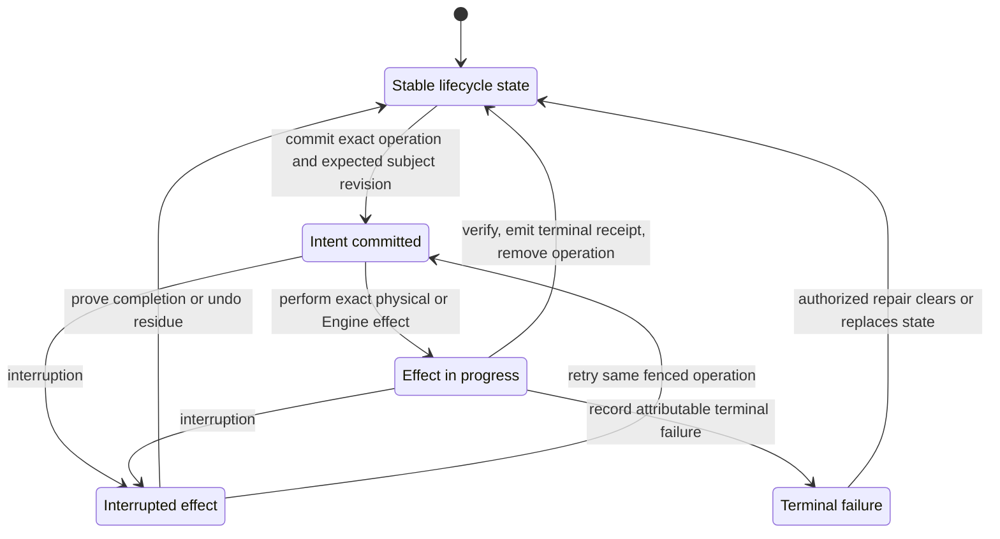
```mermaid
stateDiagram-v2
    direction TB
    state "Stable lifecycle state" as Stable
    state "Intent committed" as Intended
    state "Effect in progress" as Applying
    state "Interrupted effect" as Reconcile
    state "Terminal failure" as Failed

    [*] --> Stable
    Stable --> Intended: commit exact operation and expected subject revision
    Intended --> Applying: perform exact physical or Engine effect
    Applying --> Stable: verify, emit terminal receipt, remove operation
    Intended --> Reconcile: interruption
    Applying --> Reconcile: interruption
    Reconcile --> Stable: prove completion or undo residue
    Reconcile --> Intended: retry same fenced operation
    Applying --> Failed: record attributable terminal failure
    Failed --> Stable: authorized repair clears or replaces state
```

## Overall lifecycle

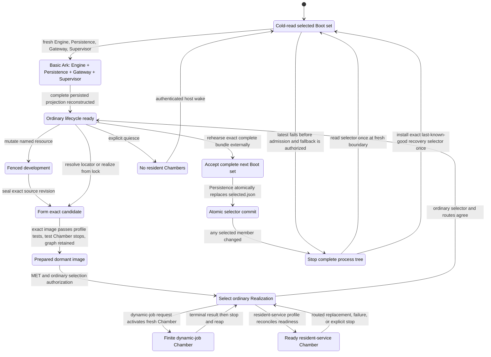
```mermaid
stateDiagram-v2
    direction TB
    state "Cold-read selected Boot set" as Wake
    state "Basic Ark: Engine + Persistence + Gateway + Supervisor" as Basic
    state "Ordinary lifecycle ready" as Normal
    state "Fenced development" as Develop
    state "Form exact candidate" as Realize
    state "Prepared dormant image" as Prepare
    state "Select ordinary Realization" as Select
    state "Finite dynamic-job Chamber" as Job
    state "Ready resident-service Chamber" as Service
    state "Accept complete next Boot set" as BootCandidate
    state "Atomic selector commit" as BootSelect
    state "Stop complete process tree" as StopAll
    state "No resident Chambers" as Quiescent

    [*] --> Wake
    Wake --> Basic: fresh Engine, Persistence, Gateway, Supervisor
    Basic --> Normal: complete persisted projection reconstructed
    Normal --> Develop: mutate named resource
    Develop --> Realize: seal exact source revision
    Normal --> Realize: resolve locator or realize from lock
    Realize --> Prepare: exact image passes profile tests, test Chamber stops, graph retained
    Prepare --> Select: MET and ordinary selection authorization
    Select --> Job: dynamic-job request activates fresh Chamber
    Job --> Select: terminal result then stop and reap
    Select --> Service: resident-service profile reconciles readiness
    Service --> Select: routed replacement, failure, or explicit stop
    Select --> Normal: ordinary selector and routes agree
    Normal --> BootCandidate: rehearse exact complete bundle externally
    BootCandidate --> BootSelect: Persistence atomically replaces selected.json
    BootSelect --> StopAll: any selected member changed
    StopAll --> Wake: read selector once at fresh boundary
    Wake --> StopAll: latest fails before admission and fallback is authorized
    StopAll --> Wake: install exact last-known-good recovery selector once
    Normal --> Quiescent: explicit quiesce
    Quiescent --> Wake: authenticated host wake
```

The lower lifecycle has one selected Boot set containing four exact Runnable Covenant Realizations. Host Agent
always starts Engine, Persistence, Gateway, and Supervisor fresh in that order at a cold activation boundary.
Gateway's route fencing and buffering upgrade ordinary Chambers only. Any selected Boot-set member change is one
atomic selector change followed by complete process-tree replacement; no boot member is routed around itself.

## First boot installation

This one-time sequence imports rather than builds the prepared Engine, Persistence, Gateway, Supervisor, and
optional Builder images. The external installer supplies a one-use accepted Boot Seed to an independently
proved-unenrolled host. Builder is a separate ordinary Covenant seed and is not started on the cold path.

`entry = accepted host envelope + proved-unenrolled host + accepted one-use Boot Seed`

`exit = atomic selected.json + pinned exact closure + four fresh ready boot Chambers`

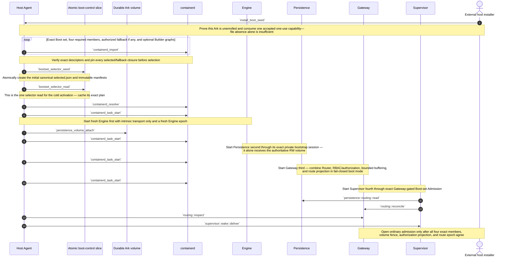
```mermaid
sequenceDiagram
    autonumber
    participant HostAgent as Host Agent
    participant BootControl as Atomic boot-control slice
    participant Volume as Durable Ark volume
    participant containerd
    participant Engine
    participant Persistence
    participant Gateway
    participant Supervisor
    actor Installer as External host installer

    Installer->>HostAgent: `install_boot_seed`
    Note over HostAgent,Installer: Prove this Ark is unenrolled and consume one accepted one-use capability—<br/>file absence alone is insufficient
    loop Exact Boot set, four required members, authorized fallback if any, and optional Builder graphs
        HostAgent->>containerd: `containerd_import`
    end
    Note over HostAgent,containerd: Verify exact descriptors and pin every selected/fallback closure before selection
    HostAgent->>BootControl: `bootset_selector_seed`
    Note over HostAgent,BootControl: Atomically create the initial canonical selected.json and immutable manifests
    HostAgent->>BootControl: `bootset_selector_read`
    Note over HostAgent,BootControl: This is the one selector read for the cold activation — cache its exact plan
    HostAgent->>containerd: `containerd_resolve`
    HostAgent->>containerd: `containerd_task_start`
    Note over HostAgent,Engine: Start fresh Engine first with intrinsic transport only and a fresh Engine epoch
    HostAgent->>Volume: `persistence_volume_attach`
    HostAgent->>containerd: `containerd_task_start`
    Note over Engine,Persistence: Start Persistence second through its exact private bootstrap session —<br/>it alone receives the authoritative RW volume
    HostAgent->>containerd: `containerd_task_start`
    Note over Persistence,Gateway: Start Gateway third — combine Router, RBAC/authorization, bounded buffering,<br/>and route projection in fail-closed boot mode
    HostAgent->>containerd: `containerd_task_start`
    Note over Gateway,Supervisor: Start Supervisor fourth through exact Gateway-gated Boot-set Admission
    Supervisor->>Persistence: `persistence::routing::read`
    Supervisor->>Gateway: `routing::reconcile`
    HostAgent->>Gateway: `routing::inspect`
    HostAgent->>Supervisor: `supervisor::wake::deliver`
    Note over Gateway,Installer: Open ordinary admission only after all four exact members,<br/>volume fence, authorization projection, and route epoch agree
```

The installer never invokes Builder. The only genesis selector write is `bootset_selector_seed`; after enrollment,
Persistence owns normal selector commits. Host Agent may write it only through the bounded pre-authorized fallback
operation described below.

## Selected Boot set cold start

`entry = running accepted Host Agent + durable boot-control slice + retained selected/fallback OCI closure`

`exit = fresh ready Engine, Persistence, Gateway, and Supervisor Chambers for one selector read, or attributable failure`

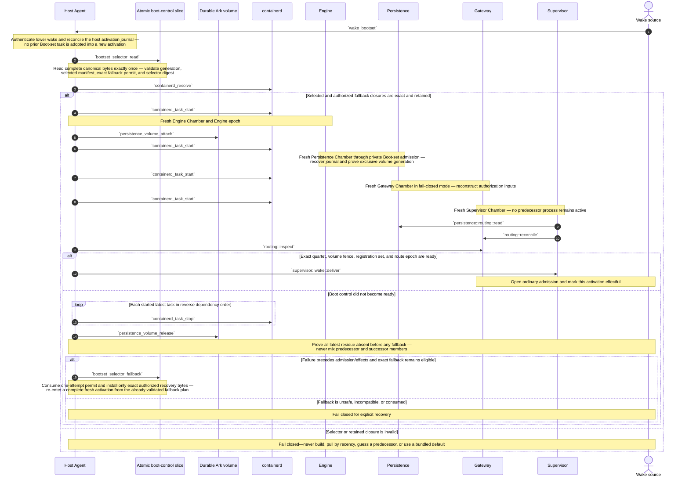
```mermaid
sequenceDiagram
    autonumber
    participant HostAgent as Host Agent
    participant BootControl as Atomic boot-control slice
    participant Volume as Durable Ark volume
    participant containerd
    participant Engine
    participant Persistence
    participant Gateway
    participant Supervisor
    actor Wake as Wake source

    Wake->>HostAgent: `wake_bootset`
    Note over HostAgent: Authenticate lower wake and reconcile the host activation journal —<br/>no prior Boot-set task is adopted into a new activation
    HostAgent->>BootControl: `bootset_selector_read`
    Note over HostAgent,BootControl: Read complete canonical bytes exactly once — validate generation,<br/>selected manifest, exact fallback permit, and selector digest
    HostAgent->>containerd: `containerd_resolve`
    alt Selected and authorized-fallback closures are exact and retained
        HostAgent->>containerd: `containerd_task_start`
        Note over HostAgent,Engine: Fresh Engine Chamber and Engine epoch
        HostAgent->>Volume: `persistence_volume_attach`
        HostAgent->>containerd: `containerd_task_start`
        Note over Engine,Persistence: Fresh Persistence Chamber through private Boot-set admission —<br/>recover journal and prove exclusive volume generation
        HostAgent->>containerd: `containerd_task_start`
        Note over Persistence,Gateway: Fresh Gateway Chamber in fail-closed mode — reconstruct authorization inputs
        HostAgent->>containerd: `containerd_task_start`
        Note over Gateway,Supervisor: Fresh Supervisor Chamber — no predecessor process remains active
        Supervisor->>Persistence: `persistence::routing::read`
        Supervisor->>Gateway: `routing::reconcile`
        HostAgent->>Gateway: `routing::inspect`
        alt Exact quartet, volume fence, registration set, and route epoch are ready
            HostAgent->>Supervisor: `supervisor::wake::deliver`
            Note over Gateway,Wake: Open ordinary admission and mark this activation effectful
        else Boot control did not become ready
            loop Each started latest task in reverse dependency order
                HostAgent->>containerd: `containerd_task_stop`
            end
            HostAgent->>Volume: `persistence_volume_release`
            Note over HostAgent,Wake: Prove all latest residue absent before any fallback —<br/>never mix predecessor and successor members
            alt Failure precedes admission/effects and exact fallback remains eligible
                HostAgent->>BootControl: `bootset_selector_fallback`
                Note over HostAgent,BootControl: Consume one-attempt permit and install only exact authorized recovery bytes —<br/>re-enter a complete fresh activation from the already validated fallback plan
            else Fallback is unsafe, incompatible, or consumed
                Note over HostAgent,Wake: Fail closed for explicit recovery
            end
        end
    else Selector or retained closure is invalid
        Note over HostAgent,Wake: Fail closed—never build, pull by recency, guess a predecessor, or use a bundled default
    end
```

Cold activation creates four fresh tasks. The selector is not polled while the stack runs. Persistence may commit a
new generation at runtime, but it changes no member until `bootset::restart` has stopped the complete process tree
and the next boundary reads the selector. A fallback is legal only before ordinary admission and irreversible
Persistence effects, with exact compatibility evidence and one unused permit.

## Boot control bootstrap

Persistence is deliberately earlier than Gateway: the reconstructible Gateway must not be the only path to the
durable state that reconstructs it. Persistence's private connection is exact Boot-set admission, not an
unauthenticated bypass. Gateway then supplies the only general Router/RBAC/buffering boundary.

`entry = ready selected Engine + exact selected Persistence, Gateway, and Supervisor tasks`

`exit = complete fail-closed authorization and route projection for the exact quartet`

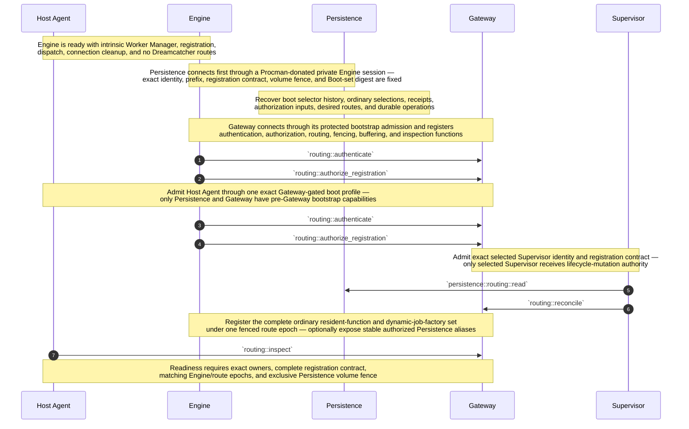
```mermaid
sequenceDiagram
    autonumber
    participant HostAgent as Host Agent
    participant Engine
    participant Persistence
    participant Gateway
    participant Supervisor

    Note over HostAgent,Engine: Engine is ready with intrinsic Worker Manager, registration,<br/>dispatch, connection cleanup, and no Dreamcatcher routes
    Note over Engine,Persistence: Persistence connects first through a Procman-donated private Engine session —<br/>exact identity, prefix, registration contract, volume fence, and Boot-set digest are fixed
    Note over Persistence: Recover boot selector history, ordinary selections, receipts,<br/>authorization inputs, desired routes, and durable operations
    Note over Engine,Gateway: Gateway connects through its protected bootstrap admission and registers<br/>authentication, authorization, routing, fencing, buffering, and inspection functions
    Engine->>Gateway: `routing::authenticate`
    Engine->>Gateway: `routing::authorize_registration`
    Note over HostAgent,Gateway: Admit Host Agent through one exact Gateway-gated boot profile —<br/>only Persistence and Gateway have pre-Gateway bootstrap capabilities
    Engine->>Gateway: `routing::authenticate`
    Engine->>Gateway: `routing::authorize_registration`
    Note over Gateway,Supervisor: Admit exact selected Supervisor identity and registration contract —<br/>only selected Supervisor receives lifecycle-mutation authority
    Supervisor->>Persistence: `persistence::routing::read`
    Supervisor->>Gateway: `routing::reconcile`
    Note over Gateway,Engine: Register the complete ordinary resident-function and dynamic-job-factory set<br/>under one fenced route epoch — optionally expose stable authorized Persistence aliases
    HostAgent->>Gateway: `routing::inspect`
    Note over HostAgent,Gateway: Readiness requires exact owners, complete registration contract,<br/>matching Engine/route epochs, and exclusive Persistence volume fence
```

The bootstrap primitive is two exact protected paths: Persistence's private Engine session, then Gateway's
bootstrap admission. Neither is a general listener. Host Agent wires both but never calls `routing::reconcile`,
`routing::fence`, `routing::install`, or `routing::reopen`. Gateway RAM is reconstructible; Persistence remains
authoritative. Builder remains outside every boot Chamber.

## Host reboot into the selected Boot set

A host reboot repeats the same cold kernel. It never reuses a task, resolves a containerd selector tag, or applies
component-by-component upgrade logic.

`entry = enrolled host + restored durable selector/volume + retained exact OCI closure + accepted host envelope`

`exit = four fresh boot Chambers whose receipts name one selector digest and exact Boot-set digest`

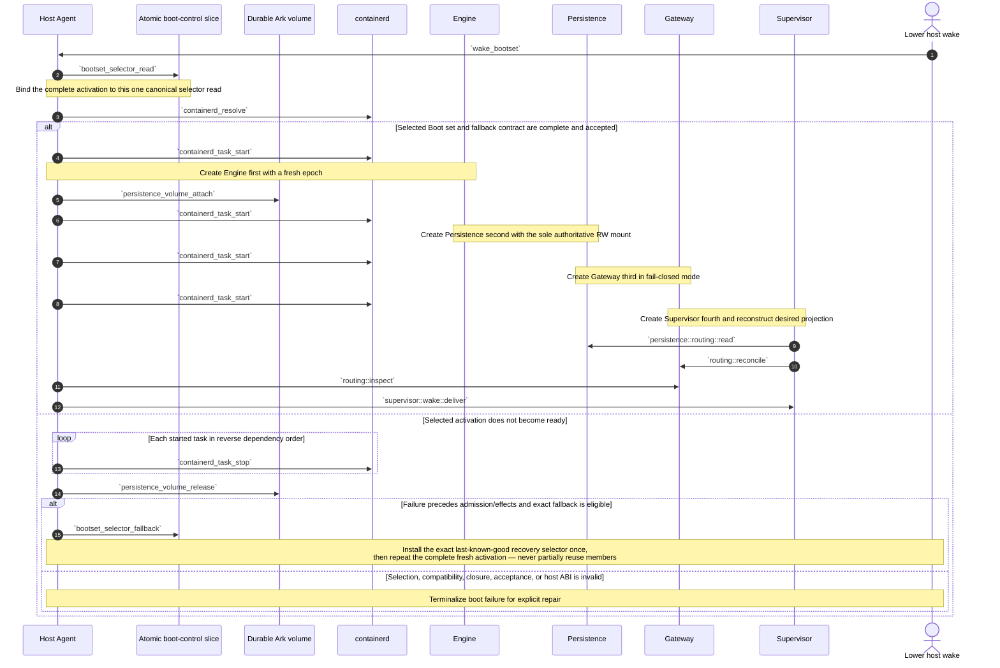
```mermaid
sequenceDiagram
    autonumber
    participant HostAgent as Host Agent
    participant BootControl as Atomic boot-control slice
    participant Volume as Durable Ark volume
    participant containerd
    participant Engine
    participant Persistence
    participant Gateway
    participant Supervisor
    actor Host as Lower host wake

    Host->>HostAgent: `wake_bootset`
    HostAgent->>BootControl: `bootset_selector_read`
    Note over HostAgent,BootControl: Bind the complete activation to this one canonical selector read
    HostAgent->>containerd: `containerd_resolve`
    alt Selected Boot set and fallback contract are complete and accepted
        HostAgent->>containerd: `containerd_task_start`
        Note over HostAgent,Engine: Create Engine first with a fresh epoch
        HostAgent->>Volume: `persistence_volume_attach`
        HostAgent->>containerd: `containerd_task_start`
        Note over Engine,Persistence: Create Persistence second with the sole authoritative RW mount
        HostAgent->>containerd: `containerd_task_start`
        Note over Persistence,Gateway: Create Gateway third in fail-closed mode
        HostAgent->>containerd: `containerd_task_start`
        Note over Gateway,Supervisor: Create Supervisor fourth and reconstruct desired projection
        Supervisor->>Persistence: `persistence::routing::read`
        Supervisor->>Gateway: `routing::reconcile`
        HostAgent->>Gateway: `routing::inspect`
        HostAgent->>Supervisor: `supervisor::wake::deliver`
    else Selected activation does not become ready
        loop Each started task in reverse dependency order
            HostAgent->>containerd: `containerd_task_stop`
        end
        HostAgent->>Volume: `persistence_volume_release`
        alt Failure precedes admission/effects and exact fallback is eligible
            HostAgent->>BootControl: `bootset_selector_fallback`
            Note over HostAgent,Host: Install the exact last-known-good recovery selector once,<br/>then repeat the complete fresh activation — never partially reuse members
        else Selection, compatibility, closure, acceptance, or host ABI is invalid
            Note over HostAgent,Host: Terminalize boot failure for explicit repair
        end
    end
```

## Same-selection Boot-set crash repair

Boot-set members share one **upgrade fate**, not one crash fate. Procman never rereads the selector for a bounded
same-selection repair; it uses the exact cached activation plan and always creates a fresh Chamber ID. Gateway
crash is recoverable—its route/RBAC state is reconstructible—but its volatile buffers are lost. Engine crash is
the case that deliberately escalates to complete activation because every connection and registration belongs to
its epoch.

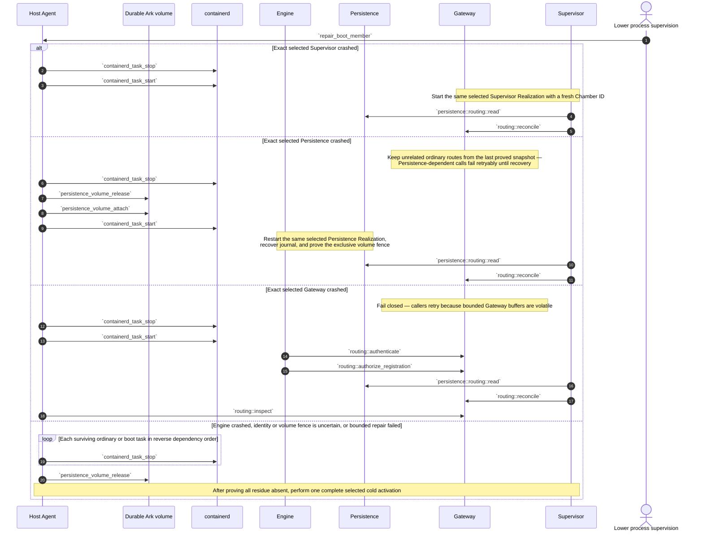
```mermaid
sequenceDiagram
    autonumber
    participant HostAgent as Host Agent
    participant Volume as Durable Ark volume
    participant containerd
    participant Engine
    participant Persistence
    participant Gateway
    participant Supervisor
    actor Monitor as Lower process supervision

    Monitor->>HostAgent: `repair_boot_member`
    alt Exact selected Supervisor crashed
        HostAgent->>containerd: `containerd_task_stop`
        HostAgent->>containerd: `containerd_task_start`
        Note over Gateway,Supervisor: Start the same selected Supervisor Realization with a fresh Chamber ID
        Supervisor->>Persistence: `persistence::routing::read`
        Supervisor->>Gateway: `routing::reconcile`
    else Exact selected Persistence crashed
        Note over Gateway: Keep unrelated ordinary routes from the last proved snapshot —<br/>Persistence-dependent calls fail retryably until recovery
        HostAgent->>containerd: `containerd_task_stop`
        HostAgent->>Volume: `persistence_volume_release`
        HostAgent->>Volume: `persistence_volume_attach`
        HostAgent->>containerd: `containerd_task_start`
        Note over Engine,Persistence: Restart the same selected Persistence Realization,<br/>recover journal, and prove the exclusive volume fence
        Supervisor->>Persistence: `persistence::routing::read`
        Supervisor->>Gateway: `routing::reconcile`
    else Exact selected Gateway crashed
        Note over Gateway: Fail closed — callers retry because bounded Gateway buffers are volatile
        HostAgent->>containerd: `containerd_task_stop`
        HostAgent->>containerd: `containerd_task_start`
        Engine->>Gateway: `routing::authenticate`
        Engine->>Gateway: `routing::authorize_registration`
        Supervisor->>Persistence: `persistence::routing::read`
        Supervisor->>Gateway: `routing::reconcile`
        HostAgent->>Gateway: `routing::inspect`
    else Engine crashed, identity or volume fence is uncertain, or bounded repair failed
        loop Each surviving ordinary or boot task in reverse dependency order
            HostAgent->>containerd: `containerd_task_stop`
        end
        HostAgent->>Volume: `persistence_volume_release`
        Note over HostAgent,Supervisor: After proving all residue absent, perform one complete selected cold activation
    end
```

A selected member digest never changes through this path. Repeated crash loops, ambiguous task ownership, stale
Admission, mismatched registration, or volume-fence uncertainty terminate local repair and trigger a complete
fresh activation of the still-selected Boot set. They do not authorize last-known-good rollback after effects.

## Ordinary Chamber activation kernel

This kernel creates one ordinary non-boot Chamber from one complete Realization. It applies to a current
Realization, a candidate under a valid Hold, a fixture, or a retained rollback target. Engine is ready in the
Engine Chamber; Persistence, Gateway, and Supervisor are ready in their separate boot Chambers.

`entry = ready selected four-member Boot set + exact Realization + current revision or candidate Hold + registration contract + authorized lease`

`exit = ready fresh Chamber + Run receipt, or no live Chamber + terminal failure receipt`

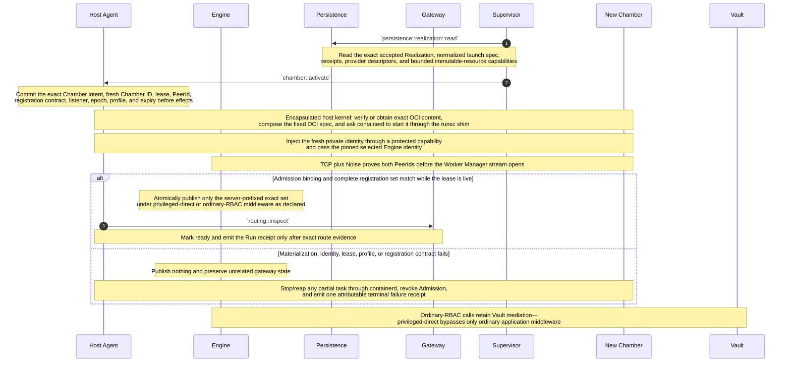
```mermaid
sequenceDiagram
    autonumber
    participant HostAgent as Host Agent
    participant Engine
    participant Persistence
    participant Gateway as Gateway
    participant Supervisor
    participant Chamber as New Chamber
    participant Vault

    Supervisor->>Persistence: `persistence::realization::read`
    Note over Supervisor,Persistence: Read the exact accepted Realization, normalized launch spec,<br/>receipts, provider descriptors, and bounded immutable-resource capabilities
    Supervisor->>HostAgent: `chamber::activate`
    Note over HostAgent: Commit the exact Chamber intent, fresh Chamber ID, lease, PeerId,<br/>registration contract, listener, epoch, profile, and expiry before effects
    Note over HostAgent,Chamber: Encapsulated host kernel: verify or obtain exact OCI content,<br/>compose the fixed OCI spec, and ask containerd to start it through the runsc shim
    Note over HostAgent,Chamber: Inject the fresh private identity through a protected capability<br/>and pass the pinned selected Engine identity
    Note over Chamber,Engine: TCP plus Noise proves both PeerIds before the Worker Manager stream opens
    alt Admission binding and complete registration set match while the lease is live
        Note over Engine: Atomically publish only the server-prefixed exact set<br/>under privileged-direct or ordinary-RBAC middleware as declared
        HostAgent->>Gateway: `routing::inspect`
        Note over HostAgent,Gateway: Mark ready and emit the Run receipt only after exact route evidence
    else Materialization, identity, lease, profile, or registration contract fails
        Note over Engine: Publish nothing and preserve unrelated gateway state
        Note over HostAgent,Chamber: Stop/reap any partial task through containerd, revoke Admission,<br/>and emit one attributable terminal failure receipt
    end
    Note over Engine,Vault: Ordinary-RBAC calls retain Vault mediation—<br/>privileged-direct bypasses only ordinary application middleware
```

`chamber::activate(exact_realization, lease)` is the sole ordinary physical-start surface. The caller supplies
an exact accepted Realization and bounded lease, not a Covenant lock, mutable locator, host path, image tag,
or runtime flags. The Host Agent validates the supplied durable authority and encapsulates exact content
resolution, import/pull, snapshot, OCI-spec, containerd, shim, and runsc mechanics behind that one call.

Persistence remains the durable data boundary; it does not custody ordinary rebuildable OCI blobs. A
source-composed Realization may be rematerialized from its exact base and resource revisions. A missing
artifact-backed graph is not rebuilt in this kernel: an authorized rebuild returns through candidate
formation, and a different digest is a different candidate.

The Noise connection is not admission by itself. Engine invokes Gateway's fixed authentication and registration
hooks; Gateway validates the Host Agent-issued Admission both when the secure connection identifies the remote
PeerId and when the peer requests Worker Manager. A claimed Chamber ID is never authority. Private identities
are fresh per lease and destroyed with the Chamber.

The current revision or candidate Hold is captured when intent commits. A concurrent selection change never
relabels the Chamber. A selected `dynamic-job` Realization normally has zero live Chambers before and after this
kernel; a selected `resident-service` Realization with zero matching ready Chambers remains fenced and triggers
Supervisor reconciliation.

## Fenced development

`mutable object = named Persistence workspace`

`developer execution = one leased ordinary Chamber from an exact development Realization`

`immutable handoff = exact resource snapshot`

The Developer Chamber is ordinary execution state. It is activated through the same three-function Host
Agent surface, terminates, and is reaped. Any immutable product may enter another lifecycle as a candidate,
but the Developer Chamber itself is never promoted.

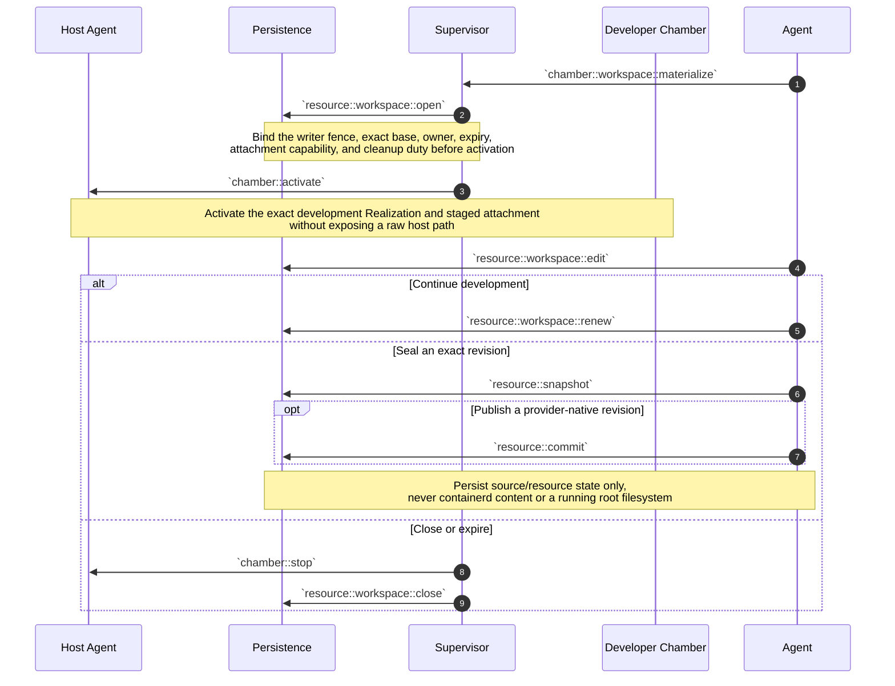
```mermaid
sequenceDiagram
    autonumber
    participant HostAgent as Host Agent
    participant Persistence
    participant Supervisor
    participant Developer as Developer Chamber
    participant Agent

    Agent->>Supervisor: `chamber::workspace::materialize`
    Supervisor->>Persistence: `resource::workspace::open`
    Note over Supervisor,Persistence: Bind the writer fence, exact base, owner, expiry,<br/>attachment capability, and cleanup duty before activation
    Supervisor->>HostAgent: `chamber::activate`
    Note over HostAgent,Developer: Activate the exact development Realization and staged attachment<br/>without exposing a raw host path
    Agent->>Persistence: `resource::workspace::edit`

    alt Continue development
        Agent->>Persistence: `resource::workspace::renew`
    else Seal an exact revision
        Agent->>Persistence: `resource::snapshot`
        opt Publish a provider-native revision
            Agent->>Persistence: `resource::commit`
        end
        Note over Agent,Persistence: Persist source/resource state only,<br/>never containerd content or a running root filesystem
    else Close or expire
        Supervisor->>HostAgent: `chamber::stop`
        Supervisor->>Persistence: `resource::workspace::close`
    end
```

Workspace, snapshot, provider revision, Realization, and Chamber remain distinct identities. A sealed output
becomes an input to a later Covenant lock. It enters **Form a candidate Realization**, forms one exact
candidate under a Hold, and may be selected only after verification. No workspace, containerd snapshot, or
running Chamber is renamed into a candidate or current Realization.

## Form a candidate Realization

`entry = authorized caller + durable logical name + locator or exact Covenant lock + candidate quota`

`exit = exact source-composed or artifact-backed candidate Realization + bounded Hold + zero new Chambers`

Several candidates may coexist for one logical name. Candidate formation is logical work owned by Supervisor
and Persistence and never starts a Chamber. Preparation is the separately evidenced operation that later
activates the exact artifact-backed candidate. Formation changes neither selection authority.

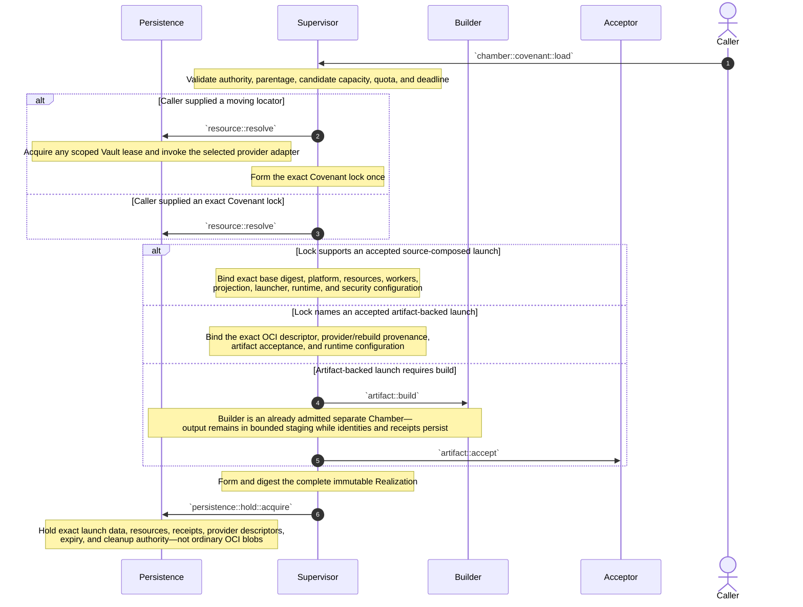
```mermaid
sequenceDiagram
    autonumber
    participant Persistence
    participant Supervisor
    participant Builder
    participant Acceptor
    actor Caller

    Caller->>Supervisor: `chamber::covenant::load`
    Note over Supervisor: Validate authority, parentage, candidate capacity, quota, and deadline
    alt Caller supplied a moving locator
        Supervisor->>Persistence: `resource::resolve`
        Note over Persistence: Acquire any scoped Vault lease and invoke the selected provider adapter
        Note over Supervisor: Form the exact Covenant lock once
    else Caller supplied an exact Covenant lock
        Supervisor->>Persistence: `resource::resolve`
    end

    alt Lock supports an accepted source-composed launch
        Note over Supervisor: Bind exact base digest, platform, resources, workers,<br/>projection, launcher, runtime, and security configuration
    else Lock names an accepted artifact-backed launch
        Note over Supervisor: Bind the exact OCI descriptor, provider/rebuild provenance,<br/>artifact acceptance, and runtime configuration
    else Artifact-backed launch requires build
        Supervisor->>Builder: `artifact::build`
        Note over Builder,Persistence: Builder is an already admitted separate Chamber—<br/>output remains in bounded staging while identities and receipts persist
        Supervisor->>Acceptor: `artifact::accept`
    end

    Note over Supervisor: Form and digest the complete immutable Realization
    Supervisor->>Persistence: `persistence::hold::acquire`
    Note over Persistence: Hold exact launch data, resources, receipts, provider descriptors,<br/>expiry, and cleanup authority—not ordinary OCI blobs
```

A moving locator is resolved only while forming the lock. Re-resolving it later may produce another lock and
candidate; it never mutates `current`. Candidate admission deduplicates the same Realization identity.

Source-composed launch remains useful for development when exact source and runtime base are cheaply obtainable.
Reusable `dynamic-job` and `resident-service` execution requires an artifact-backed candidate: preparation
must test and retain the exact immutable image that future Chambers will use. Persistence retains exact identity,
evidence, and provider/rebuild policy rather than a duplicate ordinary OCI graph.

Builds are not assumed reproducible. A byte-identical authorized rebuild may restore an unavailable recorded
OCI descriptor after evidence checks. A different digest is a different candidate. Rejection, missing Builder
support, unavailable provider bytes, or incomplete durable inputs fails closed without changing selection.

## Build an artifact

`entry = accepted Builder Realization + accepted Covenant lock + exact build request`

`output = exact OCI descriptor + Build receipt + bounded output capability`

Build is an ordinary separately sandboxed Chamber capability. The first accepted Builder image may be imported
by the installer and named in initial Persistence state, so Builder need not build itself before first use.
It is not a Host Agent method, boot process, or cold-start dependency. `containerd` does not build images.

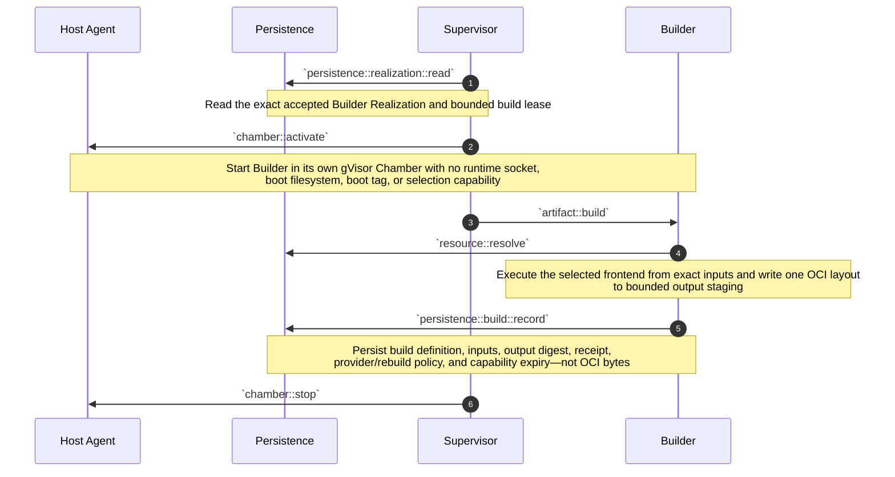
```mermaid
sequenceDiagram
    autonumber
    participant HostAgent as Host Agent
    participant Persistence
    participant Supervisor
    participant Builder

    Supervisor->>Persistence: `persistence::realization::read`
    Note over Supervisor,Persistence: Read the exact accepted Builder Realization and bounded build lease
    Supervisor->>HostAgent: `chamber::activate`
    Note over HostAgent,Builder: Start Builder in its own gVisor Chamber with no runtime socket,<br/>boot filesystem, boot tag, or selection capability
    Supervisor->>Builder: `artifact::build`
    Builder->>Persistence: `resource::resolve`
    Note over Builder: Execute the selected frontend from exact inputs and write one OCI layout<br/>to bounded output staging
    Builder->>Persistence: `persistence::build::record`
    Note over Builder,Persistence: Persist build definition, inputs, output digest, receipt,<br/>provider/rebuild policy, and capability expiry—not OCI bytes
    Supervisor->>HostAgent: `chamber::stop`
```

A later preparation or `bootset::stage` may give the Host Agent the exact bounded output capability to import.
The Builder never receives the containerd socket. Builder output remains disposable candidate staging; the
separate `artifact::retain` step is mandatory before that image becomes a Prepared Realization selectable for
`dynamic-job` or `resident-service` execution. The explicit OCI provider retains the graph and Persistence
retains only the exact provider descriptor, digest, and transitive receipts.

If bounded output disappears before import or publication, no selected identity changes. An authorized rebuild
enters candidate formation. Matching the recorded digest proves byte convergence; a different digest is a
different candidate. BuildKit, Nix, Kaniko, or a minimal OCI assembler may be replaceable Builder
implementations behind the same contract.

If a chosen frontend cannot operate inside the bounded Builder Chamber, build is delegated to an explicit
external provider with exact input/output evidence. That limitation never expands the Host Agent or moves
build onto the boot cold path.

## Prepare and retain a tested Realization

`entry = exact artifact-backed candidate Realization + bounded Hold + declared execution profile`

`verification subject = exact candidate Realization + exact Chamber + exact plan + environment`

`exit = dormant Prepared Realization + authoritative retained OCI graph + zero verification Chambers, or no Prepared record`

`Prepared != selected != running`

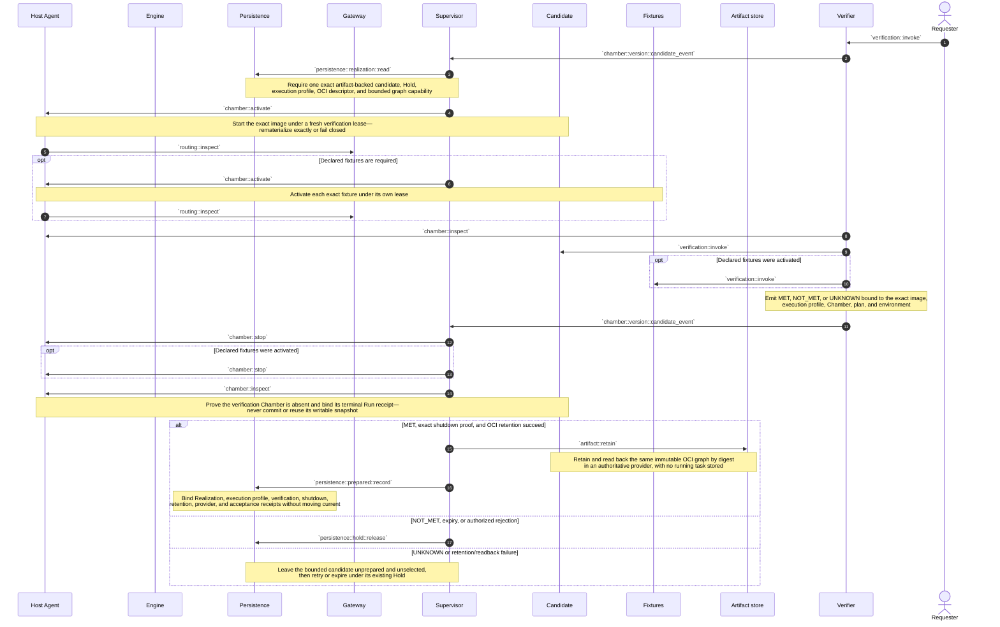
```mermaid
sequenceDiagram
    autonumber
    participant HostAgent as Host Agent
    participant Engine
    participant Persistence
    participant Gateway as Gateway
    participant Supervisor
    participant Candidate
    participant Fixtures
    participant ArtifactStore as Artifact store
    participant Verifier
    actor Requester

    Requester->>Verifier: `verification::invoke`
    Verifier->>Supervisor: `chamber::version::candidate_event`
    Supervisor->>Persistence: `persistence::realization::read`
    Note over Persistence,Supervisor: Require one exact artifact-backed candidate, Hold,<br/>execution profile, OCI descriptor, and bounded graph capability
    Supervisor->>HostAgent: `chamber::activate`
    Note over HostAgent,Candidate: Start the exact image under a fresh verification lease—<br/>rematerialize exactly or fail closed
    HostAgent->>Gateway: `routing::inspect`

    opt Declared fixtures are required
        Supervisor->>HostAgent: `chamber::activate`
        Note over HostAgent,Fixtures: Activate each exact fixture under its own lease
        HostAgent->>Gateway: `routing::inspect`
    end

    Verifier->>HostAgent: `chamber::inspect`
    Verifier->>Candidate: `verification::invoke`
    opt Declared fixtures were activated
        Verifier->>Fixtures: `verification::invoke`
    end
    Note over Verifier: Emit MET, NOT_MET, or UNKNOWN bound to the exact image,<br/>execution profile, Chamber, plan, and environment
    Verifier->>Supervisor: `chamber::version::candidate_event`

    Supervisor->>HostAgent: `chamber::stop`
    opt Declared fixtures were activated
        Supervisor->>HostAgent: `chamber::stop`
    end
    Supervisor->>HostAgent: `chamber::inspect`
    Note over HostAgent,Candidate: Prove the verification Chamber is absent and bind its terminal Run receipt—<br/>never commit or reuse its writable snapshot

    alt MET, exact shutdown proof, and OCI retention succeed
        Supervisor->>ArtifactStore: `artifact::retain`
        Note over Candidate,ArtifactStore: Retain and read back the same immutable OCI graph by digest<br/>in an authoritative provider, with no running task stored
        Supervisor->>Persistence: `persistence::prepared::record`
        Note over Persistence: Bind Realization, execution profile, verification, shutdown,<br/>retention, provider, and acceptance receipts without moving current
    else NOT_MET, expiry, or authorized rejection
        Supervisor->>Persistence: `persistence::hold::release`
    else UNKNOWN or retention/readback failure
        Note over Persistence,Supervisor: Leave the bounded candidate unprepared and unselected,<br/>then retry or expire under its existing Hold
    end
```

Preparation is the explicit boundary between candidate work and reusable execution. The reusable object is the
same immutable OCI graph that booted the verification Chamber, plus the exact Realization and transitive receipts.
The Chamber itself is shut down and reaped; its writable runtime snapshot, process state, live registrations, and
leases are never a template or storage format.

Only a Prepared Realization may be selected for `dynamic-job` or `resident-service` execution. A Prepared
Realization may remain stored indefinitely with zero live Chambers. Further verification attempts and every job
request create fresh Chambers of the same Realization and independently scoped evidence. The verifier never
rebuilds or substitutes an image, and Persistence stores provider custody evidence rather than OCI bytes.

The first Tester is judged by the external bootstrap verifier. Once Prepared and selected under a `dynamic-job`
profile, its ordinary Realization supplies fresh on-demand Tester Chambers; Tester never writes either selector.

## Select, upgrade, or roll back

`ordinary selection authority = gate-appropriate fenced promoter + Persistence compare-and-swap`

`Boot-set selection authority = gate-appropriate fenced promoter + Persistence atomic selector commit + Host Agent fresh activation`

`entry = exact Prepared ordinary candidate or accepted complete Boot set + custody + fresh evidence + expected selector revision`

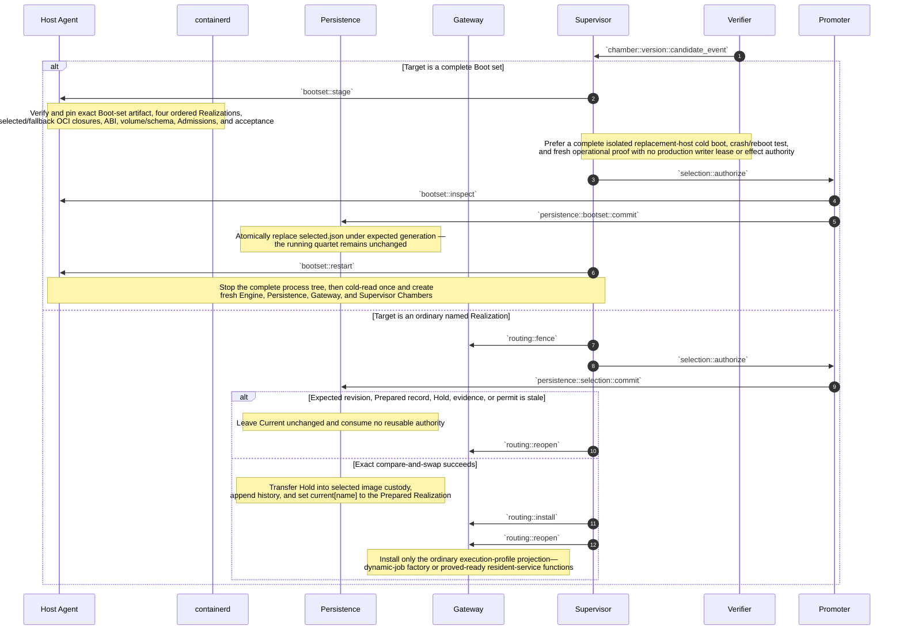
```mermaid
sequenceDiagram
    autonumber
    participant HostAgent as Host Agent
    participant containerd
    participant Persistence
    participant Gateway
    participant Supervisor
    participant Verifier
    participant Promoter

    Verifier->>Supervisor: `chamber::version::candidate_event`
    alt Target is a complete Boot set
        Supervisor->>HostAgent: `bootset::stage`
        Note over HostAgent,containerd: Verify and pin exact Boot-set artifact, four ordered Realizations,<br/>selected/fallback OCI closures, ABI, volume/schema, Admissions, and acceptance
        Note over Supervisor,Verifier: Prefer a complete isolated replacement-host cold boot, crash/reboot test,<br/>and fresh operational proof with no production writer lease or effect authority
        Supervisor->>Promoter: `selection::authorize`
        Promoter->>HostAgent: `bootset::inspect`
        Promoter->>Persistence: `persistence::bootset::commit`
        Note over Persistence: Atomically replace selected.json under expected generation —<br/>the running quartet remains unchanged
        Supervisor->>HostAgent: `bootset::restart`
        Note over HostAgent,Supervisor: Stop the complete process tree, then cold-read once and create<br/>fresh Engine, Persistence, Gateway, and Supervisor Chambers
    else Target is an ordinary named Realization
        Supervisor->>Gateway: `routing::fence`
        Supervisor->>Promoter: `selection::authorize`
        Promoter->>Persistence: `persistence::selection::commit`
        alt Expected revision, Prepared record, Hold, evidence, or permit is stale
            Note over Persistence: Leave Current unchanged and consume no reusable authority
            Supervisor->>Gateway: `routing::reopen`
        else Exact compare-and-swap succeeds
            Note over Persistence: Transfer Hold into selected image custody,<br/>append history, and set current[name] to the Prepared Realization
            Supervisor->>Gateway: `routing::install`
            Supervisor->>Gateway: `routing::reopen`
            Note over Gateway: Install only the ordinary execution-profile projection—<br/>dynamic-job factory or proved-ready resident-service functions
        end
    end
```

Selection names immutable content, never a running Chamber. Ordinary operational selection may use Gateway to
fence, buffer bounded calls, install the successor route, and drain an old resident Chamber. Boot-set selection
never does. Persistence's atomic JSON commit changes only next cold authority; `bootset::restart` applies it by
stopping every ordinary and boot task and creating one fresh quartet.

Ordinary rollback repeats ordinary CAS against retained accepted content. Boot-set rollback is another accepted
complete selector commit and full activation. The sole automatic exception is the exact one-attempt
last-known-good fallback during failed pre-admission activation; no health signal, creation time, semantic version,
fleet majority, surviving task, or cache content independently chooses rollback.

## Execute a dynamic job or resident service

`entry = selected Prepared Realization + immutable execution profile + authoritative retained OCI graph`

`dynamic-job exit = terminal result or attributable failure + Run evidence + zero job Chambers`

`resident-service exit = one exact ready Chamber + stable declared route, or fenced unavailable state`

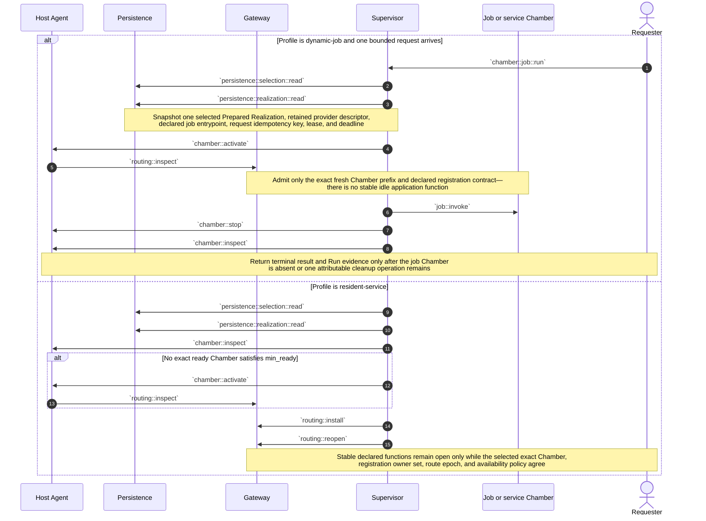
```mermaid
sequenceDiagram
    autonumber
    participant HostAgent as Host Agent
    participant Persistence
    participant Gateway as Gateway
    participant Supervisor
    participant Workload as Job or service Chamber
    actor Requester

    alt Profile is dynamic-job and one bounded request arrives
        Requester->>Supervisor: `chamber::job::run`
        Supervisor->>Persistence: `persistence::selection::read`
        Supervisor->>Persistence: `persistence::realization::read`
        Note over Persistence,Supervisor: Snapshot one selected Prepared Realization, retained provider descriptor,<br/>declared job entrypoint, request idempotency key, lease, and deadline
        Supervisor->>HostAgent: `chamber::activate`
        HostAgent->>Gateway: `routing::inspect`
        Note over Gateway,Workload: Admit only the exact fresh Chamber prefix and declared registration contract—<br/>there is no stable idle application function
        Supervisor->>Workload: `job::invoke`
        Supervisor->>HostAgent: `chamber::stop`
        Supervisor->>HostAgent: `chamber::inspect`
        Note over HostAgent,Requester: Return terminal result and Run evidence only after the job Chamber<br/>is absent or one attributable cleanup operation remains
    else Profile is resident-service
        Supervisor->>Persistence: `persistence::selection::read`
        Supervisor->>Persistence: `persistence::realization::read`
        Supervisor->>HostAgent: `chamber::inspect`
        alt No exact ready Chamber satisfies min_ready
            Supervisor->>HostAgent: `chamber::activate`
            HostAgent->>Gateway: `routing::inspect`
        end
        Supervisor->>Gateway: `routing::install`
        Supervisor->>Gateway: `routing::reopen`
        Note over Gateway,Requester: Stable declared functions remain open only while the selected exact Chamber,<br/>registration owner set, route epoch, and availability policy agree
    end
```

Both branches consume the same kind of Prepared Realization; neither builds, retests, snapshots, or mutates the
stored image at execution time. Their difference is residency and routing. A dynamic job has no live application
function while idle: one request gets a fresh writable snapshot and exact Chamber prefix, then terminal handling
stops and reaps it. A resident service requires Supervisor to keep one matching Chamber ready and Gateway to
maintain its stable function projection; if readiness is lost, the route fences until exact replacement.

The prepared image therefore outlives every job and every resident-service process, while no stopped Chamber
becomes durable state. Current selection chooses the exact reusable Realization. Its immutable execution profile
alone determines whether zero idle Chambers is the intended steady state or an availability failure requiring
reconciliation.

## Ordinary resident-service routed cutover

Gateway's warm-cutover machinery exists for ordinary Chambers only. It keeps one stable logical function set,
fences new calls, holds or rejects a bounded volatile set, changes the Persistence-owned ordinary selection, then
installs one proved-ready successor target. No Engine, Persistence, Gateway, or Supervisor Realization changes.

`entry = ready selected resident-service + Prepared successor + exact Hold and fresh evidence`

`exit = Current and stable routes name successor + predecessor reaped, or predecessor remains current`

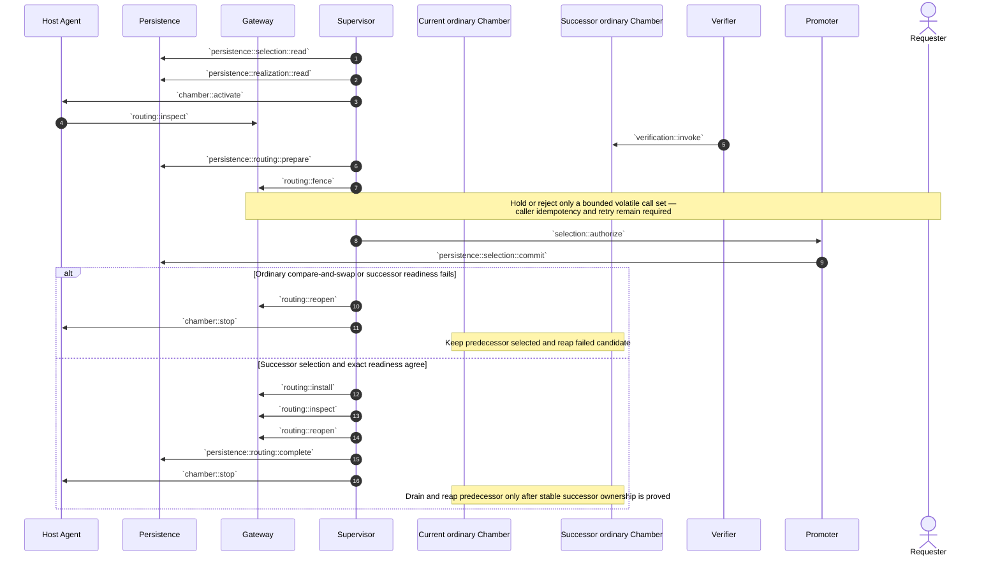
```mermaid
sequenceDiagram
    autonumber
    participant HostAgent as Host Agent
    participant Persistence
    participant Gateway
    participant Supervisor
    participant Current as Current ordinary Chamber
    participant Successor as Successor ordinary Chamber
    participant Verifier
    participant Promoter
    actor Requester

    Supervisor->>Persistence: `persistence::selection::read`
    Supervisor->>Persistence: `persistence::realization::read`
    Supervisor->>HostAgent: `chamber::activate`
    HostAgent->>Gateway: `routing::inspect`
    Verifier->>Successor: `verification::invoke`
    Supervisor->>Persistence: `persistence::routing::prepare`
    Supervisor->>Gateway: `routing::fence`
    Note over Gateway,Requester: Hold or reject only a bounded volatile call set —<br/>caller idempotency and retry remain required
    Supervisor->>Promoter: `selection::authorize`
    Promoter->>Persistence: `persistence::selection::commit`
    alt Ordinary compare-and-swap or successor readiness fails
        Supervisor->>Gateway: `routing::reopen`
        Supervisor->>HostAgent: `chamber::stop`
        Note over Current,Successor: Keep predecessor selected and reap failed candidate
    else Successor selection and exact readiness agree
        Supervisor->>Gateway: `routing::install`
        Supervisor->>Gateway: `routing::inspect`
        Supervisor->>Gateway: `routing::reopen`
        Supervisor->>Persistence: `persistence::routing::complete`
        Supervisor->>HostAgent: `chamber::stop`
        Note over Current,Successor: Drain and reap predecessor only after stable successor ownership is proved
    end
```

Gateway buffering is not a second durable queue. A Gateway crash loses its held RAM calls and clients retry. The
cutover is therefore useful for bounded ordinary target movement, not for pretending the Gateway can route around
its own replacement or around a full Boot-set restart. Dynamic jobs do not need this route handover: each new
request snapshots the newly selected revision and creates a fresh Chamber.

## Complete Boot-set replacement and bounded fallback

Every selected Boot-set member has one shared upgrade fate. Even a Supervisor-only or Gateway-only image change
creates a new Boot-set digest, atomically selects the complete quartet, stops the complete process tree, and starts
four fresh Chambers. This deliberately trades a bounded full-stack interruption for far fewer partial-upgrade,
identity-renewal, route-ownership, schema, and mixed-generation rules.

Before promotion, the preferred proof is a real cold boot and crash/reboot rehearsal of the exact bundle on an
isolated replacement host or VM. It may expose only declared private test endpoints and receives no production
effect authority or authoritative RW volume. A production move can then use outer ingress fencing and host
replacement; the in-place sequence below remains the recovery-compatible baseline.

`entry = ready predecessor stack + accepted complete successor + exact staged/fallback closures + compatibility proof`

`exit = fresh successor stack ready, exact pre-authorized predecessor restored once, or fail-closed recovery state`

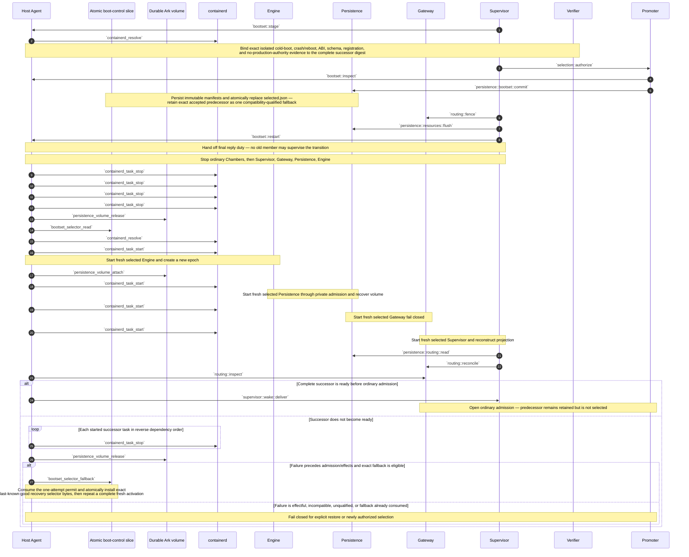
```mermaid
sequenceDiagram
    autonumber
    participant HostAgent as Host Agent
    participant BootControl as Atomic boot-control slice
    participant Volume as Durable Ark volume
    participant containerd
    participant Engine
    participant Persistence
    participant Gateway
    participant Supervisor
    participant Verifier
    participant Promoter

    Supervisor->>HostAgent: `bootset::stage`
    HostAgent->>containerd: `containerd_resolve`
    Note over HostAgent,Verifier: Bind exact isolated cold-boot, crash/reboot, ABI, schema, registration,<br/>and no-production-authority evidence to the complete successor digest
    Supervisor->>Promoter: `selection::authorize`
    Promoter->>HostAgent: `bootset::inspect`
    Promoter->>Persistence: `persistence::bootset::commit`
    Note over Persistence,BootControl: Persist immutable manifests and atomically replace selected.json —<br/>retain exact accepted predecessor as one compatibility-qualified fallback
    Supervisor->>Gateway: `routing::fence`
    Supervisor->>Persistence: `persistence::resources::flush`
    Supervisor->>HostAgent: `bootset::restart`
    Note over Supervisor,HostAgent: Hand off final reply duty — no old member may supervise the transition
    Note over HostAgent,Supervisor: Stop ordinary Chambers, then Supervisor, Gateway, Persistence, Engine
    HostAgent->>containerd: `containerd_task_stop`
    HostAgent->>containerd: `containerd_task_stop`
    HostAgent->>containerd: `containerd_task_stop`
    HostAgent->>containerd: `containerd_task_stop`
    HostAgent->>Volume: `persistence_volume_release`

    HostAgent->>BootControl: `bootset_selector_read`
    HostAgent->>containerd: `containerd_resolve`
    HostAgent->>containerd: `containerd_task_start`
    Note over HostAgent,Engine: Start fresh selected Engine and create a new epoch
    HostAgent->>Volume: `persistence_volume_attach`
    HostAgent->>containerd: `containerd_task_start`
    Note over Engine,Persistence: Start fresh selected Persistence through private admission and recover volume
    HostAgent->>containerd: `containerd_task_start`
    Note over Persistence,Gateway: Start fresh selected Gateway fail closed
    HostAgent->>containerd: `containerd_task_start`
    Note over Gateway,Supervisor: Start fresh selected Supervisor and reconstruct projection
    Supervisor->>Persistence: `persistence::routing::read`
    Supervisor->>Gateway: `routing::reconcile`
    HostAgent->>Gateway: `routing::inspect`

    alt Complete successor is ready before ordinary admission
        HostAgent->>Supervisor: `supervisor::wake::deliver`
        Note over Gateway,Promoter: Open ordinary admission — predecessor remains retained but is not selected
    else Successor does not become ready
        loop Each started successor task in reverse dependency order
            HostAgent->>containerd: `containerd_task_stop`
        end
        HostAgent->>Volume: `persistence_volume_release`
        alt Failure precedes admission/effects and exact fallback is eligible
            HostAgent->>BootControl: `bootset_selector_fallback`
            Note over HostAgent,BootControl: Consume the one-attempt permit and atomically install exact<br/>last-known-good recovery selector bytes, then repeat a complete fresh activation
        else Failure is effectful, incompatible, unqualified, or fallback already consumed
            Note over HostAgent,Promoter: Fail closed for explicit restore or newly authorized selection
        end
    end
```

The last-known-good entry is not a second mutable selector and is not merely “the previous version.” It is one
exact retained Boot set plus precomputed selector bytes, a one-use permit, and evidence that predecessor
Persistence can safely read the authoritative state. Automatic fallback expires once ordinary admission opens or
an irreversible migration/effect occurs. A successful successor becomes eligible as a future last-known-good only
after distinct operational acceptance; Procman does not infer “good” from process liveness.

## Quiesce and wake

`quiescence preserves Boot-set and ordinary selections, candidate Holds, receipts, and durable resources—not Chambers`

`wake = selected Boot set cold activation with one selector read and four fresh tasks`

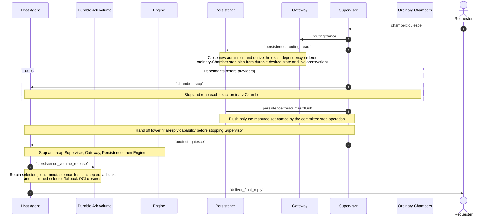
```mermaid
sequenceDiagram
    autonumber
    participant HostAgent as Host Agent
    participant Volume as Durable Ark volume
    participant Engine
    participant Persistence
    participant Gateway
    participant Supervisor
    participant Members as Ordinary Chambers
    actor Requester

    Requester->>Supervisor: `chamber::quiesce`
    Supervisor->>Gateway: `routing::fence`
    Supervisor->>Persistence: `persistence::routing::read`
    Note over Persistence,Gateway: Close new admission and derive the exact dependency-ordered<br/>ordinary-Chamber stop plan from durable desired state and live observations
    loop Dependants before providers
        Supervisor->>HostAgent: `chamber::stop`
        Note over HostAgent,Members: Stop and reap each exact ordinary Chamber
    end
    Supervisor->>Persistence: `persistence::resources::flush`
    Note over Supervisor,Persistence: Flush only the resource set named by the committed stop operation
    Note over Supervisor,HostAgent: Hand off lower final-reply capability before stopping Supervisor
    Supervisor->>HostAgent: `bootset::quiesce`
    Note over HostAgent,Engine: Stop and reap Supervisor, Gateway, Persistence, then Engine —
    HostAgent->>Volume: `persistence_volume_release`
    Note over HostAgent,Volume: Retain selected.json, immutable manifests, accepted fallback,<br/>and all pinned selected/fallback OCI closures
    HostAgent->>Requester: `deliver_final_reply`
```

`persistence::resources::flush` is the explicit Persistence barrier. Once scoped receipts are durable and no
invocation remains active, Host Agent stops the four exact Boot-set tasks in reverse dependency order and releases
the exclusive volume writer fence. Idle reaping changes no selection. The next lower wake follows **Selected Boot
set cold start**, reads `selected.json` once, and creates four fresh Chambers. The ordinary runtime namespace may
be discarded; the durable boot-control slice, Persistence data, and pinned selected/fallback closure may not.

## Attested multi-Ark builds (later)

Status: **Later extension; not required by the first Builder contract.**

The baseline single-Builder contract above remains the compatibility floor. This stronger policy is useful
only when independent builders and fresh confidential-computing evidence add enough value to justify the
extra cost.

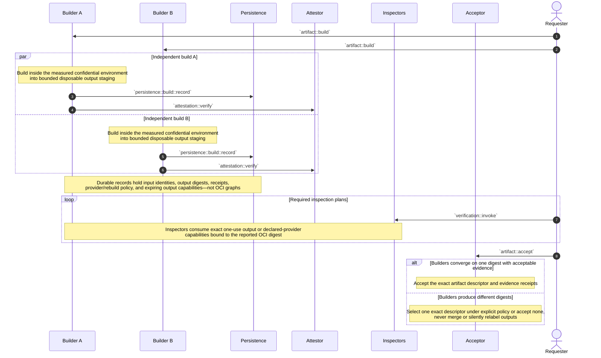
```mermaid
sequenceDiagram
    autonumber
    participant BuilderA as Builder A
    participant BuilderB as Builder B
    participant Persistence
    participant Attestation as Attestor
    participant Inspectors
    participant Acceptor
    actor Requester

    Requester->>BuilderA: `artifact::build`
    Requester->>BuilderB: `artifact::build`

    par Independent build A
        Note over BuilderA: Build inside the measured confidential environment<br/>into bounded disposable output staging
        BuilderA->>Persistence: `persistence::build::record`
        BuilderA->>Attestation: `attestation::verify`
    and Independent build B
        Note over BuilderB: Build inside the measured confidential environment<br/>into bounded disposable output staging
        BuilderB->>Persistence: `persistence::build::record`
        BuilderB->>Attestation: `attestation::verify`
    end

    Note over BuilderA,Persistence: Durable records hold input identities, output digests, receipts,<br/>provider/rebuild policy, and expiring output capabilities—not OCI graphs
    loop Required inspection plans
        Requester->>Inspectors: `verification::invoke`
        Note over BuilderA,Inspectors: Inspectors consume exact one-use output or declared-provider<br/>capabilities bound to the reported OCI digest
    end

    Requester->>Acceptor: `artifact::accept`
    alt Builders converge on one digest with acceptable evidence
        Note over Acceptor: Accept the exact artifact descriptor and evidence receipts
    else Builders produce different digests
        Note over Acceptor: Select one exact descriptor under explicit policy or accept none,<br/>never merge or silently relabel outputs
    end
```

Attestation binds a statement about one Builder realization, request, input closure, output digest, and
fresh environment evidence. It does not prove truth, reproducibility, or acceptability. Inspectors and the
Acceptor remain separate replaceable policy roles.

Multi-Ark build agreement alone creates no Ark-local durability obligation for OCI bytes. An output may remain
in bounded disposable builder staging until preparation. It becomes selectable for `dynamic-job` or
`resident-service` execution only after the exact graph is tested, the verification Chamber stops, and an
explicit authoritative OCI provider returns a digest-bound retention receipt. Persistence records identities,
evidence, and locators rather than blobs. If every byte source disappears, the Prepared custody condition is
broken; execution fails closed and rebuilding is candidate work.

## Failure and recovery formulas

- `operation remains non-terminal after interruption -> reconcile that exact operation before conflicting work`.
- `current[name] = Prepared R + dynamic-job + zero ordinary Chambers -> valid idle state`; do nothing until one bounded job request.
- `current[name] = Prepared R + resident-service + fewer than min_ready Chambers -> fenced unavailable state`; Supervisor activates an exact replacement and Gateway reopens only after readiness.
- `candidate R + MET + exact verification-Chamber shutdown + retained OCI graph digest readback -> prepared[R] may be recorded`; none of those facts alone selects or starts it.
- `dynamic job reaches terminal result or failure -> stop and reap its exact Chamber before successful chamber::job::run completion`; Prepared image and Current remain.
- `selected.json = B + zero boot tasks -> valid quiescent state`; authenticated wake reads once and creates fresh Engine, Persistence, Gateway, then Supervisor Chambers from `B`.
- `admitted ordinary call snapshots Current revision S and Realization R -> its Chamber remains pinned to (S, R)` even if selection changes before physical start completes.
- `ready ordinary Chamber fails -> terminalize exact lease and receipt`; authorized retry creates a fresh Chamber of the same Realization without changing Current.
- `ordinary Chamber lease expires or work terminates -> chamber::stop exact Chamber`; sibling Chambers and both selectors are unchanged.
- `Persistence atomic selector rename not committed when host crashes -> predecessor selector bytes remain authoritative`.
- `Persistence atomic selector rename committed when host crashes -> successor selector bytes remain authoritative`; running predecessor tasks are stopped rather than adopted on the next cold activation.
- `selected member changes by any digest or bound contract -> stop complete process tree -> one cold selector read -> fresh Engine/Persistence/Gateway/Supervisor quartet`; no partial live handover.
- `selected Supervisor crashes with exact cached plan -> restart same Realization with fresh Chamber ID -> recover desired state from Persistence`.
- `selected Persistence crashes with exact cached plan and proved old-task death -> release/reacquire exclusive volume fence -> restart same Realization -> recover durable journal`.
- `selected Gateway crashes with exact cached plan -> fail closed -> restart same Realization -> reconstruct auth and routes from Persistence`; bounded RAM calls are lost and callers retry.
- `Engine crashes, selected identity or volume fence is ambiguous, or bounded member repair repeats/fails -> stop all residue and cold-activate the complete still-selected quartet`.
- `same-selection repair -> no selector reread and no member digest change`; any mismatch escalates to complete activation or explicit selection.
- `successor fails before ordinary admission/effects + exact retained recovery selector + unused one-attempt permit + schema compatibility -> stop all successor residue -> atomically install exact monotonic recovery bytes -> complete fallback cold activation`.
- `successor opened ordinary admission, performed irreversible migration/effect, lacks compatibility, or consumed fallback -> no automatic fallback`; require explicit restore or newly authorized complete Boot-set selection.
- `last-known-good liveness alone -> insufficient`; a Boot set becomes future fallback-eligible only through distinct operational acceptance, exact retention, and compatibility evidence.
- `selected or fallback Boot-set artifact, required Realization, OCI graph, dependency edge, acceptance, ABI, volume/schema contract, selector digest, or permit missing/corrupt -> cold start fails closed`; never build, pull a moving tag, infer newest, or guess a predecessor.
- `proved-unenrolled host + accepted one-use Boot Seed -> installer may import content and atomically seed the first selector`; absence alone grants no write authority.
- `enrolled host + missing/damaged boot-control slice -> explicit accepted restore or reinstall`; containerd runtime state may be reconstructed, but selector and Persistence volume are product state.
- `staged Boot set + stale selector generation, evidence, closure receipt, or promoter permit -> persistence::bootset::commit rejects before rename`.
- `selected fallback graph not pinned or authoritative data not predecessor-readable -> fallback rejects`; history alone is not materialization or rollback authority.
- `Gateway bootstrap hooks, Persistence volume fence, Supervisor profile, Engine epoch, route epoch, or exact registration subset fails -> Boot set is not ready`; publish no partial ordinary route set.
- `Persistence task is not proved dead or volume generation mismatches -> no new RW attachment`; there is never overlapping authoritative writer access.
- `ordinary resident successor passes tests + ordinary CAS succeeds -> Gateway may install and reopen exact route`; old ordinary Chamber drains independently.
- `ordinary routed successor owns only a subset -> remain fenced`; never publish a partial stable function set.
- `Gateway crash during ordinary cutover -> lose bounded volatile buffer + reconstruct from Persistence`; request idempotency and retry handle ambiguity, not a hidden durable Gateway queue.
- `candidate Hold expires -> reap candidate Chambers + remove candidates[name][R] + emit cleanup receipt`, unless another selector, candidate, or operation retains exact durable launch data.
- `source-composed ordinary runtime view unavailable -> rematerialize from exact durable launch data while exact base graph remains obtainable; otherwise activation fails`.
- `artifact-backed ordinary graph unavailable -> activation fails`; do not build from a lock inside `chamber::activate`.
- `Prepared provider graph missing or digest readback mismatched -> fence new jobs or resident replacement and fail closed`; a live predecessor may drain but cannot become image custody.
- `build starts from a Covenant lock -> output enters candidate formation`, never directly as ordinary Current or Boot-set selection.
- `rebuild reproduces exact recorded OCI digest -> verify, shut down, retain, record Prepared, then separately select`.
- `rebuild produces another artifact or Realization digest -> distinct candidate`; only fenced selection may choose it.
- `provider credential unavailable -> resolution or build fails closed`; selection is unchanged.
- `Gateway projection disagrees with ordinary Current or authoritative Chamber state -> lifecycle state wins`; fence affected admission and rebuild projection.
- `Noise authenticates a PeerId absent from live Admission, or pinned Engine identity is wrong -> no Worker Manager stream`; publish no registration.
- `ordinary admitted PeerId claims another Chamber or non-exact registration set -> close stream + fail activation`; quarantined routes never publish.
- `Admission expires, Engine epoch changes, route epoch is fenced, or lease is revoked -> reject new streams or calls`; replacement needs fresh exact authority.
- `physical task survives but exact selected Boot set or Realization, lease, Admission, and operation cannot be proved -> reap it`; never adopt by runtime ID or apparent health.
- `verifier unavailable, verdict UNKNOWN, shutdown unproved, or retention readback absent -> no Prepared record and no selection`.
- `stale ordinary revision, Prepared record, Hold, lease, operation subject, or permit -> reject before effect`.
- `cleanup names exact Chamber IDs, task identities, Boot-set digest, volume fence, route epoch, and Holds`; unrelated work is unaffected.
- `Host Agent unavailable -> only an explicitly lower platform may wake or replace it`; no Chamber bootstraps its absent host authority.

## Implementation handoff

### Initial lifecycle

- external provider-specific Covenant locators with optional logical credential names;
- location-independent Covenants with top-level `hardware`, `image`, optional `build`, flat `mounts`, and plural `workers`;
- exact Covenant locks and content-addressed Realizations with source-composed and artifact-backed launch modes;
- immutable `dynamic-job` and `resident-service` execution profiles;
- Prepared Realization as receipt-backed state over one exact retained artifact, never a stopped Chamber or writable snapshot;
- one accepted Boot-set artifact binding exactly four ordered Runnable Covenant Realizations: Engine, Persistence, Gateway, Supervisor;
- pinned near-upstream Bootstrap Engine containing only III transport, Worker Manager, registration, dispatch, and ownership-checked cleanup;
- standalone Persistence starting second through a private exact Boot-set Engine admission and alone receiving the authoritative RW Ark volume;
- standalone Gateway starting third and combining Router, RBAC/authorization, bounded volatile buffering, stable proxying, fencing, route projection, and inspection;
- standalone reconstructible Supervisor starting fourth through Gateway and recovering desired state from Persistence;
- `boot-control/selected.json` as the sole mutable canonical Boot-set selector on the durable Ark volume, normally atomically written by Persistence under expected generation and a distinct promotion permit;
- exact immutable Boot-set manifests and pre-authorized fallback selector bytes in the `boot-control` slice;
- one protected containerd boot namespace retaining exact selected/fallback OCI closures and GC leases but no selector authority;
- one reconstructible ordinary containerd namespace;
- one-use accepted Boot Seed import and selector genesis on a proved-unenrolled Ark;
- one mechanism-only Host Agent/Procman with containerd socket, cold-boundary selector read, exclusive Persistence mount/fence, exact cached activation plan, operation journal, Admissions, cgroups, logs, and reaping;
- normal selector writes only through `persistence::bootset::commit`; one exceptional `bootset_selector_fallback` may install only exact pre-authorized bytes once before ordinary admission/effects;
- standard `Host Agent -> containerd -> containerd-shim-runsc-v1 -> runsc -> gVisor` actuation;
- narrow ordinary Host Agent I3 surface `chamber::activate`, `chamber::inspect`, and `chamber::stop`;
- narrow Boot-set surface `bootset::stage`, `bootset::inspect`, `bootset::restart`, and `bootset::quiesce`;
- cold activation that reads selector once and always creates fresh Engine, Persistence, Gateway, Supervisor Chambers in order;
- any selected member change causing full ordinary-plus-Boot-set process-tree replacement, with no live Boot-set route handover and no independently mutable component tag;
- same-selection bounded crash repair for Supervisor, Persistence, and Gateway from cached exact plan; Engine crash or uncertain repair causes complete activation;
- one-attempt last-known-good fallback restricted to pre-admission, pre-effect, compatibility-qualified activation failure;
- preferred complete candidate Boot-set rehearsal on an isolated replacement host/VM with no production writer lease or effect authority;
- host-custodied transport identities, one private Persistence bootstrap session, and one protected Gateway bootstrap admission, all fixed by exact Boot-set contracts;
- Persistence recovery followed by Supervisor-driven `routing::reconcile` of complete Gateway authorization and route projection;
- connection-owned route registrations and RAM-only Gateway projection reconstructed from Persistence;
- bounded volatile Gateway buffering only for ordinary routed target cutover, with caller idempotency and retry on Gateway loss;
- ordinary resident-service cutover through Gateway fence, Prepared successor proof, Persistence CAS, route install/reopen, and predecessor drain;
- Persistence-owned `current[name] = {revision, realization}` as the sole ordinary named selection;
- `candidates[name][realization] = Hold reference`, `prepared[realization] = {verification, shutdown, retention, provider}`, and fresh `chambers[id]`;
- fresh ordinary Chamber PeerIds bound by Host Agent Admission to exact Chamber, Realization, registration contract, Engine listener/epoch, profile, and expiry;
- Noise-authenticated Worker Manager stream gate with server-assigned prefixes and exact complete-set publication;
- Builder as an ordinary sandboxed Covenant Chamber with no containerd socket, selector path, durable volume, or selection authority;
- explicit artifact provider retaining and reading back exact tested OCI graph without acceptance, selection, or task authority;
- no build on Boot-set cold activation or ordinary activation;
- finite `chamber::job::run` orchestration and baseline one-ready-Chamber `resident-service` reconciliation;
- reverse-order quiescence Supervisor, Gateway, Persistence, Engine and release of exclusive volume fence;
- receipts naming exact selector, Boot set, Realizations, tasks, volume fence, route epoch, and prior evidence;
- idle ordinary or boot Chamber reaping that never mutates either selector.

### Deliberately later

- additional provider-neutral Builder frontends and multi-Ark confidential Builder attestations, inspection, and collective acceptance;
- replicated or externally transactional Persistence for reduced whole-stack interruption, without changing the one-selector/fresh-activation rule until separately accepted;
- host-level blue/green replacement and outer ingress cutover after isolated complete-Boot-set rehearsal;
- durable ingress queueing if product requirements exceed bounded volatile Gateway buffering and caller retry;
- shared reusable ordinary Chamber pools, prewarm controllers, and service traffic balancing;
- lower-platform automation that also stops, wakes, and replaces Host Agent;
- independently accepted replacement of Host Agent, containerd, runsc shim, runsc, kernel, and boot-control format;
- process-memory or rootfs checkpoint recovery;
- migration of ordinary Ark-to-Ark RBAC handshakes to the reusable Noise-plus-authorization-contract boundary.

### Required downstream reconciliation to this sequence authority

- cross-stack architecture vocabulary and narrative;
- Covenant owner schema and Gherkin, including immutable `dynamic-job` / `resident-service` execution profiles;
- Chambers owner Gherkin for four-member Boot set, exclusive Persistence mount, atomic selector, whole-stack replacement, bounded fallback, crash repair, Gateway buffering, ordinary routed cutover, and candidate-host rehearsal;
- Chambers runtime replacement of direct-runsc/materializer/procman surfaces with typed Host Agent and standard containerd runsc handler;
- separate Bootstrap Engine, Persistence, Gateway, and Supervisor Covenant packaging with fixed boot order, shared upgrade fate, and bounded same-selection crash repair;
- III private Persistence/bootstrap Gateway admissions, stable host identity injection, fixed auth/registration hooks, owner-safe cleanup, and ordinary PeerId stream gate;
- Persistence Boot-set/ordinary selection, Realization/build/Prepared/Hold/resource/provider, initial seed, flush, desired-route, fallback compatibility, and schema contracts;
- installer and recovery tooling for Boot Seed import, durable boot-control slice, selected/fallback closure retention, atomic selector write/readback, and one-attempt recovery rewrite;
- Host Agent activation journal, cached-plan crash repair, volume fencing, complete restart, containerd task receipts, and runtime-namespace invalidation;
- generated traceability and registered Lifecycle Atlas after authoritative inputs change.
