# Chambers lifecycle sequence reference

Status: **Current working architecture authority; downstream reconciliation pending**

Architecture classification: `architecture_delta_required`

Design-lineage baseline: `b3fdfb17a9130394b66311fe9e120797a2768273`

This document is the current Chambers lifecycle architecture authority. It owns the working design
for lifecycle identity, state, sequencing, authority boundaries, custody, routing, verification,
selection, quiescence, and recovery until it is explicitly superseded. The broader
[`ark-agent-architecture.md`](ark-agent-architecture.md), owning Gherkin, schemas, implementation,
and generated projections are downstream reconciliation targets and may temporarily lag this design.
This status establishes design authority; it does not claim implementation or runtime acceptance.

## Contents

- [Dictionary](#dictionary)
- [Lifecycle axioms](#lifecycle-axioms)
- [Lifecycle call table](#lifecycle-call-table)
- [Authoring and state shapes](#authoring-and-state-shapes)
- [Overall lifecycle](#overall-lifecycle)
- [First core installation](#first-core-installation)
- [Engine cold start](#engine-cold-start)
- [Bootstrap core services](#bootstrap-core-services)
- [Host reboot into selected core services](#host-reboot-into-selected-core-services)
- [Ordinary Chamber activation kernel](#ordinary-chamber-activation-kernel)
- [Fenced development](#fenced-development)
- [Form and activate a candidate](#form-and-activate-a-candidate)
- [Build an artifact](#build-an-artifact)
- [Verify a candidate](#verify-a-candidate)
- [Select, upgrade, or roll back](#select-upgrade-or-roll-back)
- [Quiesce and wake](#quiesce-and-wake)
- [Attested multi-Ark builds (later)](#attested-multi-ark-builds-later)
- [Failure and recovery formulas](#failure-and-recovery-formulas)
- [Implementation handoff](#implementation-handoff)

## Dictionary

This section is the terminology source of truth for this document and every generated projection of it.
Other sections state relationships and invariants between these terms; they do not create aliases or
alternate meanings. Each term is unique in this table. **Definition** is normative; **Related terms** is
navigational and does not alter the definition.

| Term | Definition | Related terms |
| --- | --- | --- |
| Acceptance receipt | Durable evidence that one exact launch specification or artifact was accepted under one policy and a named set of evidence receipts. | Inspection receipt; Realization |
| Activation | The operation that creates one fresh Chamber from one exact Realization and lease. It is not a separate lifecycle object or durable identity. | Chamber; Realization; Run receipt |
| Admission | Procman-owned, lease-scoped authority binding a fresh PeerId to one exact Chamber, Realization, registration contract, Engine listener, epoch, profile, and expiry. | Chamber lease; libp2p PeerId; Registration contract |
| Artifact-backed launch spec | A normalized launch specification whose executable root is one exact OCI descriptor with an exact provider or bounded rebuild provenance and fixed runtime and security configuration. | Normalized launch spec; OCI digest; Source-composed launch spec |
| Assembly Covenant | A Covenant that expands to a process-tree subtree. The Assembly itself has no Chamber. | Covenant; Runnable Covenant |
| Boot capsule | An immutable, bounded, launch-ready closure for one exact Engine or Persistence Realization: its Realization ID, normalized launch specification, exact resources, registration contract, and content-addressed materialization inputs. It is stored in the Core recovery store and never selects itself. | Boot Seed; Core boot manifest; Core recovery store; Realization |
| Boot Seed | Externally accepted genesis or explicit-recovery input that can initialize the first Core boot manifest for a provably unenrolled Ark and stage exact bootstrap closure. It is not a mutable selector and is never an automatic fallback from a missing or invalid manifest on an initialized Ark. | Boot capsule; Core boot manifest; Core recovery store |
| Build receipt | Durable evidence binding one build request, Builder Realization, output artifact identity, and evidence root. | Acceptance receipt; Realization |
| Candidate | One exact accepted or testable Realization retained under a bounded Hold but not selected as current. | Current selection; Hold; Realization |
| Chamber | One ephemeral host-local activation of one exact Runnable Covenant Realization. Every activation or restart receives a fresh Chamber ID and independent fate. | Activation; Chamber lease; Realization |
| Chamber lease | Bounded Procman authority for one exact Chamber, including its admission, lifetime, and cleanup scope. | Admission; Chamber |
| containerd | Disposable host materialization storage and tooling used only behind the Image Materializer. Its tags or labels may index verified cache entries, but its image records, content, snapshots, and task state never select what should run. | Image Materializer; Materialization index; OCI digest |
| Contract Covenant | A promise-only Covenant with no Chamber of its own. | Covenant; Runnable Covenant |
| Core boot manifest | The Persistence-owned, host-readable canonical storage representation of `current[engine]` and `current[persistence]`, their selection revisions, and exact Boot capsule digests. Persistence is the sole normal writer; Procman is a direct read-only consumer through a stable bootstrap schema. | Boot capsule; Boot Seed; Current selection; Persistence |
| Core recovery store | A durable, content-addressed, host-readable namespace containing verified immutable closure for selected critical services. It is in the same backup and restore set as Persistence data, while its append-only blob writes and canonical selection writes remain separately scoped. | Boot capsule; Boot Seed; Image Materializer; OCI digest |
| Covenant | A location-independent promise describing offered behavior, required dependencies, resources, workers, evidence, and policy without naming the repository that carries it. | Assembly Covenant; Contract Covenant; Runnable Covenant |
| Covenant locator | Provider coordinates plus an optional logical credential need used to resolve Covenant content. It is not immutable runtime identity. | Covenant; Credential; Provider |
| Covenant lock | The exact transitive closure of Covenant bytes, provider-native revisions, base-image and build inputs, mounts, workers, hardware, and launch policy. It is an input to candidate formation, not launch authority and not an alias for Realization. | Covenant; Normalized launch spec; Realization |
| Credential | A named Vault need. It is never a secret value, token, or leased credential embedded in lifecycle identity. | Covenant locator; Provider |
| Current selection | The sole Persistence-owned revisioned named choice `current[name] = {revision, realization}`. It can validly have zero live Chambers and is never inferred from recency, health, routes, OCI tags, or cache state. | Candidate; Core boot manifest; Realization; Selection |
| Engine | The I3 actor that owns typed transport, authenticated Worker Manager admission, function registration, derived routing, and Engine-specific lifecycle functions. Ordinary I3 calls are drawn directly to the actor that registered the target function, not through Engine. | I3 function; Registration contract; Route |
| Hold | A bounded reference retaining one exact candidate and its custody, owner, expiry, and cleanup authority. | Candidate; Realization |
| I3 function | A named function registered by one owning actor and invoked at that actor. Sequence diagrams omit Engine's ordinary brokerage path; Engine is the arrow target only for functions registered by Engine workers. | Engine; Registration contract; Worker |
| Image Materializer | The host-envelope helper that turns one exact normalized launch specification into a runtime view and is the sole holder of the containerd socket. It can stage verified immutable core closure but cannot select, build, or substitute inputs; it upgrades with the host envelope rather than as a Chamber. | containerd; Core recovery store; Normalized launch spec |
| Immutable identity | A provider-native commit, tree, digest, CID, or snapshot that identifies exact content rather than a moving locator. | Covenant lock; OCI digest; Provider |
| Inspection receipt | Durable evidence binding one exact artifact, inspection plan, evidence root, and verdict. | Acceptance receipt; OCI digest |
| Kind | The logical content form being addressed, independent of provider and location. | Provider |
| Latest | A moving resolution policy. It is never runtime identity or selection authority. | Covenant locator; Current selection |
| libp2p PeerId | Proof-of-possession transport identity authenticated by Noise. It is neither Chamber identity nor lifecycle authority without a matching live Admission. | Admission; Chamber |
| Materialization index | A disposable host-local mapping from an exact Realization and runtime-profile digest to verified containerd content, snapshot, or runtime-view receipts. It may use containerd labels or tags and can always be discarded and reconstructed. | containerd; Image Materializer; Realization |
| Normalized launch spec | One exact source-composed or artifact-backed runtime composition with fixed platform, resources, launcher, runtime, and security inputs. | Artifact-backed launch spec; Source-composed launch spec; Realization |
| OCI digest | Immutable materialization and verification identity for one OCI object or graph. It does not by itself express a Covenant, acceptance, launch plan, or Ark-local promise to retain bytes. | Artifact-backed launch spec; containerd; Realization |
| Operation | Durable exact lifecycle intent retained until a matching terminal receipt; retries reconcile that same intent before conflicting work. | Activation; Selection |
| Persistence | The durable service owning current selections, candidate Holds, Realization manifests, exact source and resource revisions, provider locators, receipts, and the Core boot manifest. It does not treat rebuildable OCI blobs as ordinary lifecycle state. | Core boot manifest; Hold; Realization |
| Procman | The non-Chamber host process manager owning Chamber state, Admission, physical operation intent, activation and reaping, the Engine wake edge, and read-only consumption of selected lifecycle state. It owns no parallel current-selection store. | Core boot manifest; Current selection; Engine |
| Provider | An access, authority, and location family capable of resolving or supplying exact content under scoped credentials. | Covenant locator; Credential; Immutable identity |
| Realization | The sole public immutable executable lifecycle identity: one exact Covenant lock plus one normalized launch specification, acceptance evidence, and launch plan. It is immediately materializable without mutable lookup, dependency choice, build, or substitution. | Covenant lock; Normalized launch spec; Chamber |
| Realization ID | The digest of the canonical Realization manifest body. | Realization |
| Registration contract | The digest of the canonical declared worker and export set for one exact Realization. Engine publishes the complete matching set atomically after authenticated admission. | Admission; Realization; Worker |
| Route | A derived Engine lookup. A stable name routes to an activation factory for its Current selection; an exact Chamber ID routes to one ready Chamber. Route cache state is never selection authority. | Current selection; Engine; Chamber |
| Run receipt | Durable evidence binding one Realization ID, fresh Chamber ID, host evidence, runtime specification identity, and outcome. | Activation; Chamber; Realization |
| Runnable Covenant | A Covenant whose selected Realization may have zero or many concurrent Chambers, each containing one or more workers. | Chamber; Covenant; Realization |
| Selection | A fenced compare-and-swap from an expected Current selection revision to one exact candidate Realization. It changes future activations, never an existing Chamber. | Candidate; Current selection; Realization |
| Source-composed launch spec | A normalized launch specification that projects exact resource revisions and workers over an exact base OCI descriptor without producing or requiring a derived application image. | Artifact-backed launch spec; Normalized launch spec; OCI digest |
| Supervisor | The replaceable control-plane actor that proposes ordinary lifecycle work and resolves declared exports into registration contracts but does not own current mutation or physical process effects. | Procman; Registration contract |
| Worker | One function-registering process or SDK worker inside a Chamber. A Runnable Covenant may declare one or more workers. | Chamber; I3 function; Registration contract |

## Lifecycle axioms

### Identity

- `Covenant locator = provider coordinates + optional logical credential need`.
- `provider = access, authority, and location family`.
- `kind = logical content form`.
- `immutable identity = provider-native commit, tree, digest, CID, or snapshot`.
- `credential = named Vault need`; it is never a secret value, token, or leased credential.
- `Covenant = location-independent promise`; it does not name the repository containing itself.
- `Covenant lock = exact transitive closure of Covenant bytes, provider-native revisions, base-image/build inputs, mounts, workers, hardware, and launch policy`.
- `Covenant lock != Realization`; a lock alone is never authority to launch `current`.
- `normalized launch spec = one exact source-composed or artifact-backed runtime composition`.
- `Realization = Covenant lock + exact normalized launch spec + acceptance evidence + launch plan`.
- `realization id = digest(realization manifest body)`.
- `registration contract = digest(canonical declared worker and export set for one exact Realization)`.
- `libp2p PeerId = proof-of-possession transport identity`; it is neither Chamber identity nor authority.
- `source-composed launch spec = exact base OCI descriptor and provider/rebuild provenance + platform + exact resource revisions + exact
  worker manifest + fixed projection, launcher, runtime, and security configuration`.
- `artifact-backed launch spec = exact OCI descriptor + exact provider or bounded rebuild provenance +
  fixed runtime and security configuration`.
- `OCI digest = materialization and verification identity`; it is not an Ark-local promise to retain the
  manifest, config, or layer bytes.
- `Realization = immediately materializable from exact durable launch data`; launch may fetch a pinned
  base or artifact, or project exact resources, but performs no mutable-tag lookup, dependency choice,
  build, or artifact substitution.
- `Build receipt = build request id + Builder realization id + output artifact id + evidence root`.
- `Inspection receipt = artifact id + plan id + evidence root + verdict`.
- `Acceptance receipt = launch-spec or artifact id + evidence receipt ids + policy id + decision`.
- `Run receipt = realization id + Chamber id + host evidence + runtime-spec id + outcome`.
- `latest = resolution policy`; it is never runtime identity.

### Cardinality

- `one Chamber -> one runnable Covenant realization`.
- `one runnable Covenant realization -> zero or many concurrent Chambers`.
- `one durable named Runnable lifecycle -> zero or one current realization + zero or many candidate realizations`.
- `one Chamber -> one lease + one independent failure and cleanup fate`.
- `one runnable Covenant -> one or more workers inside that Chamber`.
- `Assembly Covenant -> process-tree subtree`; the Assembly itself has no Chamber.
- `Contract Covenant -> promise only`; it has no Chamber.

### Runtime

- `Realization = immutable + transportable launch authority`; it need not contain a retained derived image.
- `Chamber = one ephemeral host-local activation of one exact realization`.
- `Activation` is not a separate lifecycle identity or record; `activate` is the operation that creates a Chamber.
- `containerd content, image records, and snapshots = disposable host materialization`.
- `containerd root = dedicated disposable storage slice`; `containerd state = volatile runtime storage`.
- `containerd tags or labels = optional disposable Materialization index`; they may locate a cache hit only
  after its resolved digest and runtime profile match the selected Realization.
- `critical-service Core recovery store = durable bootstrap availability`, not selection authority or an
  ordinary containerd root.
- `current realization may have zero live Chambers`.
- `activate(realization, lease) = committed Chamber intent -> fresh Chamber id -> readiness or terminal failure`.
- `restart = same realization + fresh Chamber id`.
- `activate current(name) = snapshot current revision + exact realization -> fresh Chamber + run receipt`.
- `activate candidate(name, realization) = valid Hold + exact realization -> fresh Chamber + run receipt`.
- `source-composed realization + lost runtime cache = rematerialize from its exact durable launch data
  while the exact base OCI graph remains obtainable`.
- `same lock + different non-repeatable artifact build output = different artifact-backed realization`.
- `artifact-backed realization + unavailable exact OCI bytes = cannot start`; rebuilding occurs through
  candidate formation and may yield a different Realization.
- `realize from Covenant lock = candidate formation`; it never recreates or silently replaces `current`.

### State

- `durable named process tree = Assembly-expanded logical names + revisioned current selections`.
- `current[name] = {revision, realization}`.
- `current[name]` is owned and committed by Persistence.
- `core-current.json = {schema, ark, manifest revision, previous manifest digest, engine selection,
  persistence selection, commit evidence}`; it is the canonical storage representation of
  `current[engine]` and `current[persistence]`, not a projection of second writable records.
- each core selection in `core-current.json` is `{revision, realization, boot capsule digest}`.
- `boot_capsules[boot capsule id] = immutable bounded boot projection`; an inactive capsule is evidence or
  staged input, never an alternate selector.
- `materialization_index[(realization, runtime profile)] = disposable verified cache observation`; it may be
  absent or stale without changing selection.
- `candidates[name][realization id] = Hold reference`; candidate state adds no duplicate realization fields.
- `chambers[Chamber id] = {name, realization, lease, phase}`.
- `admissions[lease] = {peer id, Chamber id, realization, registration contract, listener,
  connection epoch, profile, expiry, state}`; it is the durable `procman` authority behind the
  Engine's disposable PeerId admission index.
- `phase = intended | starting | ready | stopping`; terminal Chambers leave immutable receipts, not live state.
- `operations[operation id] = durable intent until matching terminal receipt`; unrelated Chamber starts do not
  share one inline per-name operation lock.
- `last(name) = prior realization in the latest completed selection receipt`.
- `next(name) = exact candidate named by an open fenced selection operation, otherwise null`.
- `new exact development or build output -> candidate`; several candidates may coexist.
- `Realization` is the sole public immutable executable lifecycle identity; there is no parallel
  `Generation` noun or record.
- `selection receipt = completed compare-and-swap from expected current (possibly null) to one exact realization`.

`current`, `last`, and `next` are readable projections over selection, candidate Holds, and history;
they are not three Chamber-bearing slots. A Hold is one exact reference to bounded candidate custody;
its owner, expiry, and cleanup authority remain transitively bound by that referenced receipt rather
than repeated in candidate state.

### Routing

- `route(name) = activation factory for current[name]`; it is not a Chamber selector.
- `route(Chamber id) = exact ready Chamber` for admitted execution and inspection.
- Candidate and fixture calls use exact realization and Chamber selectors; they never acquire the stable
  current route before selection.
- `exports(function) = worker endpoint inside the addressed Chamber`.
- An exact-Chamber export is unavailable until libp2p Noise has authenticated both pinned peers,
  the HPM admission permits the Worker Manager stream, the Engine has assigned `chamber::<Chamber id>`,
  and the complete registration contract has matched.
- Engine routing is built in; a physical route cache is never authority.
- `procman` supplies Persistence-owned current revisions and exact Procman-owned Chamber observations to
  Engine routing; it does not maintain a second writable current or route authority.

### Transition

- `operation intent -> physical/Engine effect -> evidence -> operation receipt`.
- Intent is durable before effect; completion follows evidence.
- `selection = Persistence compare-and-swap current[name] from expected revision to exact candidate realization`.
- `promotion selects a realization, never a Chamber`.
- `selection affects future Chambers`; existing Chambers remain pinned until completion, cancellation, or
  explicit drain.
- `rollback = the same fenced selection operation targeting a retained accepted realization`.
- Reaping a Chamber never changes current selection or candidate custody.

### Authority

- Supervisor proposes logical change and ordinary Chamber activation.
- Persistence owns current selection, candidates, Holds, Realizations, selection history, and their durable
  commit. For `engine` and `persistence`, its canonical current representation is the Core boot manifest.
- Persistence is the sole normal writer of the Core boot manifest. It writes a complete canonical temporary
  file, fsyncs it, atomically renames it over `core-current.json`, and fsyncs the containing directory; the
  rename is the core-selection commit point.
- `procman` receives a read-only capability to that one stable manifest and reads the same canonical bytes
  during both live operation and cold boot. It never opens Persistence's general database schema and never
  writes the manifest.
- A lower host installer may initialize the manifest only under an externally accepted one-use genesis or
  recovery capability. Absence alone never proves a blank Ark: an initialized host with missing, corrupt,
  or mismatched state fails closed rather than booting a compiled-in default.
- `procman` owns Chamber, Admission, physical operation-intent, reconciliation, and receipt state. Those
  execution-plane writes do not select a Realization and are not required to recover selected current after
  restoring the Persistence backup set.
- Supervisor resolves the Covenant/Realization worker exports into an immutable, content-addressed
  registration contract; `procman` binds that contract to the physical launch admission.
- `procman` mints each non-Engine Chamber's fresh lease-scoped libp2p identity, commits only its
  public PeerId binding, and supplies private key material through a protected runtime capability.
- For an Engine Chamber, the HPM likewise commits the expected boot-scoped Engine PeerId and its exact
  Chamber, Realization, listener, lease, and epoch binding before launch; `procman` pins that PeerId.
- `procman` materializes Chambers from accepted normalized launch specs and exact resource capabilities;
  it is not an image builder.
- Engine owns typed transport, registration, derived routing, and the ordinary activation-factory surface.
- Engine owns the Noise listener, PeerId connection gate, Worker Manager stream gate, server-assigned
  Chamber prefix, complete-set registration quarantine, and atomic publication into its built-in router.
- Vault owns live ordinary-RBAC authorization after Noise authentication; Noise key possession does not
  grant Chamber status, direct authority, function registration, or router mutation.
- `procman` owns the irreducible Engine wake edge; it may activate only the exact selected
  Engine realization and does not choose application policy.
- Persistence owns durable Realization manifests, exact source/resource revisions, provider locators,
  receipts, Holds, current selections, and the Core boot manifest. Ordinary rebuildable OCI graphs remain
  outside lifecycle state; the bounded Core recovery store retains only selected critical-service closure.
- The Image Materializer is the sole bridge from exact launch data, the Core recovery store, or a Boot Seed
  to `containerd`; `containerd` never calls Persistence or I3. The materializer may append digest-addressed
  verified blobs to the Core recovery store, but only Persistence may commit a manifest that selects them.
- Image Materializer is part of the lower host envelope with `procman`, containerd, runsc, and the kernel.
  It is a small library or privilege-contained helper, not a Chamber. Making the only materializer a Chamber
  would require another lower materializer to start it and merely move the recursion boundary.
- Builders may use bounded disposable OCI output staging but receive neither the `containerd` socket nor
  authority to turn their output into durable selection state.
- Tester or the gate-appropriate verifier judges an exact candidate realization and Chamber.
- A distinct fenced promoter authorizes current selection.
- No Chamber receives the runtime socket or raw host path.

## Lifecycle call table

Every arrow in a `sequenceDiagram` below is an invocation labelled with exactly one function name.
Function completion and results are implied by the invocation and are not drawn as separate arrows.
Arguments, results, and local state changes remain in the surrounding text or Mermaid notes rather than
inside arrow labels. I3 SDK registration, libp2p Noise negotiation, stream admission, and router
publication are notes because they are protocol or local Engine transitions rather than I3 function
invocations.

For an I3 invocation, the receiver lane is the actor whose worker registered that function. The Engine's
ordinary transport and routing hop is deliberately omitted, just as a network router is omitted from an
application-level request sequence. Engine is a receiver only for functions in the **I3 Engine** table
below; Engine may still appear in notes that explain registration, transport admission, or derived routing.

Names containing `::` are I3 function IDs. The snake-case rows marked **external conventional call
(not I3)** are ordinary code calls made outside the Engine through the trusted host boundary. They
are listed explicitly because no Engine can route the cold wake or physical process effect that they
represent. Owner repositories define payload schemas, but those schemas must preserve the authority
boundaries in this document. Every call remains capability-scoped and fail closed.

### Participant order

Participant lanes are declared in architectural order, not in first-call order. A right-to-left arrow is
therefore legitimate and clearer than moving foundational actors between diagrams merely to make every
message point right. Apply these strata consistently from left to right:

1. `procman`, whenever present, is the leftmost lane because it is the irreducible host lifecycle mechanism;
2. the host-envelope Image Materializer and its disposable `containerd` store follow `procman` when
   an exact runtime composition must become locally runnable;
3. the trusted host runtime follows those host-materialization lanes whenever a physical create, start,
   stop, or reap effect appears;
4. the I3 Engine and then the authorized Supervisor/control plane;
5. addressed workload Chambers and workers;
6. Persistence, Vault, and other resource providers;
7. independent verifiers, promoters, and other assurance gates; and
8. external callers, requesters, or wake sources at the right edge.

Diagrams that omit a stratum preserve the relative order of the strata that remain. Every
`activate_chamber` or `stop_chamber` arrow targets the trusted host runtime, never the absent or running
Chamber that is the subject of the effect; a note names that exact subject.

### procman

| Function | Invocation path | Brief contract |
| --- | --- | --- |
| `chambers::process::propose` | I3 | The sole public `procman` coordination surface. Submit one exact typed and fenced lifecycle operation; `procman` commits host-effect intent before changing Chambers, attachments, Admission, or quiescence state and delegates canonical selection commits to Persistence. |
| `chambers::process::inspect` | I3 | Return a capability-scoped read-only view composed from Persistence-owned current selections and candidate Holds plus Procman-owned Chambers, Admissions, open operations, and receipt references. It cannot mutate state or establish a second route authority. |
| `wake_engine` | **External conventional call (not I3)** | An authenticated lower wake source submits one bounded wake and reply capability directly to `procman` while the Engine may be absent. |
| `deliver_final_reply` | **External conventional call (not I3)** | `procman` uses the handed-off lower reply capability after the required terminal receipt is durable; no stopped Engine is involved. |

The cold wake edge is deliberately outside I3: when no Engine Chamber exists, I3 routing is also absent.
After exact Engine readiness, `procman` registers `chambers::process::propose` and
`chambers::process::inspect` with the Engine.

### Image Materializer and containerd

| Function | Invocation path | Brief contract |
| --- | --- | --- |
| `materialize_runtime` | **External conventional call (not I3)** | `procman` asks the mechanism-only Image Materializer to realize one exact normalized launch spec. It may project exact resources over a pinned base or use an exact artifact-backed image, but it cannot build or choose inputs. |
| `stage_core_closure` | **External conventional call (not I3)** | `procman` or the one-use host installer asks the Image Materializer to verify and append one exact critical-service launch closure to the Core recovery store. The returned digest and fsync evidence are prerequisites to selection, not selection authority. |
| `inspect_image` | **External conventional call (not I3)** | The Image Materializer inspects disposable `containerd` manifest, content, and unpacked-snapshot records by exact digest; a tag or name is insufficient. |
| `pull_image` | **External conventional call (not I3)** | The Image Materializer asks `containerd` to pull one exact manifest graph from the declared OCI provider through a scoped resolver/credential capability. |
| `import_image` | **External conventional call (not I3)** | The Image Materializer imports digest-verified OCI content from one bounded Core-recovery object, Boot Seed, build-output, or transfer capability into disposable `containerd` storage. |
| `unpack_image` | **External conventional call (not I3)** | The Image Materializer asks `containerd` to create a disposable unpacked snapshot for the exact base or image and host-pinned runtime profile. |

Only the Image Materializer holds the `containerd` socket. It consumes realization data and scoped
capabilities supplied by `procman`; it does not call Persistence itself. It may encode its disposable
Materialization index as containerd labels or tags, because a cache hint is safe when the selected digest
and runtime profile are independently supplied and verified. The index is never read to decide `current`.
`containerd` stores OCI content,
image metadata, and unpacked or writable snapshots on a dedicated disposable host slice. Its own `root`
may survive a daemon restart, but that does not make it product durability;
the whole slice may be discarded. Its `state` directory is volatile. Builders and Persistence never
receive the socket.

In this lifecycle, containerd does not own Chamber process identity or the runsc task. The Image Materializer
hands the exact prepared root filesystem and runtime-view receipt to `procman`; the separate trusted host
runtime boundary performs `activate_chamber` and `stop_chamber` through pinned runsc.

The Image Materializer is deliberately inside the host upgrade boundary. It may be linked into `procman` or
run as a narrowly privileged helper, but it is versioned with the host envelope and is never selected as a
Chamber. Its irreducible operations are exact-digest inspect, import or pull, verification, unpack, fixed
resource projection, runtime-bundle assembly, and append-only staging of already accepted critical closure.
Provider resolution, dependency choice, compilation, package installation, and image construction belong
to ordinary upgradable Builder or provider Chambers. Containerizing those rich mechanisms is safe; making
the sole socket-holding materializer a Chamber would still require a lower host materializer to launch it.

Deleting that slice must not delete the selected Realization, exact source/resource revisions, build and
acceptance receipts, or provider locators. A source-composed Realization can be rematerialized from those
durable inputs while its exact base OCI graph remains available from a declared provider, seed, or matching
rebuild. An artifact-backed Realization can be rematerialized only while its exact OCI graph remains
available from a declared provider or bounded output capability. If it is gone, an authorized rebuild enters
candidate formation; matching the old digest proves the same artifact, while a different digest creates a
different candidate. `containerd` does not build images.

### Trusted host runtime

| Function | Invocation path | Brief contract |
| --- | --- | --- |
| `activate_chamber` | **External conventional call (not I3)** | After exact image materialization, `procman` calls the trusted host runtime directly to create/start one exact Chamber through pinned runsc. The Chamber is the subject created by the call, not its receiver. |
| `stop_chamber` | **External conventional call (not I3)** | `procman` calls the trusted host runtime directly to stop and reap one exact Chamber after durable stop intent. The Chamber is the subject reaped by the call, not its receiver. |

### I3 Engine

| Function | Invocation path | Brief contract |
| --- | --- | --- |
| `engine::route::inspect` | I3 | Return operation-bound registration and readiness evidence for one exact non-Engine Chamber. |
| `engine::route::fence` | I3 | Fence new factory admissions for one logical name at the expected current revision. |
| `engine::route::install` | I3 | Install the derived activation factory for one newly selected revision and Realization. |
| `engine::route::reopen` | I3 | Reopen a fenced factory at the unchanged authoritative revision after a failed selection. |
| `engine::wake::deliver` | I3 | Deliver one already authenticated wake event and its bounded reply capability over the exact Noise-authenticated, HPM-authorized Engine session. |
| `engine::quiescence::plan` | I3 | Close admission and return the dependency-ordered exact Chamber stop plan. |
| `engine::quiescence::chamber` | I3 | Drive one exact Chamber to terminal quiescence evidence under the committed host stop plan. |

### Persistence

| Function | Invocation path | Brief contract |
| --- | --- | --- |
| `resource::resolve` | I3 | Resolve a permitted locator once, or fetch an exact selector, and return verified immutable descriptors or bounded transfer capabilities. |
| `persistence::realization::read` | I3 | Read one exact Realization record, normalized launch spec, receipts, provider descriptors, and scoped immutable-resource capabilities. It returns no OCI layer store. |
| `persistence::build::record` | I3 | Persist exact build definition/input identities, output OCI digest, receipt, and declared provider or rebuild policy without retaining the OCI graph. |
| `persistence::selection::read` | I3 | Read one exact canonical Current selection and revision. Core reads through this API and Procman's direct manifest read resolve to the same canonical `core-current.json` bytes. |
| `persistence::selection::commit` | I3 | Consume one exact promoter permit and compare-and-swap expected current to a candidate, transfer its Hold, and append selection history. For Engine or Persistence, atomically replace the canonical Core boot manifest only after the exact Boot capsule is durable. |
| `persistence::hold::acquire` | I3 | Acquire one bounded Hold over exact candidate Realization data and durable resource/evidence custody. |
| `persistence::hold::release` | I3 | Release one exact candidate Hold after authorized rejection, expiry, cancellation, or cleanup. |
| `resource::workspace::open` | I3 | Open one writer-fenced mutable workspace from an exact base and return its scoped attachment capability. |
| `resource::workspace::edit` | I3 | Apply an authorized mutation through the workspace fence without exposing a raw host path. |
| `resource::workspace::renew` | I3 | Renew the same workspace fence and lease for the same owner and cleanup duty; it cannot change lineage. |
| `resource::workspace::close` | I3 | Terminalize one exact workspace fence and reap unretained overlay data. |
| `resource::snapshot` | I3 | Atomically seal the exact fenced workspace bytes as an immutable content-addressed revision under bounded Persistence custody. |
| `resource::commit` | I3 | Consume one exact sealed snapshot into a durable provider-native revision and receipt; it neither publishes remotely nor selects a Realization. |
| `persistence::resources::flush` | I3 | Flush the declared durable resources covered by one committed stop operation and return operation-bound receipts. Disposable OCI/runtime state is excluded. |

### Supervisor

| Function | Invocation path | Brief contract |
| --- | --- | --- |
| `chamber::inspect` | I3 | Return the Supervisor's capability-filtered logical lifecycle view assembled from authoritative `procman` and owner observations. |
| `chamber::covenant::load` | I3 | Orchestrate locator or lock resolution into an exact candidate Realization and Hold, optionally requesting a candidate Chamber; it cannot write `current`. |
| `chamber::workspace::materialize` | I3 | Orchestrate a named fenced workspace and its staged attachment to one exact Developer Chamber activation. |
| `chamber::version::candidate_event` | I3 | Receive an exact candidate lifecycle, evidence, expiry, or cleanup event and drive only the next separately authorized step. |
| `chamber::quiesce` | I3 | Coordinate dependency-ordered quiescence, durable flush, and final reply-duty handoff to `procman`. |

### Builders, verifiers, and gates

| Function | Invocation path | Brief contract |
| --- | --- | --- |
| `artifact::build` *(optional later)* | I3 | Execute one exact build request and return an exact artifact descriptor plus build receipt; it does not accept or select the output. |
| `artifact::accept` | I3 | Judge one exact artifact, evidence set, and policy and return an acceptance receipt or rejection. |
| `attestation::verify` *(later)* | I3 | Appraise fresh confidential-environment evidence bound to one builder identity and exact statement. |
| `verification::invoke` | I3 | Execute the exact candidate and fixture verification plan through exact Chamber routes and return subject-bound evidence and a verdict. |
| `selection::authorize` | I3 | Have the distinct fenced promoter validate fresh MET evidence and issue one exact, one-use compare-and-swap permit for Persistence to consume. |

Only `chambers::process::propose` may reach `procman`-owned execution mutation. Selecting `current`
additionally requires the distinct promoter authorization described in **Select, upgrade, or roll back**, and only
`persistence::selection::commit` writes the canonical selection. Procman coordinates that call but cannot
write or infer selection; Persistence stores an authorized decision but cannot confer promoter authority on
itself.

Engine startup deliberately adds no application-level identity challenge signed by the same identity that
Noise has already authenticated. Noise mutually proves possession of the two libp2p identities. HPM state
then gives those PeerIds meaning: `procman` pins the expected Engine PeerId to the selected Engine binding,
and Engine authorizes the authenticated `procman` PeerId at the privileged Worker Manager stream. Successful
Noise alone grants no lifecycle or route authority, but repeating its key-possession proof would add no new
fact. Engine readiness is instead the admitted Worker Manager session plus exact registration evidence.

## Authoring and state shapes

### External Covenant locator

A boot, load, or import edge supplies the locator:

```yaml
provider: github
kind: git-tree
repository: dreamcatcher-tech/gateway
ref: main
path: covenant.yaml
credential: github-private-read  # optional logical Vault need
```

Provider examples include `github`, `git`, `local-git`, `file`, `ipfs`, and
`oci-registry`. Kind examples include `git-tree`, `file-tree`, `oci-image`, `oci-artifact`, and
`ipfs-object`. Resolution preserves the provider-native immutable identity. The declared logical
credential name may enter the lock; credential bytes and leases never do.

### Runnable Covenant

```yaml
id: gateway
name: Gateway

hardware:
  cpus: 1
  memory_mb: 512

image:
  role: base
  provider: oci-registry
  kind: oci-image
  reference: docker.io/example/base@sha256:...
  credential: registry-read  # optional logical Vault need

build: null

mounts:
  common:
    provider: github
    kind: git-tree
    repository: dreamcatcher-tech/common
    ref: main
    access: read-only
    credential: github-private-read

workers:
  gateway:
    manifest: workers/gateway/iii.worker.yaml

exports:
  functions:
    - gateway::llm::responses
```

Mount declarations are flat. `access` defaults to `read-only`. Raw host paths are invalid.
For a source-composed Realization, `image.role: base` identifies the pinned generic worker base; exact
resources and the worker manifest are projected over it without creating a derived application image.
An artifact-backed Covenant instead names `role: artifact` and an exact OCI descriptor. Worker-specific
runtime, dependencies, installation, start, and tests stay in each `iii.worker.yaml`; Chamber-wide
hardware, base/artifact role, optional build, and mounts stay in the Covenant.

### Assembly Covenant

```yaml
id: core
name: Core assembly

imports:
  persistence:
    provider: github
    kind: git-tree
    repository: dreamcatcher-tech/filesystem
    ref: main
    path: covenant.yaml
  gateway:
    provider: github
    kind: git-tree
    repository: dreamcatcher-tech/gateway
    ref: main
    path: covenant.yaml
```

For a durable named Assembly lifecycle, the expanded import names become stable logical names with
independent current selections. Import edges and lock closure supply logical topology; lifecycle state
does not duplicate a dependency table. An operation-scoped development child receives exact candidate
custody and Chamber identity without manufacturing another durable logical name; an exact Realization it
produces may later become a candidate for an already authorized durable name.

### Core boot manifest

`core-current.json` is a deliberately small, stable bootstrap ABI inside Persistence's durable backup and
restore set. It is the canonical current record for the two services that must be known while Persistence
itself is absent:

```text
Persistence durable volume / one backup-and-restore set
├── lifecycle/                         # Persistence's ordinary private store
├── boot-control/core-current.json     # Persistence write; Procman read-only
└── core-recovery/                     # Materializer append-only; Procman read-only
    ├── capsules/sha256:...
    └── content/sha256:...
```

This is the same durability domain, not shared access to Persistence's private database. Persistence receives
a narrowly mounted write capability for `boot-control`; Procman receives a host-side read-only capability for
`boot-control` and selected recovery objects; the Image Materializer receives only append/create-by-digest
authority in `core-recovery`. No Chamber receives the containerd socket or an unrestricted raw host path.

```json
{
  "schema": "dreamcatcher.core-boot/v1",
  "ark": "ark@sha256:...",
  "manifest_revision": 44,
  "previous_manifest": "sha256:...",
  "current": {
    "engine": {
      "revision": 12,
      "realization": "sha256:R-engine",
      "boot_capsule": "sha256:B-engine"
    },
    "persistence": {
      "revision": 9,
      "realization": "sha256:R-persistence",
      "boot_capsule": "sha256:B-persistence"
    }
  },
  "commit": {
    "operation": "selection@sha256:...",
    "permit": "sha256:..."
  }
}
```

The referenced capsules and their complete launch-ready content are immutable, digest-addressed objects in
the Core recovery store. The Image Materializer stages and fsyncs those objects before selection. During
normal operation, Persistence is the sole manifest writer: it validates the promoter permit and expected
revision, writes a complete canonical temporary file, fsyncs it, renames it over `core-current.json`, and
fsyncs the directory. That rename is the selection commit point. Persistence's normal selection API reads
these same canonical bytes for `engine` and `persistence`; there is no second database row to reconcile.

The Core-selection write protocol does not pretend that a private database transaction and a filesystem
rename are one atomic primitive. Persistence first makes the accepted Realization, immutable capsule,
expected revision, permit, and prepared Hold-transfer/selection evidence durable; it then performs the
manifest rename as the sole `current` effect and finally applies the Hold transfer and terminalizes selection
history. After interruption, the manifest revision and embedded operation/permit evidence decide whether
Persistence completes the prepared effect or abandons an uncommitted preparation. No second
`current[engine]` or `current[persistence]` value exists in the private database. Backup and restore must
preserve this durability set together and reject a manifest whose referenced accepted Realization or capsule
closure is absent.

Procman receives only a read-only capability to this schema and the referenced capsules. It may read the
same file while Persistence is live or absent, and an atomic reader sees either the complete prior manifest
or the complete successor. It never opens Persistence's general database or migrates this schema. A schema
change incompatible with the installed host reader requires an accepted host-envelope upgrade first.

The lower installer may create the first manifest only after proving the Ark is unenrolled and consuming a
one-use accepted genesis capability. On an enrolled Ark, absence, parse failure, digest mismatch, or a
missing capsule is corruption: Procman fails closed and requires explicit backup restore or accepted recovery.
It never interprets absence as permission to boot a bundled default. The manifest selects exact Realizations,
not Covenant locks; each selected Realization transitively identifies its lock.

### Current, candidates, and Chambers

A durable logical name selects one exact current Realization independently of runtime residency.
Candidates are exact Realizations under bounded Holds. Chambers are the only host-local execution
records, and several may refer to the same current or candidate Realization.

```yaml
persistence:
  current:
    gateway:
      revision: 43
      realization: sha256:R18
  candidates:
    gateway:
      sha256:R19: hold@sha256:H19
      sha256:R20: hold@sha256:H20

procman:
  chambers:
    chamber:C42:
      name: gateway
      realization: sha256:R18
      lease: lease@sha256:L42
      phase: ready
    chamber:C43:
      name: gateway
      realization: sha256:R18
      lease: lease@sha256:L43
      phase: ready
    chamber:C50:
      name: gateway
      realization: sha256:R19
      lease: lease@sha256:L50
      phase: ready
  operations: {}
```

Realization manifests are retrieved by their content identities; the state above does not repeat lock,
normalized launch spec, acceptance/evidence, or launch-plan fields. Candidate values contain only a Hold
reference. The Hold transitively binds bounded durable launch-data custody, expiry, and named cleanup
authority; it does not pin disposable OCI or runtime bytes. Chamber leases transitively bind run ownership,
scope, deadline, resources, and cleanup without copying those fields into lifecycle state.

`current[gateway].realization = R18` remains true if every shown Chamber is reaped. A later call may activate another
fresh Chamber from `R18`. Reaping `C50` does not discard candidate `R19` while `H19` remains valid, and
selecting `R19` does not promote or rename `C50`.

### Removed parallel concepts

- legacy image or generation record -> `Realization`;
- `last/current/next` Chamber-bearing slots -> current selection, candidate Holds, and selection history;
- proposal record -> exact candidate Realization mapped to one Hold reference;
- separate Activation record -> `Chamber`;
- route record -> derived Engine factory or exact-Chamber route;
- attachment table -> lock declaration plus Chamber endpoint observation;
- per-name inline operation -> exact operation intent and terminal receipt;
- duplicated receipt fields -> transitive references to Realization, Hold, lease, and prior evidence.

### Write-ahead operation

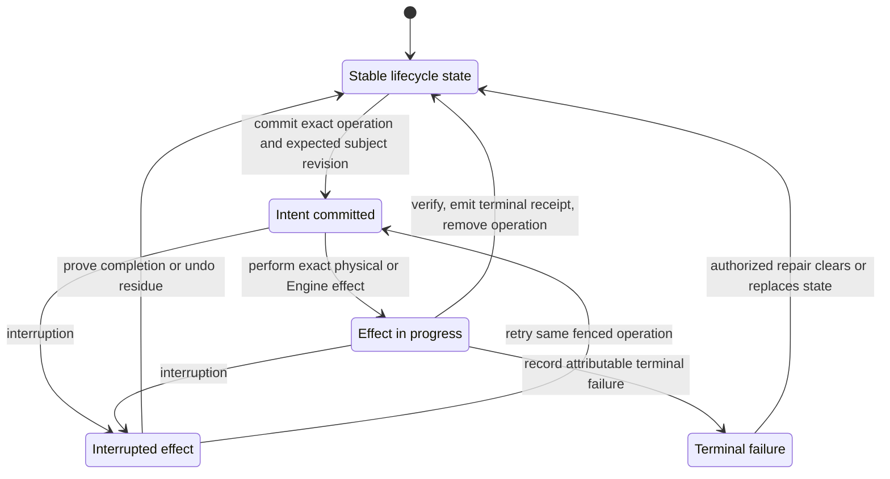

## Overall lifecycle

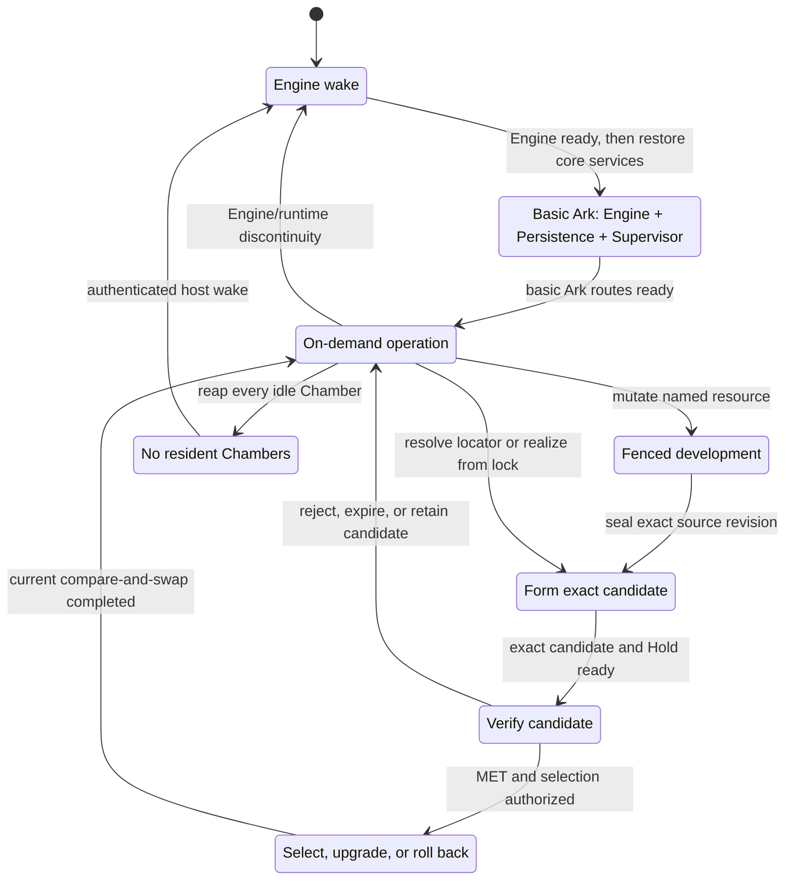

## First core installation

This sequence is the one-time genesis path for the critical Chamber set: Engine, Persistence, and
Supervisor. It does not discover a newest image. External acceptance supplies exact Realizations, complete
launch-ready closure, and a one-use genesis capability to a host that is independently proved unenrolled.

`entry = accepted host envelope + proved-unenrolled Core recovery store + accepted genesis bundle`

`exit = canonical first core selections + ready Engine + ready Persistence + ready Supervisor`

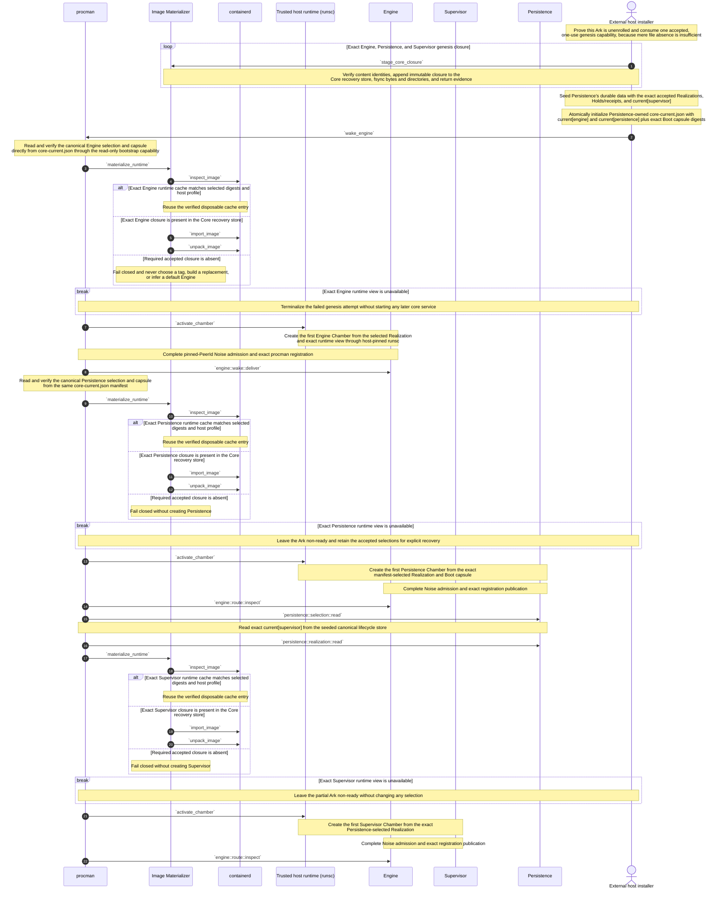

The external installer physically writes the first manifest because no Persistence Chamber exists yet, but
it does so only through the one-use genesis authority. Procman does not gain a manifest-write capability.
After genesis, only the currently selected Persistence service may commit a successor manifest; explicit
external recovery is a separately accepted lower-platform action.

The three accepted launch closures are staged before their selections become usable. The Core recovery store
and Persistence data are one backup and restore unit. Containerd may be empty at first activation and may be
wiped later; its tags and labels can accelerate lookup but cannot change any selected identity.

## Engine cold start

`entry = running procman + valid Persistence-owned core-current.json + exact selected Engine Boot capsule`

`exit = one ready Engine Chamber for admitted wake work`; no other current Realization must be resident.

`host activation != first-pair acceptance`; every initial selected Realization is already authorized by
its accepted bootstrap profile and external selection fence.

This cold Engine sequence begins at an already-running `procman`. Starting or replacing `procman` belongs
to an explicitly lower platform and remains outside this lifecycle. The first in-scope event is an
authenticated `wake_engine` call reaching that process.

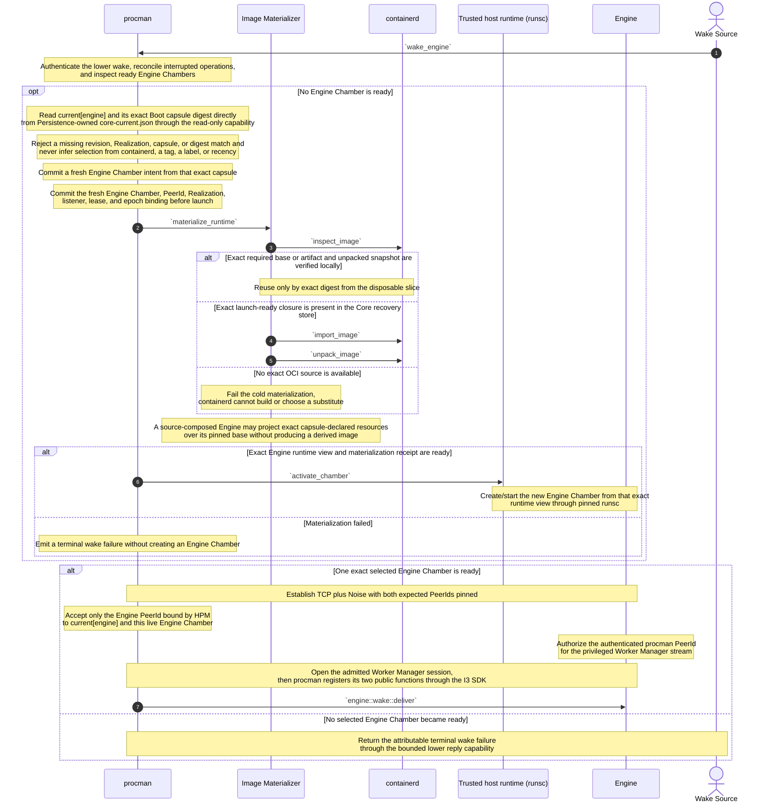

Physical Engine creation is therefore the single conditional step: an already-ready Engine skips it, while
a missing Engine takes the one `activate_chamber` branch only after exact materialization. Both successful
paths converge on the same mutually authenticated Noise session and HPM authorization. There is no second
same-key challenge-response ceremony.

The Persistence-owned Core boot manifest is the boot-selection authority. Procman reads the one canonical
`current[engine]` entry and immutable Boot capsule digest directly from `core-current.json`; it does not open
Persistence's general database or ask a stopped Persistence Chamber through I3. It also does not ask
containerd which image is latest, inspect a mutable tag as authority, or choose the newest cached object.
The Image Materializer may use a tag or label as a Materialization-index hint only after the resolved content
and runtime-profile digests match the selected capsule.

The Boot Seed is narrower: it is an externally accepted genesis or explicit-recovery input, not a second
Persistence service, mutable selector, or ordinary fallback. On first installation it stages exact closure
and initializes the manifest only after independent proof that the Ark is unenrolled. Once enrolled, a
missing, corrupt, or mismatched manifest or capsule fails closed; Procman never falls back automatically to
an older seed or compiled-in default. Selected Engine closure is retained in the Core recovery store, so an
empty containerd slice can be reconstructed without discovering, building, or substituting another image.

If admitted wake work needs another selected Runnable, the ready Engine invokes
`chambers::process::propose`; that target then follows the ordinary Chamber activation kernel.

No Chamber is architecturally required to run continuously. Policy may keep an Engine Chamber or other
working set warm, but `current` selection survives with zero Chambers. `procman` is not a Chamber; it is
the mechanism-only host wake boundary. If `procman` itself is stopped, an explicitly lower platform,
cloud control plane, or physical operator must wake it—this lifecycle does not hide that recursion.

The irreducible cold edge is `wake source -> procman -> selected Engine Realization`. A worker attached to a
running Engine or an authorized Supervisor Chamber may request ordinary Chamber activation, but it cannot
be the only mechanism that wakes the absent Engine containing it. `procman` may execute the exact
pre-authorized wake; it does not select a different Engine Realization or decide application policy.

First acceptance of the host envelope and Engine/Persistence bootstrap subjects remains the external
verification and genesis ceremony shown in **First core installation**. Engine cold start never forms a
Realization from a Covenant lock and never certifies its own seed, manifest, or capsule.

## Bootstrap core services

This is the bridge from a ready Engine to the smallest useful Ark service set. It makes the bootstrap
exception explicit instead of letting ordinary activation appear to assume Persistence from nowhere. The
Core boot manifest names the exact Persistence Realization, and the canonical Persistence store names the
exact Supervisor Realization; Procman executes those selections but does not choose replacements.

`entry = ready Engine + authenticated wake operation + valid core-current.json and Persistence Boot capsule`

`exit = ready Engine + ready Persistence + ready Supervisor`

The first Persistence Chamber cannot read its own Realization through an I3 Persistence route. `procman`
therefore reads `current[persistence]` and its exact Boot capsule directly from Persistence-owned
`core-current.json`, then uses the same Image Materializer and disposable containerd slice as every other
activation. A Boot Seed may have initialized that manifest only in **First core installation**; it does not
decide which Persistence Realization is current. Once Persistence is ready, the Supervisor follows the ordinary
durable-data path through Persistence. This exit is the basic Ark state assumed by ordinary Chamber
activation and fenced development.

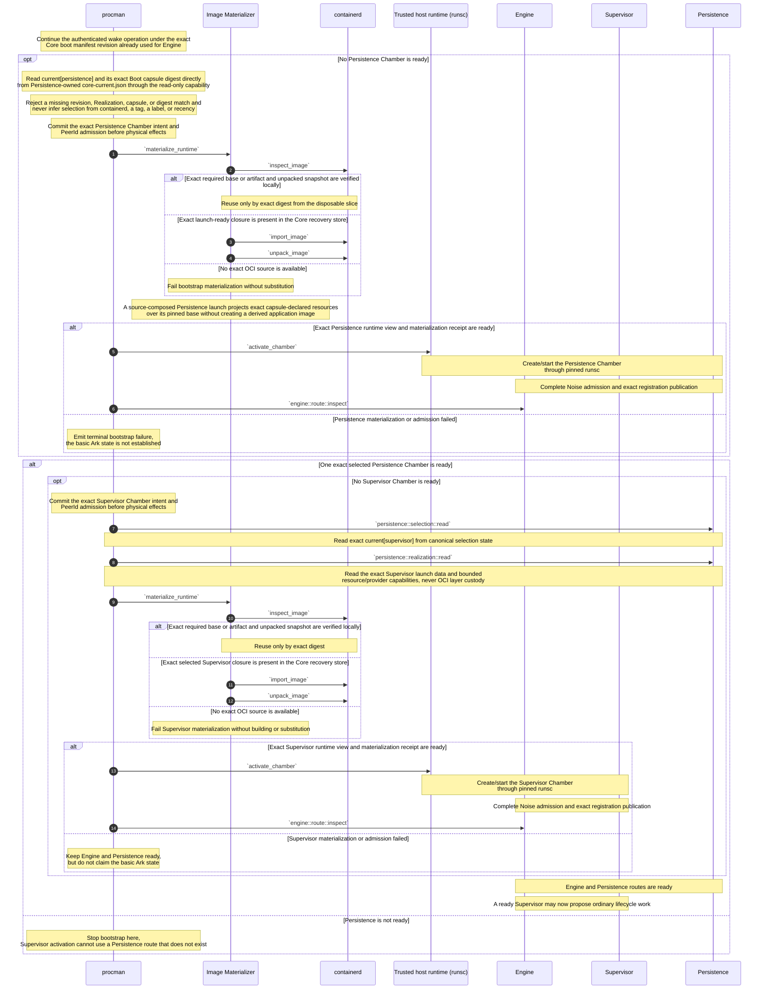

The Persistence-owned Core boot manifest closes the recurring circular dependency: it is a minimal stable
file that Procman can read directly while Engine and Persistence Chambers are absent. It is not a Procman
ledger and not a duplicate of another core current record. Persistence's ordinary selection API uses those
same canonical bytes. The Boot Seed closes only proved genesis or explicit external recovery. The Core
recovery store retains complete selected critical-service closure, so the disposable containerd slice may be
empty or deleted without losing either selection or the exact inputs required for cold bootstrap.

`containerd` never discovers, selects, or invokes Persistence. The Image Materializer receives exact capsule
data from Procman, and after Persistence is ready Procman obtains the ordinary Supervisor selection and
Realization through `persistence::selection::read` and `persistence::realization::read`. This avoids giving
either containerd or the host materializer a general I3 identity, resource-policy role, or selection authority.

The Core boot manifest and capsules are narrow: they can restore only the exact Engine and Persistence
selections committed by external initialization or `persistence::selection::commit`. They cannot resolve a
moving locator, build an image, select another Realization, or become a general application-policy path.

## Host reboot into selected core services

This sequence makes the selection-to-reboot edge explicit. The lower platform starts the accepted host
envelope—Procman, Image Materializer, containerd, runsc, and kernel—but those mechanisms do not select any
Chamber Realization. Procman reads one Core boot manifest revision and retains that read fence through Engine
and Persistence activation. After Persistence is ready, it reads the canonical Supervisor selection.

`entry = enrolled host + available or restored Persistence/Core-recovery backup set + running accepted host envelope`

`exit = ready basic Ark whose three critical Chamber run receipts match their canonical selected Realizations`

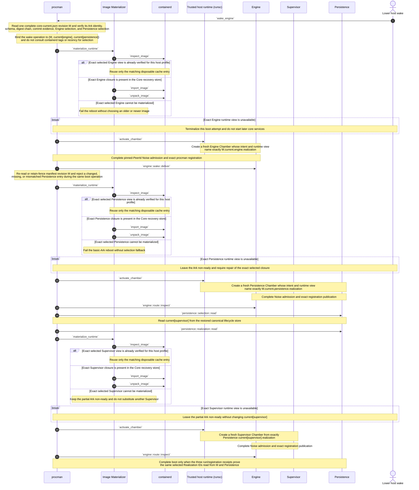

An Engine or Persistence upgrade becomes reboot authority only when
`persistence::selection::commit` has atomically installed the successor entry in `core-current.json`; a
Supervisor upgrade becomes reboot authority when that same function commits `current[supervisor]` in the
canonical Persistence store. Existing Chambers may continue running their prior Realizations until drained,
but every fresh activation snapshots the new selection. After a host reboot there are no old Chambers to
adopt, so the sequence above must create fresh Chambers for those exact successor Realizations.

This proof does not depend on containerd survival. A tag may say which exact cache object the materializer
last observed, but Procman first obtains the selected Realization from the canonical store and then verifies
the tag's resolved digest against it. A stale, missing, or malicious tag is therefore a cache miss or
integrity failure, never a rollback or upgrade decision.

## Ordinary Chamber activation kernel

This kernel creates one ordinary, non-Engine Chamber from one already complete Realization. It applies
equally to a current Realization, a candidate under a valid Hold, a fixture, or a retained rollback
target. There is no separate Activation object. Its prerequisites are explicit: the Engine and
Persistence are already ready. Cold Engine activation follows **Engine cold start**, and the first
Persistence activation uses **Bootstrap core services** because neither service can depend on a
Persistence I3 route that does not yet exist.

`entry = ready Engine + ready Persistence + exact realization + current revision or candidate Hold + registration contract + authorized Chamber lease`

`exit = ready fresh Chamber + run receipt, or no live Chamber + terminal failure receipt`

The diagram includes the outer Supervisor proposal so its first step is the reason for activation rather
than an unexplained persistence read. `procman` then commits the exact Chamber intent before any physical
effect.

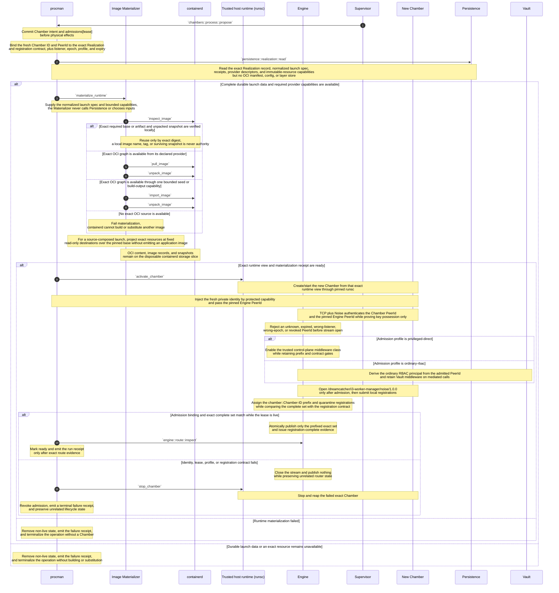

Persistence is the single Chamber-facing durable-data boundary. Provider adapters and N3/GraphFS or other
content-addressed resource stores sit behind it; they are not extra lifecycle actors in this diagram.
`persistence::realization::read` does not discover a version, inspect a mutable workspace, or build
anything. It returns the exact durable Realization data and bounded capabilities needed to compose the
runtime. Rebuildable OCI manifest, config, and layer bytes are deliberately excluded from ordinary
Persistence custody.

The Image Materializer is the only client that talks to `containerd`; `containerd` does not contact
Persistence or I3. For source-composed launch, `containerd` supplies only the pinned base image and its
snapshots while the Materializer projects exact resources into the runsc bundle. For artifact-backed launch,
`containerd` pulls or imports the exact image graph. Both forms use the same disposable containerd storage
slice and the same exact materialization receipt.

An OCI digest remains useful even when bytes are disposable: it prevents cache, provider, or build-output
substitution and lets a rebuild prove byte-for-byte convergence. It is not a retention requirement. If an
artifact-backed graph is gone, activation does not rebuild it in place. An authorized rebuild enters
**Form and activate a candidate**; the same digest can re-establish exact availability, while a different
digest is a different candidate. A source-composed Realization needs no derived application-image rebuild
and can be rematerialized from its durable launch data while its exact base OCI graph remains obtainable.

The Noise connection itself is never the admission result. A remote connection-gater close can propagate
after a dial appears to complete, so the fail-closed invariant is that an unauthorized PeerId cannot open
the Worker Manager protocol stream. The Engine checks the HPM projection both when the secure connection
identifies the remote PeerId and when that peer requests the protocol. A claimed Chamber ID in a worker
payload is never authority: from the authenticated PeerId, the server looks up the exact Chamber ID,
Realization, registration contract, lease, epoch, listener, and profile committed by HPM.

The private identity is fresh per physical Chamber lease, is never baked into an image or ordinary
environment variable, and is destroyed with the Chamber. Reconnects by the same live Chamber reuse that
lease identity; a replacement Chamber receives a fresh Chamber id and PeerId. An Engine replacement must
present a newly HPM-authorized pinned identity; existing Chambers remain fenced until `procman` supplies an
authorized listener update or replaces them. No peer may silently accept an arbitrary replacement key.

Privileged-direct is an explicit HPM admission profile for the Engine bootstrap and named trusted
control-plane subjects. It bypasses ordinary application RBAC middleware only; it does not bypass PeerId
admission, server-assigned prefixing, the immutable registration contract, complete-set validation, lease
revocation, or router publication gates. Ordinary Chambers receive the ordinary-RBAC profile.

This Chamber-to-Engine boundary is the intended reusable shape for a later upgrade of ordinary Ark-to-Ark
RBAC handshakes: secure-transport key possession followed by an explicit authorization contract. That
cross-Ark migration is deferred; existing Ark-to-Ark RBAC behavior is not changed by this sequence.

The kernel may fetch an exact pinned base or artifact and project exact resources already named by the
Realization. It may not resolve a moving locator, choose dependencies, execute a build from the Covenant
lock, or substitute another digest. Any attempt starting only from a Covenant lock enters **Form and
activate a candidate**. An artifact rebuild with a different digest is necessarily a different Realization;
a byte-identical result is still observed and admitted through the candidate path before it may satisfy
current selection.

The current revision or candidate Hold is captured when the Chamber intent commits. A concurrent
selection change never relabels that Chamber. The selected Realization may have no Chamber before or
after this kernel.

## Fenced development

`mutable object = named Persistence workspace`

`developer execution = one leased Chamber from an exact development Realization`

`immutable handoff = exact resource snapshot`

The Developer Chamber is ordinary execution state: it is activated from an exact development
Realization under a lease and addressed by exact Chamber identity. It terminates and is reaped. Any
immutable product it creates may enter a target lifecycle as a candidate, but the Developer Chamber
itself is never promoted.

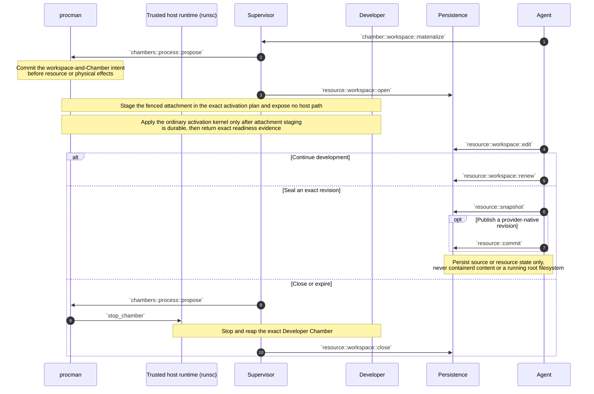

Workspace, snapshot, provider revision, Realization, and Chamber remain distinct identities. The
snapshot or provider revision becomes an input to a later lock; development never captures a running
root filesystem, containerd snapshot, or OCI cache. If that output is later proposed for a durable logical name, it enters
**Form and activate a candidate**,
forms an exact candidate Realization under a Hold, and may be selected only after verification. No
workspace or Chamber is renamed into the candidate or current Realization.

## Form and activate a candidate

`entry = authorized caller + durable logical name + locator or exact Covenant lock + candidate quota`

`exit = exact source-composed or artifact-backed candidate Realization + bounded Hold + optional ready Chamber`

Several candidates may coexist for one logical name. This mode never changes `current`; it forms one exact
normalized launch spec, establishes bounded durable launch-data custody, and optionally creates a Chamber
for inspection. The Hold does not make disposable OCI bytes durable.

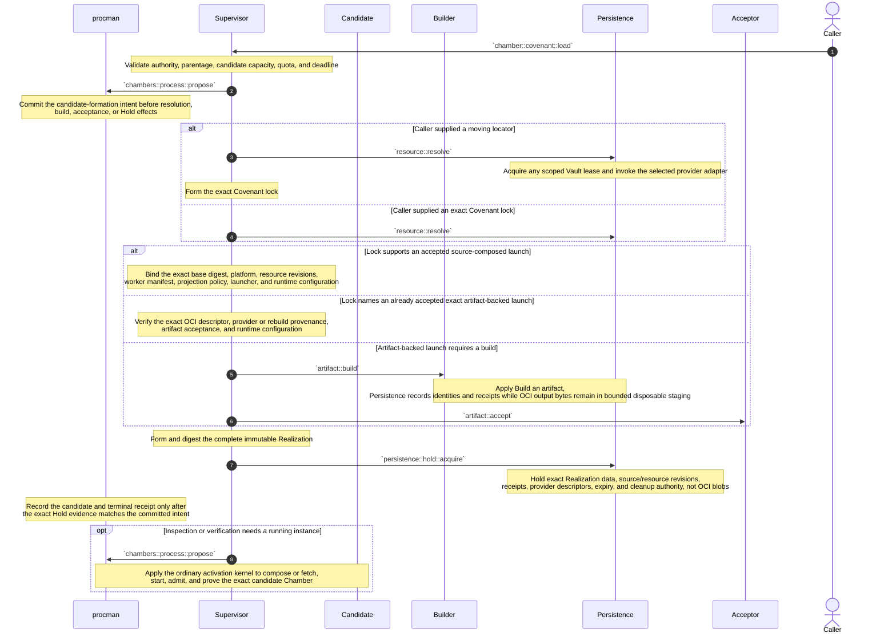

A moving locator is resolved only while forming the lock. Re-resolving `main` later may produce another
lock and another candidate; it never mutates `current`. Candidate admission deduplicates the same
Realization identity rather than inventing another proposal record.

Source-composed launch is the preferred form for ordinary workers whose exact source and runtime base can
be identified and obtained cheaply: eviction of containerd state requires exact base retrieval plus
resource projection, not an application-image
rebuild. Artifact-backed launch remains available for distributable images, opaque third-party images, or
workloads whose accepted build output itself matters. Persistence retains the exact digest, build and
acceptance evidence, provider/rebuild policy, and durable inputs—not a second local copy of the OCI graph.

Builds are not assumed reproducible. If a disposable artifact output is lost, an authorized rebuild follows
this candidate path. A byte-identical rebuild can satisfy the old OCI descriptor after evidence and custody
checks; a different digest is a different candidate and cannot silently replace `current`. Rejection,
missing Builder support, unavailable provider bytes, or incomplete durable inputs fails closed without
changing current selection.

## Build an artifact

`entry = accepted Covenant lock + exact build request`

`output = exact OCI descriptor + Build receipt + bounded disposable output capability`

Build is an optional capability. A Covenant without `build` must name a launch composition that is already
usable: normally a pinned base plus exact source/resource projection, or an accepted artifact-backed OCI
descriptor. `containerd` does not build images.

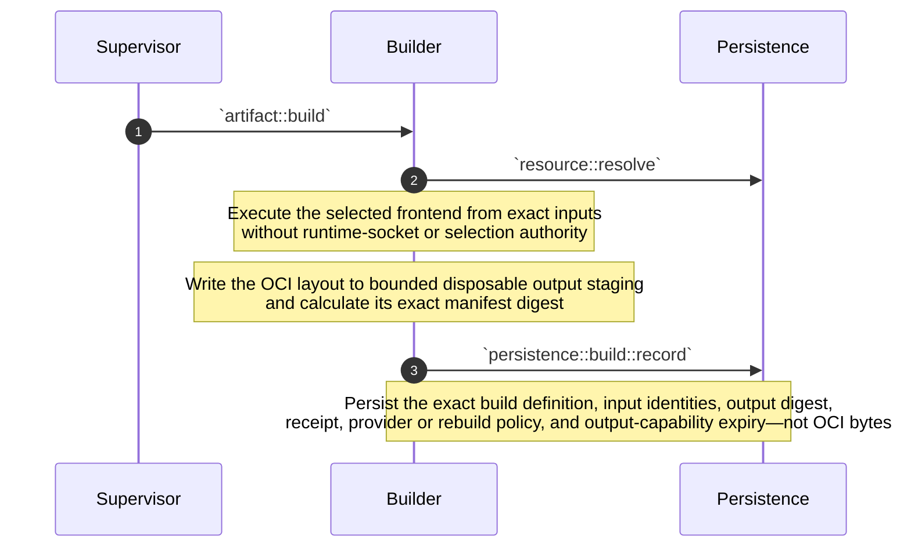

The Builder produces OCI manifest, config, and layers in a bounded disposable staging area. Persistence
records the durable facts needed to understand, verify, locate, or rebuild that result, but it does not copy
the OCI graph into essential Ark storage. If the artifact is immediately activated, the host Image
Materializer may import the one-use output capability into containerd's disposable content store. If it must
be distributed or retained independently, an explicit external OCI provider may receive it and Persistence
retains only the exact digest and provider descriptor.

`containerd` is intentionally absent from the build sequence because it is an image/content/snapshot
manager, not a build system, and Builders do not receive its socket. BuildKit or another selected frontend
may be an implementation detail of the Builder. Any handoff into containerd occurs later through the Image
Materializer under a committed activation operation.

If disposable output disappears before import or provider publication, no durable Ark data is lost. An
authorized rebuild enters candidate formation. Matching the recorded digest proves byte-for-byte recovery;
a different digest is a different candidate. This is why an exact OCI hash remains valuable even though
local OCI bytes are disposable: the hash prevents substitution and proves convergence, while the retention
policy controls whether the bytes are kept anywhere.

The first Builder version may be a minimal OCI-layout producer selected through the same accepted
Realization path. Later BuildKit, Nix, Kaniko, or confidential multi-Ark builders remain replaceable Covenant
implementations. A Builder returns evidence; it never selects `current`.

## Verify a candidate

`verdict subject = exact candidate Realization + exact Chamber + exact plan + environment`

`verdict != selection`

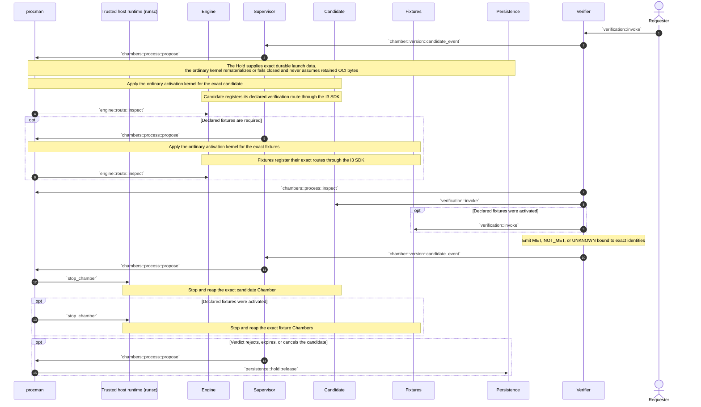

A MET verdict permits a later selection request while its Hold remains valid; it does not require the
verification Chamber to remain alive. Further verification attempts create further Chambers of the same
candidate Realization and produce independently scoped evidence.

A source-composed candidate can be recreated after containerd eviction from its exact durable launch data
while its exact base OCI graph remains obtainable.
An artifact-backed candidate still needs its exact OCI graph from disposable staging, containerd, or a
declared provider. If none is available, verification is UNKNOWN or fails; the verifier does not rebuild or
substitute an image inside this sequence.

The first Tester is judged by the external bootstrap verifier. Once separately selected, the current
Tester Realization normally supplies an on-demand Tester Chamber for other Covenants. Tester never
writes current selection.

## Select, upgrade, or roll back

`selection authority = gate-appropriate fenced promoter`

`selection effect = one Persistence-owned compare-and-swap of current[name] + atomic Core boot manifest replacement when Engine or Persistence + derived Engine factory revision`

`entry = exact candidate Realization + valid Hold + fresh gate evidence + expected current revision`

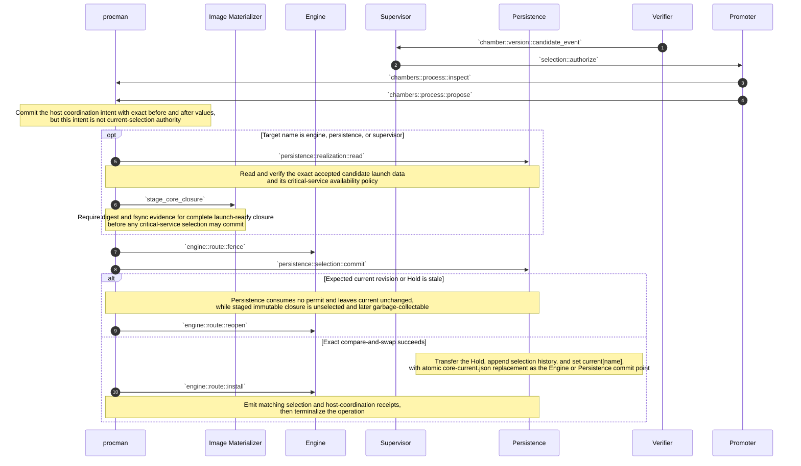

Selection never moves, adopts, or renames a Chamber. A Chamber that supplied verification evidence may
already be gone. Chambers of the prior current Realization remain pinned to it until their independent
leases complete, cancel, expire, or are explicitly drained. Only calls admitted after the new current
revision activate the newly selected Realization.

For `engine` and `persistence`, the selection commit point is Persistence's atomic replacement of
`core-current.json` with the next current revision and exact Boot capsule digest. There is no second
Procman-owned current record to update and therefore no cross-writer reconciliation window. The currently
running Persistence Chamber performs that commit before it can be replaced; when Persistence is absent,
ordinary selection is unavailable and Procman may only reboot the already committed current. First core
acceptance uses the one-time external path in **First core installation** because no Persistence route exists.

For the critical service set—Engine, Persistence, and Supervisor—the Image Materializer stages complete
launch-ready closure in the Core recovery store before Persistence commits selection. Those append-only,
content-addressed writes cannot change current. Persistence alone writes selection, Procman alone writes its
host execution journal, and containerd alone writes its disposable cache. The namespaces and authorities do
not contend.

`current` is defined only by the authoritative selection record. It is never inferred from newest
creation, latest health, fleet majority, a ready Chamber, or route-cache contents. A failure to activate
the selected Realization fails that execution; it does not silently select another one.

Engine, Persistence, and Supervisor replacement all use this sequence. Selecting a successor is the durable
upgrade; it does not relabel an already running Chamber. A new Engine Chamber reads its successor from the
Core boot manifest, a new Persistence Chamber reads its successor from that same manifest, and a new
Supervisor Chamber reads its successor through Persistence after Persistence is ready. **Host reboot into
selected core services** proves the three fresh Chambers match those committed successor identities.

Rollback uses this same selection operation with a retained accepted Realization as target. Selection
history can identify a prior target but cannot make it materializable. A critical-service rollback stages
and verifies complete closure in the Core recovery store before commit. An ordinary source-composed target
needs its complete durable launch closure and providers; an ordinary artifact-backed target needs its exact
OCI graph from a declared provider or still-live disposable cache/output capability. Without those
conditions, a valid Hold, required evidence, and authorization, rollback fails closed.

## Quiesce and wake

`quiescence preserves current selections, candidate Holds, receipts, and durable resources—not Chambers`

`wake = Engine cold start`

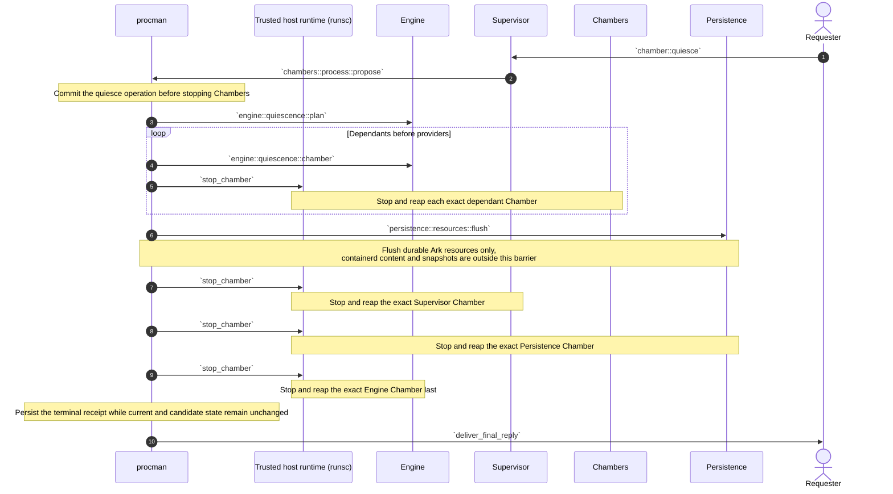

`persistence::resources::flush` is the only Persistence durability barrier in this sequence. It covers
the exact resource set named by the committed stop operation and returns operation-bound receipts; it
is not an unscoped service drain. Every other Persistence operation must already complete at the
durability boundary promised by its own contract. Once the exact resource receipts are durable and no
Persistence invocation remains active or queued, `procman` may stop the Persistence Chamber directly;
there is no additional generic Persistence flush.

The same rule supports ordinary idle reaping without a global quiesce: `procman` may stop any independently
idle Chamber whose lease and work state permit it. Reaping the final Engine Chamber leaves `procman` waiting
on its authenticated wake edge; the next event follows **Engine cold start**. If policy also stops `procman`, the reply and
wake obligation must first transfer to an explicitly lower layer.

A hard deadline may discard unflushed Chamber-local state. It creates no alternate artifact,
Realization, or process-memory identity and never changes `current` merely because a Chamber stopped.
The containerd slice requires no lifecycle flush: policy may retain it as a warm cache or discard it before,
during, or after quiescence without changing selected or candidate state.

## Attested multi-Ark builds (later)

Status: **Later extension; not required by the first Builder contract.**

The baseline single-Builder contract above remains the compatibility floor. This stronger policy is useful
only when independent builders and fresh confidential-computing evidence add enough value to justify the
extra cost.

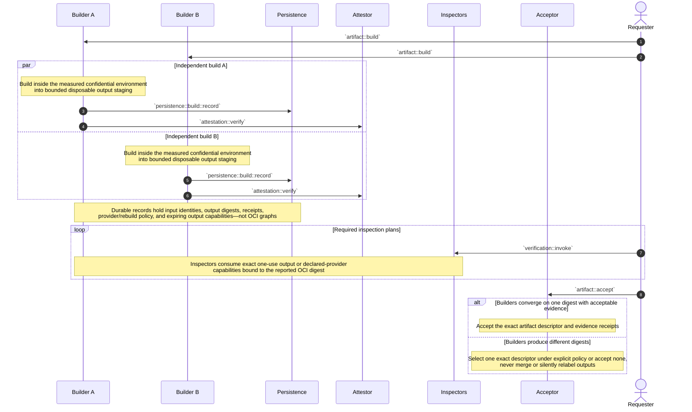

Attestation binds a statement about one Builder realization, request, input closure, output digest, and
fresh environment evidence. It does not prove truth, reproducibility, or acceptability. Inspectors and the
Acceptor remain separate replaceable policy roles.

Multi-Ark agreement still creates no Ark-local durability obligation for OCI bytes. Each output may remain
in bounded disposable builder staging, be imported into a host's disposable containerd slice, or be pushed
to an explicit external OCI provider. Persistence records identities, evidence, and locators. If every byte
source disappears, rebuilding is candidate work and a different digest is a different artifact.

## Failure and recovery formulas

- `operation remains non-terminal after interruption -> reconcile that exact operation before conflicting work`.
- `current[name] = R + zero Chambers -> valid idle state`; do nothing until demand or explicit prewarm policy.
- `admitted call snapshots current revision S and Realization R -> its Chamber remains pinned to (S, R)` even if
  selection changes before physical start completes.
- `ready Chamber fails -> terminalize its exact lease and receipt`; retry, if authorized, creates a fresh
  Chamber of the same Realization without changing current.
- `Chamber lease expires or work terminates -> stop and reap that Chamber`; sibling Chambers and current are unchanged.
- `Engine Chamber absent + authenticated wake -> procman activates exact current[engine] through Engine cold start`.
- `host restart -> procman reads one exact Persistence-owned core-current.json revision through its read-only
  capability`; the Engine and Persistence entries each bind one current revision, Realization, and Boot
  capsule before materialization.
- `enrolled host + Core boot manifest or capsule missing, corrupt, or mismatched -> cold activation fails
  closed`; never inspect a mutable OCI tag, choose the newest containerd record, infer a default, or silently
  fall back to an older Boot Seed.
- `proved-unenrolled host + accepted one-use genesis capability -> external installer may create the first
  manifest`; Procman never converts mere absence into write authority.
- `containerd tag resolves to exact selected digest and runtime profile -> permitted cache hit`; stale,
  missing, or different tag -> cache miss or integrity failure, never a selection change.
- `candidate Hold expires -> reap its candidate Chambers + remove candidates[name][R] + emit cleanup receipt`,
  unless another current, candidate, or operation reference still retains the exact durable launch data.
- `source-composed runtime cache unavailable -> rematerialize from exact durable launch data while its
  exact base OCI graph remains obtainable; otherwise activation fails`.
- `artifact-backed exact OCI graph unavailable from cache, output capability, or provider -> activation fails`;
  do not build from the lock inside the activation kernel.
- `build starts from a Covenant lock -> output enters candidate formation`, never directly as current.
- `lock-only rebuild reproduces the exact recorded OCI digest -> verify the candidate + perform fenced
  idempotent selection/custody confirmation before treating that output as available to current`.
- `lock-only rebuild produces a different artifact or Realization digest -> distinct candidate`; only the fenced selection sequence may select it.
- `provider credential unavailable -> resolution or build fails closed`; current is unchanged.
- `Engine route cache disagrees with current selection or authoritative Chamber state -> lifecycle state wins`;
  fence affected admission and rebuild the cache.
- `Noise authenticates a PeerId not present in a live admissions[lease], or the Engine pin is wrong -> no
  Worker Manager protocol stream`; publish no registration and leave the router unchanged.
- `admitted PeerId claims another Chamber or submits a non-exact registration set -> close the stream +
  revoke or fail the activation`; the quarantined set never becomes routable.
- `admission expires or is revoked -> reject new Worker Manager streams + close live registration authority`;
  a replacement Chamber requires a fresh Chamber id, lease, epoch, and PeerId.
- `physical id survives but cannot be proved -> reap it and create a fresh Chamber`.
- `verifier unavailable or verdict UNKNOWN -> no selection`.
- `stale current revision, Hold, lease, operation subject, or selection permit -> reject before effect`.
- `cleanup names exact Chamber ids and candidate Holds`; unrelated candidates and sibling Chambers are unaffected.
- `history preserves receipts and launch identities, not ordinary materialization availability`; a selected
  critical-service rollback additionally requires complete staged Core recovery closure before commit.
- `procman unavailable -> only an explicitly lower platform may wake or replace it`; no Chamber can bootstrap its own absent procman.

## Implementation handoff

### Initial lifecycle

- external provider-specific Covenant locators with optional logical credential names;
- location-independent Covenants with top-level `hardware`, `image`, optional `build`, flat
  `mounts`, and plural `workers`;
- exact Covenant locks and content-addressed, immediately materializable Realization manifests with
  source-composed and artifact-backed launch modes;
- Persistence-owned `current[name] = {revision, realization}` as the only stable named selection;
- Persistence-owned `core-current.json` as the canonical host-readable representation of
  `current[engine]` and `current[persistence]`, with exact Boot capsule digests and atomic
  write-fsync-rename-directory-fsync commit;
- one read-only Procman bootstrap capability to that stable manifest schema, with no Procman-owned parallel
  selection store and no direct dependency on Persistence's general database schema;
- `candidates[name][realization] = Hold reference` with several bounded candidates permitted;
- `chambers[id] = {name, realization, lease, phase}` with independent operations and cleanup;
- no separate Activation record and no Chamber-bearing `last/current/next` slots;
- a `procman`-owned Engine wake edge plus Engine-native activation factories for ordinary selected names;
- an explicit first-core install in which a lower installer proves an unenrolled Ark, stages exact Engine,
  Persistence, and Supervisor closure, seeds Persistence data, and consumes one accepted genesis capability;
- an explicit host-reboot sequence proving fresh Engine and Persistence Chambers equal the Realizations in
  one manifest revision and the fresh Supervisor equals the canonical Persistence selection;
- a host-envelope Image Materializer as the sole holder of the `containerd` socket, exact-digest
  inspect/pull/import/unpack branches, no direct Persistence/I3 access, and all `containerd` content,
  image, labels/tags, and snapshot state on a dedicated disposable host slice;
- a bounded Core recovery store in the Persistence backup/restore set, with append-only materializer staging
  separated from Persistence-only manifest selection writes;
- Persistence as the durable current-selection, candidate/Hold, Realization, source/resource, receipt,
  provider-descriptor, and Core boot-manifest service, with rebuildable OCI graphs excluded from ordinary
  lifecycle custody;
- explicit `procman -> trusted host runtime` conventional calls for exact Chamber create/start and stop/reap
  effects, with the Chamber represented as the subject rather than a receiver that could exist before start;
- exact-Chamber routes for execution, verification, and cleanup;
- a `procman`-owned durable lease admission binding from fresh Chamber PeerId to exact Chamber,
  Realization, registration contract, Engine listener, epoch, profile, and expiry;
- a Noise-authenticated Worker Manager protocol whose stream gate precedes registration, with
  server-assigned `chamber::<Chamber id>` prefixes and atomic complete-set publication;
- no redundant application identity challenge after Noise; expected PeerId pinning plus HPM admission and
  registration evidence establish the Engine/Chamber meaning and readiness needed by lifecycle calls;
- explicit privileged-direct and ordinary-RBAC admission profiles, both preserving lifecycle and
  registration-contract enforcement;
- fresh zero-to-many Chambers per Realization, with current remaining valid at zero residency;
- activation only from a complete exact Realization, never from a Covenant lock alone, with source
  projection or exact OCI retrieval permitted but no in-kernel build or substitution;
- lock-only realization, rebuild, and development outputs entering the candidate path before selection;
- minimal run, selection, and cleanup receipts that reference prior identities and evidence rather than
  copying their fields;
- idle Chamber reaping that does not mutate current or candidate state.

### Deliberately later

- provider-neutral build execution and basic exact-output build receipts;
- multi-Ark confidential Builder attestations, independent inspection, and collective acceptance;
- shared reusable Chamber pools, prewarm controllers, and service traffic balancing;
- lower-platform automation that also stops and wakes `procman`;
- independently accepted host-envelope replacement for Procman, Image Materializer, containerd, runsc, and
  kernel revisions; no Chamber can upgrade the irreducible helper that would be required to start it;
- hot dual-Engine migration;
- process-memory or rootfs checkpoint recovery.
- migration of ordinary Ark-to-Ark RBAC handshakes to the reusable Noise-plus-authorization-contract
  boundary established here.

### Required downstream reconciliation to this sequence authority

- cross-stack architecture vocabulary and narrative;
- Covenant owner schema and Gherkin (`source`, singular `worker`, and `worker.resources` are old);
- Chambers owner process-tree, routing, image-construction, activation, verification, and upgrade
  Gherkin;
- Chambers' legacy HMAC Engine-attestation companion, manifests, and startup contract, which must migrate
  to the Noise-authenticated and HPM-authorized Worker Manager boundary rather than coexist with it;
- I3 Engine router/first-host-worker contract, including pinned Engine and `procman` PeerIds;
- Persistence naming, Realization/build-record/Hold/resource contracts, provider adapters, and Vault
  credential-need contracts;
- Persistence-owned selection APIs, canonical Core boot-manifest schema, atomic file publication,
  Core-recovery backup/restore, one-use genesis/recovery tooling, and read-only Procman bootstrap capability;
- host-envelope Image Materializer staging, content verification, disposable Materialization index, and
  exact-cache invalidation contracts;
- generated traceability after its authoritative inputs change.
