# Chambers lifecycle sequence reference

Status: **Current working architecture authority; downstream reconciliation pending**

Architecture classification: `architecture_delta_required`

Design-lineage baseline: `b3fdfb17a9130394b66311fe9e120797a2768273`

This document is the current Chambers lifecycle architecture authority. It owns the working design
for lifecycle identity, state, sequencing, authority boundaries, custody, routing, verification,
selection, quiescence, and recovery until it is explicitly superseded. The broader
[`ark-agent-architecture.md`](ark-agent-architecture.md), owning Gherkin, schemas, implementation,
and generated projections are downstream reconciliation targets and may temporarily lag this design.
This status establishes design authority; it does not claim implementation or runtime acceptance.

## Contents

- [Lifecycle axioms](#lifecycle-axioms)
- [Engine function table](#engine-function-table)
- [Authoring and state shapes](#authoring-and-state-shapes)
- [Ordinary Chamber activation kernel](#ordinary-chamber-activation-kernel)
- [Overall lifecycle](#overall-lifecycle)
- [Mode 1 - Host activation](#mode-1---host-activation)
- [Mode 2 - Form and activate a candidate](#mode-2---form-and-activate-a-candidate)
- [Mode 3 - Fenced development](#mode-3---fenced-development)
- [Mode 4 - Build an artifact](#mode-4---build-an-artifact)
- [Later mode - Attested multi-Ark builds](#later-mode---attested-multi-ark-builds)
- [Mode 5 - Verify a candidate](#mode-5---verify-a-candidate)
- [Mode 6 - Select or roll back](#mode-6---select-or-roll-back)
- [Mode 7 - Quiesce and wake](#mode-7---quiesce-and-wake)
- [Failure and recovery formulas](#failure-and-recovery-formulas)
- [Implementation handoff](#implementation-handoff)

## Lifecycle axioms

### Identity

- `Covenant locator = provider coordinates + optional logical credential need`.
- `provider = access, authority, and location family`.
- `kind = logical content form`.
- `immutable identity = provider-native commit, tree, digest, CID, or snapshot`.
- `credential = named Vault need`; it is never a secret value, token, or leased credential.
- `Covenant = location-independent promise`; it does not name the repository containing itself.
- `Covenant lock = exact transitive closure of Covenant bytes, provider-native revisions, image/build inputs, mounts, workers, hardware, and launch policy`.
- `Covenant lock != Realization`; a lock alone is never authority to launch `current`.
- `Realization = Covenant lock + exact boot artifact + artifact acceptance + launch plan`.
- `realization id = digest(realization manifest body)`.
- `registration contract = digest(canonical declared worker and export set for one exact Realization)`.
- `libp2p PeerId = proof-of-possession transport identity`; it is neither Chamber identity nor authority.
- `Realization = immediately launchable from exact identity`; launch performs no identity-forming resolution,
  dependency choice, build, mutable-tag lookup, or artifact substitution.
- `Build receipt = build request id + Builder realization id + output artifact id + evidence root`.
- `Inspection receipt = artifact id + plan id + evidence root + verdict`.
- `Acceptance receipt = artifact id + evidence receipt ids + policy id + decision`.
- `Run receipt = realization id + Chamber id + host evidence + runtime-spec id + outcome`.
- `latest = resolution policy`; it is never runtime identity.

### Cardinality

- `one Chamber -> one runnable Covenant realization`.
- `one runnable Covenant realization -> zero or many concurrent Chambers`.
- `one durable named Runnable lifecycle -> zero or one current realization + zero or many candidate realizations`.
- `one Chamber -> one lease + one independent failure and cleanup fate`.
- `one runnable Covenant -> one or more workers inside that Chamber`.
- `Assembly Covenant -> process-tree subtree`; the Assembly itself has no Chamber.
- `Contract Covenant -> promise only`; it has no Chamber.

### Runtime

- `Realization = immutable + transportable`.
- `Chamber = one ephemeral host-local activation of one exact realization`.
- `Activation` is not a separate lifecycle identity or record; `activate` is the operation that creates a Chamber.
- `containerd/runsc state = disposable cache`.
- `current realization may have zero live Chambers`.
- `activate(realization, lease) = committed Chamber intent -> fresh Chamber id -> readiness or terminal failure`.
- `restart = same realization + fresh Chamber id`.
- `activate current(name) = snapshot current revision + exact realization -> fresh Chamber + run receipt`.
- `activate candidate(name, realization) = valid Hold + exact realization -> fresh Chamber + run receipt`.
- `same lock + different non-repeatable build output = different realization`.
- `missing exact artifact = exact realization cannot start`.
- `realize from Covenant lock = candidate formation`; it never recreates or silently replaces `current`.

### State

- `durable named process tree = Assembly-expanded logical names + revisioned current selections`.
- `current[name] = {revision, realization}`.
- `candidates[name][realization id] = Hold reference`; candidate state adds no duplicate realization fields.
- `chambers[Chamber id] = {name, realization, lease, phase}`.
- `admissions[lease] = {peer id, Chamber id, realization, registration contract, listener,
  connection epoch, profile, expiry, state}`; it is the durable `procman` authority behind the
  Engine's disposable PeerId admission index.
- `phase = intended | starting | ready | stopping`; terminal Chambers leave immutable receipts, not live state.
- `operations[operation id] = durable intent until matching terminal receipt`; unrelated Chamber starts do not
  share one inline per-name operation lock.
- `last(name) = prior realization in the latest completed selection receipt`.
- `next(name) = exact candidate named by an open fenced selection operation, otherwise null`.
- `new exact development or build output -> candidate`; several candidates may coexist.
- `Realization` is the sole public immutable executable lifecycle identity; there is no parallel
  `Generation` noun or record.
- `selection receipt = completed compare-and-swap from expected current (possibly null) to one exact realization`.

`current`, `last`, and `next` are readable projections over selection, candidate Holds, and history;
they are not three Chamber-bearing slots. A Hold is one exact reference to bounded candidate custody;
its owner, expiry, and cleanup authority remain transitively bound by that referenced receipt rather
than repeated in candidate state.

### Routing

- `route(name) = activation factory for current[name]`; it is not a Chamber selector.
- `route(Chamber id) = exact ready Chamber` for admitted execution and inspection.
- Candidate and fixture calls use exact realization and Chamber selectors; they never acquire the stable
  current route before selection.
- `exports(function) = worker endpoint inside the addressed Chamber`.
- An exact-Chamber export is unavailable until libp2p Noise has authenticated both pinned peers,
  the HPM admission permits the Worker Manager stream, the Engine has assigned `chamber::<Chamber id>`,
  and the complete registration contract has matched.
- Engine routing is built in; a physical route cache is never authority.
- `procman` supplies current revisions and exact Chamber observations to Engine routing;
  it does not maintain a second writable current or route authority.

### Transition

- `operation intent -> physical/Engine effect -> evidence -> operation receipt`.
- Intent is durable before effect; completion follows evidence.
- `selection = compare-and-swap current[name] from expected revision to exact candidate realization`.
- `promotion selects a realization, never a Chamber`.
- `selection affects future Chambers`; existing Chambers remain pinned until completion, cancellation, or
  explicit drain.
- `rollback = the same fenced selection operation targeting a retained accepted realization`.
- Reaping a Chamber never changes current selection or candidate custody.

### Authority

- Supervisor proposes logical change and ordinary Chamber activation.
- `procman` owns current/candidate/Chamber state mutation and physical Chamber creation/reaping.
- Supervisor resolves the Covenant/Realization worker exports into an immutable, content-addressed
  registration contract; `procman` binds that contract to the physical launch admission.
- `procman` mints each non-Engine Chamber's fresh lease-scoped libp2p identity, commits only its
  public PeerId binding, and supplies private key material through a protected runtime capability.
- `procman` materializes Chambers from accepted exact artifacts; it is not an image builder.
- Engine owns typed transport, registration, derived routing, and the ordinary activation-factory surface.
- Engine owns the Noise listener, PeerId connection gate, Worker Manager stream gate, server-assigned
  Chamber prefix, complete-set registration quarantine, and atomic publication into its built-in router.
- Vault owns live ordinary-RBAC authorization after Noise authentication; Noise key possession does not
  grant Chamber status, direct authority, function registration, or router mutation.
- `procman` owns the irreducible Engine wake edge; it may activate only the exact selected
  Engine realization and does not choose application policy.
- Filesystem/provider adapters own exact resource custody and transfer.
- Tester or the gate-appropriate verifier judges an exact candidate realization and Chamber.
- A distinct fenced promoter authorizes current selection.
- No Chamber receives the runtime socket or raw host path.

## Engine function table

Every arrow in a `sequenceDiagram` below is an invocation labelled with exactly one function name.
Function completion and results are implied by the invocation and are not drawn as separate arrows.
Arguments, results, and local state changes remain in the surrounding text or Mermaid notes rather than
inside arrow labels. I3 SDK registration, libp2p Noise negotiation, stream admission, and router
publication are notes because they are protocol or local Engine transitions rather than I3 function
invocations.

Names containing `::` are I3 function IDs. The snake-case `procman` rows marked **external conventional
call (not I3)** are ordinary code calls made outside the Engine through the trusted host boundary. They
are listed explicitly because no Engine can route the cold wake or physical process effect that they
represent. Owner repositories define payload schemas, but those schemas must preserve the authority
boundaries in this document. Every call remains capability-scoped and fail closed.

### Participant order

Participant lanes are declared in architectural order, not in first-call order. A right-to-left arrow is
therefore legitimate and clearer than moving foundational actors between diagrams merely to make every
message point right. Apply these strata consistently from left to right:

1. `procman`, whenever present, is the leftmost lane because it is the irreducible host lifecycle authority;
2. the trusted host runtime follows `procman` whenever a physical create, start, stop, or reap effect appears;
3. the I3 Engine and then the authorized Supervisor/control plane;
4. addressed workload Chambers and workers;
5. Filesystem, Vault, custody, and other resource providers;
6. independent verifiers, promoters, and other assurance gates; and
7. external callers, requesters, or wake sources at the right edge.

Diagrams that omit a stratum preserve the relative order of the strata that remain. Every
`activate_chamber` or `stop_chamber` arrow targets the trusted host runtime, never the absent or running
Chamber that is the subject of the effect; a note names that exact subject.

### procman

| Function | Invocation path | Brief contract |
| --- | --- | --- |
| `chambers::process::propose` | I3 | The sole public `procman` mutation surface. Submit one exact typed and fenced lifecycle operation; `procman` commits intent before changing current, candidates, Chambers, attachments, admission, or quiescence state. |
| `chambers::process::inspect` | I3 | Return a capability-scoped read-only view of current selections, candidate Holds, Chambers, lease admissions, open operations, and receipt references. It cannot mutate state or establish a second route authority. |
| `wake_engine` | **External conventional call (not I3)** | An authenticated lower wake source submits one bounded wake and reply capability directly to `procman` while the Engine may be absent. |
| `deliver_final_reply` | **External conventional call (not I3)** | `procman` uses the handed-off lower reply capability after the required terminal receipt is durable; no stopped Engine is involved. |

The cold wake edge is deliberately outside I3: when no Engine Chamber exists, I3 routing is also absent.
After exact Engine readiness, `procman` registers `chambers::process::propose` and
`chambers::process::inspect` with the Engine.

### Trusted host runtime

| Function | Invocation path | Brief contract |
| --- | --- | --- |
| `activate_chamber` | **External conventional call (not I3)** | `procman` calls the trusted host runtime directly to materialize and start one exact Chamber through pinned runsc after durable intent. The Chamber is the subject created by the call, not its receiver. |
| `stop_chamber` | **External conventional call (not I3)** | `procman` calls the trusted host runtime directly to stop and reap one exact Chamber after durable stop intent. The Chamber is the subject reaped by the call, not its receiver. |

### I3 Engine

| Function | Invocation path | Brief contract |
| --- | --- | --- |
| `engine::identity::attest` | I3 | Prove the exact selected Engine Chamber, Realization, listener, lease, and fresh challenge before `procman` trusts the connection. |
| `engine::route::inspect` | I3 | Return operation-bound registration and readiness evidence for one exact non-Engine Chamber. |
| `engine::route::fence` | I3 | Fence new factory admissions for one logical name at the expected current revision. |
| `engine::route::install` | I3 | Install the derived activation factory for one newly selected revision and Realization. |
| `engine::route::reopen` | I3 | Reopen a fenced factory at the unchanged authoritative revision after a failed selection. |
| `engine::wake::deliver` | I3 | Deliver one already authenticated wake event and its bounded reply capability to the exact attested Engine Chamber. |
| `engine::quiescence::plan` | I3 | Close admission and return the dependency-ordered exact Chamber stop plan. |
| `engine::quiescence::chamber` | I3 | Drive one exact Chamber to terminal quiescence evidence under the committed host stop plan. |

### Filesystem Service

| Function | Invocation path | Brief contract |
| --- | --- | --- |
| `resource::resolve` | I3 | Resolve a permitted locator once, or fetch an exact selector, and return verified immutable descriptors or bounded transfer capabilities. |
| `filesystem::object::read` | I3 | Read an exact content-addressed lifecycle object through capability-gated Filesystem custody. |
| `filesystem::hold::acquire` | I3 | Acquire one bounded Hold over exact candidate Realization custody. |
| `filesystem::hold::transfer` | I3 | Transfer one exact candidate Hold into selected-current custody under the fenced selection operation. |
| `filesystem::hold::release` | I3 | Release one exact candidate Hold after authorized rejection, expiry, cancellation, or cleanup. |
| `resource::workspace::open` | I3 | Open one writer-fenced mutable workspace from an exact base and return its scoped attachment capability. |
| `resource::workspace::edit` | I3 | Apply an authorized mutation through the workspace fence without exposing a raw host path. |
| `resource::workspace::renew` | I3 | Renew the same workspace fence and lease for the same owner and cleanup duty; it cannot change lineage. |
| `resource::workspace::close` | I3 | Terminalize one exact workspace fence and reap unretained overlay data. |
| `resource::snapshot` | I3 | Atomically seal the exact fenced workspace bytes as an immutable content-addressed revision under bounded custody. |
| `resource::commit` | I3 | Consume one exact sealed snapshot into a durable provider-native revision and receipt; it neither publishes remotely nor selects a Realization. |
| `filesystem::resources::flush` | I3 | Flush the declared durable resources covered by one committed stop operation and return operation-bound receipts. |
| `image::seal` *(optional later)* | I3 | Verify and atomically seal an exact OCI manifest, config, layers, and build receipt; it does not accept or select the resulting artifact. |

### Supervisor

| Function | Invocation path | Brief contract |
| --- | --- | --- |
| `chamber::inspect` | I3 | Return the Supervisor's capability-filtered logical lifecycle view assembled from authoritative `procman` and owner observations. |
| `chamber::covenant::load` | I3 | Orchestrate locator or lock resolution into an exact candidate Realization and Hold, optionally requesting a candidate Chamber; it cannot write `current`. |
| `chamber::workspace::materialize` | I3 | Orchestrate a named fenced workspace and its staged attachment to one exact Developer Chamber activation. |
| `chamber::version::candidate_event` | I3 | Receive an exact candidate lifecycle, evidence, expiry, or cleanup event and drive only the next separately authorized step. |
| `chamber::quiesce` | I3 | Coordinate dependency-ordered quiescence, durable flush, and final reply-duty handoff to `procman`. |

### Builders, verifiers, and gates

| Function | Invocation path | Brief contract |
| --- | --- | --- |
| `artifact::build` *(optional later)* | I3 | Execute one exact build request and return an exact artifact descriptor plus build receipt; it does not accept or select the output. |
| `artifact::accept` | I3 | Judge one exact artifact, evidence set, and policy and return an acceptance receipt or rejection. |
| `attestation::verify` *(later)* | I3 | Appraise fresh confidential-environment evidence bound to one builder identity and exact statement. |
| `verification::invoke` | I3 | Execute the exact candidate and fixture verification plan through exact Chamber routes and return subject-bound evidence and a verdict. |
| `selection::authorize` | I3 | Have the distinct fenced promoter validate fresh MET evidence and issue and consume one exact, one-use compare-and-swap permit. |

Only `chambers::process::propose` may reach `procman`-owned mutation. Selecting `current` additionally requires
the distinct promoter authorization described in Mode 6; neither Supervisor nor Filesystem can confer
that authority by invoking their own functions.

## Authoring and state shapes

### External Covenant locator

A boot, load, or import edge supplies the locator:

```yaml
provider: github
kind: git-tree
repository: dreamcatcher-tech/gateway
ref: main
path: covenant.yaml
credential: github-private-read  # optional logical Vault need
```

Provider examples include `github`, `git`, `local-git`, `file`, `ipfs`, and
`oci-registry`. Kind examples include `git-tree`, `file-tree`, `oci-image`, `oci-artifact`, and
`ipfs-object`. Resolution preserves the provider-native immutable identity. The declared logical
credential name may enter the lock; credential bytes and leases never do.

### Runnable Covenant

```yaml
id: gateway
name: Gateway

hardware:
  cpus: 1
  memory_mb: 512

image:
  provider: oci-registry
  kind: oci-image
  reference: docker.io/example/base@sha256:...
  credential: registry-read  # optional logical Vault need

build: null

mounts:
  common:
    provider: github
    kind: git-tree
    repository: dreamcatcher-tech/common
    ref: main
    access: read-only
    credential: github-private-read

workers:
  gateway:
    manifest: workers/gateway/iii.worker.yaml

exports:
  functions:
    - gateway::llm::responses
```

Mount declarations are flat. `access` defaults to `read-only`. Raw host paths are invalid.
Worker-specific runtime, dependencies, installation, start, and tests stay in each
`iii.worker.yaml`; Chamber-wide hardware, image, build, and mounts stay in the Covenant.

### Assembly Covenant

```yaml
id: core
name: Core assembly

imports:
  filesystem:
    provider: github
    kind: git-tree
    repository: dreamcatcher-tech/filesystem
    ref: main
    path: covenant.yaml
  gateway:
    provider: github
    kind: git-tree
    repository: dreamcatcher-tech/gateway
    ref: main
    path: covenant.yaml
```

For a durable named Assembly lifecycle, the expanded import names become stable logical names with
independent current selections. Import edges and lock closure supply logical topology; lifecycle state
does not duplicate a dependency table. An operation-scoped development child receives exact candidate
custody and Chamber identity without manufacturing another durable logical name; an exact Realization it
produces may later become a candidate for an already authorized durable name.

### Current, candidates, and Chambers

A durable logical name selects one exact current Realization independently of runtime residency.
Candidates are exact Realizations under bounded Holds. Chambers are the only host-local execution
records, and several may refer to the same current or candidate Realization.

```yaml
current:
  gateway:
    revision: 43
    realization: sha256:R18

candidates:
  gateway:
    sha256:R19: hold@sha256:H19
    sha256:R20: hold@sha256:H20

chambers:
  chamber:C42:
    name: gateway
    realization: sha256:R18
    lease: lease@sha256:L42
    phase: ready
  chamber:C43:
    name: gateway
    realization: sha256:R18
    lease: lease@sha256:L43
    phase: ready
  chamber:C50:
    name: gateway
    realization: sha256:R19
    lease: lease@sha256:L50
    phase: ready

operations: {}
```

Realization manifests are retrieved by their content identities; the state above does not repeat lock,
artifact, acceptance, or launch-plan fields. Candidate values contain only a Hold reference. The Hold
transitively binds bounded custody, expiry, and named cleanup authority. Chamber leases transitively bind
run ownership, scope, deadline, resources, and cleanup without copying those fields into lifecycle state.

`current[gateway].realization = R18` remains true if every shown Chamber is reaped. A later call may activate another
fresh Chamber from `R18`. Reaping `C50` does not discard candidate `R19` while `H19` remains valid, and
selecting `R19` does not promote or rename `C50`.

### Removed parallel concepts

- legacy image or generation record -> `Realization`;
- `last/current/next` Chamber-bearing slots -> current selection, candidate Holds, and selection history;
- proposal record -> exact candidate Realization mapped to one Hold reference;
- separate Activation record -> `Chamber`;
- route record -> derived Engine factory or exact-Chamber route;
- attachment table -> lock declaration plus Chamber endpoint observation;
- per-name inline operation -> exact operation intent and terminal receipt;
- duplicated receipt fields -> transitive references to Realization, Hold, lease, and prior evidence.

### Write-ahead operation

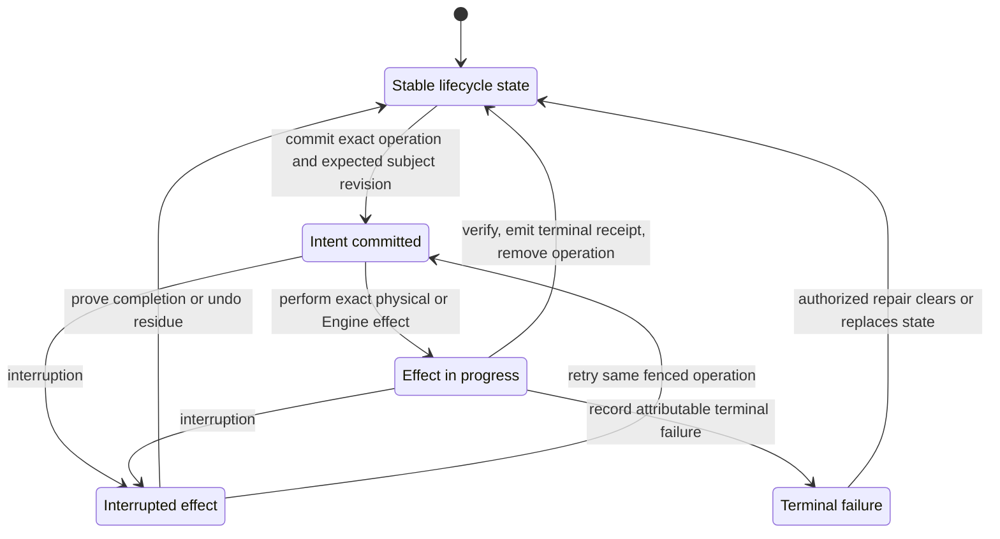

## Ordinary Chamber activation kernel

This kernel creates one ordinary, non-Engine Chamber from one already complete Realization. It applies
equally to a current Realization, a candidate under a valid Hold, a fixture, or a retained rollback
target. There is no separate Activation object. Cold Engine activation is Mode 1 rather than a branch
inside this kernel because no I3 Filesystem route exists until the Engine is ready.

`entry = exact realization + current revision or candidate Hold + registration contract + authorized Chamber lease`

`exit = ready fresh Chamber + run receipt, or no live Chamber + terminal failure receipt`

The calling mode supplies the outer `chambers::process::propose` invocation after Engine/I3 readiness.
This kernel begins after `procman` has committed the exact Chamber intent and projects only the physical
effect and readiness segment. The enclosing mode returns completion of its own outer invocation.

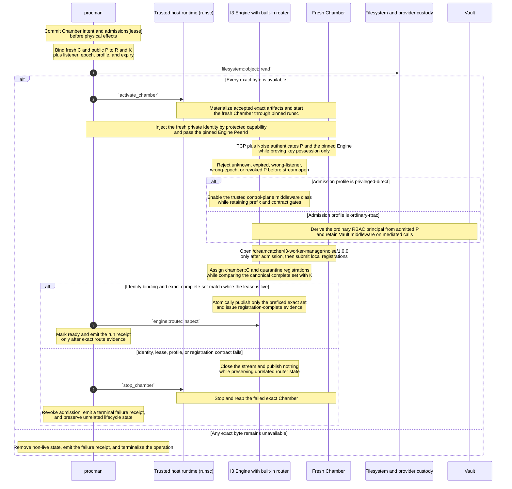

The Noise connection itself is never the admission result. A remote connection-gater close can propagate
after a dial appears to complete, so the fail-closed invariant is that an unauthorized PeerId cannot open
the Worker Manager protocol stream. The Engine checks the HPM projection both when the secure connection
identifies the remote PeerId and when that peer requests the protocol. A claimed Chamber id in a worker
payload is never authority; the server derives `C`, `R`, `K`, lease, epoch, listener, and profile from `P`.

The private identity is fresh per physical Chamber lease, is never baked into an image or ordinary
environment variable, and is destroyed with the Chamber. Reconnects by the same live Chamber reuse that
lease identity; a replacement Chamber receives a fresh Chamber id and PeerId. An Engine replacement must
present a newly HPM-authorized pinned identity; existing Chambers remain fenced until `procman` supplies an
authorized listener update or replaces them. No peer may silently accept an arbitrary replacement key.

Privileged-direct is an explicit HPM admission profile for the Engine bootstrap and named trusted
control-plane subjects. It bypasses ordinary application RBAC middleware only; it does not bypass PeerId
admission, server-assigned prefixing, the immutable registration contract, complete-set validation, lease
revocation, or router publication gates. Ordinary Chambers receive the ordinary-RBAC profile.

This Chamber-to-Engine boundary is the intended reusable shape for a later upgrade of ordinary Ark-to-Ark
RBAC handshakes: secure-transport key possession followed by an explicit authorization contract. That
cross-Ark migration is deferred; existing Ark-to-Ark RBAC behavior is not changed by this sequence.

The kernel may fetch or import bytes already named by the Realization. It may not resolve a moving
locator, choose dependencies, execute a build from the Covenant lock, or substitute another digest.
Any attempt starting only from a Covenant lock enters Mode 2 as candidate formation, even when it hopes
to reproduce a former artifact. A result with a different digest is necessarily a different
Realization; a byte-identical result is still observed and admitted through the candidate path before
it may satisfy current selection.

The current revision or candidate Hold is captured when the Chamber intent commits. A concurrent
selection change never relabels that Chamber. The selected Realization may have no Chamber before or
after this kernel.

## Overall lifecycle

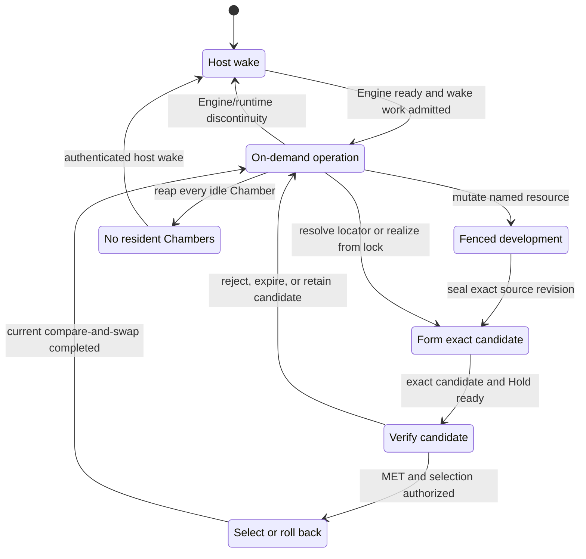

## Mode 1 - Host activation

`entry = running Linux + running procman + boot-readable current selections and exact Engine custody`

`exit = one ready Engine Chamber for admitted wake work`; no other current Realization must be resident.

`host activation != first-pair acceptance`; every initial selected Realization is already authorized by
its accepted bootstrap profile and external selection fence.

This is the cold Engine sequence, not Linux boot. Starting or replacing `procman` belongs to an explicitly
lower platform and remains outside the current lifecycle. The first in-scope event is therefore an
authenticated `wake_engine` call reaching an already-running `procman`.

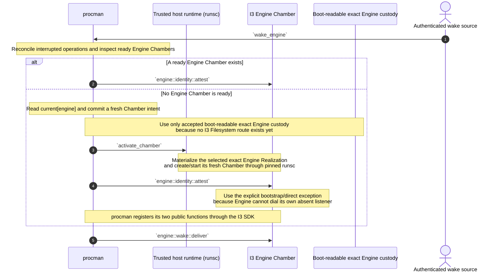

If admitted wake work needs another selected Runnable, the ready Engine invokes
`chambers::process::propose`; that target then follows the ordinary Chamber activation kernel above.

No Chamber is architecturally required to run continuously. Policy may keep an Engine Chamber or other
working set warm, but `current` selection survives with zero Chambers. `procman` is not a Chamber; it is
the mechanism-only host wake boundary. If `procman` itself is stopped, an explicitly lower platform,
cloud control plane, or physical operator must wake it—this lifecycle does not hide that recursion.

The irreducible cold edge is `wake source -> procman -> selected Engine Realization`. A worker attached to a
running Engine or an authorized Supervisor Chamber may request ordinary Chamber activation, but it
cannot be the only mechanism that wakes the absent Engine containing it. `procman` may execute the exact pre-authorized
wake; it does not select a different Engine Realization or decide application policy.

First acceptance of the host envelope and Engine/Supervisor bootstrap subjects remains an external
verification and selection ceremony. Mode 1 never forms a Realization from a Covenant lock and never
certifies its own seed.

## Mode 2 - Form and activate a candidate

`entry = authorized caller + durable logical name + locator or exact Covenant lock + candidate quota`

`exit = exact candidate Realization + bounded Hold + optional ready Chamber`

Several candidates may coexist for one logical name. This mode never changes `current`; it only forms
an exact Realization, establishes bounded custody, and optionally creates a Chamber for inspection.

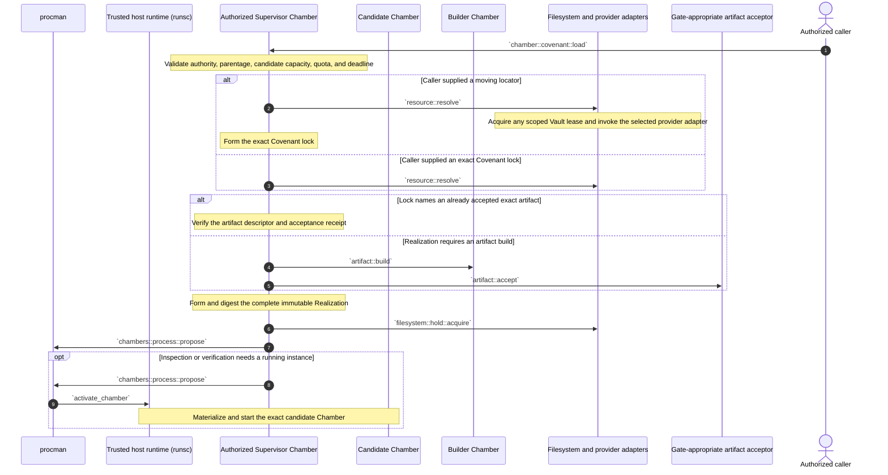

A moving locator is resolved only while forming the lock. Re-resolving `main` later may produce another
lock and another candidate; it never mutates `current`. Candidate admission deduplicates the same
Realization identity rather than inventing another proposal record.

Starting with only a Covenant lock always follows this mode. Builds are not assumed reproducible: the
same lock may yield a different artifact and therefore a different Realization. Even when a build later
produces the same digest, its custody and evidence are admitted through the candidate path before any
selection decision. Rejection, missing Builder support, or missing exact bytes fails closed without
changing current selection.

## Mode 3 - Fenced development

`mutable object = named Filesystem workspace`

`developer execution = one leased Chamber from an exact development Realization`

`immutable handoff = exact resource snapshot`

The Developer Chamber is ordinary execution state: it is activated from an exact development
Realization under a lease and addressed by exact Chamber identity. It terminates and is reaped. Any
immutable product it creates may enter a target lifecycle as a candidate, but the Developer Chamber
itself is never promoted.

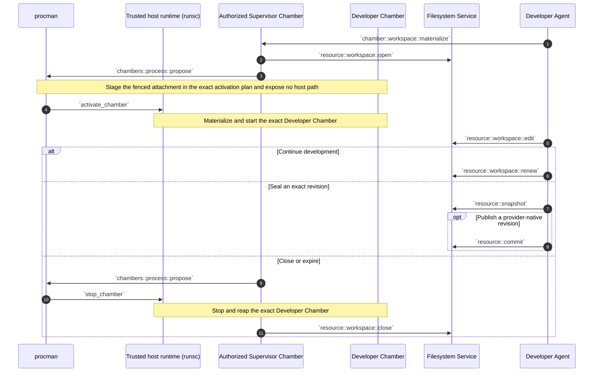

Workspace, snapshot, provider revision, Realization, and Chamber remain distinct identities. The
snapshot or provider revision becomes an input to a later lock; development never captures a
running root filesystem. If that output is later proposed for a durable logical name, it enters Mode 2,
forms an exact candidate Realization under a Hold, and may be selected only after verification. No
workspace or Chamber is renamed into the candidate or current Realization.

## Mode 4 - Build an artifact

Status: **Optional later implementation; not required by the first mount-first lifecycle.**

`build = exact request -> exact OCI artifact + build receipt`

`build output != running Builder filesystem`

`build receipt != acceptance receipt`

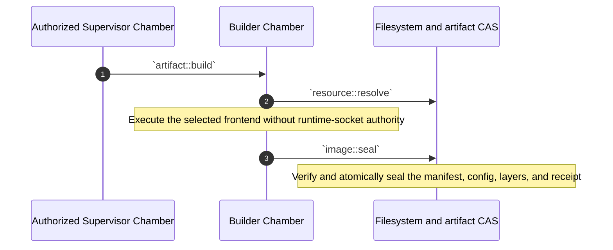

The first Builder version needs only exact inputs, an exact output digest, builder identity, and a
signed basic receipt. Mode 4 ends here. Artifact acceptance, Realization formation, and candidate Hold
creation belong exclusively to Mode 2. A build result is never installed as `current` merely because
its request used the current Covenant lock. The build request is provider-neutral; Dockerfile,
BuildKit, or another build language is an adapter rather than core Covenant syntax. The stronger
multi-Ark attestation flow below is a further deliberately deferred mode.

## Later mode - Attested multi-Ark builds

Status: **Later implementation; not required by the initial lifecycle.**

`mechanical provenance != software quality`

`independent convergence on one digest = stronger reproducibility evidence`

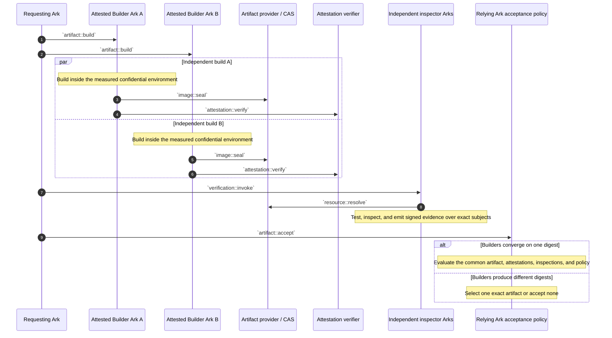

A Merkle root can commit to undisclosed builder software and evidence, but the root alone proves
no quality claim. Verification still needs accepted measurements, selective proofs, or another
named appraisal policy. The accepted artifact and every differing output produce distinct
realizations.

## Mode 5 - Verify a candidate

`verdict subject = exact candidate Realization + exact Chamber + exact plan + environment`

`verdict != selection`

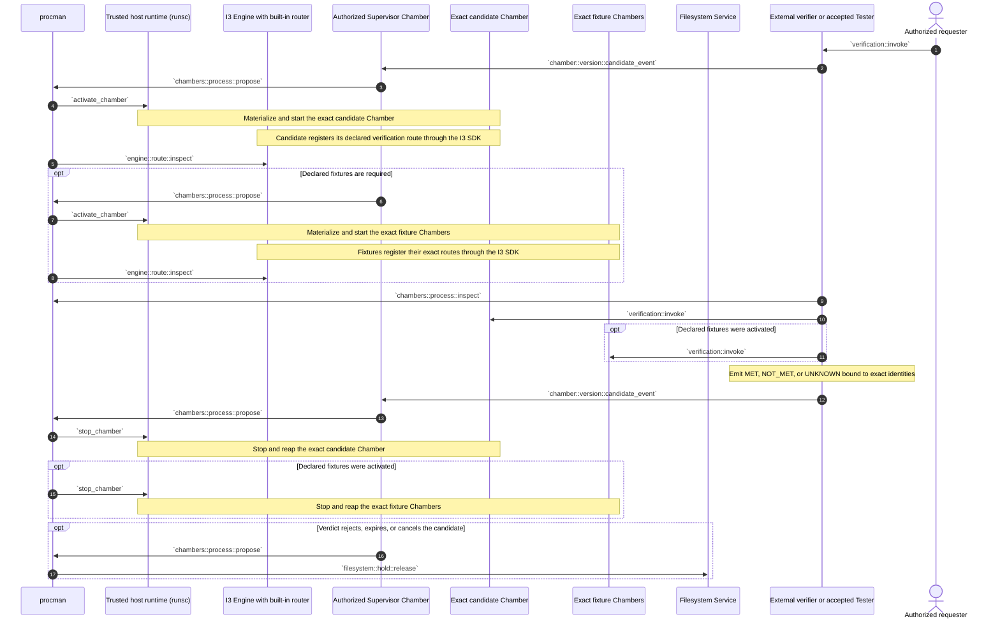

A MET verdict permits a later selection request while its Hold remains valid; it does not require the
verification Chamber to remain alive. Further verification attempts create further Chambers of the same
candidate Realization and produce independently scoped evidence.

The first Tester is judged by the external bootstrap verifier. Once separately selected, the current
Tester Realization normally supplies an on-demand Tester Chamber for other Covenants. Tester never
writes current selection.

## Mode 6 - Select or roll back

`selection authority = gate-appropriate fenced promoter`

`selection effect = one compare-and-swap of current[name] + derived Engine factory revision`

`entry = exact candidate Realization + valid Hold + fresh gate evidence + expected current revision`

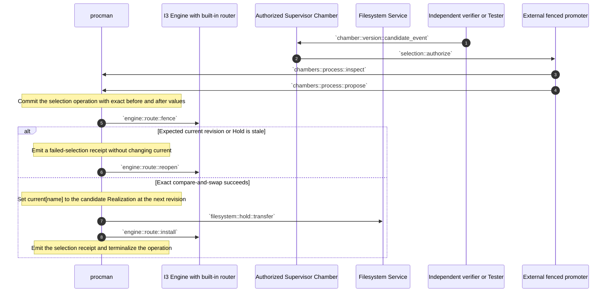

Selection never moves, adopts, or renames a Chamber. A Chamber that supplied verification evidence may
already be gone. Chambers of the prior current Realization remain pinned to it until their independent
leases complete, cancel, expire, or are explicitly drained. Only calls admitted after the new current
revision activate the newly selected Realization.

`current` is defined only by the authoritative selection record. It is never inferred from newest
creation, latest health, fleet majority, a ready Chamber, or route-cache contents. A failure to activate
the selected Realization fails that execution; it does not silently select another one.

Supervisor replacement uses the same sequence; `supervisor` is only another logical name. Authority is
bound to the selected Supervisor Realization and attenuated capabilities granted to its Chambers, not to
one immortal Supervisor Chamber.

Rollback uses this same selection operation with a retained accepted Realization as target. Selection
history can identify a prior target but cannot make its artifact available. Without exact retained bytes,
a valid Hold, required evidence, and authorization, rollback fails closed.

## Mode 7 - Quiesce and wake

`quiescence preserves current selections, candidate Holds, receipts, and durable resources—not Chambers`

`wake = Mode 1`

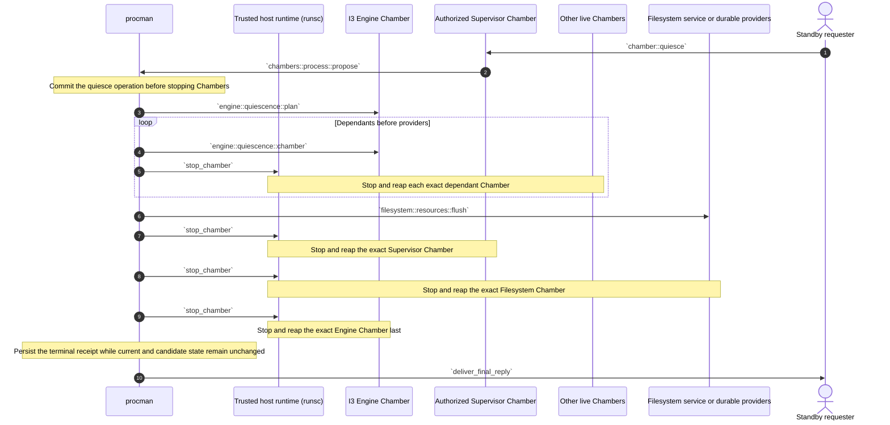

`filesystem::resources::flush` is the only Filesystem durability barrier in this sequence. It covers
the exact resource set named by the committed stop operation and returns operation-bound receipts; it
is not an unscoped service drain. Every other Filesystem operation must already complete at the
durability boundary promised by its own contract. Once the exact resource receipts are durable and no
Filesystem invocation remains active or queued, `procman` may stop the Filesystem Chamber directly;
there is no additional generic Filesystem flush.

The same rule supports ordinary idle reaping without a global quiesce: `procman` may stop any independently
idle Chamber whose lease and work state permit it. Reaping the final Engine Chamber leaves `procman` waiting
on its authenticated wake edge; the next event follows Mode 1. If policy also stops `procman`, the reply and
wake obligation must first transfer to an explicitly lower layer.

A hard deadline may discard unflushed Chamber-local state. It creates no alternate artifact,
Realization, or process-memory identity and never changes `current` merely because a Chamber stopped.

## Failure and recovery formulas

- `operation remains non-terminal after interruption -> reconcile that exact operation before conflicting work`.
- `current[name] = R + zero Chambers -> valid idle state`; do nothing until demand or explicit prewarm policy.
- `admitted call snapshots current revision S and Realization R -> its Chamber remains pinned to (S, R)` even if
  selection changes before physical start completes.
- `ready Chamber fails -> terminalize its exact lease and receipt`; retry, if authorized, creates a fresh
  Chamber of the same Realization without changing current.
- `Chamber lease expires or work terminates -> stop and reap that Chamber`; sibling Chambers and current are unchanged.
- `Engine Chamber absent + authenticated wake -> procman activates exact current[engine] through Mode 1`.
- `candidate Hold expires -> reap its candidate Chambers + remove candidates[name][R] + emit cleanup receipt`,
  unless another current, candidate, or operation reference still retains the exact bytes.
- `exact artifact unavailable -> activation fails`; do not build from the lock inside the activation kernel.
- `build starts from a Covenant lock -> output enters Mode 2 as a candidate`, never directly as current.
- `lock-only rebuild reproduces the complete current Realization identity -> verify candidate + perform fenced
  idempotent selection/custody confirmation before using the rebuilt bytes as current`.
- `lock-only rebuild produces a different artifact or Realization digest -> distinct candidate`; only Mode 6 may select it.
- `provider credential unavailable -> resolution or build fails closed`; current is unchanged.
- `Engine route cache disagrees with current selection or authoritative Chamber state -> lifecycle state wins`;
  fence affected admission and rebuild the cache.
- `Noise authenticates a PeerId not present in a live admissions[lease], or the Engine pin is wrong -> no
  Worker Manager protocol stream`; publish no registration and leave the router unchanged.
- `admitted PeerId claims another Chamber or submits a non-exact registration set -> close the stream +
  revoke or fail the activation`; the quarantined set never becomes routable.
- `admission expires or is revoked -> reject new Worker Manager streams + close live registration authority`;
  a replacement Chamber requires a fresh Chamber id, lease, epoch, and PeerId.
- `physical id survives but cannot be proved -> reap it and create a fresh Chamber`.
- `verifier unavailable or verdict UNKNOWN -> no selection`.
- `stale current revision, Hold, lease, operation subject, or selection permit -> reject before effect`.
- `cleanup names exact Chamber ids and candidate Holds`; unrelated candidates and sibling Chambers are unaffected.
- `history preserves receipts, not artifact availability`; rollback needs retained exact custody.
- `procman unavailable -> only an explicitly lower platform may wake or replace it`; no Chamber can bootstrap its own absent procman.

## Implementation handoff

### Initial lifecycle

- external provider-specific Covenant locators with optional logical credential names;
- location-independent Covenants with top-level `hardware`, `image`, optional `build`, flat
  `mounts`, and plural `workers`;
- exact Covenant locks and content-addressed, immediately launchable Realization manifests;
- `current[name] = {revision, realization}` as the only stable named selection;
- `candidates[name][realization] = Hold reference` with several bounded candidates permitted;
- `chambers[id] = {name, realization, lease, phase}` with independent operations and cleanup;
- no separate Activation record and no Chamber-bearing `last/current/next` slots;
- a `procman`-owned Engine wake edge plus Engine-native activation factories for ordinary selected names;
- explicit `procman -> trusted host runtime` conventional calls for exact Chamber create/start and stop/reap
  effects, with the Chamber represented as the subject rather than a receiver that could exist before start;
- exact-Chamber routes for execution, verification, and cleanup;
- a `procman`-owned durable lease admission binding from fresh Chamber PeerId to exact Chamber,
  Realization, registration contract, Engine listener, epoch, profile, and expiry;
- a Noise-authenticated Worker Manager protocol whose stream gate precedes registration, with
  server-assigned `chamber::<Chamber id>` prefixes and atomic complete-set publication;
- explicit privileged-direct and ordinary-RBAC admission profiles, both preserving lifecycle and
  registration-contract enforcement;
- fresh zero-to-many Chambers per Realization, with current remaining valid at zero residency;
- activation only from a complete exact Realization, never from a Covenant lock alone;
- lock-only realization, rebuild, and development outputs entering the candidate path before selection;
- minimal run, selection, and cleanup receipts that reference prior identities and evidence rather than
  copying their fields;
- idle Chamber reaping that does not mutate current or candidate state.

### Deliberately later

- provider-neutral build execution and basic exact-output build receipts;
- multi-Ark confidential Builder attestations, independent inspection, and collective acceptance;
- shared reusable Chamber pools, prewarm controllers, and service traffic balancing;
- lower-platform automation that also stops and wakes `procman`;
- hot dual-Engine migration;
- process-memory or rootfs checkpoint recovery.
- migration of ordinary Ark-to-Ark RBAC handshakes to the reusable Noise-plus-authorization-contract
  boundary established here.

### Required downstream reconciliation to this sequence authority

- cross-stack architecture vocabulary and narrative;
- Covenant owner schema and Gherkin (`source`, singular `worker`, and `worker.resources` are old);
- Chambers owner process-tree, routing, image-construction, activation, verification, and upgrade
  Gherkin;
- I3 Engine router/first-host-worker contract;
- Filesystem/provider and Vault credential-need contracts;
- generated traceability after its authoritative inputs change.
